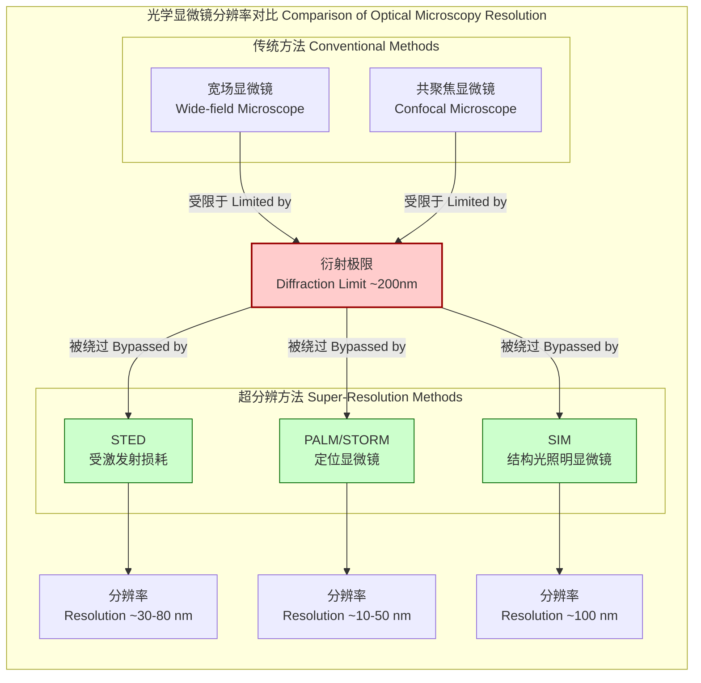

## 分辨率 (Resolution)

### 核心概念及其数学基础

分辨率是衡量一个系统区分两个紧密间隔的实体的能力的度量。这些实体可以存在于空间（空间分辨率）、时间（时间分辨率）、频率/波长（光谱分辨率）或幅度（量化分辨率）中。更高的分辨率意味着更强的辨别细节的能力。

#### 空间分辨率 (Spatial Resolution)

空间分辨率是指能够被区分为独立的两个点之间的最小距离。在光学系统中，它从根本上受到衍射的限制。

*   **瑞利判据 (Rayleigh Criterion)**
    当一个像的主衍射极大值与另一个像的第一衍射极小值重合时，这两个点源被认为是刚刚好被分辨。这个标准为光学仪器的分辨能力提供了一个明确的、虽然是约定俗成的限制。

    可分辨的最小角 $\theta$ (以弧度为单位) 由以下公式给出：
    $$ \theta = 1.22 \frac{\lambda}{D} $$
    其中：
    *   $\lambda$ 是光的波长。
    *   $D$ 是透镜或反射镜等光学系统孔径的直径。

*   **阿贝衍射极限 (Abbe Diffraction Limit)**
    对于显微镜，可分辨的最小距离 $d$ 为：
    $$ d = \frac{\lambda}{2 \cdot \text{NA}} $$
    其中：
    *   $\lambda$ 是照明光的波长。
    *   $\text{NA}$ 是物镜的数值孔径 (Numerical Aperture)，定义为 $\text{NA} = n \sin(\alpha)$。
    *   $n$ 是物镜与样品之间介质的折射率。
    *   $\alpha$ 是物镜收集的光锥的半角。

*   **点扩展函数 (Point Spread Function, PSF)**
    PSF, $h(x, y)$, 描述了成像系统对一个点光源（理想的点）的响应。由于衍射，点光源的像不再是一个点，而是一个弥散的斑点。PSF 的形状决定了系统的分辨率。对于一个理想的圆形孔径，其 PSF 是一个艾里斑 (Airy disk)，其强度分布由下式描述：
    $$ I(r) = I_0 \left[ \frac{2J_1(kar/f)}{kar/f} \right]^2 $$
    其中：
    *   $I_0$ 是中心点的最大强度。
    *   $J_1$ 是第一类一阶贝塞尔函数。
    *   $k = 2\pi/\lambda$ 是波数。
    *   $a$ 是孔径的半径。
    *   $f$ 是焦距。
    *   $r$ 是到像中心的径向距离。
    分辨率通常通过 PSF 的半峰全宽 (Full Width at Half Maximum, FWHM) 来量化。FWHM 越小，分辨率越高。

#### 时间分辨率 (Temporal Resolution)

时间分辨率是指能够区分的两个事件之间的最短时间间隔。它对于捕捉快速变化的动态过程至关重要。

*   **奈奎斯特-香农采样定理 (Nyquist-Shannon Sampling Theorem)**
    为了无失真地从采样中重建一个带宽为 $B$ 的连续时间信号 $x(t)$，采样频率 $f_s$ 必须至少是信号最高频率的两倍。
    $$ f_s \ge 2B $$
    有效的时间分辨率是采样间隔 $\Delta t = 1/f_s$。任何快于 $\Delta t$ 的变化都无法被准确记录，并可能导致混叠 (aliasing) 现象。

#### 光谱分辨率 (Spectral Resolution)

光谱分辨率是光谱仪区分两个紧密间隔的光谱线的能力。

*   **分辨本领 (Resolving Power, R)**
    这是一个无量纲的量，定义为：
    $$ R = \frac{\lambda}{\Delta\lambda} $$
    其中：
    *   $\lambda$ 是测量的中心波长。
    *   $\Delta\lambda$ 是在该波长处可以分辨的最小波长差。

*   **光栅光谱仪 (Grating Spectrometer)**
    对于衍射光栅，其理论分辨本领由下式给出：
    $$ R = mN $$
    其中：
    *   $m$ 是所使用的衍射级数 (diffraction order)。
    *   $N$ 是被照明的光栅刻线的总数。
    因此，更高衍射级数和更多光栅线可以提高光谱分辨率。

#### 量化分辨率 (Quantization Resolution)

在数字信号处理中，量化分辨率是指模数转换器 (ADC) 中两个相邻数字电平之间的最小幅度步长。

*   **量化步长 (Quantization Step, Q)**
    对于一个具有 $N$ 位和满量程电压范围 $V_{ref}$ 的 ADC，其量化步长 $Q$（也称为最低有效位 LSB）为：
    $$ Q = \frac{V_{ref}}{2^N} $$
    $N$ 是 ADC 的位数。位数越高，量化步长越小，分辨率越高。

*   **信噪比 (Signal-to-Quantization-Noise Ratio, SQNR)**
    SQNR 是衡量量化质量的一个关键指标，它表示信号功率与量化噪声功率之比。对于一个满量程的正弦波输入，其理论 SQNR（以分贝 dB 为单位）为：
    $$ \text{SQNR} \approx 6.02N + 1.76 \text{ (dB)} $$
    这个公式表明，每增加一个比特位，SQNR 大约提高 6 dB。

#### 逻辑归结 (Resolution in Logic)

逻辑归结是自动定理证明中使用的一种推理规则，尤其是在命题逻辑和一阶逻辑中。它通过寻找矛盾来证明一个公式的不可满足性。

*   **归结规则 (Resolution Rule)**
    给定两个包含互补文字（例如 $A$ 和 $\neg A$）的子句（文字的析取），可以通过组合这两个子句并消去互补文字对来推导出一个新的子句（归结式）。
    $$ \frac{(L_1 \lor \dots \lor L_k \lor A) , (M_1 \lor \dots \lor M_n \lor \neg A)}{(L_1 \lor \dots \lor L_k \lor M_1 \lor \dots \lor M_n)} $$
    如果最终能推导出空子句（表示矛盾），则原始子句集是不可满足的。

### 关键技术规格

下表总结了不同领域中分辨率的典型值。

**表 1: 空间分辨率技术规格**

| 仪器/系统 (Instrument/System) | 典型分辨率 (Typical Resolution) | 单位 (Unit) |
| :--- | :--- | :--- |
| 人眼 (Human Eye) | ~0.1 | mm (at 25 cm) |
| 光学显微镜 (Light Microscope) | ~200 | nm |
| 扫描电子显微镜 (SEM) | 0.4 - 20 | nm |
| 透射电子显微镜 (TEM) | < 50 | pm |
| 哈勃空间望远镜 (Hubble Telescope) | ~0.05 | arcseconds |
| 地球观测卫星 (Earth Observation Satellite) | 0.3 - 10 | m |

**表 2: 时间分辨率技术规格**

| 设备 (Device) | 典型分辨率 (Typical Resolution) | 单位 (Unit) |
| :--- | :--- | :--- |
| 标准摄像机 (Standard Video Camera) | 16 - 33 | ms |
| 高速摄像机 (High-Speed Camera) | 1 - 1000 | ns |
| 条纹相机 (Streak Camera) | 0.1 - 2 | ps |
| 飞秒激光器 (Femtosecond Laser) | 5 - 100 | fs |
| 粒子探测器 (Particle Detector) | 10 - 100 | ps |

**表 3: 光谱分辨率技术规格**

| 光谱仪类型 (Spectrometer Type) | 典型分辨本领 R (Typical R) |
| :--- | :--- |
| 棱镜光谱仪 (Prism Spectrometer) | 1,000 - 4,000 |
| 中阶梯光栅光谱仪 (Echelle Spectrometer) | 30,000 - 200,000 |
| 傅里叶变换光谱仪 (FTIR) | 10,000 - 1,000,000+ |
| 法布里-珀罗干涉仪 (Fabry-Pérot) | 10,000 - 10,000,000+ |

**表 4: 量化分辨率技术规格**

| ADC 位数 (ADC Bits) | 量化级别 (Levels) | 理论 SQNR (dB) |
| :--- | :--- | :--- |
| 8-bit | 256 | ~49.9 |
| 12-bit | 4,096 | ~74.0 |
| 16-bit | 65,536 | ~98.1 |
| 24-bit | 16,777,216 | ~146.2 |

### 常见用例

*   **空间分辨率**:
    *   **生物医学成像**: 在磁共振成像 (MRI) 或计算机断层扫描 (CT) 中，高空间分辨率对于区分健康的和病变的组织至关重要。性能指标：体素大小 (voxel size) < 1 mm³。
    *   **天文学**: 用于分辨双星系统或观测遥远星系的形态结构。性能指标：角分辨率 < 0.1 角秒。
    *   **半导体制造**: 在光刻技术中，分辨率决定了可以制造的集成电路的最小特征尺寸。性能指标：特征尺寸 < 10 nm。

*   **时间分辨率**:
    *   **材料科学**: 使用泵浦-探测光谱技术研究超快动力学过程，如分子振动或电荷转移。性能指标：时间分辨率 < 100 fs。
    *   **神经科学**: 脑电图 (EEG) 和脑磁图 (MEG) 具有毫秒级的时间分辨率，可以追踪大脑活动的快速变化。性能指标：采样率 > 1 kHz。
    *   **粒子物理**: 探测器需要皮秒级的时间分辨率来精确重建粒子碰撞的轨迹和时间。

*   **光谱分辨率**:
    *   **天体物理学**: 高光谱分辨率用于测量恒星的化学成分、温度和通过多普勒频移测量的径向速度。性能指标：R > 50,000。
    *   **分析化学**: 拉曼光谱或核磁共振 (NMR) 依赖高光谱分辨率来识别分子结构和区分同分异构体。

*   **量化分辨率**:
    *   **数字音频**: 16位分辨率（CD质量）和24位分辨率（高解析度音频）提供了高保真度的声音再现，减少了量化噪声。
    *   **科学仪器**: 数字示波器和数据采集卡使用高位数ADC（12至16位）来精确测量微小的电压变化。

### 实现考量

#### 超分辨成像算法

传统光学显微镜的分辨率受限于阿贝衍射极限（约200 nm）。超分辨技术通过物理或计算方法绕过此限制。
*   **受激发射损耗显微镜 (STED)**: 使用两束激光，一束激发荧光团，另一束（甜甜圈形状的损耗光）通过受激发射抑制外围区域的荧光，从而有效减小了PSF的尺寸。
*   **光激活定位显微镜 (PALM/STORM)**: 随机激活和光漂白稀疏的荧光分子子集，对每个分子进行精确定位，然后通过多轮成像重建出超分辨图像。
*   **算法复杂度**: 这些方法的图像重建算法通常涉及高斯拟合和大数据集处理，计算复杂度较高，通常为 $O(N_f \cdot N_p)$，其中 $N_f$ 是帧数， $N_p$ 是每帧检测到的光子数。

#### 逻辑归结算法

归结算法是完备的，即如果一个子句集是不可满足的，归结算法保证能够推导出空子句。
*   **实现**: 算法首先将待证明公式的否定形式转换为合取范式 (CNF)。然后，它迭代地选择两个可以进行归结的子句，生成归结式并将其添加到子句集中，直到产生空子句或没有新的归结式可以生成。
*   **算法复杂度**: 对于命题逻辑，判定可满足性问题 (SAT) 是NP完全的。归结算法在最坏情况下的时间复杂度是指数级的，即 $O(2^n)$，其中 $n$ 是命题变量的数量。尽管如此，通过高效的启发式策略（如单元传播、纯文字消除）和数据结构，现代SAT求解器在许多实际问题上表现出色。

### 性能特征

*   **调制传递函数 (Modulation Transfer Function, MTF)**:
    MTF 是对空间分辨率更全面的表征。它描述了成像系统在不同空间频率下传递对比度的能力。MTF 定义为图像对比度与物体对比度之比，是空间频率 $f$ 的函数。
    $$ \text{MTF}(f) = \frac{\text{对比度}_{\text{输出}}(f)}{\text{对比度}_{\text{输入}}(f)} $$
    MTF 曲线下降到特定值（如10%）时的空间频率通常被用作分辨率的度量。

*   **统计测量与置信区间**:
    分辨率的测量值应伴随其不确定性。例如，通过对多个PSF测量结果进行高斯拟合，可以得到FWHM的均值和标准差。结果应报告为带有置信区间的形式，例如：FWHM = 250 ± 10 nm (95% 置信区间)。这表示我们有95%的信心认为真实值落在这个区间内。

*   **时间抖动 (Jitter)**:
    时间分辨率受到时钟信号不完美性的影响，即时间抖动。抖动是事件实际发生时间与理想时间的随机偏差。它通常用其均方根 (RMS) 值来量化，并会限制系统可达到的最高时间分辨率。

### 相关技术与比较模型

#### 分辨率的物理极限与权衡

*   **海森堡不确定性原理 (Heisenberg Uncertainty Principle)**:
    这是量子力学中的一个基本原理，它限制了某些成对物理量（如位置和动量，或能量和时间）的同时测量精度。在信号处理中，一个类似的关系是时间-频率不确定性：
    $$ \Delta t \cdot \Delta f \ge \frac{1}{4\pi} $$
    其中 $\Delta t$ 是信号的时间持续长度，$\Delta f$ 是其带宽。这意味着提高时间分辨率（减小 $\Delta t$）必然会降低频率分辨率（增大 $\Delta f$），反之亦然。这种权衡在设计雷达系统、光谱分析和通信系统时至关重要。

#### 分辨率类型与应用领域关系图

```mermaid
graph TD
    subgraph "分辨率的核心领域 Core Domains of Resolution"
        A["空间分辨率<br>Spatial Resolution"]
        B["时间分辨率<br>Temporal Resolution"]
        C["光谱分辨率<br>Spectral Resolution"]
        D["量化分辨率<br>Quantization Resolution"]
        E["逻辑归结<br>Logical Resolution"]
    end

    A --> A1["显微镜<br>Microscopy"]
    A --> A2["天文学<br>Astronomy"]
    A --> A3["遥感<br>Remote Sensing"]

    B --> B1["高速摄影<br>High-Speed Photography"]
    B --> B2["神经科学 EEG/MEG<br>Neuroscience"]
    B --> B3["粒子物理<br>Particle Physics"]

    C --> C1["化学分析<br>Chemical Analysis"]
    C --> C2["天体物理学<br>Astrophysics"]
    C --> C3["材料科学<br>Material Science"]

    D --> D1["数字音频<br>Digital Audio"]
    D --> D2["数据采集<br>Data Acquisition"]
    D --> D3["数字图像<br>Digital Imaging"]

    E --> E1["自动定理证明<br>Automated Theorem Proving"]
    E --> E2["人工智能规划<br>AI Planning"]

    style A fill:#cde4ff
    style B fill:#cdffcd
    style C fill:#ffcdcd
    style D fill:#f9f7c5
    style E fill:#fcdfff
```

#### 超分辨显微镜技术对比

### 参考文献

1.  Rayleigh, Lord. "XXXI. Investigations in optics, with special reference to the spectroscope." *The London, Edinburgh, and Dublin Philosophical Magazine and Journal of Science* 8.49 (1879): 261-274. DOI: [10.1080/14786447908639684](https://doi.org/10.1080/14786447908639684)
2.  Abbe, E. "Beiträge zur Theorie des Mikroskops und der mikroskopischen Wahrnehmung." *Archiv für Mikroskopische Anatomie* 9.1 (1873): 413-468. DOI: [10.1007/BF02956173](https://doi.org/10.1007/BF02956173)
3.  Shannon, C. E. "A mathematical theory of communication." *The Bell System Technical Journal* 27.3 (1948): 379-423. DOI: [10.1002/j.1538-7305.1948.tb01338.x](https://doi.org/10.1002/j.1538-7305.1948.tb01338.x)
4.  Hell, S. W., and J. Wichmann. "Breaking the diffraction resolution limit by stimulated emission: stimulated-emission-depletion fluorescence microscopy." *Optics Letters* 19.11 (1994): 780-782. DOI: [10.1364/OL.19.000780](https://doi.org/10.1364/OL.19.000780)
5.  Robinson, J. A. "A Machine-Oriented Logic Based on the Resolution Principle." *Journal of the ACM* 12.1 (1965): 23-41. DOI: [10.1145/321250.321253](https://doi.org/10.1145/321250.321253)