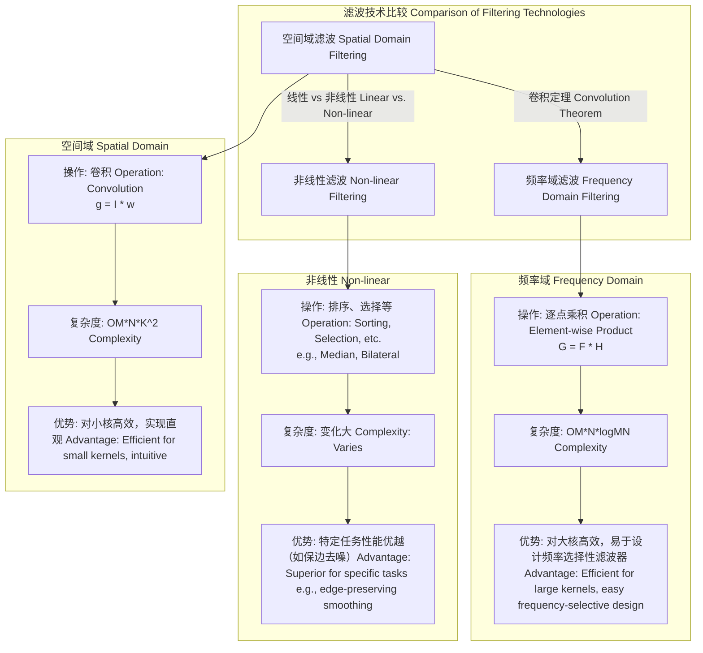

## 空间滤波

空间滤波是一种在图像空间域中直接对像素值进行操作的图像处理技术。其核心思想是利用一个小的邻域（称为核、掩模或模板）来计算每个像素的新值。这个新值是该像素邻域内像素值的函数。空间滤波被广泛应用于图像平滑、锐化、边缘检测和噪声抑制等领域。

### 核心概念与数学基础

空间滤波的根本操作是**卷积 (Convolution)**。对于一个二维图像 $I(x, y)$ 和一个大小为 $(2a+1) \times (2b+1)$ 的卷积核 $w(s, t)$，在点 $(x, y)$ 处的滤波输出 $g(x, y)$ 定义为：

$$
g(x, y) = \sum_{s=-a}^{a} \sum_{t=-b}^{b} w(s, t) I(x+s, y+t)
$$

这个操作通常表示为：

$$
g(x, y) = (w * I)(x, y)
$$

**参数详解:**
*   $g(x, y)$: 输出图像在坐标 $(x, y)$ 处的像素值。
*   $I(x, y)$: 输入图像在坐标 $(x, y)$ 处的像素值。
*   $w(s, t)$: 卷积核（滤波器）在位置 $(s, t)$ 处的权重系数。
*   $a, b$: 定义了卷积核的尺寸。核的大小为 $(2a+1) \times (2b+1)$。
*   $s, t$: 卷积核内的局部坐标。

**基本原理:**
卷积核的中心与图像中的特定像素 $(x, y)$ 对齐。输出像素的值是通过将核中的每个系数与图像中对应的像素值相乘，然后将所有乘积相加得到的。这个过程在图像的每个像素上重复进行，从而生成滤波后的图像。

```mermaid
graph TD
    A["输入图像 Input Image<br>Ix, y"] --> C["卷积操作 Convolution<br>w * I[";
    B["卷积核 Kernel/Mask<br>ws, t"] --> C;
    C --> D["输出图像 Output Image<br>gx, y"];

    subgraph "在像素 x, y 处的计算"
        direction LR
        P1["Ix-1, y-1"] -- "w-1, -1" --> M1["w-1,-1 * Ix-1,y-1"];
        P2["Ix, y"] -- "w0, 0" --> M2["w0,0 * Ix,y"];
        P3["Ix+1, y+1"] -- "w1, 1" --> M3["w1,1 * Ix+1,y+1"];
        M1 --> S["Σ 求和"];
        M2 --> S;
        M3 --> S;
        S --> G_xy["gx, y"];
    end

    style C fill:#ccf,stroke:#333,stroke-width:2px
```

**滤波器的分类:**
*   **低通滤波器 (Low-pass Filters):** 用于平滑图像和抑制噪声。核系数通常是正的。例如，均值滤波器和高斯滤波器。
*   **高通滤波器 (High-pass Filters):** 用于锐化图像和增强细节。核系数有正有负，且总和通常为零。例如，拉普拉斯算子。
*   **带通/带阻滤波器 (Band-pass/Band-stop Filters):** 用于增强或抑制特定空间频率的特征。
*   **导数滤波器 (Derivative Filters):** 用于边缘检测。例如，Sobel 算子和 Prewitt 算子。

### 关键技术规格

空间滤波器的设计和应用涉及多个关键参数，这些参数直接影响其性能和效果。

| 参数 (Parameter) | 描述 (Description) | 典型值/单位 (Typical Values/Units) |
| :--- | :--- | :--- |
| **核尺寸 (Kernel Size)** | 卷积核的维度，影响计算复杂度和滤波尺度。 | $3 \times 3$, $5 \times 5$, $7 \times 7$ 像素 (pixels) |
| **核系数 (Kernel Coefficients)** | 决定滤波器特性的权重值。 | 无量纲 (dimensionless) 或归一化值 |
| **锚点 (Anchor Point)** | 核内与输出像素位置对应的点，通常是核的中心。 | e.g., (1, 1) for a $3 \times 3$ kernel |
| **边界处理 (Border Handling)** | 定义如何处理图像边界附近的像素。 | 零填充(Zero Padding), 镜像(Mirror), 重复(Replicate), 包裹(Wrap) |
| **数据类型 (Data Type)** | 输入/输出图像及核系数的数值精度。 | 8-bit unsigned integer (uint8), 32-bit float (float32) |
| **高斯标准差 ($\sigma$)** | 仅用于高斯滤波器，控制平滑程度。$\sigma$ 越大，平滑效果越强。 | 0.8, 1.2, 2.0 (无单位) |

### 常见用例与性能指标

| 用例 (Use Case) | 滤波器类型 (Filter Type) | 描述 (Description) | 定量性能指标 (Quantitative Performance Metrics) |
| :--- | :--- | :--- | :--- |
| **噪声抑制 (Noise Reduction)** | 均值滤波器, 高斯滤波器, 中值滤波器 | 通过像素邻域平均或统计来平滑图像，减少随机噪声（如高斯噪声、椒盐噪声）。 | **峰值信噪比 (PSNR):** > 30 dB (良好), **结构相似性指数 (SSIM):** > 0.95 (高保真) |
| **图像锐化 (Image Sharpening)** | 拉普拉斯算子, 高提升滤波 (High-boost) | 增强图像的边缘和细节，通过增强高频分量实现。 | **边缘强度比 (Edge Intensity Ratio):** > 1.2, **信息熵增加 (Entropy Increase):** > 0.1 bits/pixel |
| **边缘检测 (Edge Detection)** | Sobel 算子, Prewitt 算子, Canny 边缘检测器中的梯度计算 | 识别图像中亮度急剧变化的位置，这些位置通常对应于物体的边界。 | **检测准确率 (Detection Accuracy):** > 90%, **Pratt's Figure of Merit (FOM):** > 0.8 |

### 实现考量与算法复杂度

**边界处理:**
当卷积核覆盖到图像边界时，部分核会悬空。必须采用策略填充这些缺失的像素值：
*   **零填充 (Zero Padding):** 在图像外部填充0。可能会在边界产生黑边。
*   **镜像反射 (Reflection/Mirroring):** 以边界为轴，反射图像内容。`gfedcb|abcdefgh|hgfedc`
*   **重复边缘 (Replication):** 重复使用边界像素。`aaaaaa|abcdefgh|hhhhhhhh`

**算法复杂度:**
对于一个大小为 $M \times N$ 的图像和一个大小为 $K \times K$ 的卷积核，标准空间卷积的计算复杂度为：
$$ O(M \cdot N \cdot K^2) $$
这表明计算量与图像大小和核面积成正比。对于大尺寸的核，计算成本会急剧增加。

**可分离滤波器 (Separable Filters):**
如果一个 $K \times K$ 的核 $w$ 可以分解为一个 $K \times 1$ 的列向量 $w_{col}$ 和一个 $1 \times K$ 的行向量 $w_{row}$ 的外积 ($w = w_{col} \cdot w_{row}$)，则该滤波器是可分离的。例如，高斯滤波器是可分离的。
此时，卷积可以分两步进行：
1.  使用 $w_{row}$ 对图像进行水平滤波。
2.  使用 $w_{col}$ 对上一步的结果进行垂直滤波。

复杂度降低为：
$$ O(M \cdot N \cdot K + M \cdot N \cdot K) = O(M \cdot N \cdot K) $$
这对于大核（如大 $\sigma$ 的高斯滤波）能显著提升性能。

### 性能特征与统计度量

**高斯滤波器:**
其核由二维高斯函数生成：
$$
w(s, t) = \frac{1}{2\pi\sigma^2} e^{-\frac{s^2+t^2}{2\sigma^2}}
$$
*   **$\sigma$ (标准差):** 控制滤波器的带宽。$\sigma$ 越大，通带越窄，图像越平滑。
*   **噪声抑制能力:** 对于方差为 $\sigma_n^2$ 的加性高斯白噪声，经过一个归一化的高斯滤波器（系数和为1）后，输出噪声的方差 $\sigma_o^2$ 为：
    $$ \sigma_o^2 = \sigma_n^2 \sum_{s,t} w(s,t)^2 $$
    对于一个近似的高斯核，$\sigma_o^2 \approx \frac{\sigma_n^2}{4\pi\sigma^2}$。这表明噪声方差的减小量与滤波器 $\sigma$ 的平方成反比。

**中值滤波器 (非线性滤波器):**
它将输出像素设置为邻域内像素值的中值。
$$
g(x, y) = \text{median}\{I(x+s, y+t) | s \in [-a, a], t \in [-b, b]\}
$$
*   **性能:** 对椒盐噪声 (Salt-and-Pepper Noise) 具有极佳的抑制效果，且比线性平滑滤波器更好地保留边缘。
*   **统计特性:** 它不引入新的像素值，输出值总是从邻域中选择。

### 相关技术与数学模型比较

空间滤波与频域滤波在理论上是等价的，它们通过**傅里叶变换 (Fourier Transform)** 联系在一起。



**卷积定理 (Convolution Theorem):**
空间域的卷积等价于频率域的乘积。
$$
\mathcal{F}\{I(x, y) * w(x, y)\} = \mathcal{F}\{I(x, y)\} \cdot \mathcal{F}\{w(x, y)\} = I_F(u, v) \cdot W(u, v)
$$
反之亦然：
$$
\mathcal{F}\{I(x, y) \cdot w(x, y)\} = \mathcal{F}\{I(x, y)\} * \mathcal{F}\{w(x, y)\} = I_F(u, v) * W(u, v)
$$

*   **$\mathcal{F}\{\cdot\}$**: 傅里叶变换算子。
*   $I_F(u, v)$: 图像 $I(x, y)$ 的傅里叶频谱。
*   $W(u, v)$: 滤波器核 $w(x, y)$ 的傅里叶频谱，也称为**传递函数 (Transfer Function)**。
*   $(u, v)$: 频率域坐标。

**模型比较:**
*   **空间滤波:** 直接在图像上进行局部操作。对于小核 ($3 \times 3$, $5 \times 5$)，计算效率高。
*   **频域滤波:** 将图像和滤波器都转换到频域，进行乘积运算，再反变换回空间域。当核尺寸 $K$ 很大时，基于快速傅里叶变换 (FFT) 的 $O(MN \log(MN))$ 复杂度优于空间卷积的 $O(MN K^2)$。
*   **双边滤波器 (Bilateral Filter):** 一种非线性的保边去噪滤波器，它同时考虑了空间距离和像素值相似性。
    $$
    g(p) = \frac{1}{W_p} \sum_{q \in \mathcal{S}} G_{\sigma_s}(\|p-q\|) G_{\sigma_r}(|I_p - I_q|) I_q
    $$
    *   $p, q$: 像素坐标。
    *   $\mathcal{S}$: 邻域。
    *   $I_p, I_q$: 像素值。
    *   $G_{\sigma_s}$: 空间核 (Spatial Kernel)，衡量空间距离。
    *   $G_{\sigma_r}$: 范围核 (Range Kernel)，衡量像素值差异。
    *   $W_p$: 归一化因子。
    双边滤波器在平滑区域表现得像高斯滤波器，但在边缘区域，由于范围核的作用，它会保留像素值差异大的像素，从而保护了边缘。

### 参考文献

1.  Gonzalez, R. C., & Woods, R. E. (2018). *Digital Image Processing* (4th ed.). Pearson. (本书是数字图像处理领域的权威教科书，详细介绍了各种空间滤波器。)
2.  Tomasi, C., & Manduchi, R. (1998). Bilateral filtering for gray and color images. In *Proceedings of the Sixth International Conference on Computer Vision* (pp. 839-846). DOI: `10.1109/ICCV.1998.710815`. (双边滤波器的开创性论文。)
3.  Wang, Z., Bovik, A. C., Sheikh, H. R., & Simoncelli, E. P. (2004). Image quality assessment: from error visibility to structural similarity. *IEEE Transactions on Image Processing*, 13(4), 600-612. DOI: `10.1109/TIP.2003.819861`. (提出了 SSIM 指标，是衡量滤波后图像质量的重要工具。)
4.  Canny, J. (1986). A Computational Approach to Edge Detection. *IEEE Transactions on Pattern Analysis and Machine Intelligence*, PAMI-8(6), 679-698. DOI: `10.1109/TPAMI.1986.4767851`. (Canny 边缘检测算法，其第一步就是使用高斯滤波器平滑图像。)