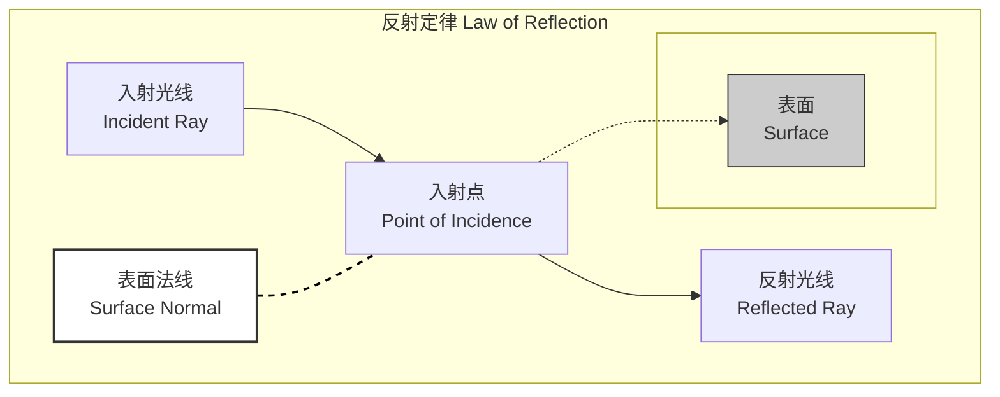

## 镜面反射 (Specular Reflection)

镜面反射，又称规则反射，是一种光学现象。当一束平行光线入射到平滑的表面（其表面不平整度远小于光的波长）时，反射光线将以一个确定的、单一的方向平行射出。这种现象遵循精确的几何光学定律，是理解镜子、光泽表面以及多种光学仪器工作原理的基础。

### 核心概念与数学基础

镜面反射的核心由两个基本物理定律支配：反射定律和菲涅尔方程。

#### 反射定律 (The Law of Reflection)

反射定律从几何上描述了反射光线的方向。它包含两个部分：
1.  入射光线、反射光线和表面法线（垂直于表面的线）三者共面。
2.  反射角（$\theta_r$）等于入射角（$\theta_i$）。两个角度都是相对于表面法线测量的。

$$
\theta_i = \theta_r
$$

这个关系可以用下面的图示来说明：


*   **入射角 ($\theta_i$)**: 入射光线与表面法线之间的夹角。
*   **反射角 ($\theta_r$)**: 反射光线与表面法线之间的夹角。

在矢量数学中，这一定律可以更严谨地表达，这在计算机图形学和物理模拟中至关重要。假设：
*   $\mathbf{\hat{L}}$ 是从表面指向光源的单位方向矢量。
*   $\mathbf{\hat{n}}$ 是表面的单位法向量。
*   $\mathbf{\hat{R}}$ 是反射光线的单位方向矢量。

反射矢量 $\mathbf{\hat{R}}$ 可以通过以下公式计算：

$$
\mathbf{\hat{R}} = 2(\mathbf{\hat{L}} \cdot \mathbf{\hat{n}})\mathbf{\hat{n}} - \mathbf{\hat{L}}
$$

其中：
*   $\mathbf{\hat{L}} \cdot \mathbf{\hat{n}}$ 是 $\mathbf{\hat{L}}$ 和 $\mathbf{\hat{n}}$ 之间的点积，结果是一个标量，代表 $\mathbf{\hat{L}}$ 在 $\mathbf{\hat{n}}$ 方向上的投影长度。
*   $2(\mathbf{\hat{L}} \cdot \mathbf{\hat{n}})\mathbf{\hat{n}}$ 是一个矢量，其大小是 $\mathbf{\hat{L}}$ 在法线方向投影的两倍，方向与法线相同。
*   从该矢量中减去 $\mathbf{\hat{L}}$ 会得到完美的镜面反射矢量。

#### 菲涅尔方程 (Fresnel Equations)

虽然反射定律描述了光反射的方向，但菲涅尔方程描述了反射光的强度（即有多少光被反射，多少光被折射/透射）。反射光的比例（称为反射率）取决于光的偏振、入射角以及两种介质的折射率。

光可以分为两种偏振状态：
*   **s-偏振 (s-polarization)**: 光的电场矢量垂直于入射平面。
*   **p-偏振 (p-polarization)**: 光的电场矢量平行于入射平面。

菲涅尔方程给出了这两种偏振的反射率（$R_s$ 和 $R_p$）：

$$
R_s = \left| \frac{n_1 \cos\theta_i - n_2 \cos\theta_t}{n_1 \cos\theta_i + n_2 \cos\theta_t} \right|^2
$$

$$
R_p = \left| \frac{n_2 \cos\theta_i - n_1 \cos\theta_t}{n_2 \cos\theta_i + n_1 \cos\theta_t} \right|^2
$$

对于非偏振光，总反射率是两者的平均值：

$$
R = \frac{R_s + R_p}{2}
$$

其中：
*   $n_1$ 是入射介质的折射率（例如，空气的折射率约为 1.0003）。
*   $n_2$ 是反射/折射介质的折射率（例如，玻璃的折射率约为 1.5）。
*   $\theta_i$ 是入射角。
*   $\theta_t$ 是折射角，它通过斯涅尔定律 (Snell's Law) 与入射角相关联： $n_1 \sin\theta_i = n_2 \sin\theta_t$。

一个重要的推论是**布儒斯特角 (Brewster's Angle)** $\theta_B$，在该入射角下，p-偏振光的反射率 $R_p$ 降至零，只有s-偏振光被反射。

### 关键技术规格

镜面反射的特性高度依赖于材料的物理属性和表面形貌。

| 参数 (Parameter) | 符号 (Symbol) | 描述 (Description) | 典型值 (Typical Values) | 单位 (Unit) |
| :--- | :---: | :--- | :--- | :---: |
| 表面粗糙度 (Surface Roughness) | $R_a$ | 表面高度偏差的算术平均值。决定了反射是镜面的还是漫反射的。 | < 10 nm (用于光学镜面) | nm, µm |
| 反射率 (Reflectivity) | $R$ | 在特定波长下，反射的辐射通量与入射的辐射通量之比。 | 银 (Ag): > 95% (可见光) <br> 铝 (Al): > 90% (可见光) | % 或无量纲 |
| 折射率 (Refractive Index) | $n$ | 光在介质中传播速度相对于在真空中传播速度的比值。 | 空气: ~1.00 <br> 水: 1.33 <br> 硅 (Si): ~3.4 (红外) | 无量纲 |
| 消光系数 (Extinction Coefficient) | $k$ | 描述光在介质中传播时因吸收而导致的强度衰减。 | 金属: > 0 <br> 绝缘体: ≈ 0 (在透明带) | 无量纲 |
| 波长依赖性 (Wavelength Dependence) | $\lambda$ | 上述所有光学常数通常都随光的波长而变化（色散）。 | 可见光: 400-700 nm <br> 近红外: 700-2500 nm | nm |

### 常见用例

| 应用领域 (Application Area) | 描述 (Description) | 关键性能指标 (Quantitative Performance Metric) |
| :--- | :--- | :--- |
| **光学镜面 (Optical Mirrors)** | 用于望远镜、激光器和光谱仪中，以精确地重定向光束。 | 平均反射率 > 98% (特定波段); 表面平整度 < $\lambda/10$ |
| **计算机图形学 (Computer Graphics)** | 模拟光泽、金属和玻璃等材质，以实现逼真的渲染。 | 帧率 (FPS) > 60; 渲染结果与物理测量值的均方根误差 (RMSE) < 5% |
| **激光雷达 (LIDAR)** | 从平坦表面（如建筑物、水体）接收强的镜面返回信号，用于测绘和目标识别。 | 信号噪声比 (SNR) > 20 dB; 探测概率 > 99% (对于合作目标) |
| **抗反射涂层 (Anti-Reflection Coatings)** | 通过薄膜干涉最小化镜片和太阳能电池上的镜面反射，以提高透射率。 | 在设计波长处的残余反射率 < 0.2%; 带宽 > 100 nm |
| **X射线晶体学 (X-ray Crystallography)** | X射线从晶体原子平面发生相干的镜面反射（布拉格衍射），用于确定分子结构。 | 结构解析度 < 2 Å; R-因子 < 0.2 |

### 实现考量

在计算机图形学中，镜面反射通常使用简化的光照模型来近似，以在实时渲染中实现效率和视觉效果的平衡。

#### Phong 反射模型

这是一种经验模型，计算简单且效果可接受。
*   **算法**:
    1.  计算归一化的视图矢量 $\mathbf{\hat{V}}$ (从表面指向相机)。
    2.  计算归一化的光照矢量 $\mathbf{\hat{L}}$ (从表面指向光源)。
    3.  计算反射矢量 $\mathbf{\hat{R}} = 2(\mathbf{\hat{L}} \cdot \mathbf{\hat{n}})\mathbf{\hat{n}} - \mathbf{\hat{L}}$。
    4.  计算镜面反射强度。

*   **方程**:
    $$
    I_{spec} = k_s \cdot I_l \cdot (\max(0, \mathbf{\hat{R}} \cdot \mathbf{\hat{V}}))^\alpha
    $$
    *   $I_{spec}$ 是镜面反射光的强度。
    *   $k_s$ 是材质的镜面反射系数（颜色）。
    *   $I_l$ 是入射光的强度（颜色）。
    *   $\mathbf{\hat{R}}$ 是理想的镜面反射矢量。
    *   $\mathbf{\hat{V}}$ 是指向观察者的矢量。
    *   $\alpha$ 是“光泽度”或“高光指数”，控制高光的大小和锐度。值越高，表面越光滑，高光越小。

*   **算法复杂度**: 对于单个像素和单个光源，Phong 模型的计算是常数时间复杂度，即 $O(1)$。对于一个包含 $P$ 个像素和 $L$ 个光源的场景，在正向渲染管线中，总复杂度为 $O(P \cdot L)$。

#### Blinn-Phong 反射模型

这是 Phong 模型的一个优化，计算上更高效。
*   **算法**: 它引入了一个“半程矢量” $\mathbf{\hat{H}}$，该矢量位于光照矢量 $\mathbf{\hat{L}}$ 和视图矢量 $\mathbf{\hat{V}}$ 的角平分线上。
    $$
    \mathbf{\hat{H}} = \frac{\mathbf{\hat{L}} + \mathbf{\hat{V}}}{||\mathbf{\hat{L}} + \mathbf{\hat{V}}||}
    $$
*   **方程**:
    $$
    I_{spec} = k_s \cdot I_l \cdot (\max(0, \mathbf{\hat{n}} \cdot \mathbf{\hat{H}}))^{\alpha'}
    $$
    *   Blinn-Phong 模型避免了计算反射矢量 $\mathbf{\hat{R}}$，在许多情况下（特别是当光源和视点距离很远时）点积 $\mathbf{\hat{n}} \cdot \mathbf{\hat{H}}$ 的计算开销更小。

### 性能特征

#### 表面粗糙度的影响

一个表面表现出镜面反射还是漫反射，取决于其表面不平整度相对于光波长的大小。**瑞利判据 (Rayleigh Criterion)** 提供了一个经验法则：
如果表面高度变化 $h$ 满足以下条件，则该表面可被视为光学平滑（即镜面）：

$$
h < \frac{\lambda}{8 \cos\theta_i}
$$

*   $\lambda$ 是光的波长。
*   $\theta_i$ 是入射角。

这意味着，一个对于长波长的无线电波来说是镜面的表面（如金属板），对于短波长的可见光来说可能是粗糙的（漫反射）。

#### 双向反射分布函数 (BRDF)

描述表面反射特性的最全面的数学工具是双向反射分布函数 (BRDF)。它定义了光从任意入射方向 $\omega_i$ 反射到任意出射方向 $\omega_o$ 的比例。

$$
f_r(\omega_i, \omega_o) = \frac{dL_o(\omega_o)}{dE_i(\omega_i)} = \frac{dL_o(\omega_o)}{L_i(\omega_i) \cos\theta_i d\omega_i}
$$

*   $f_r(\omega_i, \omega_o)$ 是 BRDF，单位为 sr⁻¹ (每球面度)。
*   $L_o(\omega_o)$ 是出射方向 $\omega_o$ 的辐射率 (Radiance)。
*   $E_i(\omega_i)$ 是从方向 $\omega_i$ 入射的辐照度 (Irradiance)。
*   $L_i(\omega_i)$ 是入射方向 $\omega_i$ 的辐射率。

对于一个理想的镜面反射体，其BRDF是一个狄拉克-德尔塔函数，表示所有光都只反射到一个方向：

$$
f_{r,specular}(\omega_i, \omega_o) = \rho_s \frac{\delta(\cos\theta_o - \cos\theta_i)\delta(\phi_o - \phi_i \pm \pi)}{\cos\theta_i}
$$

*   $\rho_s$ 是由菲涅尔方程决定的镜面反射率。
*   $\delta(\cdot)$ 是狄拉克-德尔塔函数，确保只有在 $\omega_o$ 是 $\omega_i$ 的精确反射方向时，函数值才非零。

### 相关技术与比较模型

镜面反射只是光与物质相互作用的一种模式。在建模真实世界材料时，通常需要结合多种反射模型。

```mermaid
graph TD
    subgraph "表面反射模型 Surface Reflection Models"
        A["理想镜面反射<br>Ideal Specular"] -- "遵循反射定律<br>Follows Law of Reflection" --> B["BRDF: 狄拉克-德尔塔函数<br>BRDF: Dirac Delta Function"];
        C["理想漫反射 朗伯<br>Ideal Diffuse Lambertian"] -- "向所有方向均匀散射<br>Scatters Uniformly" --> D["BRDF: 常数 ρ/π<br>BRDF: Constant ρ/π"];
        E["微表面模型 例如 Cook-Torrance<br>Microfacet Models e.g., Cook-Torrance"] -- "将表面视为微小镜面集合<br>Surface as collection of micro-mirrors" --> F["BRDF = D * G * F / 4 * N.L * N.V[";
    end

    A --> G["应用: 镜子, 平静水面<br>Use Case: Mirrors, Calm Water"];
    C --> H["应用: 粉笔, 磨砂表面<br>Use Case: Chalk, Matte Surfaces"];
    E --> I["应用: 大多数真实世界材料 金属, 塑料<br>Use Case: Most real materials metals, plastics"];

    style A fill:#cde,stroke:#333
    style C fill:#dce,stroke:#333
    style E fill:#edc,stroke:#333
```

#### 镜面反射 vs. 漫反射 (Specular vs. Diffuse)

*   **镜面反射**: 有方向性，形成清晰的镜像或高光。由平滑表面产生。
*   **漫反射 (Diffuse Reflection)**: 无方向性，光线向各个方向均匀散射。由粗糙表面产生。一个理想的漫反射体（朗伯表面）的BRDF是常数 $f_r = \rho_d / \pi$，其中 $\rho_d$ 是漫反射率。

#### 微表面模型 (Microfacet Models)

现代计算机图形学中最先进和物理上最准确的模型是微表面模型，如 **Cook-Torrance 模型**。它假设宏观上粗糙的表面在微观尺度上是由大量朝向各异的、完美的镜面反射微小平面（microfacets）组成。

其BRDF方程为：

$$
f_r(\mathbf{\hat{l}}, \mathbf{\hat{v}}) = \frac{D(\mathbf{\hat{h}}) F(\mathbf{\hat{v}}, \mathbf{\hat{h}}) G(\mathbf{\hat{l}}, \mathbf{\hat{v}}, \mathbf{\hat{h}})}{4(\mathbf{\hat{n}} \cdot \mathbf{\hat{l}})(\mathbf{\hat{n}} \cdot \mathbf{\hat{v}})}
$$

*   $D(\mathbf{\hat{h}})$: **法线分布函数 (Normal Distribution Function, NDF)**。一个统计模型（如 Trowbridge-Reitz GGX），描述了微表面法线方向的分布概率。这是控制表面粗糙度外观的关键。
*   $F(\mathbf{\hat{v}}, \mathbf{\hat{h}})$: **菲涅尔项 (Fresnel Term)**。与前面讨论的菲涅尔方程相同，计算在微表面上发生镜面反射的光的比例。
*   $G(\mathbf{\hat{l}}, \mathbf{\hat{v}}, \mathbf{\hat{h}})$: **几何遮蔽函数 (Geometry Function)**。描述了由于微表面之间的相互遮挡（阴影）和遮蔽（遮挡）而导致的光线损失。

微表面模型能够通过调整其参数（主要是粗糙度和菲涅尔项）来模拟从近乎完美的镜面到非常粗糙的哑光表面之间的连续过渡，从而极大地提高了渲染的真实感。

### 参考文献

1.  Cook, R. L., & Torrance, K. E. (1982). A reflectance model for computer graphics. *ACM Transactions on Graphics (TOG)*, 1(1), 7–24. DOI: [10.1145/357290.357293](https://doi.org/10.1145/357290.357293)
2.  Walter, B., Marschner, S. R., Li, H., & Torrance, K. E. (2007). Microfacet models for refraction through rough surfaces. *In Proceedings of the 18th Eurographics conference on Rendering Techniques* (pp. 195-206). DOI: [10.1111/j.1467-8659.2007.01054.x](https://doi.org/10.1111/j.1467-8659.2007.01054.x)
3.  Hecht, E. (2017). *Optics* (5th ed.). Pearson. (This textbook provides a comprehensive foundation for the Law of Reflection and Fresnel Equations).
4.  Nicodemus, F. E., Richmond, J. C., Hsia, J. J., Ginsberg, I. W., & Limperis, T. (1977). *Geometrical Considerations and Nomenclature for Reflectance*. National Bureau of Standards. (The foundational work defining the BRDF). DOI: [10.6028/NBS.MONO.160](https://doi.org/10.6028/NBS.MONO.160)