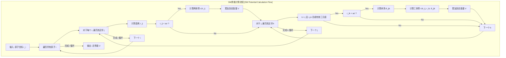
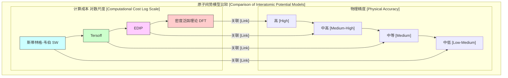

## 斯蒂林格-韦伯势 (Stillinger-Weber potential)

斯蒂林格-韦伯（Stillinger-Weber, SW）势是一种用于分子动力学（MD）模拟的经验性原子间势，尤其适用于描述具有共价键特征的材料，如硅（Si）。该势于1985年由Frank H. Stillinger和Thomas A. Weber提出，其核心目标是准确再现硅的晶体结构（金刚石立方结构）及其热力学性质，例如熔化过程。SW势通过引入一个三体相互作用项来稳定四面体成键构型，这使其在模拟半导体材料方面取得了巨大成功。

### 核心概念与数学基础

SW势能的核心思想是将系统的总势能 $V$ 分解为两体相互作用项 $v_2$ 和三体相互作用项 $v_3$ 的和。

$$
V = \sum_{i<j} v_2(r_{ij}) + \sum_{i<j<k} v_3(\vec{r}_i, \vec{r}_j, \vec{r}_k)
$$

其中：
*   $i, j, k$ 是系统中原子的索引。
*   $r_{ij}$ 是原子 $i$ 和 $j$ 之间的距离。
*   $\vec{r}_i, \vec{r}_j, \vec{r}_k$ 是原子的位置矢量。

#### 两体势 ($v_2$)

两体势项描述了原子对之间的基本相互作用，包括短程排斥和中程吸引。为了在计算中提高效率，该势能函数在一个截断距离 $a\sigma$ 处平滑地变为零。

其数学形式为：
$$
v_2(r_{ij}) =
\begin{cases}
A \epsilon \left[ B \left( \frac{r_{ij}}{\sigma} \right)^{-p} - \left( \frac{r_{ij}}{\sigma} \right)^{-q} \right] \exp\left[ \left( \frac{r_{ij}}{\sigma} - a \right)^{-1} \right] & , \text{ if } \frac{r_{ij}}{\sigma} < a \\
0 & , \text{ if } \frac{r_{ij}}{\sigma} \ge a
\end{cases}
$$

参数解释：
*   $\epsilon$：能量单位，决定了势阱的深度。
*   $\sigma$：长度单位，定义了相互作用的特征尺度。
*   $r_{ij}$：原子 $i$ 和 $j$ 之间的距离。
*   $A, B, p, q$：无量纲参数，用于调整势函数的确切形状。对于原始的硅势，$q=0$，这使得吸引项变为一个常数。
*   $a$：无量纲截断参数，定义了相互作用的范围。当 $r_{ij} \to a\sigma$ 时，指数项确保势能及其导数平滑地趋于零。

#### 三体势 ($v_3$)

三体势是SW势的关键部分，它用于描述和维持共价键的方向性，特别是硅中的四面体成键角（约109.47°）。该项对偏离理想键角的构型施加能量惩罚。

其数学形式为：
$$
v_3(\vec{r}_i, \vec{r}_j, \vec{r}_k) = \lambda \epsilon \left[ \cos\theta_{jik} - \cos\theta_0 \right]^2 \exp\left[ \frac{\gamma\sigma}{r_{ij}-a\sigma} + \frac{\gamma\sigma}{r_{ik}-a\sigma} \right]
$$
此表达式仅在 $r_{ij} < a\sigma$ 和 $r_{ik} < a\sigma$ 时非零。

参数解释：
*   $\lambda, \gamma$：无量纲参数，分别控制三体项的强度和其随距离的衰减速度。
*   $\theta_{jik}$：以原子 $i$ 为顶点，连接原子 $j$ 和 $k$ 的键角。
*   $\cos\theta_0$：理想四面体键角的余弦值，其值为 $-1/3$。当实际键角 $\theta_{jik}$ 等于理想键角 $\theta_0$ 时，三体势的贡献为零。
*   指数项是一个平滑的截断函数，确保三体相互作用在截断距离 $a\sigma$ 处消失。

### 关键技术规格

以下是针对硅（Si）的原始SW势参数。这些参数通过拟合硅的晶格常数、内聚能、熔点和液相结构等实验数据得到。

| 参数 (Parameter) | 数值 (Value) | 单位 (Unit) | 描述 (Description) |
| :--- | :--- | :--- | :--- |
| $\epsilon$ | 2.1683 | eV | 能量尺度 (Energy scale) |
| $\sigma$ | 2.0951 | Å | 长度尺度 (Length scale) |
| $A$ | 7.049556277 | 无量纲 | 两体项强度 (Two-body strength) |
| $B$ | 0.6022245584 | 无量纲 | 两体项排斥形状 (Two-body repulsive shape) |
| $p$ | 4.0 | 无量纲 | 两体项排斥指数 (Two-body repulsive exponent) |
| $q$ | 0.0 | 无量纲 | 两体项吸引指数 (Two-body attractive exponent) |
| $a$ | 1.80 | 无量纲 | 截断距离因子 (Cutoff distance factor) |
| $\lambda$ | 21.0 | 无量纲 | 三体项强度 (Three-body strength) |
| $\gamma$ | 1.20 | 无量纲 | 三体项衰减因子 (Three-body decay factor) |
| $\cos\theta_0$ | -1/3 | 无量纲 | 理想四面体键角余弦 (Ideal tetrahedral angle cosine) |

根据这些参数，截断距离为 $r_c = a\sigma = 1.80 \times 2.0951 \text{ Å} \approx 3.77 \text{ Å}$。

### 常见用例

SW势被广泛应用于模拟硅的各种相态和物理过程。
*   **晶体硅 (c-Si)**：模拟其晶格动力学、点缺陷（空位、间隙原子）、位错的形成与运动以及熔化过程。
*   **非晶硅 (a-Si)**：研究其原子结构、径向分布函数、振动谱（声子态密度）以及从液态淬火生成非晶态的过程。
*   **液态硅 (l-Si)**：预测其结构因子、配位数（SW势预测液态硅的配位数约为6.4，与实验值吻合良好）和输运性质。

#### 定量性能指标

| 物理性质 (Property) | SW势预测值 (SW Prediction) | 实验值 (Experimental Value) | 相对误差 (Relative Error) |
| :--- | :--- | :--- | :--- |
| 熔点 (Melting Point) | 1691 K | 1687 K | +0.24% |
| 熔化潜热 (Latent Heat of Fusion) | 32.7 kJ/mol | 50.2 kJ/mol | -34.9% |
| 晶格常数 (Lattice Constant, 0K) | 5.43 Å | 5.43 Å | 0% (拟合目标) |
| 内聚能 (Cohesive Energy) | 4.63 eV/atom | 4.63 eV/atom | 0% (拟合目标) |

### 实现考量

在分子动力学模拟中高效地实现SW势需要考虑以下几点：

*   **近邻列表 (Neighbor Lists)**：由于SW势是短程势（截断距离约为3.77 Å），计算相互作用时无需考虑所有原子对。使用Verlet列表或单元列表等近邻搜索算法，可以仅计算截断距离内的原子相互作用，从而显著降低计算量。
*   **算法复杂度**：
    *   **暴力计算**：对于一个包含 $N$ 个原子的系统，计算所有两体项需要 $O(N^2)$ 的时间，计算所有三体项需要 $O(N^3)$ 的时间。
    *   **使用近邻列表**：在凝聚态物质中，每个原子在截断距离内的邻居数量 $k$ 近似为常数。因此，两体项的计算复杂度降为 $O(N \cdot k)$，三体项的计算复杂度降为 $O(N \cdot k^2)$。由于 $k$ 是常数，总计算复杂度为 $O(N)$，这使得模拟大规模系统成为可能。
*   **力的计算**：原子 $i$ 所受的力 $\vec{F}_i$ 是总势能 $V$ 对其位置矢量 $\vec{r}_i$ 的负梯度，即 $\vec{F}_i = -\nabla_{\vec{r}_i} V$。这需要通过链式法则计算 $v_2$ 和 $v_3$ 对原子坐标的偏导数。需要注意的是，一个三体项 $v_3(\vec{r}_i, \vec{r}_j, \vec{r}_k)$ 会对所有三个相关原子 $i, j, k$ 产生力的贡献。

### 性能特征

#### 优点
*   **结构准确性**：能够很好地稳定硅的金刚石立方结构，并给出正确的晶格常数和内聚能。
*   **热力学性质**：对硅的熔点预测非常准确。
*   **计算效率**：相比于第一性原理计算，SW势的计算成本极低，可以模拟包含数百万个原子的系统。

#### 缺点
*   **可移植性差**：参数是为纯硅拟合的，不能直接用于其他元素或硅的化合物（如SiC, SiO₂）。
*   **表面和缺陷描述不佳**：由于其固定的角度依赖性，SW势在描述原子配位数发生变化的场景（如表面重构、某些类型的缺陷）时表现不佳。
*   **弹性常数不准确**：它高估了剪切弹性常数，导致柯西关系 $C_{12} \approx C_{44}$ 近似成立，这与实验不符。
*   **熔化潜热低估**：预测的熔化潜热显著低于实验值，表明其对固液两相能量差的描述不够精确。

#### 弹性性质统计

| 物理性质 (Property) | SW势预测值 (SW Prediction) | 实验值 (Experimental Value) | 相对误差 (Relative Error) |
| :--- | :--- | :--- | :--- |
| 体积模量 (Bulk Modulus, $B$) | 98.6 GPa | 97.8 GPa | +0.8% |
| 弹性常数 $C_{11}$ | 151 GPa | 166 GPa | -9.0% |
| 弹性常数 $C_{12}$ | 76 GPa | 64 GPa | +18.8% |
| 弹性常数 $C_{44}$ | 59 GPa | 80 GPa | -26.3% |

### 相关技术与模型比较

SW势是多种用于模拟共价材料的势函数之一。其他相关模型包括：

*   **Tersoff势**：一种键序势（Bond-Order Potential），键的强度取决于其局部化学环境（如邻近原子的数量和角度）。这使得Tersoff势在处理不同配位环境（如表面和缺陷）时比SW势更具优势。
*   **EDIP (Environment-Dependent Interatomic Potential)**：比Tersoff势更复杂，它显式地考虑了原子周围的配位环境来调整其相互作用，旨在更准确地描述液态和非晶态。
*   **从头算/密度泛函理论 (Ab initio/DFT)**：基于量子力学的第一性原理计算方法。它们不依赖经验参数，精度最高，但计算成本也最为高昂，通常只能用于几百个原子的系统。

### 参考文献

*   Stillinger, F. H., & Weber, T. A. (1985). Computer simulation of local order in condensed phases of silicon. *Physical Review B*, *31*(8), 5262–5271. DOI: [10.1103/PhysRevB.31.5262](https://doi.org/10.1103/PhysRevB.31.5262)