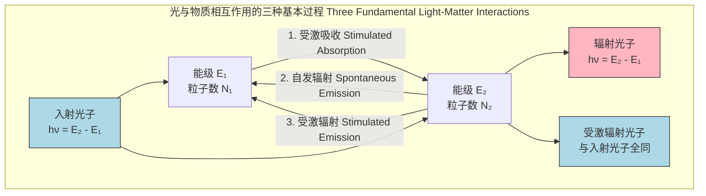
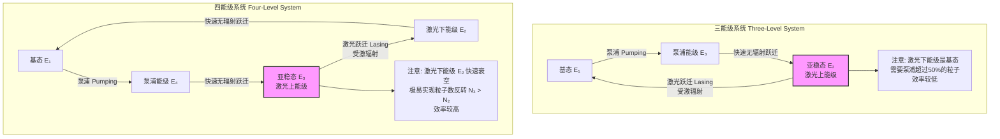
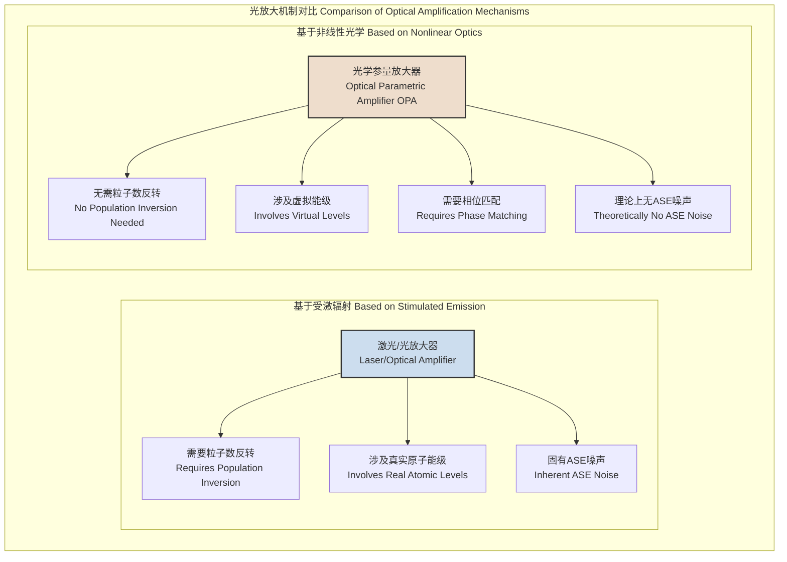

## 受激辐射 (Stimulated Emission)

受激辐射是一种量子力学现象，当一个处于激发态的原子（或分子、量子点等量子系统）与一个能量等于该系统两能级之差的光子相互作用时，该原子会跃迁到较低的能级，并辐射出一个与入射光子在频率、相位、偏振方向和传播方向上完全相同的新光子。这一过程是光放大和激光产生的基础，其理论由阿尔伯特·爱因斯坦于1917年奠定。

### 核心概念与数学基础

爱因斯坦提出了三种基本的光与物质相互作用过程，它们共同描述了原子系统与电磁辐射场之间的能量交换。

#### 爱因斯坦系数与关系式推导

考虑一个简化的二能级原子系统，其能级分别为 $E_1$ 和 $E_2$（$E_2 > E_1$），对应的粒子数密度为 $N_1$ 和 $N_2$。辐射场的能量密度为 $\rho(\nu)$，其中跃迁频率 $\nu = (E_2 - E_1)/h$。

1.  **受激吸收 (Stimulated Absorption)**：处于低能级 $E_1$ 的原子吸收一个光子，跃迁到高能级 $E_2$。其跃迁速率与 $N_1$ 和 $\rho(\nu)$ 成正比。
    $$ R_{abs} = B_{12} N_1 \rho(\nu) $$
    其中，$B_{12}$ 是受激吸收爱因斯坦B系数。

2.  **自发辐射 (Spontaneous Emission)**：处于高能级 $E_2$ 的原子在没有外部光子作用下，自发地跃迁到低能级 $E_1$，并释放一个光子。其跃迁速率仅与 $N_2$ 成正比。
    $$ R_{sp} = A_{21} N_2 $$
    其中，$A_{21}$ 是自发辐射爱因斯坦A系数。

3.  **受激辐射 (Stimulated Emission)**：处于高能级 $E_2$ 的原子在入射光子的诱导下，跃迁到低能级 $E_1$，并辐射一个与入射光子完全相同的光子。其跃迁速率与 $N_2$ 和 $\rho(\nu)$ 成正比。
    $$ R_{stim} = B_{21} N_2 \rho(\nu) $$
    其中，$B_{21}$ 是受激辐射爱因斯坦B系数。

在热力学平衡状态下，向上跃迁的总速率必须等于向下跃迁的总速率：
$$ R_{abs} = R_{sp} + R_{stim} $$
$$ B_{12} N_1 \rho(\nu) = A_{21} N_2 + B_{21} N_2 \rho(\nu) $$

从此式中解出辐射能量密度 $\rho(\nu)$：
$$ \rho(\nu) = \frac{A_{21} N_2}{B_{12} N_1 - B_{21} N_2} = \frac{A_{21}/B_{21}}{(N_1/N_2)(B_{12}/B_{21}) - 1} $$

根据热平衡时的玻尔兹曼分布定律，两能级的粒子数密度比为：
$$ \frac{N_2}{N_1} = \frac{g_2}{g_1} e^{-(E_2 - E_1)/(k_B T)} = \frac{g_2}{g_1} e^{-h\nu/(k_B T)} $$
其中：
*   $g_1, g_2$ 分别是能级 $E_1, E_2$ 的简并度。
*   $k_B$ 是玻尔兹曼常数。
*   $T$ 是绝对温度。

将此关系代入 $\rho(\nu)$ 的表达式：
$$ \rho(\nu) = \frac{A_{21}/B_{21}}{(\frac{g_1}{g_2} e^{h\nu/(k_B T)})(\frac{B_{12}}{B_{21}}) - 1} $$

将此结果与普朗克的黑体辐射定律进行比较：
$$ \rho(\nu) = \frac{8\pi h \nu^3}{c^3} \frac{1}{e^{h\nu/(k_B T)} - 1} $$

通过比较上述两个 $\rho(\nu)$ 的表达式，我们必须得到以下两个重要的**爱因斯坦关系式**：

1.  受激吸收与受激辐射系数之间的关系：
    $$ g_1 B_{12} = g_2 B_{21} $$
    这个关系表明，在考虑了能级简并度后，原子从低能级到高能级的受激跃迁概率等于从高能级到低能级的受激跃迁概率。

2.  自发辐射与受激辐射系数之间的关系：
    $$ \frac{A_{21}}{B_{21}} = \frac{8\pi h \nu^3}{c^3} $$
    这个关系揭示了自发辐射和受激辐射的相对重要性。比值随频率的立方 $\nu^3$ 增加，意味着在高频（如X射线）波段，自发辐射占主导地位；而在低频（如微波）波段，受激辐射更容易成为主导过程。

#### 光放大的条件：粒子数反转

要实现净光放大，受激辐射的速率必须超过受激吸收的速率：
$$ R_{stim} > R_{abs} $$
$$ B_{21} N_2 \rho(\nu) > B_{12} N_1 \rho(\nu) $$
利用关系式 $g_1 B_{12} = g_2 B_{21}$，上述不等式简化为：
$$ \frac{N_2}{g_2} > \frac{N_1}{g_1} $$
这个条件被称为**粒子数反转 (Population Inversion)**。它描述了一种非热平衡状态，即高能级上单位简并态的粒子数多于低能级。这是实现激光和光放大的先决条件。

### 关键技术规格

在实际应用中，通常使用更便于测量的参数，如受激辐射截面。下表列出了一些关键参数及其在典型激光材料Nd:YAG（掺钕钇铝石榴石，激光波长 λ=1064 nm）中的参考值。

| 参数 (Parameter) | 符号 (Symbol) | 定义 (Definition) | 典型值 (Nd:YAG @ 1064 nm) | 单位 (Unit) |
| :--- | :--- | :--- | :--- | :--- |
| 爱因斯坦A系数 | $A_{21}$ | 单位时间内单个激发态原子的自发辐射概率 | ~2300 | s⁻¹ |
| 受激辐射截面 | $\sigma_{em}(\nu)$ | 描述光子与激发态原子相互作用的有效面积 | ~2.8 × 10⁻¹⁹ | cm² |
| 自发辐射寿命 | $\tau_{sp}$ | 激发态粒子数因自发辐射衰减到1/e所需的时间，$\tau_{sp} = 1/A_{21}$ | ~430 | μs |
| 增益系数 | $g(\nu)$ | 光在单位长度内强度的指数增长率 | 取决于泵浦强度 | cm⁻¹ |
| 饱和光强 | $I_{sat}$ | 使增益系数下降到其小信号值一半时的光强 | ~2.9 | kW/cm² |

**注:** 受激辐射截面 $\sigma_{em}(\nu)$ 与爱因斯坦B系数的关系为：
$$ \sigma_{em}(\nu) = \frac{h\nu}{c} B_{21} f(\nu) $$
其中 $f(\nu)$ 是归一化的谱线线型函数，描述了跃迁的频率响应。

### 常见用例

受激辐射是现代光子学的核心技术，其应用广泛。

*   **激光器 (Lasers)**
    *   **原理**: 在一个谐振腔内放置一个具有粒子数反转的增益介质。自发辐射产生的光子在腔内来回反射，反复通过增益介质，通过受激辐射被放大，最终形成高度相干、单色、方向性好的激光束。
    *   **性能指标**:
        *   输出功率 (Output Power): 从毫瓦 (mW) 到兆瓦 (MW) 不等。
        *   光束质量 (Beam Quality): 用 M² 因子衡量，理想高斯光束 M²=1。
        *   谱线宽度 (Linewidth): 从几吉赫兹 (GHz) 到亚赫兹 (sub-Hz) 不等。

*   **光放大器 (Optical Amplifiers)**
    *   **原理**: 与激光器类似，但没有谐振腔。输入信号光直接通过具有粒子数反转的增益介质，通过单次或多次受激辐射过程被放大。最典型的例子是掺铒光纤放大器 (EDFA)。
    *   **性能指标**:
        *   增益 (Gain): >30 dB (放大1000倍) 是商用EDFA的典型值。
        *   噪声系数 (Noise Figure, NF): 描述放大过程中信噪比的恶化程度。量子极限为3 dB，典型EDFA的NF < 5 dB。
        *   增益平坦度 (Gain Flatness): 在工作带宽内增益的一致性。

*   **超辐射发光二极管 (Superluminescent Diodes, SLDs)**
    *   **原理**: 基于放大自发辐射 (ASE)。结构类似半导体激光器，但通过设计抑制端面反射，避免形成谐振。自发辐射光在波导内单次通过时被受激辐射显著放大。
    *   **性能指标**:
        *   输出功率: 1-100 mW。
        *   光谱宽度: 5-100 nm (宽光谱，低相干性)。
        *   相干长度: 几微米到几十微米。

### 实现考量

实现受激辐射主导的过程，关键在于如何有效地建立并维持粒子数反转。

#### 泵浦机制与能级系统

为了实现粒子数反转，需要通过外部能源将粒子从低能级“泵浦”到高能级。根据增益介质的能级结构，激光系统通常分为三能级和四能级系统。

*   **三能级系统**: 激光跃迁的下能级是基态。为了实现粒子数反转 ($N_2 > N_1$)，必须将超过一半的基态粒子泵浦到激发态，因此需要非常高的泵浦功率。例如，红宝石激光器。
*   **四能级系统**: 激光跃迁的下能级 ($E_2$) 是一个高于基态的能级，并且粒子能从该能级快速衰变到基态。因此，$E_2$ 上的粒子数始终保持很低 ($N_2 \approx 0$)。只要有少量粒子被泵浦到上能级 $E_3$，就能轻松实现粒子数反转 ($N_3 > N_2$)。绝大多数现代激光器，如Nd:YAG激光器和He-Ne激光器，都采用四能级（或准四能级）系统。

#### 速率方程分析

系统的动态行为可以通过速率方程组进行建模。这些方程描述了各能级粒子数和光子数随时间的变化。对于一个简化的四能级系统，其核心方程（忽略泵浦能级和激光下能级的布居）可以写作：
$$ \frac{dN_2(t)}{dt} = R_p - \frac{N_2(t)}{\tau_{sp}} - \sigma_{em} \frac{c}{n} [N_2(t) - N_1(t)] \phi(t) $$
$$ \frac{d\phi(t)}{dt} = \sigma_{em} \frac{c}{n} [N_2(t) - N_1(t)] \phi(t) - \frac{\phi(t)}{\tau_{ph}} + \beta \frac{N_2(t)}{\tau_{sp}} $$
其中：
*   $N_2, N_1$ 是激光上、下能级的粒子数密度。
*   $R_p$ 是泵浦速率。
*   $\tau_{sp}$ 是上能级的自发辐射寿命。
*   $\phi(t)$ 是腔内光子数密度。
*   $\tau_{ph}$ 是光子在谐振腔内的寿命。
*   $c/n$ 是介质中的光速。
*   $\beta$ 是自发辐射光子进入激光模式的比例因子。

求解这组耦合的非线性微分方程可以预测激光器的阈值、输出功率、弛豫振荡等行为。其数值求解的复杂度与能级数量和考虑的物理过程成正比。

### 性能特征

#### 增益饱和 (Gain Saturation)

增益介质的增益系数并不是一个常数，它会随着放大光强的增加而减小。这是因为高强度的光会加速受激辐射过程，大量消耗上能级的粒子，从而降低粒子数反转的程度。这种现象称为增益饱和。

均匀加宽介质的增益饱和可以用以下公式描述：
$$ g(I) = \frac{g_0}{1 + I/I_{sat}} $$
其中：
*   $g(I)$ 是光强为 $I$ 时的增益系数。
*   $g_0$ 是小信号增益系数，即 $I \to 0$ 时的最大增益。$g_0 = \sigma_{em} \Delta N_0$，其中 $\Delta N_0$ 是未受扰动时的初始粒子数反转密度。
*   $I$ 是光强。
*   $I_{sat}$ 是饱和光强，定义为使增益系数下降到 $g_0/2$ 时的光强。其物理意义是，当光强等于饱和光强时，受激辐射速率约等于自发辐射速率。其表达式为 $I_{sat} = \frac{h\nu}{\sigma_{em} \tau_{sp}}$。

#### 放大自发辐射 (Amplified Spontaneous Emission, ASE)

在增益介质中，除了信号光被放大，自发辐射产生的光子也会在传播过程中被受激辐射放大，形成放大自发辐射（ASE）。ASE与信号光竞争增益，并作为噪声叠加在信号上，降低信噪比。这是光放大器性能的一个基本限制。

**噪声系数 (Noise Figure, NF)** 是衡量放大器信噪比恶化程度的指标：
$$ NF = \frac{SNR_{in}}{SNR_{out}} $$
对于一个理想的、仅受ASE限制的光放大器，其噪声系数有一个量子极限。在高增益条件下，NF可以近似为：
$$ NF \approx 2n_{sp} = 2 \frac{N_2}{N_2 - (g_2/g_1)N_1} $$
其中 $n_{sp}$ 被称为自发辐射因子或粒子数反转因子。在理想的完全粒子数反转情况下 ($N_1=0$)，$n_{sp}=1$，此时 $NF=2$，即 **3 dB**。这是光放大器噪声性能的理论最佳值。

### 相关技术对比

*   **与自发辐射和吸收的关系**: 受激辐射、自发辐射和吸收是同一物理框架下的三个过程。在热平衡系统中，它们相互制约。在激光和光放大器中，人们通过泵浦打破平衡，使受激辐射成为主导过程，同时抑制吸收，而自发辐射则成为初始光子来源和噪声源。

*   **与光学参量放大的对比**:
    *   **物理机制**: 受激辐射依赖于增益介质中特定能级间的粒子数反转。而光学参量放大（OPA）是一种非线性光学效应，依赖于介质的二阶（$\chi^{(2)}$）或三阶（$\chi^{(3)}$）非线性极化率。在OPA中，一个高能量的泵浦光子（$\omega_p$）在非线性晶体中分裂成一个信号光子（$\omega_s$）和一个闲频光子（$\omega_i$），满足能量守恒 $\omega_p = \omega_s + \omega_i$。
    *   **噪声**: 受激辐射放大器不可避免地引入ASE噪声，其量子极限为3 dB。而理想的OPA不涉及自发辐射过程，理论上可以实现无噪声放大（NF=0 dB），但在实际中会受到泵浦光噪声等因素的影响。
    *   **条件**: 受激辐射需要实现粒子数反转。OPA则需要满足严格的相位匹配条件（$\vec{k}_p = \vec{k}_s + \vec{k}_i$），以保证能量从泵浦光高效地转移到信号光和闲频光。

### 参考文献

1.  Einstein, A. (1917). Zur Quantentheorie der Strahlung. *Physikalische Zeitschrift*, 18, 121-128. (这是爱因斯坦提出受激辐射概念的原始论文之一).
2.  Svelto, O. (2010). *Principles of Lasers* (5th ed.). Springer. DOI: 10.1007/978-1-4419-1302-9. (激光物理领域的权威教科书).
3.  Desurvire, E., Simpson, J. R., & Becker, P. C. (1987). High-gain erbium-doped traveling-wave fiber amplifier. *Optics Letters*, 12(11), 888-890. DOI: 10.1364/OL.12.000888. (开创性的高增益掺铒光纤放大器研究论文).