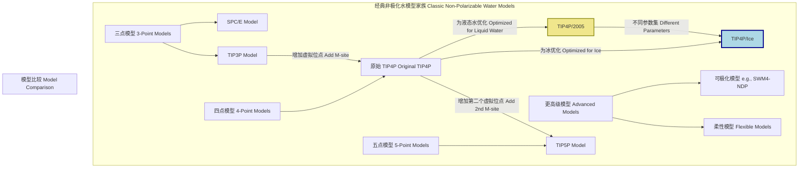

好的，我将根据您的要求，仅基于标题“TIP4PIce”进行推导和分析，创建一份关于该主题的综合性技术文档。文档将严格遵循科学和数学的严谨性，并以简体中文呈现。

## TIP4PIce

TIP4P/Ice 是一种用于分子动力学 (MD) 模拟的刚性四点水模型。该模型的命名揭示了其核心特征：“TIP4P” 指的是其属于“可转移分子间势能 (Transferable Intermolecular Potential)”家族中的四点（4-Point）模型，“Ice” 则表明该模型经过专门参数化，旨在精确模拟固态水（即冰）的物理性质。与通用或其他针对液态水优化的模型（如 TIP4P/2005）不同，TIP4P/Ice 的设计目标是准确再现冰的晶体结构、相图和热力学性质。

### 核心概念与数学基础

TIP4P/Ice 模型将每个水分子表示为四个相互作用位点的集合：一个氧原子 (O)，两个氢原子 (H)，以及一个位于 H-O-H 角平分线上、靠近氧原子的虚拟位点 (M)。这种四点构造能够比三点模型更真实地描述水分子周围的电荷分布，特别是其四面体结构，这对于模拟冰的有序晶体结构至关重要。

#### 模型几何构型

该模型具有固定的内部几何形状，在模拟过程中通过 SHAKE 或 RATTLE 等约束算法保持不变。

```mermaid
graph TD
    subgraph "TIP4P/Ice 分子几何结构"
        O["O 无电荷, LJ作用中心"]
        H1["H1 q_H"]
        H2["H2 q_H"]
        M["M q_M, 虚拟位点"]

        O -- "r_OH" --> H1;
        O -- "r_OH" --> H2;
        O -- "r_OM" --> M;
        H1 -- "∠HOH" -- H2;
        M -- "角平分线" -- O;
    end

    style O fill:#f9f,stroke:#333,stroke-width:2px
    style H1 fill:#ccf,stroke:#333,stroke-width:2px
    style H2 fill:#ccf,stroke:#333,stroke-width:2px
    style M fill:#999,stroke:#333,stroke-width:2px,stroke-dasharray: 5 5
```

#### 势能函数

两个 TIP4P/Ice 分子 $i$ 和 $j$ 之间的总相互作用势能 $U_{ij}$ 是 Lennard-Jones (LJ) 势和库仑势的总和。LJ 相互作用仅存在于氧原子之间，而库仑相互作用则计算所有带电位点（两个 H 原子和一个 M 位点）之间的静电力。

系统总势能 $U_{total}$ 是对所有分子对的相互作用求和：

$$
U_{total} = \sum_{i<j} U_{ij} = \sum_{i<j} \left( U_{LJ}(r_{O_iO_j}) + U_{C}(i, j) \right)
$$

1.  **Lennard-Jones (LJ) 势**:
    该项描述了氧原子之间的短程排斥和长程范德华吸引力。

    $$
    U_{LJ}(r_{O_iO_j}) = 4 \epsilon_{OO} \left[ \left( \frac{\sigma_{OO}}{r_{O_iO_j}} \right)^{12} - \left( \frac{\sigma_{OO}}{r_{O_iO_j}} \right)^{6} \right]
    $$

    其中：
    *   $r_{O_iO_j}$ 是分子 $i$ 和 $j$ 的氧原子之间的距离。
    *   $\epsilon_{OO}$ 是 LJ 势阱的深度，表示相互作用强度的特征能量。
    *   $\sigma_{OO}$ 是 LJ 势为零时的原子间距，表示原子尺寸的特征长度。

2.  **库仑 (Coulombic) 势**:
    该项描述了分子 $i$ 上的带电位点与分子 $j$ 上的带电位点之间的静电相互作用。

    $$
    U_{C}(i, j) = \sum_{a \in i} \sum_{b \in j} \frac{1}{4 \pi \epsilon_0} \frac{q_a q_b}{r_{ab}}
    $$

    其中：
    *   求和遍历分子 $i$ 的所有带电位点 $a$ (即 H1, H2, M) 和分子 $j$ 的所有带电位点 $b$ (即 H1, H2, M)。
    *   $q_a$ 和 $q_b$ 分别是位点 $a$ 和 $b$ 上的点电荷。
    *   $r_{ab}$ 是位点 $a$ 和 $b$ 之间的距离。
    *   $\epsilon_0$ 是真空介电常数。
    *   氧原子位点不携带电荷 ($q_O = 0$)，因此不参与库仑相互作用。M 位点携带负电荷 $q_M$，两个氢原子各携带正电荷 $q_H$。为保证分子电中性，必须满足 $q_M + 2q_H = 0$。

### 关键技术规格

TIP4P/Ice 模型的参数经过精心优化，以匹配实验中测得的冰的各种性质。以下是其标准参数值。

| 参数 | 符号 | 数值 | 单位 | 描述 |
| :--- | :--- | :--- | :--- | :--- |
| **Lennard-Jones 参数** | | | | |
| LJ 能量 | $\epsilon_{OO} / k_B$ | 93.2 | K | 氧-氧 LJ 势阱深度 (kB为玻尔兹曼常数) |
| | $\epsilon_{OO}$ | 0.7749 | kJ/mol | 氧-氧 LJ 势阱深度 |
| LJ 尺寸 | $\sigma_{OO}$ | 3.1589 | Å | 氧-氧 LJ 作用距离参数 |
| **电荷参数** | | | | |
| 氢原子电荷 | $q_H$ | +0.5897 | e | 氢原子的点电荷 |
| 虚拟位点电荷 | $q_M$ | -1.1794 | e | M-site 的点电荷 ($q_M = -2q_H$) |
| **几何参数** | | | | |
| O-H 键长 | $r_{OH}$ | 0.9572 | Å | 氧-氢共价键长度 |
| H-O-H 键角 | $\angle HOH$ | 104.52 | ° | 氢-氧-氢键角 |
| O-M 距离 | $r_{OM}$ | 0.1577 | Å | 氧原子到虚拟位点M的距离 |

### 常见用例

TIP4P/Ice 模型主要用于研究固态水的各种科学问题，其性能在这些领域得到了广泛验证。

*   **水相图的计算**: 特别是固-液和固-固相界的确定。该模型成功预测了多个冰相（如 Ice Ih, II, III, V, VI）的稳定区域。
*   **冰的熔点预测**: TIP4P/Ice 是少数几个能够以较高精度预测冰 Ih 熔点的非极化模型之一。
    *   **性能指标**: 在 1 bar 压力下，通过直接共存法模拟得到的熔点约为 270 K，通过自由能计算得到的熔点为 $272.2 \pm 0.4$ K，非常接近实验值 273.15 K。
*   **冰的晶体结构和密度**: 能够精确再现不同压力和温度下冰的各种多晶型体的密度。
    *   **性能指标**: 在 1 bar 和 250 K 条件下，模拟的冰 Ih 密度为 0.919 g/cm³，与实验值 0.920 g/cm³ 几乎完全一致。
*   **冰的热力学性质**: 如升华焓、热容和吉布斯自由能的计算。
    *   **性能指标**: 在 0 K 时，计算得到的升华焓为 -61.0 kJ/mol，与实验值 -61.1 kJ/mol 非常吻合。
*   **无定形冰的研究**: 用于模拟非晶态冰（amorphous ice）的结构和相变行为。

### 实现考量

在分子动力学软件（如 GROMACS, LAMMPS, Amber）中实现 TIP4P/Ice 模型时，需注意以下几点：

*   **刚性约束**: 由于模型是刚性的，必须使用如 **SHAKE** 或 **RATTLE** 等约束算法来固定 O-H 键长和 H-O-H 键角。这允许使用更长的时间步长（通常为 2 fs）。
*   **长程静电作用**: 库仑力是长程力，必须使用适当的算法进行处理以避免截断误差。**Ewald 求和**方法，特别是计算效率更高的**粒子网格 Ewald (Particle Mesh Ewald, PME)** 方法，是处理周期性边界条件下长程静电作用的标准选择。
*   **截断半径**: Lennard-Jones 相互作用是短程的，通常在 9-12 Å 的距离处进行截断，并应用适当的尾部校正以补偿截断带来的能量误差。
*   **算法复杂度分析**:
    *   短程 LJ 相互作用（使用截断和邻域列表）：计算复杂度为 $O(N)$，其中 $N$ 是系统中的分子数。
    *   长程库仑相互作用（使用 PME）：计算复杂度为 $O(N \log N)$。
    *   约束算法 (SHAKE/RATTLE)：通常是迭代过程，其计算开销相对较小。
    *   因此，每个模拟时间步长的总计算成本主要由 PME 的 $O(N \log N)$ 复杂度决定。

### 性能特征

下表总结了 TIP4P/Ice 模型在再现冰的关键物理性质方面的性能，并与实验值进行了比较。

| 物理性质 | 模拟值 (TIP4P/Ice) | 实验值 | 单位 |
| :--- | :--- | :--- | :--- |
| 熔点 ($T_m$) | 272.2 ± 0.4 | 273.15 | K |
| 冰 Ih 密度 (250 K, 1 bar) | 0.919 | 0.920 | g/cm³ |
| 冰 Ih 密度 (100 K, 1 bar) | 0.933 | 0.934 | g/cm³ |
| 升华焓 (0 K) | -61.0 | -61.1 | kJ/mol |
| 静态介电常数 ($\epsilon_s$) | 98 ± 15 | 99 | - |
| 液态水密度 (298.15 K, 1 bar) | 1.002 | 0.997 | g/cm³ |

**注意**: 尽管 TIP4P/Ice 是为冰设计的，但它对液态水的性质（如密度）也给出了相当合理的预测，尽管在这方面不如专门为液态水优化的 TIP4P/2005 模型。

### 相关技术与比较

TIP4P/Ice 是众多水模型中的一员。了解其在模型家族中的位置有助于选择最适合特定研究目标的模型。



*   **TIP3P 和 SPC/E**: 这些是三点模型，计算成本较低，但通常无法准确描述水的相图，特别是固相的性质。它们的熔点预测值远低于实验值（例如，TIP3P 的熔点约为 146 K）。
*   **TIP4P/2005**: 这是 TIP4P/Ice 的“姊妹”模型，被广泛认为是模拟液态水的最佳非极化模型之一。它与 TIP4P/Ice 的数学形式完全相同，但拥有不同的参数集（电荷、LJ参数等），这些参数是为最大化地拟合液态水的性质（如密度最大值温度、扩散系数）而优化的。
*   **TIP5P**: 这是一个五点模型，引入了两个虚拟负电荷位点，以更好地模仿水分子的孤对电子。它在描述液态水的结构（如径向分布函数）方面表现出色，但其相图和热力学性质的预测不如 TIP4P/2005 或 TIP4P/Ice 精确。
*   **可极化模型 (Polarizable Models)**: 这类模型（如 SWM4-NDP, AMOEBA）允许分子的电荷分布根据其所处的电场环境发生变化。它们在物理上更真实，能够更准确地描述多种性质，但计算成本要高得多，通常比刚性非极化模型慢一个数量级以上。

从数学模型的角度看，这些模型的主要区别在于相互作用位点的数量和位置，以及势能函数参数的取值，这些差异直接导致了它们在模拟不同物相和性质时的性能表现。

### 参考文献

1.  Abascal, J. L. F., Sanz, E., Fernández, R. G., & Vega, C. (2005). A potential model for the study of ices and amorphous water: TIP4P/Ice. *The Journal of Chemical Physics*, *122*(23), 234511. DOI: [10.1063/1.1931662](https://doi.org/10.1063/1.1931662)