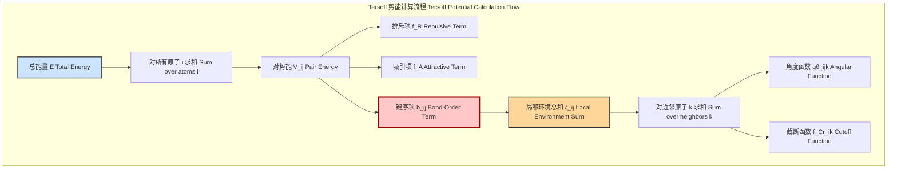
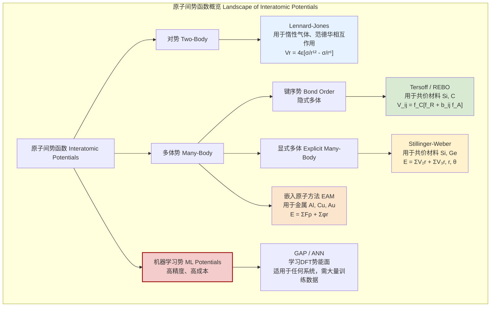

## Tersoff 泛函形式

Tersoff 泛函形式是一种经验性的多体键序势（Bond-Order Potential, BOP），由物理学家 Jerry Tersoff 在20世纪80年代末开发，主要用于模拟共价键合系统，特别是硅（Si）、碳（C）和锗（Ge）及其合金。与简单的对势（pair potential）不同，Tersoff 势能够描述原子间成键的强度如何受其局部化学环境（如键角和近邻原子数量）的影响。这一特性使其能够准确地模拟不同配位环境下的原子相互作用，例如在晶体、表面、缺陷和非晶结构中。

### 核心概念与数学基础

Tersoff 势的核心思想是，两个原子 $i$ 和 $j$ 之间的键能不仅取决于它们之间的距离 $r_{ij}$，还通过一个“键序”项 $b_{ij}$ 依赖于原子 $i$ 的局部环境。系统的总势能 $E$ 是所有原子能量 $E_i$ 的总和，而每个原子的能量 $E_i$ 则表示为与其近邻原子对相互作用能 $V_{ij}$ 的总和的一半（避免重复计算）：

$$
E = \sum_i E_i = \frac{1}{2} \sum_{i \neq j} V_{ij}
$$

其中，对势 $V_{ij}$ 由排斥项 $f_R$、吸引项 $f_A$ 和键序项 $b_{ij}$ 构成。其形式如下：

$$
V_{ij} = f_C(r_{ij}) \left[ f_R(r_{ij}) + b_{ij} f_A(r_{ij}) \right]
$$

#### 1. 分项解析

*   **排斥项 $f_R(r_{ij})$ 和吸引项 $f_A(r_{ij})$**:
    这两项描述了原子间的基本对相互作用，通常采用指数形式（Morse势的形式）：
    $$
    f_R(r_{ij}) = A_{ij} e^{-\lambda_{1,ij} r_{ij}}
    $$
    $$
    f_A(r_{ij}) = -B_{ij} e^{-\lambda_{2,ij} r_{ij}}
    $$
    其中：
    *   $A_{ij}, B_{ij}$: 分别是排斥项和吸引项的幅度（单位：eV）。
    *   $\lambda_{1,ij}, \lambda_{2,ij}$: 分别是排斥项和吸引项的衰减因子（单位：Å⁻¹）。
    *   对于单元素体系，参数与原子类型无关，即 $A_{ij}=A, B_{ij}=B$ 等。

*   **截断函数 $f_C(r_{ij})$**:
    为了在分子动力学（MD）模拟中节省计算资源，相互作用在超过一定距离后被平滑地截断为零。Tersoff 势使用了一个余弦形式的截断函数：
    $$
    f_C(r_{ij}) =
    \begin{cases}
    1 & , r_{ij} < R_{ij} - D_{ij} \\
    \frac{1}{2} - \frac{1}{2} \sin\left( \frac{\pi (r_{ij} - R_{ij})}{2 D_{ij}} \right) & , R_{ij} - D_{ij} < r_{ij} < R_{ij} + D_{ij} \\
    0 & , r_{ij} > R_{ij} + D_{ij}
    \end{cases}
    $$
    其中：
    *   $R_{ij}$: 截断距离的中心点（单位：Å）。
    *   $D_{ij}$: 截断函数的平滑过渡区域的半宽度（单位：Å）。
    *   截断范围为 $[R_{ij} - D_{ij}, R_{ij} + D_{ij}]$。

*   **键序项 $b_{ij}$**:
    这是Tersoff势的核心，它体现了多体效应。$b_{ij}$ 调节吸引项的强度，反映了原子 $i$ 和 $j$ 之间的键如何被原子 $i$ 的其他近邻原子 $k$ 削弱。其值介于0和1之间。
    $$
    b_{ij} = (1 + \beta_i^n \zeta_{ij}^n)^{-1/(2n)}
    $$
    其中：
    *   $\zeta_{ij}$: 表示原子 $i$ 周围对 $i-j$ 键产生影响的其他键的有效“数量”。
    *   $\beta_i, n_i$: 是可调参数，控制键序项的函数形式。

    $\zeta_{ij}$ 的计算考虑了原子 $i$ 的所有其他近邻 $k$（不包括 $j$）：
    $$
    \zeta_{ij} = \sum_{k \neq i,j} f_C(r_{ik}) g(\theta_{ijk})
    $$
    其中：
    *   $f_C(r_{ik})$: 确保只有在截断半径内的原子 $k$ 才被计入。
    *   $g(\theta_{ijk})$: 是一个角度依赖函数，它惩罚偏离理想键角的构型。$\theta_{ijk}$ 是由原子 $j, i, k$ 构成的键角。

*   **角度依赖函数 $g(\theta)$**:
    该函数用于稳定特定的晶体结构（例如金刚石结构中的四面体键角）。其形式为：
    $$
    g(\theta) = 1 + \frac{c_i^2}{d_i^2} - \frac{c_i^2}{d_i^2 + (h_i - \cos\theta)^2}
    $$
    其中：
    *   $c_i, d_i, h_i$: 是用于拟合材料弹性常数和不同晶格结构能量的无量纲参数。
    *   对于硅和碳，这些参数被设定为倾向于形成 $\cos\theta = -1/3$ 的四面体键角（约109.5°）。当 $\cos\theta = h_i$ 时，$g(\theta)$ 达到其最小值，从而使该键角在能量上最有利。

#### 2. Tersoff 势计算流程

下面的Mermaid图展示了从总能到各个组成部分的计算层次结构。

### 关键技术参数

以下表格列出了Tersoff势应用于单晶硅（Si）时的典型参数。这些参数通过拟合硅的内聚能、晶格常数和弹性常数等实验数据得到。

| 参数 (Parameter) | 符号 (Symbol) | 数值 (Value) | 单位 (Unit) | 描述 (Description) |
| :--- | :--- | :--- | :--- | :--- |
| 排斥幅度 (Repulsive Magnitude) | $A$ | 1830.8 | eV | 排斥项 $f_R$ 的幅度 |
| 吸引幅度 (Attractive Magnitude) | $B$ | 471.18 | eV | 吸引项 $f_A$ 的幅度 |
| 排斥衰减 (Repulsive Decay) | $\lambda_1$ | 2.4799 | Å⁻¹ | 排斥项的衰减因子 |
| 吸引衰减 (Attractive Decay) | $\lambda_2$ | 1.7322 | Å⁻¹ | 吸引项的衰减因子 |
| 键序参数 (Bond-order parameter) | $\beta$ | 1.1000e-6 | (无量纲) | $b_{ij}$ 中的参数 |
| 键序参数 (Bond-order parameter) | $n$ | 0.78734 | (无量纲) | $b_{ij}$ 中的指数 |
| 角度参数 (Angular parameter) | $c$ | 1.0039e5 | (无量纲) | $g(\theta)$ 中的参数 |
| 角度参数 (Angular parameter) | $d$ | 16.217 | (无量纲) | $g(\theta)$ 中的参数 |
| 角度参数 (Angular parameter) | $h$ | -0.59825 | (无量纲) | $g(\theta)$ 中的目标余弦值 |
| 截断中心 (Cutoff Center) | $R$ | 2.85 | Å | 截断函数 $f_C$ 的中心 |
| 截断宽度 (Cutoff Width) | $D$ | 0.15 | Å | 截断函数的平滑区半宽 |

*数据来源: J. Tersoff, Phys. Rev. B 39, 5566 (1989).*

### 常见用例与性能指标

Tersoff势因其对共价键环境的良好描述性和计算效率，被广泛应用于材料科学的计算模拟中。

*   **用例**:
    *   **晶体生长与外延**: 模拟硅或碳薄膜在衬底上的沉积过程。
    *   **点缺陷与扩展缺陷**: 计算空位、间隙原子、位错和晶界的形成能与迁移势垒。
    *   **非晶材料**: 模拟非晶硅（a-Si）和类金刚石碳（DLC）的原子结构和性质。
    *   **纳米结构**: 研究碳纳米管、石墨烯和硅纳米线的力学和热学性质。
    *   **断裂与变形**: 模拟材料在应力下的裂纹扩展和塑性变形行为。

*   **定量性能指标 (以硅为例)**:
    下表将Tersoff势计算的硅的一些基本物理性质与实验值进行了比较，展示了其预测精度。

| 物理性质 (Property) | Tersoff 预测值 | 实验值 (Experimental Value) | 相对误差 (Relative Error) |
| :--- | :--- | :--- | :--- |
| 晶格常数 (Lattice Constant) | 5.431 Å | 5.430 Å | ~0.02% |
| 内聚能 (Cohesive Energy) | 4.63 eV/atom | 4.63 eV/atom | ~0% (拟合目标) |
| 体积模量 (Bulk Modulus) | 99.2 GPa | 99.0 GPa | ~0.2% |
| 弹性常数 C₁₁ | 141 GPa | 166 GPa | -15% |
| 弹性常数 C₁₂ | 78 GPa | 64 GPa | +22% |
| 弹性常数 C₄₄ | 65 GPa | 80 GPa | -19% |

从表中可以看出，Tersoff势能极好地再现金刚石结构硅的晶格常数、内聚能和体积模量。尽管弹性常数的预测存在一定偏差（15-25%），但这在经验势中是可接受的范围，并且足以用于定性到半定量的力学行为研究。

### 实现考量与算法复杂度

在分子动力学（MD）或蒙特卡洛（MC）模拟中实现Tersoff势时，计算效率至关重要。

*   **算法核心**:
    1.  **构建近邻列表**: 对于每个原子，首先构建一个列表，包含其截断半径 ($R+D$) 内的所有其他原子。这是避免对所有 $N(N-1)/2$ 原子对进行计算的关键步骤。
    2.  **能量/力计算循环**:
        *   遍历每个原子 $i$。
        *   遍历原子 $i$ 的近邻原子 $j$。
        *   对于每个 $i-j$ 对，计算 $\zeta_{ij}$。这需要再次遍历原子 $i$ 的近邻原子 $k$。
        *   利用计算出的 $\zeta_{ij}$，得到键序 $b_{ij}$。
        *   计算对势能 $V_{ij}$ 并累加到总能量。
        *   通过对势能 $E$ 对原子坐标求负梯度（$-\nabla_{\mathbf{r}} E$）来计算力。这是一个复杂的过程，因为 $V_{ij}$ 不仅依赖于 $\mathbf{r}_i$ 和 $\mathbf{r}_j$，还通过 $b_{ij}$ 和 $\theta_{ijk}$ 间接依赖于近邻 $\mathbf{r}_k$ 的位置。因此，力的计算涉及三体力（three-body forces）。

*   **算法复杂度**:
    *   **朴素实现**: 如果不使用近邻列表，对于每个原子对 $(i,j)$，都需要遍历所有其他原子 $k$ 来计算 $\zeta_{ij}$。这将导致算法复杂度为 $O(N^3)$，对于大规模系统是不可接受的。
    *   **使用近邻列表**: 假设系统密度恒定，则每个原子的平均近邻数 $M$ 是一个常数。构建近邻列表的复杂度为 $O(N)$。在计算力的循环中，外层循环遍历 $N$ 个原子，内层循环遍历 $M$ 个近邻 $j$，计算 $\zeta_{ij}$ 的循环再次遍历 $M$ 个近邻 $k$。因此，总复杂度为 $O(N \cdot M^2)$。由于 $M$ 是常数，**有效复杂度为 $O(N)$**。这使得Tersoff势能够高效地模拟包含数百万个原子的系统。

### 性能特点

*   **优点**:
    *   **物理意义清晰**: 键序概念直观地联系了成键强度与局部环境。
    *   **可移植性好**: 相比于仅为特定晶体结构设计的势，Tersoff势能较好地处理多种配位环境（如表面重构、缺陷）。
    *   **计算效率高**: $O(N)$ 的复杂度使其适用于大规模MD模拟。
    *   **参数化灵活**: 可以通过调整参数来描述多种共价材料及其合金。

*   **局限性**:
    *   **适用范围**: 主要适用于共价键系统，不适用于金属键（缺乏电子气贡献）或离子键（缺乏长程静电作用）系统。
    *   **精度限制**: 作为经验势，其精度无法与第一性原理计算（如DFT）相比。例如，它可能无法准确预测熔点或某些微妙的表面效应。
    *   **过拟合风险**: 参数拟合的目标性质决定了其适用场景。例如，为体相性质拟合的参数可能在描述表面或小团簇时表现不佳。

### 相关技术与数学模型比较

Tersoff势是原子间势函数发展历程中的一个重要模型。了解其与其他势函数的区别有助于选择合适的模型。

*   **Lennard-Jones (LJ) 势**:
    *   **模型**: $V(r) = 4\epsilon [(\sigma/r)^{12} - (\sigma/r)^6]$
    *   **对比**: 纯粹的对势，无法描述键角依赖性。因此，它不能稳定金刚石结构（其预测的稳定结构是密堆积的fcc或hcp），不适用于共价系统。

*   **Stillinger-Weber (SW) 势**:
    *   **模型**: $E = \sum_{i<j} V_2(r_{ij}) + \sum_{i<j<k} V_3(r_{ij}, r_{ik}, \theta_{ijk})$
    *   **对比**: SW势通过一个显式的三体项来处理键角依赖性。它在描述体相硅的晶格动力学和熔化行为方面通常比Tersoff势更准确。然而，Tersoff势的键序形式被认为在不同配位环境下（如表面和缺陷）具有更好的可移植性。

*   **嵌入原子方法 (EAM)**:
    *   **模型**: $E_{tot} = \sum_i F_i(\rho_{h,i}) + \frac{1}{2} \sum_{i \neq j} \phi_{ij}(r_{ij})$，其中 $\rho_{h,i} = \sum_{j \neq i} f_j(r_{ij})$
    *   **对比**: EAM是为金属设计的。其物理图像是每个原子嵌入到由其邻居贡献的电子云密度中。这种非方向性的“胶水”模型与Tersoff势中描述共价键方向性的键序模型截然不同。

*   **反应性经验键序 (REBO) 势**:
    *   **模型**: REBO是Tersoff势的直接扩展，主要用于模拟碳氢化合物的化学反应。它在Tersoff的键序形式基础上增加了对共轭效应、扭转效应和更复杂的近邻环境的描述。

*   **机器学习 (ML) 势**:
    *   **模型**: 例如高斯近似势（GAP）或神经网络（ANN）势。这些模型不依赖于预设的物理函数形式，而是通过机器学习从大量的量子力学（如DFT）计算数据中“学习”势能面。
    *   **对比**: ML势可以达到接近DFT的精度，远超Tersoff等经验势，但其计算成本更高，且需要大量的训练数据。它们代表了当前原子模拟精度的新前沿。

### 参考文献

1.  Tersoff, J. (1988). New empirical approach for the structure and energy of covalent systems. *Physical Review B*, 37(12), 6991–7000. DOI: [10.1103/PhysRevB.37.6991](https://doi.org/10.1103/PhysRevB.37.6991)
2.  Tersoff, J. (1988). Empirical interatomic potential for carbon, with applications to amorphous carbon. *Physical Review Letters*, 61(25), 2879–2882. DOI: [10.1103/PhysRevLett.61.2879](https://doi.org/10.1103/PhysRevLett.61.2879)
3.  Tersoff, J. (1989). Modeling solid-state chemistry: Interatomic potentials for multicomponent systems. *Physical Review B*, 39(8), 5566–5568. DOI: [10.1103/PhysRevB.39.5566](https://doi.org/10.1103/PhysRevB.39.5566)