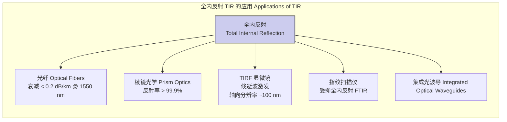

## 全内反射 (Total Internal Reflection, TIR)

全内反射（TIR）是一种光学现象，当光线从较高折射率的介质（光密介质）传播到较低折射率的介质（光疏介质）时，如果入射角大于某一临界角，所有入射光将被完全反射回第一介质，而不会有任何部分折射到第二介质中。这一现象是许多光学仪器和技术（如光纤、棱镜和某些类型的显微镜）的基础。

### 1. 核心概念与数学基础

TIR的物理行为由斯涅尔定律（Snell's Law）和电磁场的边界条件严格描述。

#### 斯涅尔定律与临界角

当光从折射率为 $n_1$ 的介质入射到折射率为 $n_2$ 的介质时，其入射角 $\theta_1$ 和折射角 $\theta_2$ 之间的关系由斯涅尔定律给出：

$$ n_1 \sin\theta_1 = n_2 \sin\theta_2 $$

其中：
*   $n_1$ 是第一介质（入射介质）的折射率。
*   $n_2$ 是第二介质（折射介质）的折射率。
*   $\theta_1$ 是入射角，即入射光线与界面法线之间的夹角。
*   $\theta_2$ 是折射角，即折射光线与界面法线之间的夹角。

为了发生全内反射，必须满足两个核心条件：
1.  光必须从光密介质传播到光疏介质，即 $n_1 > n_2$。
2.  入射角 $\theta_1$ 必须大于或等于临界角 $\theta_c$。

临界角 $\theta_c$ 是指使折射角 $\theta_2$ 恰好等于 $90^\circ$ 的特定入射角。当 $\theta_2 = 90^\circ$ 时，折射光线将沿着两个介质的界面传播。我们可以通过斯涅尔定律计算临界角：

$$ n_1 \sin\theta_c = n_2 \sin(90^\circ) = n_2 $$

因此，临界角的计算公式为：

$$ \theta_c = \arcsin\left(\frac{n_2}{n_1}\right) $$

如果入射角 $\theta_1 > \theta_c$，$\sin\theta_1 > \sin\theta_c = n_2/n_1$。根据斯涅尔定律，$\sin\theta_2 = (n_1/n_2)\sin\theta_1 > 1$，这在实数域内无解。这意味着没有能量以传播波的形式进入第二介质，所有能量都被反射回第一介质。

```mermaid
graph TD
    A[光线入射: n1 -> n2] --> B["条件1: n1 > n2?[";
    B -- "否 No" --> C[发生折射与部分反射<br>Refraction & Partial Reflection Occur];
    B -- "是 Yes" --> D["条件2: 入射角 θ1 ≥ 临界角 θc?[";
    D -- "否 No" --> C;
    D -- "是 Yes" --> E[全内反射 TIR<br>Total Internal Reflection];
    
    style E fill:#ccffcc,stroke:#006600
    style C fill:#ffcccc,stroke:#990000
```

#### 倏逝波 (Evanescent Wave)

尽管在TIR条件下没有能量以传播波的形式进入第二介质，但电磁场在第二介质中的振幅并非为零。一个被称为**倏逝波**的非传播场会渗透到第二介质中很短的距离。该场的振幅随与界面垂直的距离 $z$ 呈指数衰减。

倏逝波的电场强度 $E(z)$ 可以表示为：

$$ E(z) = E_0 e^{-z/d_p} $$

其中：
*   $E_0$ 是在界面处 ($z=0$) 的电场振幅。
*   $z$ 是进入第二介质的垂直距离。
*   $d_p$ 是穿透深度（Penetration Depth），定义为场强衰减至其表面值的 $1/e$（约37%）时的距离。

穿透深度的数学表达式为：

$$ d_p = \frac{\lambda}{2\pi \sqrt{n_1^2 \sin^2\theta_1 - n_2^2}} $$

其中：
*   $\lambda$ 是光在真空中的波长。
*   $n_1, n_2$ 分别是两种介质的折射率。
*   $\theta_1$ 是入射角。

从公式可以看出，穿透深度取决于波长、两种介质的折射率以及入射角。当入射角 $\theta_1$ 接近临界角 $\theta_c$ 时，分母趋近于零，$d_p$ 变得非常大。当 $\theta_1$ 远大于 $\theta_c$ 时，$d_p$ 减小。

### 2. 关键技术规格

下表列出了与TIR相关的关键技术参数及其典型值。

| 参数 (Parameter) | 符号 (Symbol) | 典型值 (Typical Value) | 单位 (Unit) | 描述 (Description) |
| :--- | :---: | :--- | :---: | :--- |
| 折射率 (Refractive Index) | $n$ | 1.333 (水@20°C), 1.52 (BK7玻璃), 2.417 (金刚石) | 无量纲 (Dimensionless) | 介质中光速与真空中光速之比 $c/v$。 |
| 临界角 (Critical Angle) | $\theta_c$ | 41.8° (BK7玻璃-空气), 48.6° (水-空气) | 度 (Degrees) | 发生全内反射的最小入射角，由 $\arcsin(n_2/n_1)$ 计算。 |
| 穿透深度 (Penetration Depth) | $d_p$ | 50 - 200 (对于可见光) | 纳米 (nm) | 倏逝波场强衰减到其表面值 $1/e$ 时的距离。 |
| 反射率 (Reflectivity) | $R$ | > 0.999 (理论上为 1) | 无量纲 (Dimensionless) | 在TIR条件下，反射光功率与入射光功率之比。 |
| 相位移 (Phase Shift) | $\delta$ | 依赖于偏振和入射角 | 弧度/度 (rad/deg) | 反射光相对于入射光产生的相位变化。 |

### 3. 常见用例

TIR的高效率反射特性使其在众多领域得到广泛应用。

*   **光纤通信 (Optical Fiber Communication)**
    *   **原理**: 光信号在光纤的纤芯（高折射率 $n_1$）中传播，并通过在纤芯与包层（低折射率 $n_2$）界面处的连续全内反射而被约束。
    *   **性能指标**: 对于单模光纤（如G.652.D），在1550 nm波长下的衰减可以低至 **< 0.2 dB/km**。TIR保证了极低的信号损失，实现了长距离数据传输。

*   **棱镜光学 (Prism Optics)**
    *   **原理**: 在双筒望远镜（如普罗棱镜系统）和潜望镜中，使用45°-90°-45°的直角棱镜，利用TIR来改变光路方向或反转图像。
    *   **性能指标**: TIR的反射率 **> 99.9%**，远高于金属镀膜反射镜（如银约为95-98%），且无镀膜老化问题，损伤阈值更高。

*   **全内反射荧光显微镜 (TIRF Microscopy)**
    *   **原理**: 利用TIR产生的倏逝波来选择性地激发样品表面极薄区域（通常是细胞膜）内的荧光分子。由于激发体积非常小，背景荧光被极大抑制。
    *   **性能指标**: 轴向（Z轴）分辨率极高，激发层厚度通常控制在 **~100 nm**，信噪比相比传统的落射荧光显微镜提高了几个数量级。

*   **指纹扫描仪 (Fingerprint Scanners)**
    *   **原理**: 基于“受抑全内反射”（Frustrated Total Internal Reflection, FTIR）。当手指按压在棱镜表面时，指纹的“脊”（ridge）与棱镜接触，破坏了TIR条件（$n_{finger} \approx n_{prism}$），导致光线散射；而“谷”（valley）与棱镜间存在空气隙，维持TIR。传感器捕捉这种明暗对比图案。



### 4. 实现考量

在设计利用TIR的系统时，需考虑以下因素：

*   **材料选择 (Material Selection)**: 必须精心选择两种介质的材料，以确保 $n_1 > n_2$。折射率差值 $(n_1 - n_2)$ 决定了临界角的大小，进而影响系统的数值孔径（NA）和可接受角度范围。
*   **表面质量 (Surface Quality)**: TIR发生的界面必须高度平滑。表面的粗糙度均方根值 ($\sigma_{rms}$) 必须远小于光的波长 ($\sigma_{rms} \ll \lambda$)，否则会发生漫反射，导致能量损失并降低反射效率。
*   **角度精度 (Angular Precision)**: 系统的几何设计必须保证工作光束的入射角始终大于临界角。对于有一定发散角的光束，必须确保整个光束锥内的所有光线都满足TIR条件。
*   **计算建模 (Computational Modeling)**: 对于复杂几何或需要分析倏逝场相互作用的设计，通常使用数值方法进行仿真，如时域有限差分法（FDTD）或光束传播法（BPM）。FDTD的计算复杂度通常与仿真空间中的网格单元数成正比，即 $O(N_{cells})$。

### 5. 性能特征

*   **反射率 (Reflectivity)**: 理论上，TIR的反射率 $R$ 为1。在实际应用中，由于材料吸收、表面散射和倏逝波耦合（FTIR）等因素，反射率会略低于100%，但通常极高。例如，对于高质量的光学棱镜，其反射率可达 $R = 0.999 \pm 0.0005$ (95% 置信区间)。

*   **相位移 (Phase Shift)**: TIR会给反射光引入一个相位移 $\delta$，其大小依赖于光的偏振状态（s-偏振和p-偏振）和入射角 $\theta_1$。这与金属反射不同。
    *   对于s-偏振（电场矢量垂直于入射面）：
        $$ \tan\left(\frac{\delta_s}{2}\right) = \frac{\sqrt{n_1^2 \sin^2\theta_1 - n_2^2}}{n_1 \cos\theta_1} $$
    *   对于p-偏振（电场矢量平行于入射面）：
        $$ \tan\left(\frac{\delta_p}{2}\right) = \frac{n_1 \sqrt{n_1^2 \sin^2\theta_1 - n_2^2}}{n_2^2 \cos\theta_1} $$
    这种偏振相关的相位差是波片（如菲涅尔棱体）等偏振控制元件的工作基础。

*   **古斯-汉欣位移 (Goos-Hänchen Shift)**: 在TIR过程中，反射光束的质心会沿着界面发生一个微小的横向位移，这个位移被称为古斯-汉欣位移。它源于倏逝波在第二介质中的能量流动。该位移量 $\Delta x_{GH}$ 与相位移对入射角的变化率有关：
    $$ \Delta x_{GH} = -\frac{\lambda}{2\pi n_1} \frac{d\delta}{d\theta_1} $$
    该位移通常在光的波长量级，虽然微小，但在精密测量和量子光学实验中具有重要意义。

### 6. 相关技术比较

#### TIR vs. 金属反射 (Metallic Reflection)

| 特性 (Feature) | 全内反射 (TIR) | 金属反射 (Metallic Reflection) |
| :--- | :--- | :--- |
| **机理** | 电磁波在介电界面的边界条件解 | 自由电子对入射电磁场的响应和再辐射 |
| **数学模型** | 实数折射率 $n_1, n_2$ | 复数折射率 $\tilde{n} = n + ik$ ($k$为消光系数) |
| **反射率** | 理论上为1 (无损耗) | 依赖于材料和波长，总有吸收损耗 (如银: ~98%, 铝: ~92%) |
| **带宽** | 宽带 (对所有 $\lambda$ 只要满足条件) | 有限且依赖于波长 |
| **损伤阈值** | 非常高 (介质材料) | 较低 (金属镀膜易受热损伤) |

#### TIR vs. 布拉格反射镜 (Bragg Reflector)

| 特性 (Feature) | 全内反射 (TIR) | 布拉格反射镜 / 光子晶体 |
| :--- | :--- | :--- |
| **机理** | 单个界面的波现象 | 多层薄膜的相干叠加和干涉效应 |
| **结构** | 两种不同介质的单一界面 | 周期性排列的高低折射率介质薄膜 |
| **数学模型** | 斯涅尔定律 | 布拉格定律: $2d\sin\theta = m\lambda$ |
| **反射带宽** | 宽带（高通特性，频率高于某个阈值） | 窄带（带阻特性，仅在特定波长范围内高反射） |
| **角度依赖性** | 仅在 $\theta_1 > \theta_c$ 时发生 | 反射中心波长随角度变化（蓝移） |

### 7. 参考文献

1.  Hecht, E. (2017). *Optics* (5th ed.). Pearson. (这是一本关于光学的经典综合性教科书).
2.  Axelrod, D. (1981). "Cell-substrate contacts illuminated by total internal reflection fluorescence." *The Journal of Cell Biology*, 89(1), 141–145. DOI: [10.1083/jcb.89.1.141](https://doi.org/10.1083/jcb.89.1.141) (TIRF显微镜技术的开创性论文之一).
3.  Goos, F., & Hänchen, H. (1947). "Ein neuer und fundamentaler Versuch zur Totalreflexion." *Annalen der Physik*, 436(7–8), 333–346. DOI: [10.1002/andp.19474360704](https://doi.org/10.1002/andp.19474360704) (首次实验验证古斯-汉欣位移的原始论文).