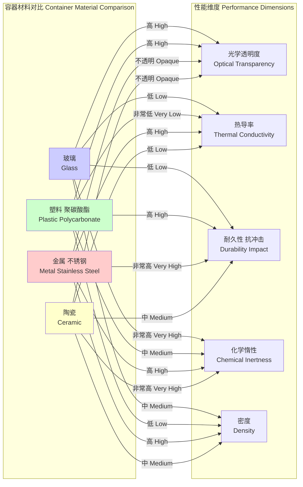

## 水杯

本文档旨在对“水杯”这一物理系统进行全面的技术性描述，重点关注其背后的科学原理和数学基础。

### 核心概念与数学基础

#### 1. 系统几何与流体静力学
水杯是一个由固体容器（玻璃）和流体（水）组成的复合系统。其静态行为由几何学和流体静力学原理决定。

*   **体积与质量**: 在一个半径为 $r$ 的圆柱形杯子中，高度为 $h$ 的水的体积 $V$ 为 $V = \pi r^2 h$。水的质量为 $m_w = \rho_w V$，其中 $\rho_w$ 是水的密度。
*   **流体静压**: 在水面以下深度 $h$ 处，水所产生的压力由以下静水压力方程给出：
    $$ P(h) = P_0 + \rho_w g h $$
    其中：
    *   $P(h)$ 是在深度 $h$ 处的绝对压力。
    *   $P_0$ 是水面的大气压力。
    *   $\rho_w$ 是水的密度 (约 $1000 \, \text{kg/m}^3$)。
    *   $g$ 是重力加速度 (约 $9.81 \, \text{m/s}^2$)。
*   **稳定性**: 杯子的稳定性由其质心（CM）位置决定。杯子和水的总质心必须尽可能低。对于底座更宽的杯子，质心更低，因此更不容易倾倒。稳定性的条件是，从质心引出的垂直线必须落在支撑底座的范围内。

#### 2. 玻璃的材料科学
玻璃是一种非晶态（无定形）固体材料。其物理和化学性质对于容器的功能性和耐久性至关重要。

*   **力学性能**:
    *   **弹性**: 玻璃是一种脆性弹性材料。其对应力（$\sigma$）的响应由胡克定律描述：$\sigma = E \epsilon$，其中 $\epsilon$ 是应变。
        *   $E$ 是杨氏模量，衡量材料的刚度。
    *   **断裂强度**: 玻璃的理论强度非常高，但其实际强度受到表面微裂纹（格里菲斯裂纹）的限制。裂纹尖端的应力强度因子 $K_I$ 由 $K_I = Y \sigma \sqrt{\pi a}$ 给出，其中 $Y$ 是一个几何因子，$a$ 是裂纹长度。当 $K_I$ 达到材料的断裂韧性 $K_{Ic}$ 时，发生断裂。
*   **热学性能**:
    *   **热膨胀**: 受热时，玻璃会膨胀。长度的变化 $\Delta L$ 由下式给出：
        $$ \Delta L = \alpha L_0 \Delta T $$
        其中：
        *   $\alpha$ 是线性热膨胀系数。
        *   $L_0$ 是初始长度。
        *   $\Delta T$ 是温度变化。
        较低的 $\alpha$ 值（如硼硅酸盐玻璃）可以减少热应力，降低因热冲击而破裂的风险。
*   **光学性能**:
    *   **透明性**: 玻璃对可见光是透明的，因为可见光光子的能量不足以将其电子激发到更高的能带。
    *   **折射率**: 材料的折射率 $n$ 是指光在真空中的速度 $c$ 与光在该材料中的速度 $v$ 之比：$n = c/v$。它决定了光线进入或离开玻璃时的弯曲程度。

#### 3. 水杯的光学效应
装有水的水杯系统构成一个复杂的光学透镜。

*   **折射**: 光线在每个界面（空气-玻璃、玻璃-水、水-玻璃、玻璃-空气）都会发生弯曲。这由斯涅尔定律描述：
    $$ n_1 \sin(\theta_1) = n_2 \sin(\theta_2) $$
    其中：
    *   $n_1, n_2$ 是两种介质的折射率。
    *   $\theta_1, \theta_2$ 是相对于法线的入射角和折射角。
*   **透镜效应**: 一个圆柱形的装水玻璃杯起到一个厚圆柱透镜的作用。对于简化模型，可以使用厚透镜的透镜制造者公式，但光线追踪方法更为精确。该系统可以放大或扭曲通过它观察的物体。
*   **全内反射 (TIR)**: 当光从光密介质（如水，$n_w \approx 1.33$）传播到光疏介质（如空气，$n_a \approx 1.00$）时，如果入射角超过临界角 $\theta_c$，光线将被完全反射。
    $$ \theta_c = \arcsin\left(\frac{n_2}{n_1}\right) $$
    对于水-空气界面，$\theta_c = \arcsin(1.00/1.33) \approx 48.8^\circ$。

#### 4. 热力学与热传递
*   **热容**: 将水的温度改变 $\Delta T$ 所需的热量 $Q$ 为 $Q = m_w c_w \Delta T$，其中 $c_w$ 是水的比热容。
*   **热传递**: 水中的热量可以通过以下方式散失到周围环境中：
    *   **传导**: 通过玻璃杯壁和杯底。热流速率由傅里叶定律给出：
        $$ \frac{dQ}{dt} = -k A \frac{dT}{dx} $$
        其中 $k$ 是玻璃的热导率，$A$ 是面积，$dT/dx$ 是温度梯度。
    *   **对流**: 从玻璃杯外表面到空气，以及从水面。
    *   **辐射**: 从所有表面发出，由斯蒂芬-玻尔兹曼定律描述。

#### 5. 声学与振动
当杯口被激发时（例如用湿润的手指摩擦），水杯可以发出乐音。这是一种共振现象。

*   **共振频率**: 玻璃杯壁以驻波模式振动。对于一个简化的圆柱壳模型，其基频（$f$）可以近似为：
    $$ f \propto \frac{h}{R^2} \sqrt{\frac{E}{\rho_g(1-\nu^2)}} $$
    其中：
    *   $h$ 是杯壁厚度。
    *   $R$ 是杯子半径。
    *   $E$ 是玻璃的杨氏模量。
    *   $\rho_g$ 是玻璃的密度。
    *   $\nu$ 是玻璃的泊松比。
*   **水的影响**: 加入水会增加振动系统的有效质量，从而降低共振频率。频率的变化量取决于水位。这种效应可以用流体动力学中的附加质量理论来建模。

### 关键技术规格

| 属性 | 钠钙玻璃 | 硼硅酸盐玻璃 | 水 (20°C, 1 atm) | 单位 |
| :--- | :--- | :--- | :--- | :--- |
| 密度 ($\rho$) | 2500 | 2230 | 998.2 | kg/m³ |
| 杨氏模量 ($E$) | 70 | 64 | N/A | GPa |
| 泊松比 ($\nu$) | 0.22 | 0.20 | N/A | - |
| 断裂韧性 ($K_{Ic}$) | 0.75 | 0.8 | N/A | MPa·m¹/² |
| 热膨胀系数 ($\alpha$) | $9 \times 10^{-6}$ | $3.3 \times 10^{-6}$ | $207 \times 10^{-6}$ | K⁻¹ |
| 热导率 ($k$) | 1.0 | 1.1 | 0.6 | W/(m·K) |
| 折射率 ($n$) (at 589 nm) | 1.52 | 1.47 | 1.333 | - |
| 比热容 ($c_p$) | 840 | 830 | 4182 | J/(kg·K) |

### 常见用例

*   **液体容器**: 主要功能。性能指标：容积（mL），防漏完整性。
*   **光学放大/扭曲器**: 利用其透镜效应。性能指标：放大倍数，焦距。一个典型的装满水的酒杯焦距可在5-10厘米之间。
*   **声学共鸣器 (杯琴)**: 性能指标：共振频率范围（通常为500-2000 Hz），品质因数（Q-factor）。高品质的水晶玻璃Q值可超过1000，表示阻尼小，音调持久。
*   **量热容器 (用于基础实验)**: 利用玻璃杯和水作为系统来测量热交换。性能指标：隔热性能，通过总传热系数 $U$ (W/(m²·K)) 衡量。

### 实现考量

本节将水杯视为一个工程系统，探讨其设计与分析。

*   **几何设计**:
    *   **稳定性**: 低的纵横比（高/宽）和宽而重的底座可以增加稳定性。最佳几何形状可以通过计算不同填充水平下的质心并确保倾斜角最大化来确定。
    *   **人机工程学**: 形状应便于握持。这是一个定性因素，但可以使用人体测量学数据进行建模。
    *   **倾倒动力学**: 杯口的几何形状（例如，一个尖锐、清晰的边缘）对于防止康达效应（导致液体沿杯壁下流）至关重要。这可以使用计算流体动力学（CFD）进行分析。
*   **数值建模与复杂度**:
    *   **有限元分析 (FEA)**: 用于模拟在机械（如冲击）和热载荷下的应力分布。这有助于预测失效点并优化设计的耐久性。
    *   **计算复杂度**: FEA涉及求解一个大型线性方程组 $[K]\{u\} = \{F\}$，其中 $[K]$ 是刚度矩阵。对于一个有 $N$ 个自由度的系统，稠密矩阵的内存需求为 $O(N^2)$，直接求解器的求解时间为 $O(N^3)$。然而，对于FEA中典型的稀疏矩阵，内存需求接近 $O(N)$，而迭代求解器（如共轭梯度法）可以在大约 $O(N^k)$ 的复杂度内找到解，其中 $k$ 略大于1。

```mermaid
graph TD
    subgraph "水杯的数值分析 Numerical Analysis of a Water Glass"
        A[定义几何与材料属性<br>Define Geometry & Material Properties] --> B选择分析类型<br>Select Analysis Type;
        B -- "结构力学<br>Structural Mechanics" --> C[FEA: 静态应力分析<br>FEA: Static Stress Analysis];
        B -- "热传导<br>Heat Transfer" --> D[FEA: 热应力分析<br>FEA: Thermal Stress Analysis];
        B -- "流体动力学<br>Fluid Dynamics" --> E[CFD: 倾倒/晃动模拟<br>CFD: Pouring/Sloshing Simulation];
        B -- "声学<br>Acoustics" --> F[FEA: 模态分析<br>FEA: Modal Analysis];
        C --> G求解线性方程组<br>[K]u=F<br>Solve Linear System;
        D --> G;
        F --> H求解特征值问题<br>[K] - ω²[M]φ=0<br>Solve Eigenvalue Problem;
        G --> I["结果可视化<br>应力/位移<br>Result Visualization<br>Stress/Displacement"];
        H --> J["结果可视化<br>振型/共振频率<br>Result Visualization<br>Mode Shapes / Frequencies"];
        E --> K["结果可视化<br>流速/压力场<br>Result Visualization<br>Velocity/Pressure Fields"];

        subgraph "计算复杂度 Computational Complexity"
            G -- "直接求解器 Direct Solver" --> Complexity1["ON³"];
            G -- "迭代求解器 Iterative Solver" --> Complexity2["~ON<sup>1.x</sup>"];
        end
    end
```

### 性能特征

由于制造差异和材料失效的随机性，水杯的性能不是确定性的。

*   **制造公差**: 关键尺寸如壁厚（$h$）和半径（$R$）存在统计变化。它们可以被建模为正态分布，例如 $h \sim \mathcal{N}(\mu_h, \sigma_h^2)$，其中 $\mu_h$ 是平均厚度，$\sigma_h$ 是标准差。典型的公差可能在 $\pm 5\%$。这些变化直接影响共振频率和机械强度。
*   **断裂统计**: 像玻璃这样的脆性材料的断裂强度最好用统计模型来描述，例如威布尔分布。在给定应力水平（$\sigma$）下的累积失效率（$P_f$）为：
    $$ P_f(\sigma) = 1 - \exp\left[ - \left( \frac{\sigma}{\sigma_0} \right)^m \right] $$
    其中：
    *   $\sigma_0$ 是特征强度（尺度参数），即约63.2%的样品发生失效时的应力。
    *   $m$ 是威布尔模量（形状参数），描述了强度的离散性。更高的 $m$ 值表示材料更均匀（也更可靠）。对于典型的钠钙玻璃，$m$ 的范围在5-10之间。

### 相关技术

对不同容器材料的比较分析突出了玻璃的特定优势。



**比较数学模型:**

*   **隔热模型**: 容器中热水的冷却速率可以用总传热系数 $U$ 来建模。对于一个圆柱形玻璃杯，其总热阻 $R_{th}$ 是通过玻璃的传导热阻和向空气的对流热阻之和。
    $$ R_{th} = R_{cond} + R_{conv} = \frac{\ln(r_o/r_i)}{2\pi L k} + \frac{1}{h_{conv} A_o} $$
    其中 $r_o, r_i$ 是内外半径，$L$ 是高度，$k$ 是热导率，$h_{conv}$ 是对流换热系数，$A_o$ 是外表面积。
    *   **玻璃**: 低 $k$ 值提供了不错的隔热性能。
    *   **金属**: 高 $k$ 值导致隔热性能差。
    *   **塑料**: 极低的 $k$ 值提供了良好的隔热性能。
    该模型允许定量比较饮料在不同容器中的冷却速度。

### 参考文献

1.  Griffith, A. A. (1921). The phenomena of rupture and flow in solids. *Philosophical Transactions of the Royal Society of London. Series A, Containing Papers of a Mathematical or Physical Character*, 221(582-593), 163-198. DOI: `10.1098/rsta.1921.0006`
2.  Rossing, T. D. (1982). The physics of wine glasses. *The Physics Teacher*, 20(6), 363-368. DOI: `10.1119/1.2341077`
3.  Weibull, W. (1951). A statistical distribution function of wide applicability. *Journal of Applied Mechanics*, 18(3), 293-297. DOI: `10.1115/1.4010337`
4.  Incropera, F. P., DeWitt, D. P., Bergman, T. L., & Lavine, A. S. (2007). *Fundamentals of Heat and Mass Transfer*. John Wiley & Sons. (这是一本基础教科书，没有单一的DOI)。