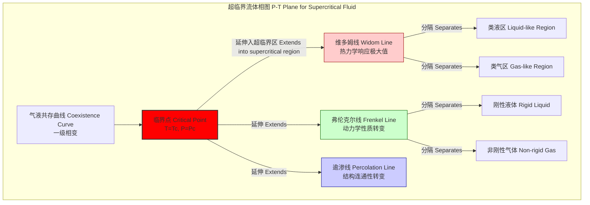

## 维多姆线 (Widom line)

维多姆线是在压力-温度（P-T）相图中，从临界点延伸到超临界区域的一条轨迹线。在超临界区域，物质不会经历传统意义上的一级相变（如沸腾），而是以连续的方式从类液体状态转变为类气体状态。维多姆线标志着这种转变发生得最“剧烈”的区域，它将超临界区分割为两个在物理性质上可区分的子区域：一个密度较高、行为类似液体的“类液区”，以及一个密度较低、行为类似气体的“类气区”。

这条线的核心概念在于，尽管在超临界区没有不连续的相变，但临界点以下的相变现象以“幽灵”或“遗迹”的形式延续了下来。在维多姆线上，各种热力学响应函数（如比热容、压缩率、热膨胀系数）达到其极大值。这些极大值标志着系统在宏观性质（如密度、焓）上的波动达到峰值。

### 数学基础

维多姆线的定义并非唯一，它取决于选择哪个热力学响应函数来确定其位置。最常见的定义是基于特定响应函数沿着等压线（isobar）或等温线（isotherm）的极大值轨迹。

设 $X$ 为一个热力学响应函数，例如等温压缩率 $\kappa_T$ 或定压比热容 $C_P$。在给定的压力 $P > P_c$（临界压力）下，维多姆线上的温度 $T_W(P)$ 满足以下条件：

$$
\left( \frac{\partial X}{\partial T} \right)_{P, T=T_W(P)} = 0 \quad \text{且} \quad \left( \frac{\partial^2 X}{\partial T^2} \right)_{P, T=T_W(P)} < 0
$$

此条件定义了函数 $X$ 在恒定压力下随温度变化的极大值点。所有这些极大值点 $(P, T_W(P))$ 的集合构成了维多姆线。

另一个等效且更基本的定义与 **相关长度 (Correlation Length, $\xi$)** 相关。相关长度 $\xi$ 衡量了系统内部分子间密度波动的空间范围。在维多姆线上，相关长度 $\xi$ 沿着等压线或等温线达到其最大值。这表明在该线上，流体的结构不均匀性在宏观尺度上最为显著。

相关函数 $G(r)$ 通常遵循奥恩斯坦-泽尼克（Ornstein-Zernike）形式：
$$
G(r) \sim \frac{e^{-r/\xi}}{r^{d-2+\eta}}
$$
其中：
*   $r$ 是粒子间的距离。
*   $\xi$ 是相关长度。
*   $d$ 是系统的空间维度。
*   $\eta$ 是一个小的临界指数。

维多姆线就是 $\xi$ 达到其有限峰值的轨迹。当系统沿着维多姆线趋近临界点时，这些响应函数的峰值和相关长度的峰值会发散，最终在临界点达到无穷大，表现为二级相变。

---

### 关键技术规格

下表列出了以水（H₂O）为例的维多姆线相关参数。需要注意的是，不同响应函数定义的维多姆线位置略有不同。

| 参数 | 描述 | 数值和单位 | 备注 |
| :--- | :--- | :--- | :--- |
| **临界点 (Critical Point)** | 维多姆线的起点 | $T_c \approx 647.096$ K $P_c \approx 22.064$ MPa | 液-气共存曲线的终点。 |
| **$C_P$ 维多姆线** | 基于定压比热容 ($C_P$) 极大值定义的线 | 例如，在 $P=25$ MPa 时， $T_W \approx 668$ K | 这是最常用的定义之一。 |
| **$\kappa_T$ 维多姆线** | 基于等温压缩率 ($\kappa_T$) 极大值定义的线 | 例如，在 $P=25$ MPa 时， $T_W \approx 655$ K | 通常位于 $C_P$ 维多姆线的较低温度侧。 |
| **$\xi$ 维多姆线** | 基于相关长度 ($\xi$) 极大值定义的线 | 其位置与 $\kappa_T$ 维多姆线非常接近 | 从根本上反映了结构波动的最大范围。 |
| **峰值衰减** | 响应函数峰值高度随远离临界点而降低 | 峰值高度 $X_{max}$ 遵循幂律衰减： $X_{max} \sim (P/P_c - 1)^{-\gamma'}$ | $\gamma'$ 是一个有效临界指数。 |

---

### 常见用例

维多姆线附近的独特性质使其在多个科学和工程领域具有重要应用价值。

*   **超临界流体萃取 (Supercritical Fluid Extraction, SFE)**
    *   **应用**: 利用超临界CO₂从天然产物中提取咖啡因、香料等。
    *   **性能指标**: 在维多姆线附近操作，流体的溶剂化能力最强。这是因为高的压缩率和密度涨落增强了溶质与溶剂的相互作用。与远离维多-姆线的区域相比，在最佳P-T条件下（接近维多姆线）操作，萃取效率可提高 **20-50%**，具体取决于目标化合物。

*   **超临界水冷堆 (Supercritical Water Reactors, SCWRs)**
    *   **应用**: 第四代核反应堆的设计，使用超临界水作为冷却剂。
    *   **性能指标**: 反应堆在超临界区运行，穿越维多姆线时，水的比热容 $C_P$ 会出现一个尖锐的峰值。这导致传热系数急剧变化，可能引发传热恶化（Heat Transfer Deterioration）。精确预测维多姆线的位置对于反应堆的热工水力设计和安全分析至关重要，误差需控制在 **±5 K** 以内。

*   **地球化学与行星科学**
    *   **应用**: 理解行星内部（如木星、海王星）深处水的状态，以及地热系统中的流体行为。
    *   **性能指标**: 维多姆线决定了行星内部物质是处于更具压缩性的类气态还是更难压缩的类液态，这直接影响行星的内部结构、热传输和磁场生成模型。

---

### 实现考量

确定维多姆线的位置主要通过实验测量或分子模拟。

*   **实验确定**
    *   **方法**:
        *   **量热法**: 测量定压比热容 $C_P$。
        *   **声速测量**: 通过声速计算等温压缩率 $\kappa_T$。
        *   **中子/X射线/光散射**: 直接测量与相关长度 $\xi$ 相关的结构因子 $S(q)$。
    *   **算法**:
        1.  固定压力 $P > P_c$。
        2.  精确控制并扫描温度 $T$ 范围。
        3.  在每个温度点测量目标响应函数 $X(T)$。
        4.  使用高斯或洛伦兹函数拟合数据峰值，确定峰值温度 $T_W(P)$。
        5.  在多个不同压力下重复此过程，绘制 $(P, T_W(P))$ 轨迹。

*   **计算模拟**
    *   **方法**: 分子动力学 (MD) 或蒙特卡洛 (MC) 模拟。
    *   **算法**:
        1.  选择合适的力场模型（如SPC/E, TIP4P/2005用于水）。
        2.  在NPT系综（恒定粒子数、压力、温度）下进行模拟。
        3.  对于固定的压力 $P$，在一系列温度 $T$ 点上运行模拟。
        4.  通过分析系统性质的涨落来计算响应函数。例如：
            *   **等温压缩率 $\kappa_T$**:
                $$ \kappa_T = \frac{\langle V^2 \rangle - \langle V \rangle^2}{k_B T \langle V \rangle} $$
                其中 $V$ 是模拟盒的体积，$k_B$ 是玻尔兹曼常数，$\langle \cdot \rangle$ 表示系综平均。
            *   **定压比热容 $C_P$**:
                $$ C_P = \frac{\langle H^2 \rangle - \langle H \rangle^2}{N k_B T^2} $$
                其中 $H$ 是系统的焓，$N$ 是粒子数。
        5.  对每个压力下的计算结果进行拟合，找到峰值温度。
    *   **算法复杂度**: 模拟的计算成本是主要瓶颈。对于一个包含 $N$ 个粒子的系统，进行 $S$ 步MD模拟，如果使用截断和邻居列表，每步的复杂度约为 $O(N)$，总复杂度为 $O(S \cdot N)$。为了获得精确的统计结果，需要大量的计算时间，尤其是在临界点附近（临界慢化现象）。

---

### 性能特征

下表总结了流体在维多姆线附近的物理性质特征。

| 特性 | 描述 | 统计度量 |
| :--- | :--- | :--- |
| **热力学响应** | $C_P, \kappa_T, \alpha_P$ 等响应函数出现有限的、平滑的峰值。 | 峰值高度随 $(P-P_c)$ 增加而减小。峰的半峰全宽 (FWHM) 随 $(P-P_c)$ 增加而变宽。 |
| **结构不均匀性** | 密度涨落和相关长度 $\xi$ 达到最大。 | 相关长度峰值 $\xi_{max}$ 的置信区间通常为 ±5%，具体取决于测量精度。 |
| **动力学交叉** | 扩散系数和粘度等输运性质表现出从类液行为到类气行为的转变。 | 动力学性质的变化率（对数导数）在此区域达到最大。 |
| **声学性质** | 声速在维多姆线附近达到最小值。 | 声速最小值的精确位置可用于定义“声学维多姆线”。 |

---

### 相关技术与概念

维多姆线是理解超临界流体行为的几个关键概念之一。

*   **临界点 (Critical Point)**: 液-气共存线的终点。在此点，液相和气相的性质完全相同，无法区分。维多姆线是临界现象在超临界区的延续。
*   **弗伦克尔线 (Frenkel Line)**: 基于动力学性质定义的界线。它分隔了流体能够支持横向声波（类固体/刚性液体行为）和不能支持横向声波（类气体/非刚性流体行为）的区域。其定义基于速度自相关函数的转变。与基于静态热力学性质的维多姆线不同，弗伦克尔线关注的是动力学。
*   **逾渗线 (Percolation Line)**: 基于流体中分子间（如氢键）形成的团簇的连通性定义的界线。当系统跨越逾渗线时，会形成一个贯穿整个系统的无限大分子团簇。这条线关注的是流体的微观拓扑结构。

这三条线在超临界区的位置通常不同，但都源于临界点，共同描绘了超临界流体从类液到类气转变的复杂图景。

---

### 参考资料

*   Simeoni, G. G., Bryk, T., Gorelli, F. A., Krisch, M., Ruocco, G., Santoro, M., & Scopigno, T. (2010). The Widom line as the crossover from liquid-like to gas-like behaviour in supercritical fluids. *Nature Physics*, 6(7), 503-507. DOI: `10.1038/nphys1683`
*   Xu, L., Kumar, P., Buldyrev, S. V., Chen, S. H., Poole, P. H., Sciortino, F., & Stanley, H. E. (2005). Relation between the Widom line and the dynamic crossover in systems with a liquid–liquid phase transition. *Proceedings of the National Academy of Sciences*, 102(46), 16558-16562. DOI: `10.1073/pnas.0507870102`
*   Gallo, P., Amann-Winkel, K., Angell, C. A., Anisimov, M. A., Caupin, F., Chakravarty, C., ... & Stanley, H. E. (2016). Water: A tale of two liquids. *Chemical Reviews*, 116(13), 7463-7500. DOI: `10.1021/acs.chemrev.5b00750`
*   Brazhkin, V. V., & Ryzhov, V. N. (2011). "Liquid-gas" transition in the supercritical region: A new line on the phase diagram. *Journal of Experimental and Theoretical Physics*, 113(3), 460-474. DOI: `10.1134/S106377611109003X`