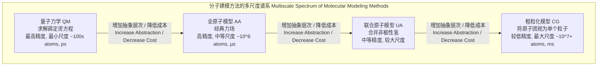

## 全原子模型

全原子 (All-Atom, AA) 模型是计算化学和生物物理学中的一种分子建模方法，其核心特征是系统中的每一个原子（包括氢原子）都被表示为一个独立的相互作用中心。这种高分辨率的表示方法使其能够精确地描述分子的几何结构、能量以及动态行为，是分子动力学 (MD) 模拟和蒙特卡洛 (MC) 模拟中应用最广泛的模型之一。

### 核心概念与数学基础

全原子模型的基础是一个经验势能函数，通常被称为**力场 (Force Field)**。该函数 $U(\vec{r}^N)$ 描述了由 $N$ 个原子组成的系统在给定构象（由所有原子的坐标向量 $\vec{r}^N$ 定义）下的总势能。力场的目标是使用经典的、计算上易于处理的函数形式来近似真实分子间的量子力学相互作用。

系统的总势能可以分解为成键相互作用和非键相互作用两部分：

$$
U(\vec{r}^N) = U_{\text{成键}} + U_{\text{非键}}
$$

#### 1. 成键相互作用 ($U_{\text{成键}}$)
成键相互作用描述了通过共价键直接连接或紧密相邻的原子之间的能量，包括键长伸缩、键角弯曲和二面角扭转。

*   **键长伸缩 (Bond Stretching)**
    原子间共价键的伸缩振动通常由一个简谐势来近似，类似于胡克定律。
    $$
    U_{\text{伸缩}}(r) = \sum_{\text{bonds}} \frac{1}{2} k_b (r - r_0)^2
    $$
    **参数说明:**
    *   $k_b$: 键长力常数，描述键的刚度 (单位: kcal·mol⁻¹·Å⁻² 或 kJ·mol⁻¹·nm⁻²)。
    *   $r$: 两个成键原子间的瞬时距离 (单位: Å 或 nm)。
    *   $r_0$: 平衡键长，即势能最小时的距离 (单位: Å 或 nm)。

*   **键角弯曲 (Angle Bending)**
    由三个连续原子形成的键角的弯曲振动也通常用简谐势来描述。
    $$
    U_{\text{弯曲}}(\theta) = \sum_{\text{angles}} \frac{1}{2} k_\theta (\theta - \theta_0)^2
    $$
    **参数说明:**
    *   $k_\theta$: 键角力常数 (单位: kcal·mol⁻¹·rad⁻²)。
    *   $\theta$: 三个原子间的瞬时键角 (单位: 弧度)。
    *   $\theta_0$: 平衡键角 (单位: 弧度)。

*   **二面角扭转 (Dihedral Torsion)**
    描述了围绕中心共价键旋转的能量变化，通常由一个周期性的傅里叶级数函数表示。
    $$
    U_{\text{扭转}}(\phi) = \sum_{\text{dihedrals}} \sum_{n} \frac{V_n}{2} [1 + \cos(n\phi - \gamma_n)]
    $$
    **参数说明:**
    *   $V_n$: 扭转势垒的高度 (单位: kcal·mol⁻¹)。
    *   $n$: 周期性 (整数)，描述了在360°旋转中能量最小点的数量。
    *   $\phi$: 四个原子定义的二面角 (单位: 弧度)。
    *   $\gamma_n$: 相位角，确定了势能最小点的位置 (单位: 弧度)。

#### 2. 非键相互作用 ($U_{\text{非键}}$)
非键相互作用描述了不通过共价键直接相连的原子对之间的相互作用，主要包括范德华力和静电力。这些相互作用通常在原子间距超过3-4个键时计算。

*   **范德华相互作用 (van der Waals Interaction)**
    通常使用 Lennard-Jones (LJ) 12-6 势来描述。它包含一个短程排斥项 ($r^{-12}$) 和一个长程吸引项 ($r^{-6}$)。
    $$
    U_{\text{LJ}}(r_{ij}) = \sum_{i<j} 4\epsilon_{ij} \left[ \left( \frac{\sigma_{ij}}{r_{ij}} \right)^{12} - \left( \frac{\sigma_{ij}}{r_{ij}} \right)^{6} \right]
    $$
    **参数说明:**
    *   $\epsilon_{ij}$: 势阱深度，描述了原子 $i$ 和 $j$ 之间吸引力的强度 (单位: kcal·mol⁻¹)。
    *   $\sigma_{ij}$: 有限距离参数，当相互作用能为零时，原子间的距离 (单位: Å 或 nm)。
    *   $r_{ij}$: 原子 $i$ 和 $j$ 之间的距离。
    *   对于不同原子类型间的相互作用，参数通常通过组合规则（如 Lorentz-Berthelot 规则）获得：$\sigma_{ij} = (\sigma_i + \sigma_j)/2$ 和 $\epsilon_{ij} = \sqrt{\epsilon_i \epsilon_j}$。

*   **静电相互作用 (Electrostatic Interaction)**
    由库仑定律描述，表示原子上固定的点电荷之间的相互作用。
    $$
    U_{\text{库仑}}(r_{ij}) = \sum_{i<j} \frac{1}{4\pi\epsilon_0\epsilon_r} \frac{q_i q_j}{r_{ij}}
    $$
    **参数说明:**
    *   $q_i, q_j$: 原子 $i$ 和 $j$ 上的部分电荷 (单位: e, 基本电荷单位)。
    *   $r_{ij}$: 原子 $i$ 和 $j$ 之间的距离。
    *   $\epsilon_0$: 真空介电常数 ($8.854 \times 10^{-12}$ F·m⁻¹)。
    *   $\epsilon_r$: 相对介电常数 (在真空中为1)。

#### 3. 运动方程
一旦势能函数 $U$ 被定义，作用在每个原子 $i$ 上的力 $\vec{F}_i$ 可以通过计算势能对原子坐标的负梯度得到：
$$
\vec{F}_i = -\nabla_{\vec{r}_i} U(\vec{r}^N)
$$
然后，系统的动力学演化可以通过数值积分牛顿第二运动定律来求解：
$$
\vec{F}_i = m_i \vec{a}_i = m_i \frac{d^2\vec{r}_i}{dt^2}
$$

### 关键技术规格

力场参数是全原子模型的核心。这些参数通过拟合量子化学计算数据和实验数据（如晶体结构、振动光谱、蒸发焓等）得到。下表展示了来自典型力场（如 CHARMM 或 AMBER）的一些原子类型的示例参数。

| 原子类型 | 描述 | 质量 (amu) | 部分电荷 (e) | $\sigma$ (Å) | $\epsilon$ (kcal/mol) |
| :--- | :--- | :--- | :--- | :--- | :--- |
| CT1 | 烷烃 sp³ 碳 (CH) | 12.011 | +0.09 | 3.3997 | 0.1094 |
| H | 连在非极性碳上的氢 | 1.008 | +0.09 | 2.4714 | 0.0157 |
| N | 肽骨架中的氮 | 14.007 | -0.47 | 3.2500 | 0.1700 |
| H(N) | 肽骨架中连在氮上的氢 | 1.008 | +0.31 | 0.6325 | 0.0460 |
| C | 肽骨架中的羰基碳 | 12.011 | +0.51 | 3.4000 | 0.0860 |
| O | 肽骨架中的羰基氧 | 15.999 | -0.51 | 2.9600 | 0.2100 |
| OW | TIP3P 水模型中的氧 | 15.999 | -0.834 | 3.1507 | 0.1520 |
| HW | TIP3P 水模型中的氢 | 1.008 | +0.417 | N/A | N/A |

*注意：部分电荷是分子环境的函数，并且必须使整个分子的总电荷为中性或等于其净电荷。LJ 参数 `N/A` 表示某些模型（如 TIP3P）将 LJ 相互作用中心仅置于氧原子上。*

### 常见用例

全原子模型因其高保真度而被广泛应用于需要精确结构和相互作用细节的领域。

*   **蛋白质折叠与动力学**: 模拟蛋白质如何从无规线团折叠成其功能性三维结构。
    *   **性能指标**: 在微秒 ($\mu s$) 到毫秒 ($ms$) 的时间尺度上，对包含 $10^5 - 10^6$ 个原子的系统进行模拟。通过计算轨迹中构象相对于参考结构（如晶体结构）的均方根偏差 (RMSD)，评估其稳定性。典型稳定蛋白质的 RMSD 波动范围为 1-3 Å。
*   **药物设计与配体结合**: 计算小分子药物与靶蛋白的结合自由能，并阐明其结合模式。
    *   **性能指标**: 结合自由能计算精度通常在 1-2 kcal/mol 范围内。模拟通常需要纳秒 ($ns$) 到微秒 ($\mu s$) 的时间尺度。
*   **生物膜渗透**: 研究小分子或离子如何穿过脂质双分子层。
    *   **性能指标**: 通过伞形采样等增强采样方法计算穿膜的平均力势 (Potential of Mean Force, PMF)。PMF 曲线的能垒高度（例如 10-20 kcal/mol）决定了渗透速率。
*   **核酸（DNA/RNA）模拟**: 研究 DNA 的柔性、DNA-蛋白质相互作用以及 RNA 的复杂折叠。
    *   **性能指标**: 模拟时间尺度从纳秒到微秒不等，用于分析碱基对的局部参数（如扭曲、翻转）和整体结构。

### 实施考量

```mermaid
graph TD
    subgraph "全原子模拟的计算流程 Computational Workflow of an AA Simulation"
        A["初始构象和拓扑<br>Initial Conformation & Topology"] --> B["能量最小化<br>Energy Minimization"];
        B --> C["系统平衡<br>System Equilibration"];
        C --> D开始生产模拟 Start Production MD;
        D --> E["计算力<br>F = -∇U"];
        E --> F["积分运动方程<br>rt+Δt, vt+Δt"];
        F --> G["应用约束和边界条件<br>Constraints & PBC"];
        G --> H["保存轨迹和性质<br>Save Trajectory & Properties"];
        H --> D;
    end
```

#### 算法复杂性
全原子模拟的计算瓶颈在于非键相互作用的计算。

*   **非键相互作用**: 对所有原子对进行计算的朴素算法复杂度为 $O(N^2)$，其中 $N$ 是原子数。这在计算上是不可行的。
    *   **截断半径 (Cutoff Radius)**: 为了提高效率，通常只计算截断半径（例如 10-14 Å）内的原子对之间的短程相互作用。这可以将复杂度降低到接近 $O(N)$。
    *   **长程静电**: 简单的截断会引入严重误差。**粒子网格埃瓦尔德 (Particle Mesh Ewald, PME)** 方法是计算长程静电的标准。它将计算分为实空间部分（短程，直接计算）和倒易空间部分（长程，通过快速傅里叶变换计算）。PME 的复杂度为 $O(N \log N)$，远优于 $O(N^2)$。
*   **成键相互作用**: 由于每个原子只与少数几个其他原子成键，因此计算成键相互作用的复杂度为 $O(N)$。

#### 集成算法
为了求解运动方程，需要使用数值积分器。最常用的是 **Verlet 算法**及其变体（如 **Leap-frog 算法**），因为它们具有时间可逆性、良好的能量守恒性和计算效率。

### 性能特征

*   **计算成本**: 全原子模拟非常耗时。在现代 GPU 上，一个包含约 100,000 个原子的典型蛋白质-水系统的模拟速度约为 100-500 纳秒/天。
*   **精度与尺度的权衡**: 全原子模型提供了最高的经典精度，但代价是限制了可模拟的系统尺寸（通常小于 $10^7$ 个原子）和时间尺度（通常为微秒级）。
*   **统计收敛性**: 模拟结果是系综平均值。为了获得可靠的统计数据，必须进行足够长时间的模拟以确保关键物理量的收敛。结果通常以平均值 ± 标准差或置信区间的形式报告，例如，平均结合能为 $-8.5 \pm 0.5$ kcal/mol (95% CI)。

### 相关技术

全原子模型是多尺度建模方法中的一个层次。根据所需精度和可用计算资源，可以选择不同分辨率的模型。



*   **联合原子 (United-Atom, UA) 模型**: 为了减少计算量，非极性氢原子（如亚甲基 -CH₂- 中的氢）被合并到其所连接的重原子中。这减少了系统中的粒子总数，并允许使用更长的时间步长。其势能函数形式与 AA 类似，但参数需要重新校准。
*   **粗粒化 (Coarse-Grained, CG) 模型**: 更高层次的简化，将一组原子（如一个氨基酸残基或几个水分子）表示为单个“珠子”或“超原子”。这极大地减少了自由度，使得模拟更大的系统（如病毒衣壳）和更长的时间尺度（毫秒甚至更长）成为可能。其势能函数通常形式更简单，参数更具经验性。
*   **量子力学/分子力学 (QM/MM) 模型**: 一种混合方法，将系统的核心区域（如酶的活性位点）用高精度的量子力学方法处理，而将其余大部分（如蛋白质主体和溶剂）用计算成本较低的全原子模型处理。
    $$
    E_{\text{QM/MM}} = E_{\text{QM}}(\text{区域 I}) + E_{\text{MM}}(\text{区域 II}) + E_{\text{QM-MM}}(\text{区域 I, 区域 II})
    $$
    其中 $E_{\text{QM-MM}}$ 描述了 QM 和 MM 区域之间的相互作用。

### 参考文献

1.  Cornell, W. D., Cieplak, P., Bayly, C. I., Gould, I. R., Merz, K. M., Ferguson, D. M., ... & Kollman, P. A. (1995). A Second Generation Force Field for the Simulation of Proteins, Nucleic Acids, and Organic Molecules. *Journal of the American Chemical Society*, 117(19), 5179–5197. **DOI**: [10.1021/ja00124a002](https://doi.org/10.1021/ja00124a002) (AMBER力场)
2.  MacKerell, A. D., Bashford, D., Bellott, M., Dunbrack, R. L., Evanseck, J. D., Field, M. J., ... & Karplus, M. (1998). All-Atom Empirical Potential for Molecular Modeling and Dynamics Studies of Proteins. *The Journal of Physical Chemistry B*, 102(18), 3586–3616. **DOI**: [10.1021/jp973084f](https://doi.org/10.1021/jp973084f) (CHARMM力场)
3.  Jorgensen, W. L., Maxwell, D. S., & Tirado-Rives, J. (1996). Development and Testing of the OPLS All-Atom Force Field on Conformational Energetics and Properties of Organic Liquids. *Journal of the American Chemical Society*, 118(45), 11225-11236. **DOI**: [10.1021/ja9621760](https://doi.org/10.1021/ja9621760) (OPLS-AA力场)
4.  Darden, T., York, D., & Pedersen, L. (1993). Particle mesh Ewald: An N⋅log(N) method for Ewald sums in large systems. *The Journal of Chemical Physics*, 98(12), 10089-10092. **DOI**: [10.1063/1.464397](https://doi.org/10.1063/1.464397) (PME方法)