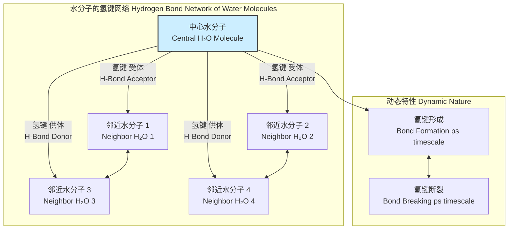
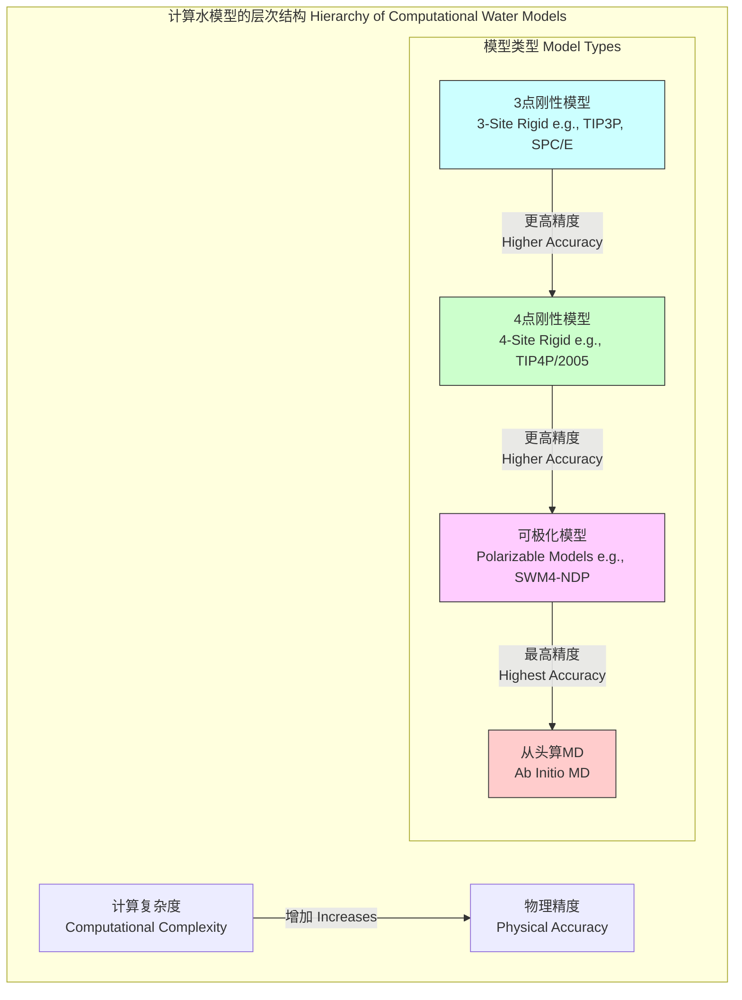
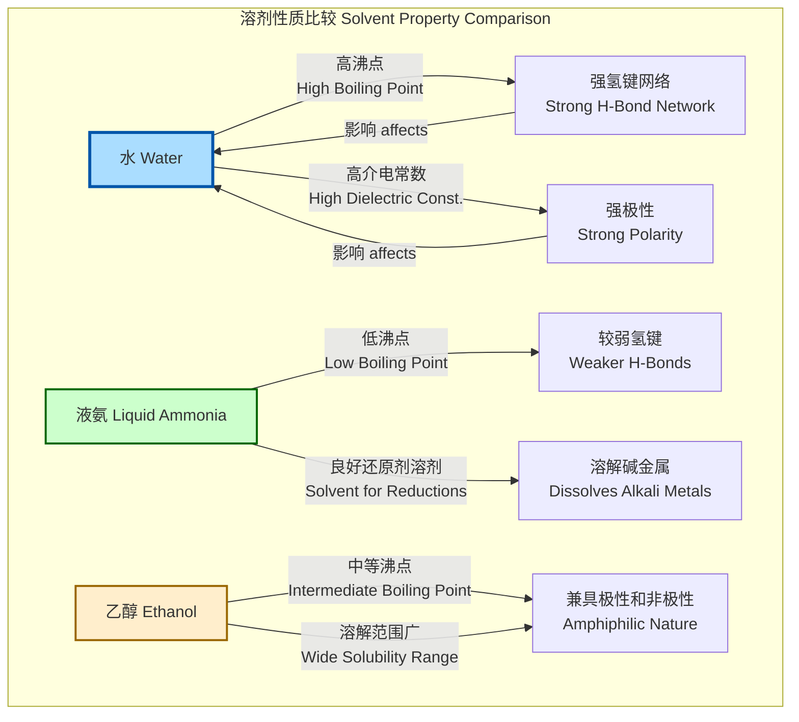

## 环境液态水

环境液态水，通常指在标准环境温度和压力（SATP：298.15 K 或 25 °C，100 kPa）下存在的纯水（H₂O）。它是地球上最常见也最重要的物质之一，是生命、气候和众多工业过程的基础。本技术文档将从科学和数学角度，对环境液态水的核心概念、技术规格、性能及相关模型进行深入阐述。

### 核心概念及其数学基础

#### 1. 分子结构与氢键网络
水分子由一个氧原子和两个氢原子通过共价键连接而成，分子呈V形，H-O-H键角约为104.5°。由于氧原子具有高电负性，水分子是强极性分子，具有显著的偶极矩（约1.85 D）。

这种极性导致了分子间强大的静电相互作用，即**氢键（Hydrogen Bond）**。在液态水中，每个水分子平均可以与其他3到4个水分子形成动态的、瞬时的氢键，构成一个不断重组的三维网络结构。这个网络是水许多独特性质（如高沸点、高比热容）的根源。

氢键的能量可以通过量子力学计算，一个典型的水-水氢键键能约为 20 kJ/mol。其相互作用势能通常使用Lennard-Jones势和库仑势的组合来建模：

$$ U(\mathbf{r}_{ij}) = \sum_{a \in i} \sum_{b \in j} \left[ 4\epsilon_{ab} \left( \left( \frac{\sigma_{ab}}{r_{ab}} \right)^{12} - \left( \frac{\sigma_{ab}}{r_{ab}} \right)^{6} \right) + \frac{q_a q_b}{4\pi\epsilon_0 r_{ab}} \right] $$

其中：
*   $U(\mathbf{r}_{ij})$ 是分子 $i$ 和 $j$ 之间的总相互作用势能。
*   $a$ 和 $b$ 分别是分子 $i$ 和 $j$ 上的原子（O或H）。
*   $r_{ab}$ 是原子 $a$ 和 $b$ 之间的距离。
*   $\epsilon_{ab}$ 和 $\sigma_{ab}$ 是Lennard-Jones势参数，分别代表势阱深度和有限距离尺寸。
*   $q_a$ 和 $q_b$ 是原子 $a$ 和 $b$ 上的部分电荷。
*   $\epsilon_0$ 是真空介电常数。

#### 2. 热力学性质
水的宏观热力学性质由其分子间相互作用决定。

*   **吉布斯自由能 (Gibbs Free Energy)**: 描述了系统在恒温恒压下做非体积功的能力。液态水的稳定性由其吉布斯自由能的最小值确定。
    $$ G = H - TS = U + PV - TS $$
    其中：
    *   $G$ 是吉布斯自由能。
    *   $H$ 是焓。
    *   $T$ 是绝对温度。
    *   $S$ 是熵。
    *   $U$ 是内能。
    *   $P$ 是压力。
    *   $V$ 是体积。

*   **比热容 (Specific Heat Capacity)**: 水具有异常高的比热容，这意味着需要大量能量才能使其温度升高。这是由于能量不仅用于增加分子的动能，还需用于断裂氢键。
    $$ c_p = \frac{1}{m} \left( \frac{\partial H}{\partial T} \right)_P $$
    其中：
    *   $c_p$ 是等压比热容。
    *   $m$ 是质量。
    *   $(\frac{\partial H}{\partial T})_P$ 是在恒定压力下焓随温度的变化率。

#### 3. 输运性质
*   **黏度 (Viscosity)**: 液态水的黏度相对较低，但受温度影响显著。黏度源于分子间作用力引起的内摩擦。其温度依赖性可用Arrhenius类型方程近似描述：
    $$ \eta = \eta_0 \exp\left(\frac{E_a}{RT}\right) $$
    其中：
    *   $\eta$ 是动力黏度。
    *   $\eta_0$ 是指前因子。
    *   $E_a$ 是流动的活化能 (约 17 kJ/mol)。
    *   $R$ 是理想气体常数。
    *   $T$ 是绝对温度。

*   **自扩散系数 (Self-Diffusion Coefficient)**: 描述了水分子在自身液体中的随机热运动。它与黏度和温度的关系由Stokes-Einstein方程给出：
    $$ D = \frac{k_B T}{6 \pi \eta r} $$
    其中：
    *   $D$ 是扩散系数。
    *   $k_B$ 是玻尔兹曼常数。
    *   $r$ 是分子的有效流体动力学半径。

### 关键技术规格
以下数据在标准环境温度和压力（SATP: 298.15 K, 100 kPa）下测定。

| 属性 (Property) | 数值 (Value) | 单位 (Unit) |
| :--- | :--- | :--- |
| **物理性质 (Physical Properties)** | | |
| 密度 (Density) | 997.047 ± 0.001 | kg/m³ |
| 摩尔质量 (Molar Mass) | 18.01528 | g/mol |
| **热力学性质 (Thermodynamic Properties)** | | |
| 等压比热容 ($c_p$) | 4181.3 | J/(kg·K) |
| 汽化焓 ($\Delta H_{vap}$) | 43.99 | kJ/mol |
| 热导率 ($\kappa$) | 0.6065 | W/(m·K) |
| **输运性质 (Transport Properties)** | | |
| 动力黏度 ($\eta$) | 8.90 × 10⁻⁴ | Pa·s (or mPa·s) |
| 自扩散系数 ($D$) | 2.299 × 10⁻⁹ | m²/s |
| **电磁性质 (Electromagnetic Properties)** | | |
| 静态相对介电常数 ($\epsilon_r$) | 78.36 | (无量纲) |
| 折射率 ($n_D$) at 589 nm | 1.3330 | (无量纲) |
| 表面张力 ($\gamma$) | 71.99 × 10⁻³ | N/m |

### 常见用例

1.  **溶剂 (Solvent)**:
    *   **描述**: 由于其高介电常数和形成氢键的能力，水是优异的极性溶剂，能溶解离子化合物和许多极性有机物。
    *   **性能指标**: 溶解度参数。Hansen溶解度参数 ($\delta_t$) 用于衡量物质间的相容性。
        $$ \delta_t^2 = \delta_d^2 + \delta_p^2 + \delta_h^2 $$
        其中 $\delta_d, \delta_p, \delta_h$ 分别是色散力、极性力和氢键作用的贡献。对于水，其值约为：
        *   $\delta_d = 15.5$ MPa$^{1/2}$
        *   $\delta_p = 16.0$ MPa$^{1/2}$
        *   $\delta_h = 42.3$ MPa$^{1/2}$
        *   $\delta_t = 47.8$ MPa$^{1/2}$

2.  **热传递流体 (Heat Transfer Fluid)**:
    *   **描述**: 高比热容和高热导率使水成为高效的热传递介质，广泛用于冷却系统和热力循环。
    *   **性能指标**: 传热系数 ($h$)。对于强制对流，其值可通过Dittus-Boelter方程估算：
        $$ \text{Nu}_D = 0.023 \cdot \text{Re}_D^{0.8} \cdot \text{Pr}^{n} $$
        其中 $\text{Nu}$ 是努塞尔数 ($hD/k$)，$\text{Re}$ 是雷诺数 ($\rho v D/\eta$)，$\text{Pr}$ 是普朗特数 ($c_p \eta/k$) 。$n=0.4$ 用于加热，$n=0.3$ 用于冷却。

3.  **生物和化学反应介质 (Biological and Chemical Reaction Medium)**:
    *   **描述**: 生命活动几乎都在水溶液中进行。水不仅是反应物，还通过疏水效应等方式影响蛋白质折叠和酶催化。
    *   **性能指标**: 反应速率常数 ($k$)。水的性质（如pH值、离子强度）直接影响反应动力学。

### 实现考量：计算建模

对液态水的精确建模是计算化学和物理学的核心挑战。这通常通过分子动力学（MD）或蒙特卡洛（MC）模拟实现。

*   **水模型 (Water Models)**:
    *   **刚性模型**: 如 `TIP3P`, `SPC/E`, `TIP4P/2005`。这些模型将水分子视为刚性结构，仅考虑分子间相互作用。它们在计算效率和精度之间取得平衡。
    *   **柔性模型**: 允许键长和键角振动，能更准确地模拟光谱性质，但计算成本更高。
    *   **极化模型**: 考虑了分子在电场中的诱导偶极，能更精确地描述介电性质，计算成本显著增加。

*   **算法复杂度分析 (Algorithmic Complexity Analysis)**:
    *   MD模拟的核心是计算粒子间的相互作用力。对于一个包含 $N$ 个水分子的系统：
    *   **直接计算 (Naive approach)**: 计算所有粒子对的相互作用，复杂度为 $O(N^2)$。这对于大系统是不可行的。
    *   **截断半径法 (Cutoff method)**: 只考虑一个截断半径 $r_c$ 内的相互作用，结合邻域列表（Neighbor Lists）技术，可将复杂度降低到 $O(N)$。
    *   **长程静电作用**: 对于库仑力这种长程力，截断会引入严重误差。**粒子网格埃瓦尔德 (Particle Mesh Ewald, PME)** 方法是标准解决方案，它将计算分为实空间和倒易空间两部分，其复杂度为 $O(N \log N)$。

### 性能特征

水的宏观性质是微观分子快速运动和相互作用的统计平均结果。

*   **径向分布函数 (Radial Distribution Function, $g(r)$)**:
    该函数描述了以一个分子为中心，在距离 $r$ 处找到另一个分子的概率密度。它是连接微观结构和宏观热力学性质的桥梁。
    $$ g(r) = \frac{V}{N^2} \left\langle \sum_{i \neq j} \delta(\mathbf{r} - (\mathbf{r}_i - \mathbf{r}_j)) \right\rangle $$
    其中 $\langle \dots \rangle$ 表示系综平均。对于液态水， $g_{OO}(r)$（氧-氧径向分布函数）在 $r \approx 2.8$ Å 处有第一个尖锐的峰，对应于氢键的平均长度。第二个峰在 $r \approx 4.5$ Å，对应于四面体结构的次近邻。

*   **密度涨落 (Density Fluctuation)**:
    在恒定 $N,V,T$ 系综中，系统的可压缩性与密度涨落相关。
    $$ \kappa_T = \frac{1}{\rho k_B T} \frac{\langle N^2 \rangle - \langle N \rangle^2}{\langle N \rangle} $$
    其中 $\kappa_T$ 是等温压缩系数。水在4°C时密度最大，这是一种反常现象，源于氢键网络结构在低温下向更开放的类冰结构转变。

### 相关技术：与其他溶剂的比较

水作为一种独特的溶剂，常与其他极性或非极性溶剂进行比较。

| 属性 (Property) | 液态水 (H₂O) | 液氨 (NH₃, at -40°C) | 乙醇 (C₂H₅OH) |
| :--- | :--- | :--- | :--- |
| **沸点 (Boiling Point)** | 100 °C | -33.3 °C | 78.4 °C |
| **偶极矩 (Dipole Moment)** | 1.85 D | 1.47 D | 1.69 D |
| **介电常数 ($\epsilon_r$)** | 78.4 | 22 | 24.5 |
| **黏度 ($\eta$)** | 0.89 mPa·s | 0.25 mPa·s | 1.07 mPa·s |
| **氢键能力 (H-Bonding)** | 强 (供体/受体) | 中等 (供体/受体) | 中等 (供体/受体) |

### 参考文献

1.  Abascal, J. L. F., & Vega, C. (2005). A general purpose model for the condensed phases of water: TIP4P/2005. *The Journal of Chemical Physics*, 123(23), 234505. **DOI**: [10.1063/1.2121687](https://doi.org/10.1063/1.2121687)
2.  Jorgensen, W. L., Chandrasekhar, J., Madura, J. D., Impey, R. W., & Klein, M. L. (1983). Comparison of simple potential functions for simulating liquid water. *The Journal of Chemical Physics*, 79(2), 926-935. **DOI**: [10.1063/1.445869](https://doi.org/10.1063/1.445869)
3.  Eisenberg, D., & Kauzmann, W. (2005). *The Structure and Properties of Water*. Oxford University Press. (A classic monograph).
4.  Franks, F. (Ed.). (2000). *Water: A Matrix of Life*. Royal Society of Chemistry.