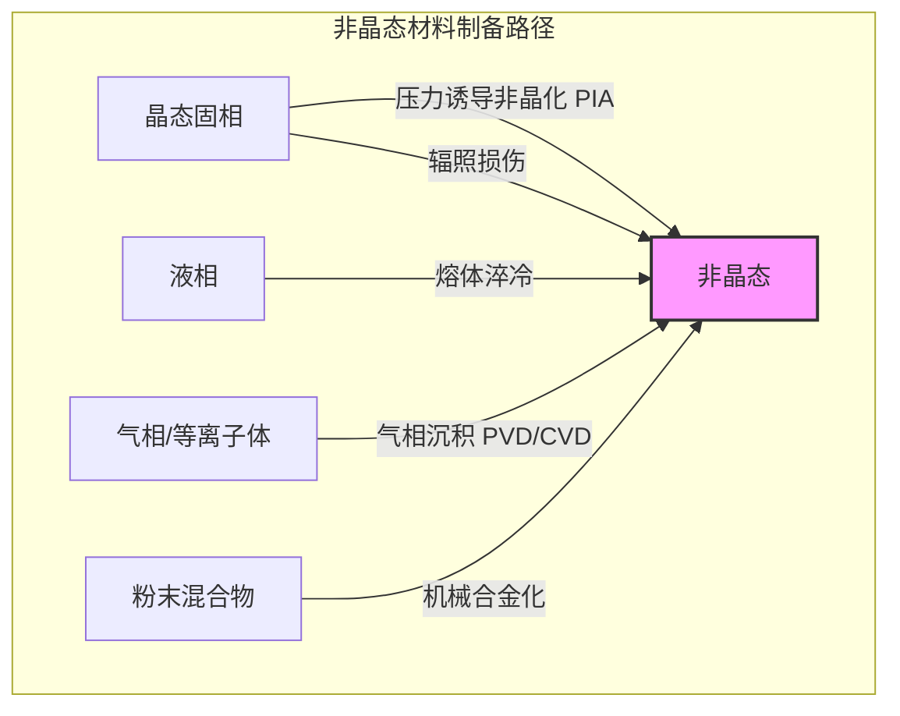

## 非晶化压力

非晶化压力（Amorphization Pressure, $P_a$）是指在特定温度下，施加于晶态材料上，使其发生从有序晶体结构到无序非晶态结构的固态相变的临界压力。这种现象被称为压力诱导非晶化（Pressure-Induced Amorphization, PIA）。PIA是一种重要的非晶态材料制备方法，也是研究物质在极端条件下行为的基础物理过程。

### 核心概念与数学基础

压力诱导非晶化可以从热力学和动力学（机械不稳定性）两个角度来理解。

#### 1. 热力学模型

从热力学角度看，相变由系统的吉布斯自由能（Gibbs Free Energy, $G$）驱动。吉布斯自由能的定义为：
$$ G = U + PV - TS $$
其中：
*   $G$ 是吉布斯自由能
*   $U$ 是内能
*   $P$ 是压力
*   $V$ 是体积
*   $T$ 是绝对温度
*   $S$ 是熵

在给定的温度 $T$ 和压力 $P$ 下，系统会趋向于占据吉布斯自由能最低的相。当压力增加到一定程度时，非晶相的自由能 $G_{amorphous}$ 可能会低于晶相的自由能 $G_{crystal}$。非晶化压力 $P_a$ 理论上可以定义为两相自由能相等的点：
$$ G_{amorphous}(P_a, T) = G_{crystal}(P_a, T) $$
在此压力之上，非晶相在热力学上比晶相更稳定。

对于某些材料（如冰、硅），其熔化曲线的斜率为负，即压力越高，熔点越低。根据克劳修斯-克拉佩龙方程（Clausius-Clapeyron equation）：
$$ \frac{dP}{dT_{m}} = \frac{\Delta H_{m}}{T_{m} \Delta V_{m}} = \frac{L_{m}}{T_{m} (V_{liquid} - V_{solid})} $$
其中：
*   $dP/dT_{m}$ 是熔化曲线上压力随温度的变化率
*   $\Delta H_{m}$ 是熔化焓（潜热 $L_m$）
*   $T_{m}$ 是熔点温度
*   $\Delta V_{m}$ 是熔化过程中的体积变化

如果液相的密度大于固相（$\Delta V_{m} < 0$），则 $dP/dT_{m} < 0$。将这条熔化曲线外推到玻璃化转变温度 $T_g$ 以下的低温区，可以预测一个压力点，在该压力下晶体将“熔化”成过冷液体（即非晶态）。这个点对应的压力就是非晶化压力，这被称为“冷熔化”假说。

```mermaid
graph TD
    subgraph "压力诱导非晶化 PIA 机制"
        A[晶体材料] -- "施加压力 P ↑" --> B["晶格压缩, 体积减小 V ↓"];
        B --> C["晶格应变能增加"];
        C --> D["相稳定性判据[";
        D -- "热力学路径" --> E["G_非晶 < G_晶体"];
        D -- "动力学/机械路径" --> F["弹性模量 → 0 剪切失稳"];
        E --> G["晶格坍塌"];
        F --> G["晶格坍塌"];
        G --> H[非晶态固相];
    end

    style A fill:#ccf,stroke:#333,stroke-width:2px
    style H fill:#fcc,stroke:#333,stroke-width:2px
```

#### 2. 机械不稳定性模型

PIA通常在晶格的机械不稳定性极限下发生，这是一种动力学过程。根据玻恩-黄稳定性判据（Born-Huang stability criteria），晶格的稳定性要求其弹性常数矩阵的所有主子行列式为正。对于立方晶体，稳定性条件包括：
*   $C_{11} > 0$
*   $C_{44} > 0$
*   $C_{11} - C_{12} > 0$
*   $C_{11} + 2C_{12} > 0$ (这保证了体积模量 $K = (C_{11} + 2C_{12})/3 > 0$)

其中，$C_{ij}$ 是弹性刚度常数。压力会改变材料的弹性常数。当压力增加到使某个剪切弹性模量（如 $C_{44}$ 或 $C' = (C_{11}-C_{12})/2$）趋近于零时，晶格对相应的剪切形变失去抵抗能力，发生“声子软化”，导致晶格结构整体坍塌，形成无序的非晶结构。这种机械失稳通常发生在系统达到热力学平衡转变压力之前，是一种动力学驱动的相变。

### 关键技术参数

不同材料的非晶化压力差异很大，并受温度、加载速率和应力状态等因素影响。

| 物质 (Material) | 晶体结构 (Crystal Structure) | 非晶化压力 $P_a$ (GPa) | 温度 (T, K) | 体积变化 ($\Delta V/V_0$, %) | 备注 (Comments) |
| :--- | :--- | :--- | :--- | :--- | :--- |
| 冰 (Ice, H₂O) | Ih (六方冰) | ~1.0 | 77 | ~ -20% | 转变为高密度非晶冰 (HDA) |
| 石英 (α-Quartz, SiO₂) | 三角晶系 | 25 - 35 | 300 | ~ -21% | 压力条件影响显著 |
| 硅 (Silicon, Si) | 金刚石立方 | 10 - 12 | 300 | ~ -22% | 从高压金属相(β-tin)卸压时发生 |
| 锗 (Germanium, Ge) | 金刚石立方 | ~10 | 300 | ~ -20% | 与硅类似，从高压相卸压时非晶化 |
| 锑化镓 (GaSb) | 闪锌矿 | ~8.5 | 300 | - | 压力下直接转变为非晶相 |

*注意：上表中的数值为典型实验值，实际数值可能因实验条件（如压力传递介质的静水压性）而异。*

### 常见应用案例

*   **新型非晶材料合成**: PIA能够制备通过传统熔体淬冷法难以获得的块体非晶材料，特别是对于高熔点或在熔化前会分解的材料。
*   **地球物理与行星科学**: 用于理解地球深部地幔和地核，或木卫二等冰卫星内部物质的状态。这些天体内部的巨大压力可能导致岩石和冰发生非晶化。
*   **基础物理研究**: PIA为研究非晶态物质的本质、玻璃化转变以及多非晶相变（polyamorphism，即同一种物质存在多种密度不同的非晶相）提供了独特的途径。

**量化性能指标**:
*   **非晶化产率**: 在给定的P-T条件下，样品中成功转变为非晶相的体积百分比，通常通过X射线衍射或拉曼光谱进行量化。
*   **密度**: PIA产生的非晶相通常是高密度非晶相（HDA）。例如，由冰Ih在77 K和1 GPa下形成的HDA冰，其密度约为1.17 g/cm³，比普通冰（~0.92 g/cm³）高出约27%。
*   **力学性能**: 产生的非晶材料具有独特的力学性能，如硬度和弹性模量，这些性能可通过纳米压痕等技术进行测量。

### 实现考量

#### 实验实现
*   **核心设备**: 金刚石对顶砧（Diamond Anvil Cell, DAC）是实现吉帕（GPa）级别超高压力的关键设备。通过两个相对的金刚石砧尖挤压样品，可在微米级的样品腔内产生极高压力。
*   **压力标定与传递**: 压力通常使用红宝石荧光光谱法进行标定。为保证静水压环境，样品腔内需填充压力传递介质，如氦、氖、氩等惰性气体或硅油。非静水压条件会引入剪切应力，可能显著降低非晶化压力。
*   **原位表征**:
    *   **X射线衍射 (XRD)**: 晶体布拉格衍射峰的消失和宽化的弥散峰的出现是判断非晶化的直接证据。
    *   **拉曼/布里渊光谱**: 晶格振动模式（声子）的宽化、移动或消失，特别是布里渊光谱可直接测量声速，从而监测弹性模量的软化。

#### 计算模拟实现
*   **主要方法**: 分子动力学（Molecular Dynamics, MD）模拟是研究PIA微观机制的有力工具。
*   **算法流程**:
    1.  建立包含N个原子的晶体超胞模型，并选择合适的原子间相互作用势函数（如Stillinger-Weber势用于Si，Tersoff势用于C）。
    2.  在NPT（等温等压）系综下，逐步增加外部压力。
    3.  在每个压力步长下，使系统充分弛豫，并监测关键物理量。
    4.  通过分析径向分布函数（RDF）、配位数、系统势能和原子构型来判断非晶化。非晶化通常伴随着势能的突降和RDF中长程有序峰的消失。
*   **算法复杂度**: 对于使用截断半径和邻域列表的典型MD模拟，计算复杂度为 $O(N)$。如果包含长程静电作用并使用Ewald求和等方法，则复杂度可能为 $O(N \log N)$ 或 $O(N^{3/2})$。

### 性能特征

*   **压力范围与可变性**: 实验测得的 $P_a$ 存在一定的分散性，主要受以下因素影响：
    *   **温度**: $P_a$ 通常随温度降低而降低。
    *   **加载速率**: 快速加压可能导致过压现象，即实际转变压力高于平衡转变压力。
    *   **剪切应力**: 非静水压条件下的剪切应力会促进机械失稳，从而降低 $P_a$。
    *   **缺陷与晶粒尺寸**: 初始晶体中的缺陷、位错或纳米晶的晶界会成为非晶化的形核点，通常也会降低 $P_a$。
*   **统计度量**: 对于特定材料，非晶化压力通常报告为一个范围或带有置信区间的平均值。例如，α-石英的 $P_a$ 在300 K下报告为 $30 \pm 5$ GPa，这个不确定性反映了不同实验条件和测量方法的差异。

### 相关技术与比较

PIA是获得非晶态的多种途径之一。



#### 与熔体淬冷的比较

| 特性 | 压力诱导非晶化 (PIA) | 熔体淬冷 (Melt Quenching) |
| :--- | :--- | :--- |
| **物理路径** | 固-固相变，由压力驱动 | 液-固相变，由快速降温驱动 |
| **驱动力** | 机械失稳或热力学自由能 | 动力学上抑制晶体形核与长大 |
| **适用材料** | 范围广，可用于难熔或分解材料 | 限于良好玻璃形成体（GFA） |
| **产物结构** | 通常为高密度、高配位的非晶相 | 密度与过冷液体相近 |
| **核心数学模型** | 弹性失稳: $C_{ij}(P) \to 0$ | 经典形核理论: 需高于临界冷却速率 $R_c$ |

**熔体淬冷的数学模型**:
熔体淬冷成功的关键是冷却速率必须大于临界冷却速率 $R_c$，以避免晶体形核。晶体的稳态形核率 $I(T)$ 可以表示为：
$$ I(T) = A \cdot \exp\left(-\frac{\Delta G^*}{k_B T}\right) \cdot \exp\left(-\frac{Q_D}{k_B T}\right) $$
其中：
*   $A$ 是指前因子
*   $\Delta G^*$ 是形成临界尺寸晶核所需的自由能垒
*   $k_B$ 是玻尔兹曼常数
*   $Q_D$ 是原子跨越液-固界面的扩散激活能

该模型的核心思想是在温度-时间-相变（TTT）图上“绕过”形核率最高的“鼻尖”区域。而PIA的模型则完全不同，它关注的是压力作用下晶格本身的力学响应和能量状态。

### 参考文献

1.  Mishima, O., Calvert, L. D., & Whalley, E. (1984). ‘Melting’ of ice I at 77 K and 10 kbar: a new method of making amorphous solids. *Nature*, 310(5976), 393-395. DOI: [10.1038/310393a0](https://doi.org/10.1038/310393a0)
2.  Hemley, R. J., Jephcoat, A. P., Mao, H. K., Ming, L. C., & Manghnani, M. H. (1988). Pressure-induced amorphization of crystalline silica. *Nature*, 334(6177), 52-54. DOI: [10.1038/334052a0](https://doi.org/10.1038/334052a0)
3.  Ponyatovsky, E. G., & Barkalov, O. I. (1992). Pressure-induced amorphous phases. *Materials Science Reports*, 8(4), 147-191. DOI: [10.1016/0920-2307(92)90005-X](https://doi.org/10.1016/0920-2307(92)90005-X)
4.  Brazhkin, V. V., & Lyapin, A. G. (2003). Universal behavior of the amorphous phases of elements under pressure. *Journal of Physics: Condensed Matter*, 15(36), 6059. DOI: [10.1088/0953-8984/15/36/301](https://doi.org/10.1088/0953-8984/15/36/301)