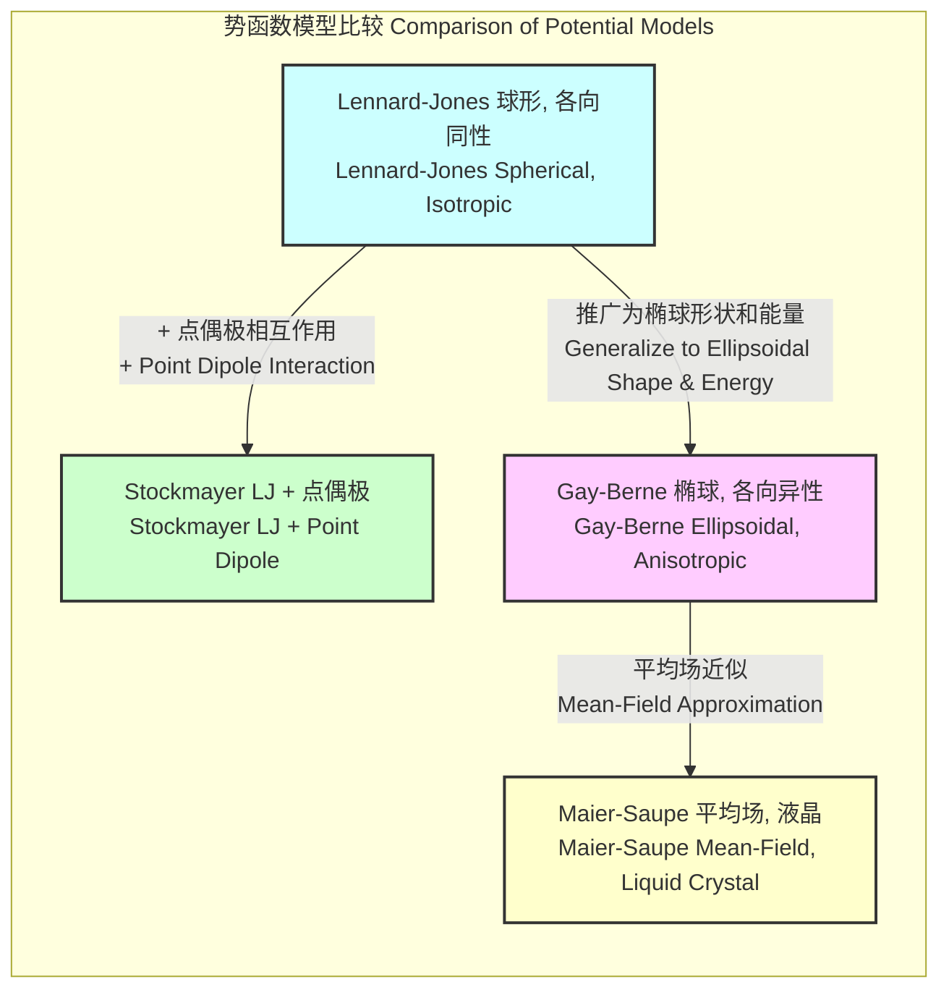
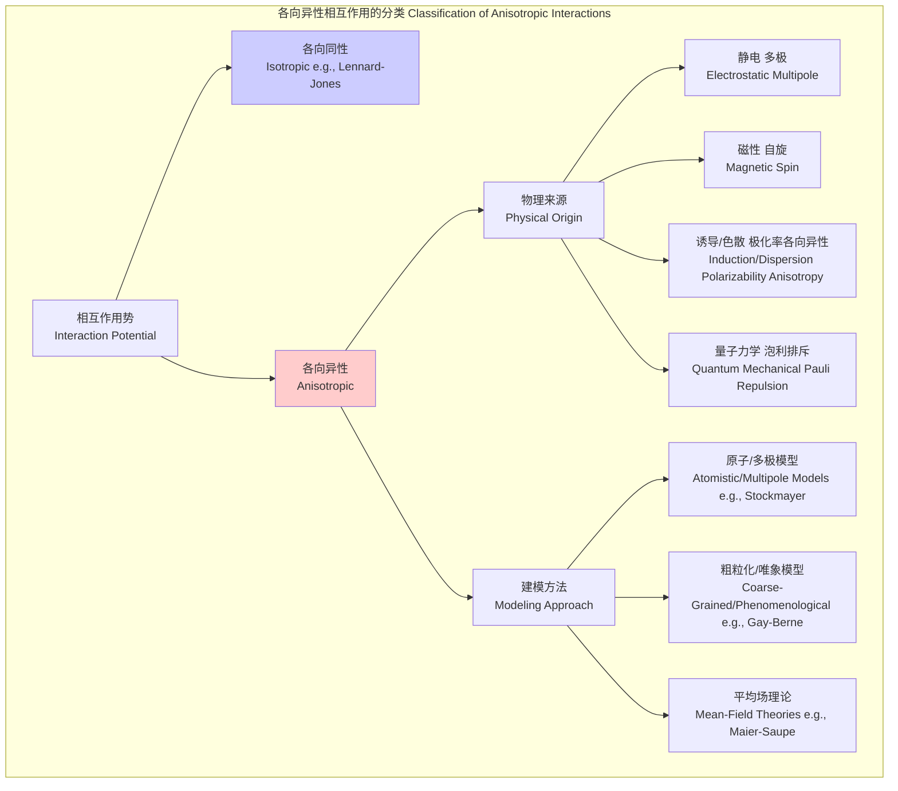

## 各向异性相互作用

各向异性相互作用（Anisotropic Interactions）是指粒子间的相互作用能量或作用力不仅依赖于它们之间的距离，还依赖于它们的相对方向或自身取向。这与各向同性相互作用（Isotropic Interactions）形成对比，后者仅是粒子间距离的函数。在分子、胶体和材料科学中，各向异性是理解和设计复杂结构（如液晶、生物膜和自组装材料）的关键。

### 1. 核心概念与数学基础

从根本上说，两个粒子（标记为1和2）之间的相互作用势能 $V$ 可以表示为它们位置矢量 $\mathbf{r}_1, \mathbf{r}_2$ 和取向坐标 $\mathbf{\Omega}_1, \mathbf{\Omega}_2$ 的函数：$V(\mathbf{r}_1, \mathbf{r}_2, \mathbf{\Omega}_1, \mathbf{\Omega}_2)$。取向坐标 $\mathbf{\Omega}$ 可以用欧拉角或四元数来描述。

对于刚性粒子，该势能通常可以简化为相对位置矢量 $\mathbf{r} = \mathbf{r}_2 - \mathbf{r}_1$ 和两个取向的函数：$V(\mathbf{r}, \mathbf{\Omega}_1, \mathbf{\Omega}_2)$。

#### 1.1 多极展开 (Multipole Expansion)

处理各向异性静电相互作用最系统的方法是多极展开。它将每个分子的电荷分布展开为一系列多极矩：单极矩（总电荷）、偶极矩、四极矩等。两个电荷分布之间的相互作用能可以表示为这些多极矩之间相互作用的总和。

*   **偶极-偶极相互作用 (Dipole-Dipole Interaction)**：这是最常见的各向异性项，存在于极性分子之间。其势能为：
    $$
    V_{dd}(\mathbf{r}, \boldsymbol{\mu}_1, \boldsymbol{\mu}_2) = \frac{1}{4\pi\epsilon_0 r^3} \left[ (\boldsymbol{\mu}_1 \cdot \boldsymbol{\mu}_2) - 3(\boldsymbol{\mu}_1 \cdot \hat{\mathbf{r}})(\boldsymbol{\mu}_2 \cdot \hat{\mathbf{r}}) \right]
    $$
    其中：
    *   $\boldsymbol{\mu}_1, \boldsymbol{\mu}_2$ 是两个粒子的偶极矩矢量。
    *   $\mathbf{r}$ 是从粒子1指向粒子2的位置矢量，其大小为 $r = |\mathbf{r}|$。
    *   $\hat{\mathbf{r}} = \mathbf{r}/r$ 是沿 $\mathbf{r}$ 方向的单位矢量。
    *   $\epsilon_0$ 是真空介电常数。
    该相互作用能随距离以 $r^{-3}$ 的形式衰减，并且其符号和大小强烈依赖于两个偶极子的相对取向。

*   **四极-四极相互作用 (Quadrupole-Quadrupole Interaction)**：对于具有零偶极矩但电荷分布非球对称的分子（如 CO₂ 或苯），最低阶的各向异性相互作用是四极-四极相互作用。其能量随距离以 $r^{-5}$ 的形式衰减，数学表达更为复杂，依赖于四极矩张量 $\mathbf{Q}$。
    $$
    V_{qq} \propto \frac{1}{r^5} f(\mathbf{Q}_1, \mathbf{Q}_2, \mathbf{\Omega}_1, \mathbf{\Omega}_2, \hat{\mathbf{r}})
    $$
    其中 $f$ 是一个复杂的取向依赖函数。

#### 1.2 唯象模型 (Phenomenological Models)

除了基于物理原理的多极展开，还发展了许多唯象模型来高效地描述各向异性，特别是在计算机模拟中。

*   **斯托克迈耶势 (Stockmayer Potential)**：该模型通过将点偶极-偶极相互作用项与各向同性的Lennard-Jones (LJ)势相结合，来描述极性流体。
    $$
    V_{\text{Stockmayer}} = V_{LJ}(r) + V_{dd}(\mathbf{r}, \boldsymbol{\mu}_1, \boldsymbol{\mu}_2) = 4\epsilon \left[ \left(\frac{\sigma}{r}\right)^{12} - \left(\frac{\sigma}{r}\right)^{6} \right] + V_{dd}
    $$
    该模型适用于模拟简单的极性分子，如HCl。

*   **Gay-Berne 势 (Gay-Berne Potential)**：这是一个功能更强大的模型，通过推广LJ势来描述椭球形粒子。它同时考虑了形状各向异性和吸引作用的各向异性。
    $$
    V_{GB}(\mathbf{r}, \mathbf{\Omega}_1, \mathbf{\Omega}_2) = 4\epsilon(\hat{\mathbf{r}}, \mathbf{\Omega}_1, \mathbf{\Omega}_2) \left[ \left(\frac{\sigma_0}{r - \sigma(\hat{\mathbf{r}}, \mathbf{\Omega}_1, \mathbf{\Omega}_2) + \sigma_0}\right)^{12} - \left(\frac{\sigma_0}{r - \sigma(\hat{\mathbf{r}}, \mathbf{\Omega}_1, \mathbf{\Omega}_2) + \sigma_0}\right)^{6} \right]
    $$
    其中，接触距离 $\sigma$ 和能量参数 $\epsilon$ 都依赖于粒子的相对取向和它们与分离矢量 $\mathbf{r}$ 的夹角。该模型被广泛用于研究液晶。

### 2. 关键技术规格

下表总结了几种关键的各向异性相互作用及其特征。

| 相互作用类型 | 能量标度律 ($E \propto r^{-n}$) | 典型能量幅度 | 相关物理体系 | 关键参数 |
| :--- | :--- | :--- | :--- | :--- |
| 电偶极-电偶极 | $r^{-3}$ | 1 - 10 kJ/mol | 极性分子 (H₂O, NH₃) | 偶极矩 $\mu$ (Debye), 介电常数 $\epsilon$ |
| 电四极-电四极 | $r^{-5}$ | 0.1 - 1 kJ/mol | 非极性、非球形分子 (CO₂, C₆H₆) | 四极矩 $Q$ (Debye·Å) |
| 磁各向异性 | - (与体积相关) | 10⁻⁶ - 10⁻³ eV/atom | 铁磁、反铁磁材料 (Fe, Co, Ni) | 磁晶各向异性常数 $K$ (J/m³) |
| Gay-Berne 势 | 复杂，类似LJ | 可调 (通常~kJ/mol) | 液晶、椭球形胶体 | 形状各向异性参数 $\kappa$, 能量各向异性参数 $\kappa'$ |
| 氢键 | 类似 $r^{-3}$ (静电部分) | 10 - 40 kJ/mol | 生物分子 (DNA, 蛋白质), 水 | 供体-受体距离和角度 |

### 3. 常见用例

各向异性相互作用在多个科学和技术领域中至关重要。

*   **液晶显示 (Liquid Crystal Displays, LCDs)**
    *   **描述**：液晶分子（通常是棒状或盘状）之间的各向异性相互作用（主要由Gay-Berne势或Maier-Saupe理论描述）导致了取向有序相（如向列相）的形成。外加电场可以改变分子的平均取向，从而控制光的偏振和透射。
    *   **性能指标**：**向列相序参量 (Nematic Order Parameter, S)**。对于棒状分子，其定义为 $S = \langle \frac{3}{2}(\mathbf{u} \cdot \mathbf{n})^2 - \frac{1}{2} \rangle$，其中 $\mathbf{u}$ 是分子长轴方向，$\mathbf{n}$ 是向列相指向矢（分子的平均取向方向），$\langle \cdot \rangle$ 表示系综平均。在典型的向列相中，$S$ 的值在 0.4 到 0.7 之间。

*   **磁记录 (Magnetic Recording)**
    *   **描述**：铁磁材料中的磁晶各向异性使得磁化矢量倾向于沿着特定的晶体学轴（“易轴”）排列。这种能量势垒使得信息（以磁化方向表示）能够稳定存储，抵抗热涨落和外部磁场的干扰。
    *   **性能指标**：**各向异性场 (Anisotropy Field, $H_K$)** 或 **各向异性常数 ($K_u$)**。$H_K = 2K_u / \mu_0 M_s$，其中 $M_s$ 是饱和磁化强度。对于高密度记录介质，需要大的 $K_u$ 值（> $10^5$ J/m³）以确保数据稳定性。

*   **分子自组装 (Molecular Self-Assembly)**
    *   **描述**：“补丁”胶体粒子或具有特定结合位点的分子，通过高度定向的相互作用（如氢键或疏水作用）自发地组装成预定的超结构，如胶体金刚石晶格或蛋白质复合体。
    *   **性能指标**：**产率 (Yield)** 和 **结合自由能 ($\Delta G$)**。通过精确设计相互作用的几何形状和强度，可以实现对特定结构的高产率组装。

### 4. 实现考量

在计算机模拟（如分子动力学或蒙特卡洛）中实现各向异性相互作用需要特别注意。

*   **取向表示**：
    *   **欧拉角 ($\alpha, \beta, \gamma$)**：直观，但存在“万向节死锁”问题，且在积分运动方程时有奇异点。
    *   **四元数 ($q_0, q_1, q_2, q_3$)**：是首选方法。它们没有奇异点，数学上更稳健，便于对旋转运动进行积分。

*   **力/力矩计算**：
    *   对于势能 $V(\mathbf{r}, \mathbf{\Omega}_1, \mathbf{\Omega}_2)$，作用在粒子 $i$ 上的力 $\mathbf{F}_i = -\nabla_{\mathbf{r}_i} V$，力矩 $\boldsymbol{\tau}_i = -\mathbf{L}_i V$，其中 $\mathbf{L}_i$ 是与粒子 $i$ 取向相关的角动量算子。这些计算比各向同性势要复杂得多。

*   **算法复杂度**：
    *   **直接计算**：对于一个有 $N$ 个粒子的系统，计算所有粒子对之间的相互作用需要 $O(N^2)$ 的时间，这对于大系统是不可接受的。
    *   **长程相互作用**：对于 $r^{-n}$ (其中 $n \le 3$) 类型的慢衰减相互作用（如偶极-偶极），必须使用特殊算法。**埃瓦尔德求和 (Ewald Summation)** 及其快速傅里叶变换的变体，如 **粒子网格埃瓦尔德 (Particle Mesh Ewald, PME)** 方法，可以将复杂度降低到 $O(N \log N)$。
    *   **短程相互作用**：对于快速衰减的相互作用，可以使用 **邻居列表 (Neighbor Lists)** 或 **单元列表 (Cell Lists)** 将计算量限制在空间上邻近的粒子对之间，从而实现 $O(N)$ 的复杂度。

### 5. 性能特征

由各向异性相互作用主导的系统表现出独特的集体行为和结构特征。

*   **相变**：各向异性是许多相变（如各向同性-向列相变）的驱动力。这些相变通常是温度或浓度依赖的，并且可以通过序参量的变化来表征。
*   **统计测量**：
    *   **序参量 (Order Parameter, S)**：如前所述，量化了系统的全局取向有序度。其值通常通过长时间模拟的系综平均得到，误差棒可以通过块平均法估计，以说明时间相关性。例如，一个模拟结果可能报告为 $S = 0.65 \pm 0.02$ (95% CI)。
    *   **取向相关函数 (Orientational Correlation Function)**：衡量粒子取向之间的相关性如何随距离衰减。通常使用勒让德多项式 $P_l$ 来定义：
        $$
        G_l(r) = \langle P_l(\mathbf{u}_i \cdot \mathbf{u}_j) \rangle_{|\mathbf{r}_i - \mathbf{r}_j|=r}
        $$
        其中 $P_1(\cos\theta) = \cos\theta$ 描述铁电序，$P_2(\cos\theta)$ 描述向列序。$G_l(r)$ 的衰减长度给出了取向相关的特征尺度。
    *   **径向分布函数 (Radial Distribution Function, $g(r)$)**：在各向异性系统中，可以定义一个取向依赖的 $g(\mathbf{r})$，它给出了在中心粒子处于特定取向时，在相对位置 $\mathbf{r}$ 处找到另一个粒子的概率密度。

### 6. 相关技术与模型比较

理解各向异性相互作用的最佳方式是将其与更简单的各向同性模型进行比较。

*   **Lennard-Jones (LJ) 势 (各向同性)**：
    $$
    V_{LJ}(r) = 4\epsilon \left[ \left(\frac{\sigma}{r}\right)^{12} - \left(\frac{\sigma}{r}\right)^{6} \right]
    $$
    这是描述非极性球形粒子（如氩）相互作用的基准模型，完全不依赖于取向。

*   **Stockmayer 势 (各向异性)**：
    $$
    V_{\text{Stockmayer}} = V_{LJ}(r) + \frac{1}{4\pi\epsilon_0 r^3} \left[ (\boldsymbol{\mu}_1 \cdot \boldsymbol{\mu}_2) - 3(\boldsymbol{\mu}_1 \cdot \hat{\mathbf{r}})(\boldsymbol{\mu}_2 \cdot \hat{\mathbf{r}}) \right]
    $$
    该模型是研究偶极相互作用对流体相行为和输运性质影响的最简单模型。

*   **Gay-Berne (GB) 势 (各向异性)**：
    GB势是描述非球形粒子（特别是液晶元）之间相互作用的黄金标准。它捕获了粒子形状如何影响排斥，以及侧-侧、端-端和交叉构型之间吸引力的差异。它比Stockmayer势更真实地模拟了棒状分子的行为。

*   **Maier-Saupe 理论 (平均场)**：
    这是一种平均场理论，其中每个分子都与一个由所有其他分子产生的平均化取向场相互作用。其单粒子势为：
    $$
    V_{MS}(\theta) = -\epsilon_{MS} S P_2(\cos\theta) = -\epsilon_{MS} S \left( \frac{3}{2}\cos^2\theta - \frac{1}{2} \right)
    $$
    其中 $S$ 是必须自洽求解的序参量。该模型成功地预测了各向同性-向列相变的存在，但忽略了涨落和短程关联。

以下图表展示了各向异性相互作用的不同类型和建模方法。

### 7. 参考文献

1.  Gay, J. G., & Berne, B. J. (1981). Modification of the overlap potential to mimic a linear site-site potential. *The Journal of Chemical Physics*, 74(6), 3316–3319. [DOI: 10.1063/1.441483](https://doi.org/10.1063/1.441483)
2.  Allen, M. P., & Tildesley, D. J. (1989). *Computer Simulation of Liquids*. Oxford University Press. (This book provides a comprehensive theoretical and practical guide to simulating molecular systems, including those with anisotropic potentials).
3.  De Gennes, P. G., & Prost, J. (1993). *The Physics of Liquid Crystals*. Oxford University Press. (A classic text on the theory of liquid crystals, where anisotropic interactions are central).
4.  Daan Frenkel, & Berend Smit. (2002). *Understanding Molecular Simulation: From Algorithms to Applications*. Academic Press. (An essential resource for simulation methodologies, including advanced topics like calculating free energies and simulating phase transitions).
5.  Darden, T., York, D., & Pedersen, L. (1993). Particle mesh Ewald: An N⋅log(N) method for Ewald sums in large systems. *The Journal of Chemical Physics*, 98(12), 10089–10092. [DOI: 10.1063/1.464397](https://doi.org/10.1063/1.464397)