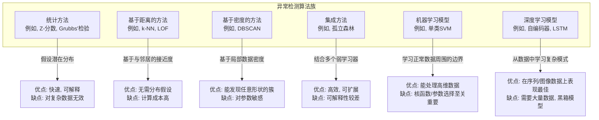
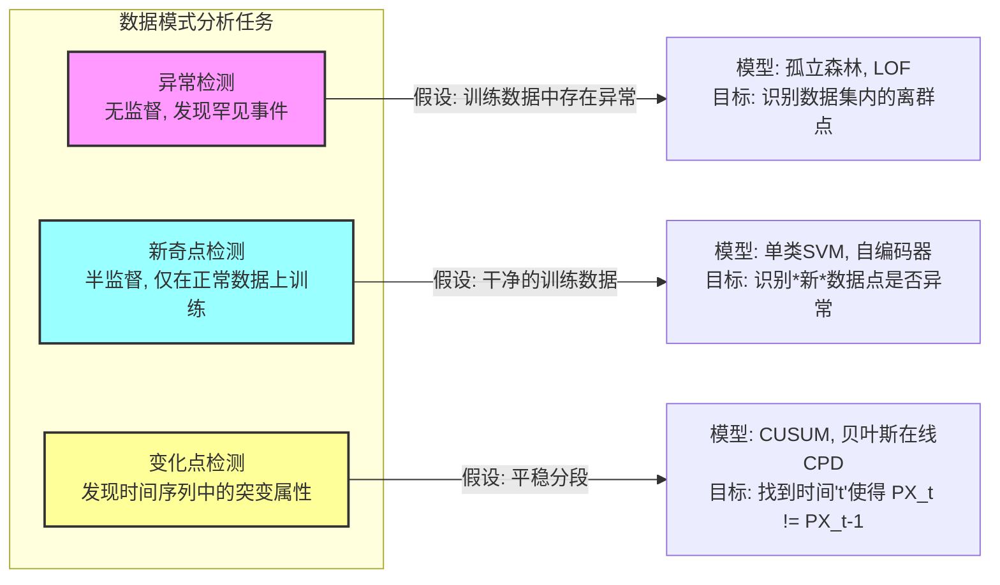

## 异常行为

### 1. 核心概念与数学基础

异常行为指的是在数据集中与正常或预期行为显著偏离的观测、事件或模式。这些不一致的模式也被称为离群点、异常点、新奇点或例外。检测异常行为的基本假设是，与正常实例相比，此类实例是罕见的。

#### 1.1. 统计学定义

从统计学的角度来看，正常数据点被假定从一个随机模型的高概率区域生成，而异常点则从低概率区域生成。

**概率密度函数 (Probability Density Function, PDF):**
对于给定的数据点 $x$ 和一个概率分布模型 $p(\cdot)$，如果其概率密度 $p(x)$ 低于某个阈值 $\epsilon$，则该点被认为是异常的。
$$
\text{is_anomaly}(x) = \begin{cases} 1 & \text{若 } p(x) < \epsilon \\ 0 & \text{其他情况} \end{cases}
$$
- $x$: 一个数据点或向量。
- $p(x)$: 在假设模型下 $x$ 的概率密度。
- $\epsilon$: 一个预定义的概率阈值。

一个常见的模型是多元高斯（正态）分布：
$$
p(x; \mu, \Sigma) = \frac{1}{(2\pi)^{d/2} |\Sigma|^{1/2}} \exp\left(-\frac{1}{2} (x - \mu)^T \Sigma^{-1} (x - \mu)\right)
$$
- $d$: 数据的维度数量。
- $\mu$: 分布的均值向量。
- $\Sigma$: 分布的协方差矩阵。
- $|\Sigma|$: 协方差矩阵的行列式。

#### 1.2. 基于距离的度量

异常也可以根据其与其他数据点的距离来定义。

**Z-分数 (Z-Score) (用于单变量数据):**
Z-分数衡量一个数据点与均值之间相差多少个标准差。Z-分数超过某个阈值（例如3）的点通常被认为是异常点。
$$
Z = \frac{x - \mu}{\sigma}
$$
- $x$: 数据点。
- $\mu$: 数据集的均值。
- $\sigma$: 数据集的标准差。

**马哈拉诺比斯距离 (Mahalanobis Distance) (用于多变量数据):**
这种距离度量考虑了变量之间的相关性，并且是尺度不变的。它衡量点 $x$ 到分布中心（均值 $\mu$）的距离。
$$
D_M(x) = \sqrt{(x - \mu)^T \Sigma^{-1} (x - \mu)}
$$
- $x$: 数据点向量。
- $\mu$: 分布的均值向量。
- $\Sigma^{-1}$: 协方差矩阵的逆矩阵。
具有较大马氏距离的点是异常点。

### 2. 关键技术规格

这些规格是配置和评估异常检测系统的典型参数。

| 参数 | 符号 | 典型值/范围 | 单位 | 描述 |
| :--- | :--- | :--- | :--- | :--- |
| 检测阈值 (Z-分数) | $Z_{thresh}$ | 2.5 到 3.5 | 标准差 | 在单变量统计方法中，用于标记一个点为异常的阈值。 |
| 检测阈值 (概率) | $\epsilon$ | $10^{-3}$ 到 $10^{-9}$ | 概率 | 一个点被认为是正常所需的最小概率密度。 |
| 污染因子 | $\nu$ | 0.01 到 0.1 | 无量纲 | 数据集中预期的异常比例。用于孤立森林等算法。 |
| k (用于 k-NN/LOF) | $k$ | 10 到 50 | 计数 | 用于距离/密度计算时考虑的最近邻居数量。 |
| 时间序列窗口大小 | $W$ | 10 到 1000 | 时间步 | 用于为新数据点建模正常行为时所使用的过去数据点数量。 |
| 自编码器潜在维度 | $d_{latent}$ | 2 到 64 | 计数 | 自编码器中瓶颈层的维度，控制压缩程度。 |
| 置信水平 | $1 - \alpha$ | 95%, 99%, 99.9% | 百分比 | 所检测到的点是真实异常的期望统计置信度。 |

### 3. 常见用例

| 用例 | 领域 | 关键性能指标 | 典型性能 |
| :--- | :--- | :--- | :--- |
| 信用卡欺诈检测 | 金融 | 精确率-召回率曲线下面积 (PR-AUC) | 0.80 - 0.95 |
| 网络入侵检测 | 网络安全 | F1-分数 (F1-Score) | > 0.98 (对于已知攻击) |
| 工业故障预测 | 制造业 | 召回率, 距离失效时间 | 召回率 > 0.95, 失效预测 > 1 小时 |
| 医学异常检测 (如心电图) | 医疗保健 | 灵敏度 (召回率), 特异度 | > 99% |
| 天文物体发现 | 科学 | 纯度 (精确率) | 因巡天项目而异 |

### 4. 实现考量

算法的选择取决于数据的特性（维度、大小、类型）和异常的性质。

#### 算法复杂度分析

| 算法 | 训练复杂度 | 预测复杂度 | 注释 |
| :--- | :--- | :--- | :--- |
| Z-分数 | $O(N)$ | $O(1)$ | $N$ 是数据点数量。 |
| k-NN 异常检测 | $O(1)$ 或 $O(N \log N)$ | $O(N \cdot d)$ | 训练仅是存储数据。预测需要计算到所有点的距离。索引可加速。 |
| 局部离群因子 (LOF) | $O(N^2 \cdot d)$ | $O(N \cdot d)$ | 训练阶段涉及计算成对距离。 |
| 孤立森林 | $O(T \cdot \psi \log \psi)$ | $O(T \cdot \log \psi)$ | $T$ 是树的数量, $\psi$ 是子样本大小。 |
| 单类SVM | $O(N_{sv}^3 + L \cdot N_{sv}^2 + d \cdot L \cdot N_{sv})$ | $O(d \cdot N_{sv})$ | $N_{sv}$ 是支持向量数, $L$ 是训练样本数。 |
| 自编码器 | $O(E \cdot N \cdot W)$ | $O(W)$ | $E$ 是周期数, $N$ 是样本数, $W$ 是网络权重数。 |

### 5. 性能特征

评估异常检测系统至关重要。由于异常是罕见的，标准准确率通常是一个误导性指标。

**混淆矩阵** 用于总结性能：

| | 预测为正常 | 预测为异常 |
| :--- | :--- | :--- |
| **实际为正常** | 真阴性 (TN) | 假阳性 (FP) - I型错误 |
| **实际为异常** | 假阴性 (FN) - II型错误 | 真阳性 (TP) |

由此，我们导出关键指标：
- **精确率 (Precision / Purity):** 衡量阳性预测的准确性。
  $$ \text{Precision} = \frac{TP}{TP + FP} $$
- **召回率 (Recall / Sensitivity, True Positive Rate):** 衡量找到所有实际异常的能力。
  $$ \text{Recall} = \frac{TP}{TP + FN} $$
- **F1-分数 (F1-Score):** 精确率和召回率的调和平均值。
  $$ F_1 = 2 \cdot \frac{\text{Precision} \cdot \text{Recall}}{\text{Precision} + \text{Recall}} = \frac{2TP}{2TP + FP + FN} $$
- **特异度 (Specificity / True Negative Rate):**
  $$ \text{Specificity} = \frac{TN}{TN + FP} $$
- **受试者工作特征 (ROC) 曲线:** 召回率 (TPR) vs. 假阳性率 (FPR = 1 - 特异度) 的曲线图。**曲线下面积 (AUC)** 是一个表示整体性能的标量值。AUC为1.0表示完美分类器，而0.5表示随机猜测。

### 6. 相关技术

异常检测是更广泛的模式识别任务家族的一部分。

#### 比较数学模型

- **异常检测 (例如 LOF):** 点 $A$ 的分数是基于其局部可达密度与其邻居的比较。
  $$ \text{LOF}_k(A) = \frac{\sum_{B \in N_k(A)} \frac{\text{lrd}_k(B)}{\text{lrd}_k(A)}}{|N_k(A)|} $$
  一个远大于1的分数表示异常。这里，$\text{lrd}$ 是局部可达密度，而 $N_k(A)$ 是 $A$ 的 $k$-邻居。

- **新奇点检测 (例如 自编码器):** 模型被训练以最小化正常数据上的重构误差。如果一个新点 $x_{new}$ 的重构误差很高，则其为异常。
  $$ \text{Error}(x_{new}) = \|x_{new} - D(E(x_{new}))\|_2^2 > \theta $$
  - $E(\cdot)$: 编码器函数。
  - $D(\cdot)$: 解码器函数。
  - $\theta$: 误差阈值，由正常数据的验证集上的误差分布确定。

- **变化点检测 (例如 CUSUM):** 累积和 (CUSUM) 统计量 $S_t$ 跟踪与目标均值 $\mu_0$ 的偏差。如果 $S_t$ 超过阈值，则标记一个变化。
  $$ S_t = \max(0, S_{t-1} + (x_t - \mu_0 - k)) $$
  - $x_t$: 时间 $t$ 的观测值。
  - $\mu_0$: 受控过程的目标均值。
  - $k$: 一个容差或松弛参数。

### 7. 参考文献

-   Breunig, M. M., Kriegel, H. P., Ng, R. T., & Sander, J. (2000). LOF: identifying density-based local outliers. *Proceedings of the 2000 ACM SIGMOD international conference on Management of data*, 93-104. DOI: [10.1145/342009.335388](https://doi.org/10.1145/342009.335388)
-   Liu, F. T., Ting, K. M., & Zhou, Z. H. (2008). Isolation forest. *2008 Eighth IEEE International Conference on Data Mining*, 413-422. DOI: [10.1109/ICDM.2008.17](https://doi.org/10.1109/ICDM.2008.17)
-   Chandola, V., Banerjee, A., & Kumar, V. (2009). Anomaly detection: A survey. *ACM computing surveys (CSUR)*, 41(3), 1-58. DOI: [10.1145/1541880.1541882](https://doi.org/10.1145/1541880.1541882)