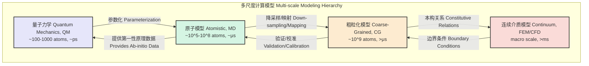

## 原子模型 (Atomistic Models)

原子模型是一类计算物理和计算化学中的模拟方法，其核心思想是将物质系统（如固体、液体、气体、生物分子）描述为一组相互作用的单个原子。这些模型通过求解每个原子的运动方程来预测和解释材料的宏观和微观性质。原子模型在尺度上介于第一性原理（量子力学）计算和连续介质力学之间，为研究数十万到数亿个原子的系统在纳秒到微秒时间尺度上的行为提供了有力的工具。

### 核心概念与数学基础

原子模型的基础是经典力学，它建立在几个关键的近似和概念之上。

#### 玻恩-奥本海默近似 (Born-Oppenheimer Approximation)

该近似是原子模型的理论基石。由于原子核的质量远大于电子（$m_{nuc} \gg m_e$），其运动速度也远慢于电子。因此，可以认为在任意时刻，电子都处于由瞬时固定的原子核位置所决定的量子基态。这使得我们可以将原子核的运动与电子的运动解耦，并将电子的效应归结为一个有效的、仅依赖于原子核坐标的**势能面 (Potential Energy Surface, PES)**。

#### 经典哈密顿量 (Classical Hamiltonian)

在玻恩-奥本海默近似下，一个包含 $N$ 个原子的系统的经典哈密顿量 $H$ 可以表示为系统总能量，即所有原子的动能 $K$ 和势能 $U$ 之和：

$$
H(\mathbf{r}^N, \mathbf{p}^N) = K(\mathbf{p}^N) + U(\mathbf{r}^N) = \sum_{i=1}^{N} \frac{\|\mathbf{p}_i\|^2}{2m_i} + U(\mathbf{r}_1, \mathbf{r}_2, \dots, \mathbf{r}_N)
$$

其中：
*   $N$ 是系统中的原子总数。
*   $\mathbf{r}^N = \{\mathbf{r}_1, \mathbf{r}_2, \dots, \mathbf{r}_N\}$ 是所有原子位置矢量的集合。
*   $\mathbf{p}^N = \{\mathbf{p}_1, \mathbf{p}_2, \dots, \mathbf{p}_N\}$ 是所有原子动量矢量的集合。
*   $m_i$ 是原子 $i$ 的质量。
*   $\mathbf{p}_i = m_i \mathbf{v}_i = m_i \frac{d\mathbf{r}_i}{dt}$ 是原子 $i$ 的动量。
*   $U(\mathbf{r}^N)$ 是系统的势能函数，也称为**力场 (Force Field)** 或**原子间势 (Interatomic Potential)**。它完全由原子核的坐标决定。

#### 力场 (Force Fields)

力场是原子模型的核心，它以数学函数的形式描述了原子间的相互作用。原子的受力 $\mathbf{F}_i$ 可以通过势能函数对其位置求负梯度得到：

$$
\mathbf{F}_i = -\nabla_{\mathbf{r}_i} U(\mathbf{r}^N)
$$

力场的选择至关重要，其准确性直接决定了模拟结果的可靠性。常见的力场类型包括：

*   **对势 (Pair Potentials)**：系统总势能是所有原子对之间相互作用势能的总和。最经典的例子是**Lennard-Jones (LJ) 势**，用于描述惰性气体原子间的范德华相互作用。
    $$
    U_{LJ}(r_{ij}) = 4\epsilon \left[ \left(\frac{\sigma}{r_{ij}}\right)^{12} - \left(\frac{\sigma}{r_{ij}}\right)^{6} \right]
    $$
    其中，$r_{ij} = \|\mathbf{r}_i - \mathbf{r}_j\|$ 是原子 $i$ 和 $j$ 之间的距离，$\epsilon$ 是势阱深度，$\sigma$ 是相互作用的有效直径。

*   **多体力场 (Many-body Potentials)**：用于描述金属和共价键合材料，其中原子间的相互作用不仅取决于距离，还取决于周围的化学环境。例如，**嵌入原子方法 (Embedded Atom Method, EAM)** 用于金属，**Tersoff势**用于硅、碳等共价材料。

*   **分子力场 (Molecular Mechanics Force Fields)**：用于生物分子（如蛋白质、DNA）和有机分子。这类力场将总势能分解为键合项和非键合项。
    $$
    U(\mathbf{r}^N) = \sum_{\text{bonds}} U_{\text{bond}} + \sum_{\text{angles}} U_{\text{angle}} + \sum_{\text{dihedrals}} U_{\text{dihedral}} + \sum_{i<j, \text{non-bonded}} \left( U_{\text{LJ}}(r_{ij}) + U_{\text{Coulomb}}(r_{ij}) \right)
    $$
    *   $U_{\text{bond}} = k_b(r - r_0)^2$：键长伸缩（谐振子近似）。
    *   $U_{\text{angle}} = k_{\theta}(\theta - \theta_0)^2$：键角弯曲。
    *   $U_{\text{dihedral}} = \sum_n \frac{V_n}{2}[1 + \cos(n\phi - \gamma_n)]$：二面角扭转。
    *   $U_{\text{Coulomb}}(r_{ij}) = \frac{q_i q_j}{4\pi\epsilon_0 r_{ij}}$：静电相互作用。

### 关键技术规格

在进行原子模拟时，需要设定一系列关键参数。这些参数的选择对模拟的稳定性、准确性和效率至关重要。

| 参数 (Parameter) | 符号 (Symbol) | 典型值 (Typical Value) | 单位 (Unit) | 描述 (Description) |
| :--- | :---: | :--- | :--- | :--- |
| 模拟时间步长 (Time Step) | $\Delta t$ | 0.5 - 2.0 | fs (飞秒) | 数值积分的时间步长，必须小于系统中最快振动周期。 |
| 系统尺寸 (System Size) | $N$ | $10^3$ - $10^8$ | atoms (原子数) | 模拟体系中的原子总数。 |
| 温度 (Temperature) | $T$ | 10 - 2000 | K (开尔文) | 系统的热力学温度，通常通过恒温器控制。 |
| 压强 (Pressure) | $P$ | 1 - $10^5$ | atm (标准大气压) | 系统的热力学压强，通常通过恒压器控制。 |
| 截断半径 (Cutoff Radius) | $r_c$ | 8 - 15 | Å (埃) | 为提高计算效率，仅考虑此半径内的非键相互作用。 |
| 介电常数 (Dielectric Const.) | $\epsilon_r$ | 1 - 80 | - | 用于静电相互作用计算的介质环境。 |
| 弛豫时间 (Relaxation Time) | $\tau_T, \tau_P$ | 0.1 - 2.0 | ps (皮秒) | 恒温器/恒压器的耦合时间常数。 |

### 常见用例与性能指标

原子模型被广泛应用于多个科学和工程领域。

| 应用领域 (Use Case) | 模拟目标 (Simulation Goal) | 关键性能指标 (Quantitative Performance Metric) | 典型精度 (Typical Accuracy) |
| :--- | :--- | :--- | :--- |
| **材料科学** | 计算晶格常数、弹性模量、热导率、熔点 | 预测值与实验值的相对误差 | 晶格常数: < 2% <br> 弹性模量: 5-15% |
| **生物化学** | 模拟蛋白质折叠、药物-靶点结合、膜渗透 | 结合自由能 ($\Delta G_{bind}$)、均方根偏差 (RMSD) | $\Delta G_{bind}$: ±(1-2) kcal/mol <br> RMSD: 1-3 Å |
| **化学工程** | 研究催化反应机理、气体在多孔材料中的扩散 | 反应能垒、扩散系数 (D) | 扩散系数: 数量级内准确 |
| **纳米技术** | 设计纳米结构（如碳纳米管、石墨烯）的力学和电学性质 | 杨氏模量、断裂应变 | 杨氏模量: ±10% |

### 实现考量与算法分析

实现原子模型的标准算法是**分子动力学 (Molecular Dynamics, MD)**。MD模拟的核心是一个迭代过程，用于求解牛顿运动方程。

```mermaid
graph TD
    A[开始: 初始化<br>Start: Initialization<br>t=0, r0, v0] --> B["计算力<br>Compute Forces<br>Ft = -∇Urt[";
    B --> C["积分运动方程<br>Integrate EOM<br>rt -> rt+Δt<br>vt -> vt+Δt[";
    C --> D["应用恒温/恒压器<br>Apply Thermostat/Barostat<br>可选 Optional[";
    D --> E["分析/保存轨迹<br>Analyze / Save Trajectory<br>rt+Δt, E_kin, E_pot[";
    E --> Ft < t_max?;
    F -- "是 Yes" --> B;
    F -- "否 No" --> G[结束<br>End];

    subgraph "核心算法: Verlet积分器"
        C
    end

    style A fill:#ccf,stroke:#333,stroke-width:2px
    style G fill:#f99,stroke:#333,stroke-width:2px
    style B fill:#cfc,stroke:#333,stroke-width:2px
```

#### 积分算法

最常用的积分算法之一是**Verlet算法**。其基本形式为：

$$
\mathbf{r}_i(t+\Delta t) = 2\mathbf{r}_i(t) - \mathbf{r}_i(t-\Delta t) + \frac{\mathbf{F}_i(t)}{m_i} (\Delta t)^2 + O((\Delta t)^4)
$$

该算法具有时间反演对称性，并能提供良好的长期能量守恒性。其数值误差的阶数为 $\Delta t$ 的四次方。

#### 算法复杂度分析

*   **力计算**：这是MD模拟中最耗时的部分。对于一个有 $N$ 个原子的系统，如果考虑所有原子对之间的相互作用，计算复杂度为 $O(N^2)$。
*   **优化**：为了降低复杂度，通常引入**截断半径 (cutoff radius, $r_c$)**。
    *   **邻居列表 (Neighbor Lists)**：每个原子只计算其邻居列表内原子的力，列表每隔数步更新一次。这可以将平均复杂度降低到 $O(N)$。
    *   **长程静电作用**：对于长程库仑力，不能简单截断。通常使用**粒子-网格-Ewald (Particle-Mesh Ewald, PME)** 等方法处理，其复杂度为 $O(N \log N)$。

### 性能特征与统计度量

MD模拟产生的是原子随时间演化的轨迹。为了从轨迹中提取有意义的物理量，需要使用统计力学的工具。

#### 系综平均 (Ensemble Average)

一个宏观可观测量 $A$ 的值是其在特定统计系综（如微正则系综NVE、正则系综NVT、等温等压系综NPT）中的平均值 $\langle A \rangle$。根据**遍历性假设 (Ergodic Hypothesis)**，长时间的模拟时间平均等于系综平均：

$$
\langle A \rangle = \lim_{\tau \to \infty} \frac{1}{\tau} \int_0^{\tau} A(\mathbf{r}^N(t), \mathbf{p}^N(t)) dt
$$

#### 结构性质：径向分布函数 (Radial Distribution Function, RDF)

$g(r)$ 描述了以一个原子为中心，在距离 $r$ 处找到另一个原子的概率密度，相对于理想气体的均匀密度。

$$
g(r) = \frac{V}{4\pi r^2 N \rho} \left\langle \sum_{i \neq j} \frac{\delta(r - r_{ij})}{N} \right\rangle
$$

其中 $\rho = N/V$ 是平均数密度。$g(r)$ 的峰位对应于系统的原子配位壳层。

#### 动力学性质：均方根位移 (Mean Squared Displacement, MSD)

MSD衡量了原子随时间偏离其初始位置的平均距离的平方。

$$
\text{MSD}(t) = \frac{1}{N} \left\langle \sum_{i=1}^N \|\mathbf{r}_i(t) - \mathbf{r}_i(0)\|^2 \right\rangle
$$

对于液体或气体中的扩散行为，MSD与时间在长时极限下呈线性关系，其斜率与**扩散系数 (Diffusion Coefficient, D)** 相关（爱因斯坦关系）：

$$
D = \lim_{t \to \infty} \frac{\text{MSD}(t)}{6t}
$$

**统计不确定性**：所有计算出的性质都具有统计误差。通常使用**块平均法 (Block Averaging)** 来估计标准误差和置信区间，以确保结果的可靠性。例如，一个物理量的最终报告值应为 $\langle A \rangle \pm \sigma_A$，其中 $\sigma_A$ 是标准误差。

### 相关技术与比较

原子模型是多尺度建模方法中的一个关键层次。



| 模型 (Model) | 基本单元 (Basic Unit) | 控制方程 (Governing Equation) | 优点 (Pros) | 缺点 (Cons) |
| :--- | :--- | :--- | :--- | :--- |
| **量子力学 (QM)** | 电子、原子核 | Schrödinger/Kohn-Sham 方程 | 高精度，可描述化学反应 | 计算成本极高，尺度受限 |
| **原子模型 (Atomistic)** | 原子 | 牛顿第二定律 | 平衡了精度和效率，可达较大时空尺度 | 依赖于力场，无法描述电子效应 |
| **粗粒化 (CG)** | 原子团（“珠子”） | 牛顿/郎之万方程 | 效率更高，可模拟更大系统和更长时间 | 损失原子级细节，势函数更具经验性 |
| **连续介质 (Continuum)** | 无穷小体积元 | 偏微分方程 (如Navier-Stokes) | 可模拟宏观尺度现象 | 无法描述原子级不连续性或缺陷 |

**数学模型比较**：
*   **量子力学 (DFT)** 求解Kohn-Sham方程：
    $$
    \left[ -\frac{\hbar^2}{2m_e}\nabla^2 + V_{ext}(\mathbf{r}) + V_H(\mathbf{r}) + V_{XC}(\mathbf{r}) \right] \psi_i(\mathbf{r}) = \epsilon_i \psi_i(\mathbf{r})
    $$
    其中 $V_{XC}$ 是交换关联势，是理论的核心近似。
*   **原子模型 (MD)** 求解牛顿方程：
    $$
    m_i \frac{d^2\mathbf{r}_i}{dt^2} = -\nabla_{\mathbf{r}_i} U(\mathbf{r}^N)
    $$
    其核心是势函数 $U(\mathbf{r}^N)$ 的选择。

### 参考文献

1.  Alder, B. J., & Wainwright, T. E. (1959). Studies in Molecular Dynamics. I. General Method. *The Journal of Chemical Physics*, 31(2), 459-466. **DOI**: [10.1063/1.1730376](https://doi.org/10.1063/1.1730376)
2.  Verlet, L. (1967). Computer "Experiments" on Classical Fluids. I. Thermodynamical Properties of Lennard-Jones Molecules. *Physical Review*, 159(1), 98-103. **DOI**: [10.1103/PhysRev.159.98](https://doi.org/10.1103/PhysRev.159.98)
3.  Ponder, J. W., & Case, D. A. (2003). Force fields for protein simulations. *Advances in Protein Chemistry*, 66, 27-85. **DOI**: [10.1016/s0065-3233(03)66002-x](https://doi.org/10.1016/s0065-3233(03)66002-x)
4.  Plimpton, S. (1995). Fast Parallel Algorithms for Short-Range Molecular Dynamics. *Journal of Computational Physics*, 117(1), 1-19. **DOI**: [10.1006/jcph.1995.1039](https://doi.org/10.1006/jcph.1995.1039)