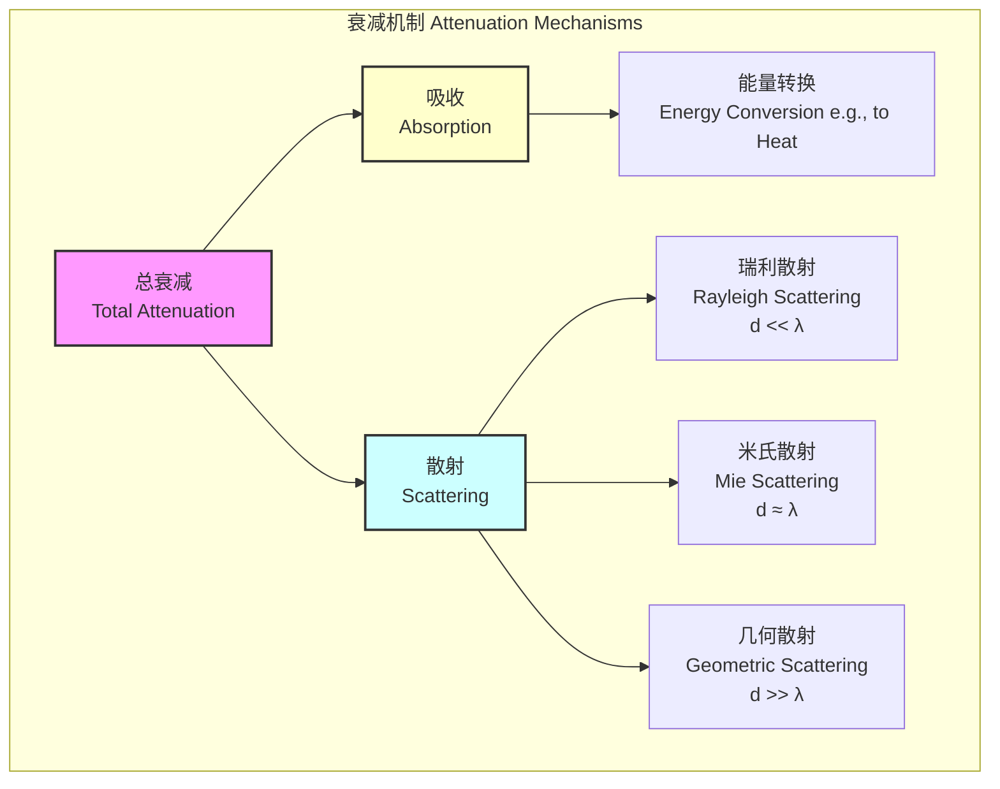
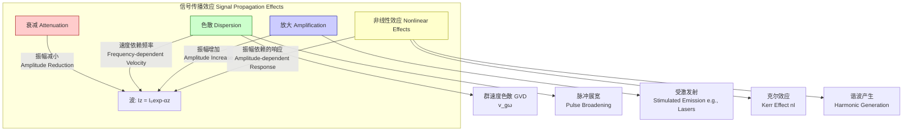

## 衰减 (Attenuation)

衰减是指任何类型的通量（如辐射、声波、粒子束）在穿过介质时其强度的逐渐损失。这种强度损失可能是由于介质的吸收、散射，或两者兼而有之。衰减是所有形式的波和辐射传播中的一个基本现象。

### 核心概念与数学基础

从根本上说，衰减描述了波的振幅或强度随传播距离的指数衰减。这种现象可以通过比尔-朗伯定律（Beer-Lambert Law）进行数学建模，该定律是描述衰减最核心的方程。

#### 比尔-朗伯定律 (Beer-Lambert Law)

该定律指出，对于给定的材料，光的吸收与通过材料的光程长度和吸收物质的浓度成正比。对于波的强度（辐照度），其数学表达式为：

$$
I(z) = I_0 e^{-\alpha z}
$$

其中：
*   $I(z)$ 是波在传播了距离 $z$ 后的强度。
*   $I_0$ 是波在源点（$z=0$）的初始强度。
*   $z$ 是波在介质中传播的距离。
*   $\alpha$ 是衰减系数（attenuation coefficient），单位通常为 $\text{m}^{-1}$ 或 $\text{cm}^{-1}$。它是一个综合参数，包含了吸收和散射的共同作用。

衰减系数 $\alpha$ 可以进一步分解为吸收系数 $\alpha_a$ 和散射系数 $\alpha_s$：

$$
\alpha = \alpha_a + \alpha_s
$$

#### 衰减机制

衰减主要由两种物理过程引起：吸收和散射。

*   **吸收 (Absorption):** 波的能量被介质吸收并转化为其他形式的能量，如热能。这个过程是谐振性的，通常在特定频率下最为显著。
*   **散射 (Scattering):** 波在与介质中的不均匀性（如粒子、分子、晶界）相互作用时，其传播方向发生改变。散射将能量从前向传播方向重新分配到其他方向。

#### 波动方程中的衰减

对于一个有损耗的介质，线性波动方程可以被修正以包含一个阻尼项，该项导致衰减：

$$
\nabla^2 \psi - \frac{1}{v^2} \frac{\partial^2 \psi}{\partial t^2} - \gamma \frac{\partial \psi}{\partial t} = 0
$$

其中：
*   $\psi$ 是波函数。
*   $v$ 是波在无损介质中的相速度。
*   $\gamma$ 是阻尼系数，与介质的能量耗散特性有关。

该方程的平面波解的形式为 $\psi(z, t) = A_0 e^{-\frac{\gamma v^2}{2} z} e^{i(kz - \omega t)}$，表明振幅呈指数衰减。

#### 复数表示法

在频域中，衰减通常通过使用复数物理量来描述，这极大地简化了数学处理。
*   **复波数 (Complex Wavenumber):**
    $$ k = k' + i k'' $$
    其中 $k'$ 是相位常数，与波长有关 ($k' = 2\pi/\lambda$)，而 $k''$ 是衰减常数。平面波可以写作 $E(z) = E_0 e^{ikz} = E_0 e^{i(k' + ik'')z} = E_0 e^{-k''z} e^{ik'z}$。这里的衰减系数 $\alpha = 2k''$。

*   **复折射率 (Complex Refractive Index):**
    $$ \tilde{n} = n + i\kappa $$
    其中 $n$ 是常规的折射率，决定相速度 ($v = c/n$)，而 $\kappa$ 是消光系数（extinction coefficient），它直接导致衰减。衰减系数 $\alpha$ 与 $\kappa$ 的关系为：
    $$ \alpha = \frac{4\pi\kappa}{\lambda_0} $$
    其中 $\lambda_0$ 是波在真空中的波长。

### 关键技术规格

衰减系数是材料和波频率的固有属性。以下是一些常见介质在特定条件下的典型衰减值。

| 介质 (Medium) | 波类型 (Wave Type) | 频率/波长 (Frequency/Wavelength) | 衰减系数 (Attenuation Coefficient) | 单位 (Unit) |
| :--- | :--- | :--- | :--- | :--- |
| 单模光纤 (SMF-28) | 电磁波 (EM Wave) | 1550 nm | ~0.18 | dB/km |
| 多模光纤 (Multimode Fiber) | 电磁波 (EM Wave) | 850 nm | ~2.5 | dB/km |
| 人体软组织 (Soft Tissue) | 超声波 (Ultrasound) | 1 MHz | ~0.5 - 0.7 | dB/(cm·MHz) |
| 骨骼 (Bone) | 超声波 (Ultrasound) | 1 MHz | ~5.0 | dB/(cm·MHz) |
| 海水 (Seawater) | 声波 (Acoustic) | 10 kHz | ~0.06 | dB/km |
| 空气 (Air, 20°C, 20% RH) | 声波 (Acoustic) | 1 kHz | ~0.5 | dB/100m |
| 同轴电缆 (RG-58) | 电信号 (Electrical) | 100 MHz | ~15 | dB/100ft |

**单位换算:**
分贝（dB）是一种对数单位。强度衰减（dB）与线性衰减系数 $\alpha$ 的关系为：
$$ \text{Attenuation (dB)} = 10 \log_{10}\left(\frac{I_0}{I(z)}\right) = 10 \log_{10}(e^{\alpha z}) = (10 \log_{10} e) \alpha z \approx 4.343 \alpha z $$
奈培（Np）是另一个对数单位，基于自然对数：
$$ \text{Attenuation (Np)} = \ln\left(\frac{A_0}{A(z)}\right) = \frac{\alpha z}{2} $$
其中 $A$ 是振幅。$1 \text{ Np} \approx 8.686 \text{ dB}$。

### 常见用例

衰减在多个科学和工程领域都是一个关键参数。

*   **光纤通信 (Optical Fiber Communication):**
    *   **描述:** 信号在光纤中长距离传输时，其功率会因瑞利散射和材料吸收（主要是由二氧化硅中的杂质引起）而减弱。
    *   **性能指标:** 在1550 nm波长窗口，标准单模光纤的损耗可以低至 0.18 dB/km。这意味着信号传输100公里后，功率会下降到其初始值的 $10^{-1.8}$（约1.58%）。因此，需要使用光放大器（如EDFA）来补偿这种损耗。

*   **医学超声成像 (Medical Ultrasound Imaging):**
    *   **描述:** 超声波穿透人体组织时会发生衰减。不同组织（如肝脏、肌肉、脂肪、骨骼）具有不同的频率依赖性衰减系数。
    *   **性能指标:** 衰减系数通常以 dB/cm/MHz 为单位进行量化。例如，肝脏的衰减约为 0.5 dB/cm/MHz。医生可以利用衰减信息来区分健康组织和病变组织（如肿瘤或纤维化）。时间增益补偿（TGC）技术被用于放大来自更深层组织的回波，以补偿衰减效应，从而获得均匀亮度的图像。

*   **地震学 (Seismology):**
    *   **描述:** 地震波（P波和S波）在穿过地壳和地幔时，由于岩石的非弹性特性和散射而衰减。
    *   **性能指标:** 衰减通常用无量纲的品质因子 $Q$ 来描述。$Q$ 值与能量耗散成反比。
        $$ Q = 2\pi \frac{E_{\text{stored}}}{E_{\text{lost per cycle}}} $$
        一个高 $Q$ 值（如 $Q > 500$）表示低衰减，而一个低 $Q$ 值（如 $Q < 100$）表示高衰减。地壳上部的 $Q$ 值通常较低，而地幔深处的 $Q$ 值较高。

### 实现考量

在数值模拟中，衰减的实现方式取决于所使用的算法。

*   **光线追踪 (Ray Tracing):**
    *   **描述:** 在图形学或光学模拟中，当一条光线穿过一个参与介质（participating medium）时，其能量可以根据比尔-朗伯定律在每个步长上进行衰减。
    *   **算法复杂度:** 对于每条光线，计算是 $O(N_s)$，其中 $N_s$ 是光线在介质中行进的步数。这是一种计算上相对简单的方法。

*   **时域有限差分法 (FDTD - Finite-Difference Time-Domain):**
    *   **描述:** FDTD通过求解麦克斯韦方程组来模拟电磁波传播。为了包含有损耗的材料，可以在安培定律的FDTD更新方程中引入一个电导率项 $\sigma$。
        $$ \nabla \times \mathbf{H} = \mathbf{J} + \frac{\partial \mathbf{D}}{\partial t} = \sigma \mathbf{E} + \epsilon \frac{\partial \mathbf{E}}{\partial t} $$
    *   **算法复杂度:** FDTD的复杂度通常为 $O(N)$，其中 $N$ 是仿真网格中的单元总数。引入损耗项不会改变算法的基本复杂度，但会增加每次迭代的计算量。

*   **有限元法 (FEM - Finite Element Method):**
    *   **描述:** FEM常用于求解声学和结构力学中的波动方程。可以通过在系统的刚度矩阵中引入一个阻尼矩阵 $[C]$ 来模拟衰减。
        $$ [M]\{\ddot{u}\} + [C]\{\dot{u}\} + [K]\{u\} = \{F(t)\} $$
    *   **算法复杂度:** FEM求解器的复杂度取决于所用求解器的类型（直接或迭代），通常高于 $O(N)$，可能是 $O(N^2)$ 或更高。

### 性能特征

衰减的测量和表征涉及统计分析。

*   **统计性质:** 尤其对于由随机散射主导的衰减，其过程本质上是统计性的。例如，在浑浊介质中，光子的平均自由程（Mean Free Path, MFP）是光子在发生一次散射事件之前平均行进的距离，它与散射系数成反比：$l_s = 1/\alpha_s$。
*   **测量不确定性:** 任何对衰减系数的实验测量都存在不确定性。这可能源于仪器噪声、样品制备的不一致性以及模型拟合的局限性。
*   **置信区间:** 报告衰减系数时，应提供一个置信区间（例如，95% CI）。例如，一个组织的衰减值可能报告为 $0.55 \pm 0.05$ dB/cm/MHz，这意味着有95%的把握认为真实值落在这个范围内。这种统计表征对于临床诊断和材料科学至关重要。

### 相关技术

衰减是波传播中的几种效应之一。理解其与其他现象的关系非常重要。

*   **色散 (Dispersion):**
    *   **描述:** 指波的相速度 $v_p$ 随频率 $\omega$ 变化的现象。这导致不同频率分量以不同速度传播，从而引起波包（如光脉冲）的展宽。
    *   **数学模型:** 色散通常通过波数 $k(\omega)$ 的泰勒展开来描述：$k(\omega) = k_0 + k'(\omega-\omega_0) + \frac{1}{2}k''(\omega-\omega_0)^2 + \dots$。其中 $k' = 1/v_g$（群速度的倒数），$k''$ 是群速度色散（GVD）参数。
    *   **对比:** 衰减影响波的**振幅**，而色散影响波的**相位**和**形状**。两者可以同时存在。

*   **放大 (Amplification):**
    *   **描述:** 衰减的逆过程，波的强度随传播而增加。这需要一个有源介质，通过外部能源（如泵浦激光）提供能量。
    *   **数学模型:** 放大可以用一个负的衰减系数（或称为增益系数 $g$）来建模：$I(z) = I_0 e^{gz}$。这在激光器和光放大器中是核心原理。

*   **非线性效应 (Nonlinear Effects):**
    *   **描述:** 当波的强度非常高时，介质的响应（如折射率或吸收）可能依赖于强度本身。这会导致自聚焦、谐波产生等现象。
    *   **数学模型:** 例如，克尔效应描述了折射率对强度的依赖性：$n(I) = n_0 + n_2 I$，其中 $n_2$ 是非线性折射率。

### 参考文献

1.  Kao, K. C., & Hockham, G. A. (1966). Dielectric-fibre surface waveguides for optical frequencies. *Proceedings of the Institution of Electrical Engineers*, 113(7), 1151-1158. DOI: `10.1049/piee.1966.0189`. (这篇开创性论文为低损耗光纤通信奠定了理论基础。)
2.  Parker, K. J., Doyley, M. M., & Rubens, D. J. (2011). Imaging the elastic properties of tissue: the 20 year perspective. *Physics in Medicine & Biology*, 57(3), 533. DOI: `10.1088/0031-9155/57/3/533`. (该综述详细讨论了超声衰减作为组织表征的工具。)
3.  Aki, K., & Richards, P. G. (2002). *Quantitative Seismology* (2nd ed.). University Science Books. (这是地震学领域的权威教科书，深入探讨了地震波衰减和品质因子Q。)
4.  Bohren, C. F., & Huffman, D. R. (1983). *Absorption and Scattering of Light by Small Particles*. Wiley-VCH. (该书是研究光与粒子相互作用（包括吸收和散射）的经典著作。)