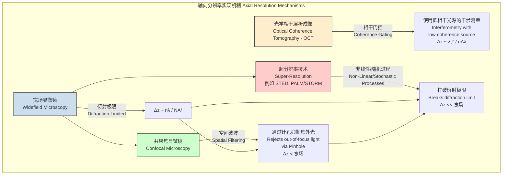

## 轴向（z）分辨率

轴向（z）分辨率，通常也称为深度分辨率或纵向分辨率，是衡量一个成像系统沿其光轴（z轴）区分两个紧邻物点的最小可分辨距离的能力。这一参数对于三维（3D）成像至关重要，因为它决定了图像的“光学切片”能力，即从样本的厚体积中生成清晰、无模糊的二维（2D）平面的能力。

轴向分辨率的物理基础是光的衍射。当光通过成像系统的孔径（例如，显微镜的物镜）时，会发生衍射，导致一个理想的点光源在像空间中形成一个弥散的三维光强分布图样。这个三维图样被称为点扩展函数（Point Spread Function, PSF）。轴向分辨率由该PSF沿z轴的尺寸和形状决定。通常，轴向分辨率通过PSF在z轴方向上的半高全宽（Full Width at Half Maximum, FWHM）来量化。FWHM值越小，轴向分辨率越高。

### 核心概念与数学基础

轴向分辨率的数学描述因成像技术的不同而异。

#### 1. 衍射极限分辨率（传统宽场显微镜）

对于传统的宽场显微镜，其轴向分辨率受到衍射的根本限制。根据瑞利判据（Rayleigh Criterion）的推导，轴向分辨率的近似表达式为：

$$ \Delta z \approx \frac{2 n \lambda}{NA^2} $$

其中：
*   $\Delta z$ 是轴向分辨率。
*   $n$ 是物镜与样本之间浸润介质的折射率（例如，空气$n \approx 1.0$，水$n \approx 1.33$，油$n \approx 1.51$）。
*   $\lambda$ 是所用光的波长。
*   $NA$ 是物镜的数值孔径（Numerical Aperture），定义为 $NA = n \sin(\theta)$，其中 $\theta$ 是物镜可收集光线的最大半角。

此公式表明，轴向分辨率与波长的平方成反比，与数值孔径的平方成反比。因此，使用高NA物镜和短波长的光是提高轴向分辨率的关键。

#### 2. 共聚焦显微镜（Confocal Microscopy）

共聚焦显微镜通过在探测器前放置一个共轭针孔（Pinhole）来物理性地阻挡来自焦平面以外的散射光和荧光信号。这种空间滤波机制显著提高了轴向分辨率。其轴向分辨率（FWHM）的更精确表达式为：

$$ \Delta z_{FWHM} \approx \frac{0.88 \lambda}{n - \sqrt{n^2 - NA^2}} $$

在 $NA$ 较小的情况下，此公式可以简化为与传统显微镜相似的形式，但系数更优：$\Delta z_{confocal} \approx \frac{1.4 n \lambda}{NA^2}$。这表明，在相同条件下，共聚焦显微镜的轴向分辨率优于宽场显微镜。

#### 3. 光学相干层析成像（Optical Coherence Tomography, OCT）

OCT是一种基于低相干干涉术的成像技术。其轴向分辨率与聚焦光学元件（即NA）无关，而是由光源的相干长度决定。

$$ \Delta z_{OCT} = \frac{2 \ln(2)}{\pi} \frac{\lambda_0^2}{n \cdot \Delta \lambda} \approx 0.44 \frac{\lambda_0^2}{n \cdot \Delta \lambda} $$

其中：
*   $\Delta z_{OCT}$ 是OCT系统的轴向分辨率。
*   $\lambda_0$ 是光源的中心波长。
*   $\Delta \lambda$ 是光源的光谱带宽（FWHM）。
*   $n$ 是样本的折射率。

此关系式揭示了OCT的一个核心优势：通过使用宽带光源（大的 $\Delta \lambda$），即使在使用低NA光学元件的情况下，也能实现极高的轴向分辨率（微米级）。这使得OCT能够在很深的成像深度（毫米级）下保持高轴向分辨率。

### 关键技术规格

下表总结了不同成像技术的典型轴向分辨率值。

| 技术 (Technology) | 典型轴向分辨率 (Typical Axial Resolution) | 关键影响参数 (Key Parameters) |
| :--- | :--- | :--- |
| 宽场显微镜 (Widefield Microscopy) | 500 - 1000 nm | $\lambda=525$ nm, NA=1.4, n=1.51 |
| 共聚焦显微镜 (Confocal Microscopy) | 350 - 700 nm | $\lambda=525$ nm, NA=1.4, n=1.51, 针孔尺寸 |
| 双光子显微镜 (Two-Photon Microscopy) | 800 - 1500 nm | $\lambda_{ex}=920$ nm, NA=1.0 (更长波长导致分辨率较低) |
| 受激发射损耗显微镜 (STED) | 50 - 150 nm | 损耗光功率、对准精度 |
| 光激活定位显微术 (PALM/STORM) | 20 - 50 nm | 单分子定位精度、标记密度 |
| 光片照明显微镜 (Light Sheet) | 1 - 5 µm | 照明物镜的NA、光片厚度 |
| 光学相干层析成像 (OCT) | 1 - 15 µm | $\lambda_0=1300$ nm, $\Delta \lambda=100$ nm (光源带宽) |
| 医用超声 (Medical Ultrasound) | 200 - 1000 µm | 换能器中心频率 (5-15 MHz)、带宽 |

### 常见用例

高轴向分辨率在多个科学和工业领域中至关重要。

*   **三维细胞生物学**: 在三维空间中解析亚细胞器，如线粒体、高尔基体和内质网。**性能指标**: 能够区分轴向距离小于500 nm的结构。
*   **神经科学**: 通过解析单个树突棘和突触来绘制神经网络连接图。**性能指标**: 使用0.2-0.5 µm的z轴步长进行图像堆栈采集，以完整重建神经元形态。
*   **材料科学**: 表征薄膜厚度、亚表面缺陷和多层结构。**性能指标**: 以微米或亚微米级的精度测量薄膜层厚。
*   **眼科学 (OCT)**: 对视网膜各层进行成像，用于青光眼和黄斑变性的诊断。**性能指标**: 解析厚度约为100 µm的视网膜神经纤维层（RNFL），要求轴向分辨率优于10 µm。

### 实现考量

在实际系统中获得理论上的轴向分辨率需要考虑多个因素。

*   **光学设计**: 物镜的选择（高NA对显微镜至关重要）、浸润介质（油、水、空气）以及照明/探测光的波长。
*   **系统对准**: 在共聚焦显微镜中，针孔的对准至关重要。任何偏离都会严重降低分辨率和信号强度。
*   **样本属性**: 样本本身的折射率及其内部变化会引起像差，从而降低有效的PSF质量和分辨率。折射率匹配对于深层组织成像尤为重要。
*   **算法增强（反卷积）**:
    *   反卷积是一种计算方法，旨在通过数学方法消除PSF引起的图像模糊。
    *   其模型为：$I_{measured} = PSF * O_{true} + \text{noise}$，其中 $*$ 代表卷积运算。目标是从测量的图像 $I_{measured}$ 中恢复真实的物体 $O_{true}$。
    *   常用算法包括Richardson-Lucy（迭代法）和Wiener滤波器。
    *   **算法复杂度**: Richardson-Lucy等迭代算法的计算量主要由用于高效卷积的快速傅里叶变换（FFT）决定。对于一个尺寸为 $N = W \times H \times D$ 的三维图像，每次迭代的计算复杂度为 $O(N \log N)$。所需的迭代次数取决于信噪比和期望的图像质量。

### 性能表征

轴向分辨率的性能需要通过实验进行精确测量和表征。

*   **测量方法**: 通常通过对亚分辨率荧光微球（其直径远小于预期的分辨率）进行成像来凭经验测量。
*   **分析过程**: 获取微球图像的x-z或y-z切面，并绘制沿z轴穿过微球中心的强度分布曲线。
*   **性能度量**: 计算该强度分布曲线的半高全宽（FWHM），其值即为系统测得的轴向分辨率。
*   **统计报告**: 为了评估系统的稳定性和测量的可重复性，通常会在视场内的多个微球上重复测量。结果以**平均值 ± 标准差**的形式报告（例如，$\Delta z = 550 \pm 30$ nm, n=20个微球）。为了获得更高的统计严谨性，还可以提供平均值的95%置信区间。

### 相关技术

不同技术通过不同的物理机制实现或改善轴向分辨率。

#### 对比模型

*   **宽场 vs. 共聚焦**: 宽场显微镜收集来自整个照明锥体的光，导致严重的焦外模糊，轴向分辨率较差。其PSF沿z轴被显著拉长。共聚焦显微镜利用针孔物理性地阻挡这些焦外光，从而有效地“锐化”了轴向PSF，提高了分辨率并实现了光学切片。其数学模型从一个简单的衍射积分，变为一个在像平面上包含了与针孔函数相乘的运算。
*   **显微镜 vs. OCT**: 传统显微镜的轴向分辨率通过NA与其横向分辨率紧密耦合。高轴向分辨率需要高NA，这通常意味着短工作距离。OCT的轴向分辨率则与其横向分辨率（聚焦）解耦，由光源的时间相干性决定。这使得OCT能够在很长的成像深度（毫米级）上实现高轴向分辨率（微米级），这是高NA显微镜无法实现的。

## 参考文献

1.  Pawley, J. B. (Ed.). (2006). *Handbook of Biological Confocal Microscopy*. Springer Science & Business Media. (生物共聚焦显微镜领域的基础性手册).
2.  Huang, D., Swanson, E. A., Lin, C. P., Schuman, J. S., Stinson, W. G., Chang, W., ... & Puliafito, C. A. (1991). Optical coherence tomography. *Science*, 254(5035), 1178-1181. DOI: 10.1126/science.1957169 (OCT技术的开创性论文).
3.  Hell, S. W., & Wichmann, J. (1994). Breaking the diffraction resolution limit by stimulated emission: stimulated-emission-depletion fluorescence microscopy. *Optics Letters*, 19(11), 780-782. DOI: 10.1364/OL.19.000780 (STED技术的开创性论文).
4.  Betzig, E., Patterson, G. H., Sougrat, R., Lindwasser, O. W., Olenych, S., Bonifacino, J. S., ... & Hess, H. F. (2006). Imaging intracellular fluorescent proteins at nanometer resolution. *Science*, 313(5793), 1642-1645. DOI: 10.1126/science.1127344 (PALM技术的开创性论文).