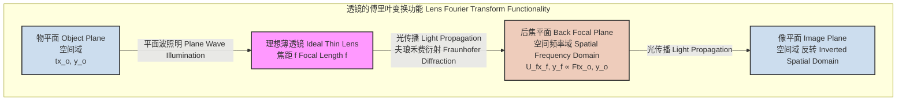
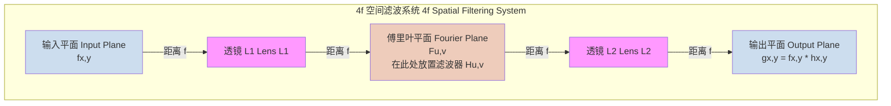
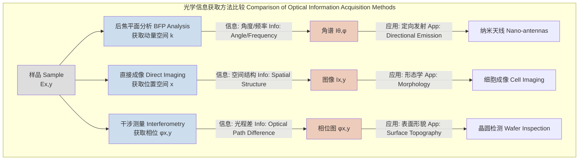

## 后焦平面 (Back Focal Plane)

后焦平面（Back Focal Plane, BFP），也常被称为傅里叶平面（Fourier Plane），是光学系统中一个至关重要的概念，尤其在物理光学、傅里叶光学和先进显微成像技术中。它不仅仅是几何光学中平行光线的汇聚点，更是一个物理空间，其中光场的分布直接对应于物平面光场的空间频率谱（即傅里叶变换）。

### 1. 核心概念与数学基础

从几何光学的角度看，后焦平面是透镜的一个主平面，所有平行于光轴入射的光线经过透镜后会汇聚于后焦点（Back Focal Point），而后焦平面就是通过后焦点并垂直于光轴的平面。

然而，其更深刻的物理意义来自于波动光学和傅里叶光学。一个理想薄透镜对光场的作用可以被数学地描述为一个相位变换和一个傅里叶变换的结合。当一个物（或光阑）被放置在透镜的前焦平面（Front Focal Plane）时，其在后焦平面上形成的光场分布，正是该物体透过率函数的二维傅里叶变换。

#### 1.1 透镜的傅里叶变换性质

考虑一个位于透镜前焦平面 $(x_o, y_o)$ 的物体，其复振幅透过率为 $t_A(x_o, y_o)$。当一束单位振幅的单色平面波（波长为 $\lambda$）垂直入射到该物体上时，紧随物体之后的光场为 $U_o(x_o, y_o) = t_A(x_o, y_o)$。经过焦距为 $f$ 的理想薄透镜后，在后焦平面 $(x_f, y_f)$ 上的光场分布 $U_f(x_f, y_f)$ 可以由夫琅禾费衍射积分（Fraunhofer Diffraction Integral）精确描述，其结果为：

$$
U_f(x_f, y_f) = \frac{e^{i \frac{k}{2f}(x_f^2 + y_f^2)}}{i\lambda f} \iint_{-\infty}^{\infty} U_o(x_o, y_o) e^{-i \frac{2\pi}{\lambda f} (x_f x_o + y_f y_o)} dx_o dy_o
$$

这个表达式可以被解读为：

$$
U_f(x_f, y_f) = C \cdot \mathcal{F}\{U_o(x_o, y_o)\}_{f_x = \frac{x_f}{\lambda f}, f_y = \frac{y_f}{\lambda f}}
$$

其中：
*   $U_f(x_f, y_f)$ 是后焦平面上坐标为 $(x_f, y_f)$ 处的复振幅。
*   $U_o(x_o, y_o)$ 是前焦平面上坐标为 $(x_o, y_o)$ 处的复振幅。
*   $\lambda$ 是光的波长。
*   $f$ 是透镜的焦距。
*   $k = 2\pi/\lambda$ 是波数（wavenumber）。
*   $C = \frac{e^{i \frac{k}{2f}(x_f^2 + y_f^2)}}{i\lambda f}$ 是一个位于傅里叶变换之外的复振幅因子。在大多数应用中，我们更关心强度 $I_f = |U_f|^2$，此时这个相位项会被消除，振幅因子变为一个常数。
*   $\mathcal{F}\{\cdot\}$ 表示二维傅里叶变换算子。
*   $f_x = \frac{x_f}{\lambda f}$ 和 $f_y = \frac{y_f}{\lambda f}$ 是空间频率。这个关系是核心：后焦平面上的物理坐标 $(x_f, y_f)$ 与物平面的空间频率 $(f_x, f_y)$ 成线性正比关系。

这意味着，后焦平面上的每一点都对应着物平面光场的一个特定空间频率分量。
*   **中心点 (0, 0):** 对应于直流分量（$f_x=0, f_y=0$），即图像的平均亮度。
*   **远离中心的点:** 对应于高频分量，代表图像中的细节和边缘。

#### 1.2 角度与位置的关系

后焦平面上的位置也直接对应于从物方射入透镜的平行光束的角度。一束以角度 $(\theta_x, \theta_y)$（相对于光轴的小角度近似）入射的平行光，将被聚焦到后焦平面上的点 $(x_f, y_f)$，其关系为：

$$
x_f = f \tan(\theta_x) \approx f \theta_x
$$
$$
y_f = f \tan(\theta_y) \approx f \theta_y
$$

对于任意角度，更精确的关系由阿贝正弦条件（Abbe Sine Condition）给出。对于一个来自物方、与光轴夹角为 $\theta$ 的平面波，它将在后焦平面的径向位置 $r_f$ 处聚焦：

$$
r_f = f \sin(\theta)
$$

这个关系在全内反射荧光显微镜（TIRF）等技术中至关重要。

### 2. 关键技术规格

后焦平面的特性与使用它的光学元件（通常是显微镜物镜）的规格密切相关。

| 参数 (Parameter) | 符号 (Symbol) | 典型值 (Typical Value) | 单位 (Unit) | 描述 (Description) |
| :--- | :--- | :--- | :--- | :--- |
| 物镜焦距 (Objective Focal Length) | $f_{obj}$ | 1.8 - 4.5 | mm | 对于标准显微镜物镜 (e.g., 100x, 60x)。焦距越短，放大倍率越高。 |
| 数值孔径 (Numerical Aperture) | NA | 0.1 - 1.49 | (无量纲) | 定义了物镜可以接收光线的最大角度。NA = $n \sin(\theta_{max})$。 |
| 最大可及空间频率 (Maximum Accessible Spatial Frequency) | $f_{max}$ | NA / $\lambda$ | m⁻¹ | 系统能够分辨的最高空间频率，由NA和波长决定。 |
| 后焦平面物理尺寸 (Physical Size of BFP) | $D_{BFP}$ | $2 f_{obj} \sin(\theta_{max})$ | mm | 由物镜的物理光阑（aperture stop）决定，通常与NA相关。 |
| 空间频率与位置的比例因子 (Scaling Factor) | $\lambda f$ | 2.2 x 10⁻¹⁰ - 8.1 x 10⁻¹⁰ | m² | 连接BFP物理坐标和空间频率的关键参数。 |

**示例计算:**
对于一个NA=1.49的油浸物镜，使用 $\lambda=532$ nm 的激光：
*   最大接收角: $\theta_{max} = \arcsin(\text{NA}/n) = \arcsin(1.49/1.518) \approx 78.9^\circ$ (其中 $n=1.518$ 是浸油折射率)。
*   最大可及空间频率: $f_{max} = 1.49 / (532 \times 10^{-9} \text{ m}) \approx 2.8 \times 10^6 \text{ m}^{-1}$。
*   如果物镜焦距 $f_{obj} = 1.8$ mm，则BFP的有效半径为 $r_{BFP, max} = f_{obj} \sin(\theta_{max}) \approx 1.8 \text{ mm} \times 0.98 = 1.76$ mm。

### 3. 常见用例与性能指标

后焦平面是许多先进光学技术的核心。

*   **空间滤波 (Spatial Filtering):**
    *   **描述:** 在后焦平面放置物理掩模（mask），以选择性地阻挡或改变特定空间频率分量的相位/振幅。
    *   **用例:**
        *   **高通滤波:** 放置一个中心挡板以阻挡低频分量，从而增强图像边缘。
        *   **低通滤波:** 放置一个可变光阑（iris）以阻挡高频分量，从而平滑图像、去除噪声。
        *   **希尔伯特变换/微分:** 放置一个在中心有 $\pi$ 相位跳变的相位板，可用于图像边缘检测。
    *   **性能指标:** 截止频率 $f_c = r_c / (\lambda f)$，其中 $r_c$ 是掩模的半径。滤波后图像的信噪比（SNR）改善程度。

*   **相衬显微镜 (Phase Contrast Microscopy):**
    *   **描述:** 在后焦平面放置一个相位环，它将未衍射光（零频分量）的相位移动 $\pm \pi/2$ 并衰减其振幅。
    *   **原理:** 这使得原本不可见的相位变化（来自透明样本）转换为可见的强度变化。
    *   **性能指标:** 对比度增强因子 $C_{out}/C_{in}$，其中 $C$ 是图像对比度。

*   **全内反射荧光显微镜 (TIRF Microscopy):**
    *   **描述:** 通过精确控制激光束在物镜后焦平面上的位置，来精确控制其在样品平面的入射角。
    *   **原理:** 将激光束聚焦到BFP的边缘区域（$r_f > f \sin(\theta_c)$，其中 $\theta_c$ 是全反射临界角），使激光在盖玻片/样品界面发生全内反射，产生一个仅穿透样品约100 nm的倏逝波（evanescent wave）场。
    *   **性能指标:**
        *   倏逝波穿透深度: $d = \frac{\lambda}{4\pi} \left( n_1^2 \sin^2\theta - n_2^2 \right)^{-1/2}$，通常为 50-150 nm。
        *   背景抑制比: 表面荧光信号与体相荧光信号的比值，可达 >100:1。

*   **角分辨光谱/成像 (Angle-Resolved Spectroscopy/Imaging):**
    *   **描述:** 直接对后焦平面进行成像，而不是像平面。这被称为傅里叶显微镜或倒易空间成像。
    *   **原理:** BFP上的强度分布 $I(x_f, y_f)$ 直接反映了样品发射或散射光线的角度分布 $I(\theta, \phi)$。
    *   **用例:** 研究纳米结构（如光子晶体、等离激元结构）的定向发射、测量单分子的偶极子取向。
    *   **性能指标:** 角度分辨率 $\Delta\theta \approx \frac{\delta x_f}{f}$，其中 $\delta x_f$ 是探测器像素尺寸。测量偶极子取向的精度，通常可达 $\pm 5^\circ$。

### 4. 实现考量

#### 4.1 4f 系统
实现空间滤波最经典的配置是4f系统。

该系统由两个焦距均为 $f$ 的透镜组成，它们相距 $2f$。输入平面位于第一个透镜的前焦平面，后焦平面（滤波平面）位于两透镜之间，输出平面位于第二个透镜的后焦平面。
*   **第一步:** L1对输入函数 $f(x,y)$ 进行傅里叶变换，得到 $F(u,v)$。
*   **第二步:** 在滤波平面，乘以滤波器函数 $H(u,v)$，得到 $G(u,v) = F(u,v)H(u,v)$。
*   **第三步:** L2对 $G(u,v)$ 进行逆傅里叶变换，得到输出 $g(x,y)$。根据卷积定理，这等效于输入函数与滤波器脉冲响应 $h(x,y)$（即$H(u,v)$的逆傅里叶变换）的卷积。

#### 4.2 计算实现与算法复杂度
在计算光学中，模拟后焦平面的过程通常使用快速傅里叶变换（FFT）算法。
*   **输入:** 一个 $N \times N$ 像素的复数数组，代表物平面的光场 $U_o(x_o, y_o)$。
*   **算法:**
    1.  对输入数组应用二维FFT。
    2.  使用 `fftshift` 函数将零频分量移动到数组中心，以匹配光学的物理现实。
*   **复杂度:** 二维FFT的计算复杂度为 $O(N^2 \log N)$。对于现代计算硬件，处理百万像素（$1024 \times 1024$）级别的图像通常在毫秒级内完成。

### 5. 性能特征与统计度量

*   **分辨率极限:** 阿贝衍射极限（Abbe diffraction limit）可以直接在后焦平面上理解。物镜的数值孔径NA决定了其后焦平面的有效尺寸，从而定义了能被系统收集的最大空间频率 $f_{max} = \text{NA}/\lambda$。根据傅里叶理论，无法收集更高频率的信息意味着空间分辨率受限于 $d \approx 1/f_{max} = \lambda/\text{NA}$（一个更精确的推导给出 $d = \lambda/(2\text{NA})$）。
*   **信噪比 (SNR):** 在BFP成像中，信噪比至关重要。例如，在测量单分子取向时，荧光信号是泊松分布的散粒噪声。信号强度 $S$ 正比于收集到的光子数 $N_{ph}$，噪声 $N$ 正比于 $\sqrt{N_{ph}}$。因此，$SNR \propto \sqrt{N_{ph}}$。
*   **测量精度:** 在通过拟合BFP图像来确定角度或位置时，其精度受到SNR和探测器像素化的限制。对于一个高斯光斑的中心定位，其定位精度 $\sigma_x$（标准差）可以达到：
    $$
    \sigma_x \approx \frac{w}{\sqrt{N_{ph}}}
    $$
    其中 $w$ 是光斑的宽度（标准差），$N_{ph}$ 是检测到的总光子数。这意味着，在BFP中测量的角度精度 $\sigma_\theta = \sigma_{r_f}/f$ 同样依赖于信号强度。对于一个典型的单分子实验（$N_{ph} \approx 1000$），定位精度可以远超像素尺寸，达到亚像素级别。置信区间（Confidence Interval）通常被用来报告拟合参数的不确定性，例如，95% CI。

### 6. 相关技术与比较模型

| 技术 (Technology) | 核心原理 (Core Principle) | 数学模型 (Mathematical Model) | 优点 (Pros) | 缺点 (Cons) |
| :--- | :--- | :--- | :--- | :--- |
| **后焦平面分析 (BFP Analysis)** | 傅里叶变换，角空间成像 | $I(k_x, k_y) \propto |\mathcal{F}\{E(x,y)\}|^2$ | 直接测量角分布、动量空间信息，对相位敏感 | 丢失直接空间信息，需要专门的光路（伯特兰透镜） |
| **直接空间成像 (Direct Space Imaging)** | 物镜将物平面映射到像平面 | $I(x',y') \propto |E(Mx, My)|^2$ | 直观的空间信息，高分辨率 | 对角度/动量信息不敏感，相位信息丢失（除非使用干涉法） |
| **干涉测量术 (Interferometry)** | 参考光束与信号光束干涉 | $I = |E_{ref} + E_{sig}|^2$ | 可恢复相位信息，极高精度 | 对振动和环境变化非常敏感，系统复杂 |
| **结构光照明显微术 (SIM)** | 用已知模式的光照明样品 | $I_{obs} = O \times P_{illum}$; $\mathcal{F}\{I_{obs}\} = \mathcal{F}\{O\} * \mathcal{F}\{P_{illum}\}$ | 超越衍射极限的分辨率（约2倍） | 需要多次采集图像，计算密集，对样品有光毒性 |

### 7. 参考文献 (References)

*   Goodman, J. W. (2005). *Introduction to Fourier Optics* (3rd ed.). Roberts and Company Publishers. (这是该领域的经典教科书).
*   Novotny, L., & Hecht, B. (2012). *Principles of Nano-Optics* (2nd ed.). Cambridge University Press. (对BFP在纳米光学和显微镜中的应用有深入的讨论).
*   Axelrod, D. (2001). Total Internal Reflection Fluorescence Microscopy in Cell Biology. *Traffic*, 2(11), 764–774. DOI: `10.1034/j.1600-0854.2001.21104.x`
*   Lieb, M. A., Zavislan, J. M., & Novotny, L. (2004). Single-molecule orientations determined by direct emission pattern imaging. *Journal of the Optical Society of America B*, 21(6), 1210. DOI: `10.1364/JOSAB.21.001210`