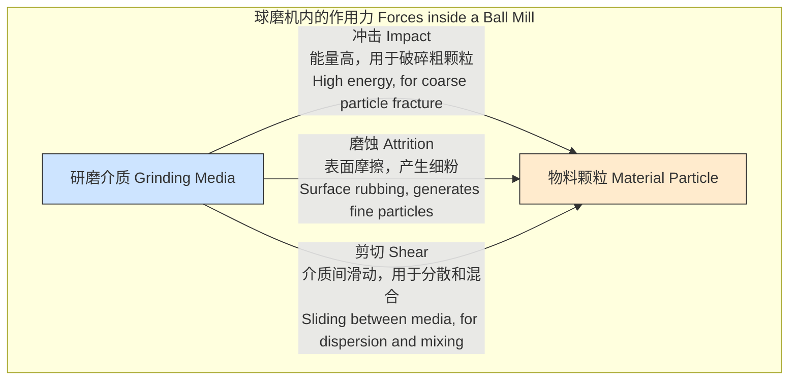
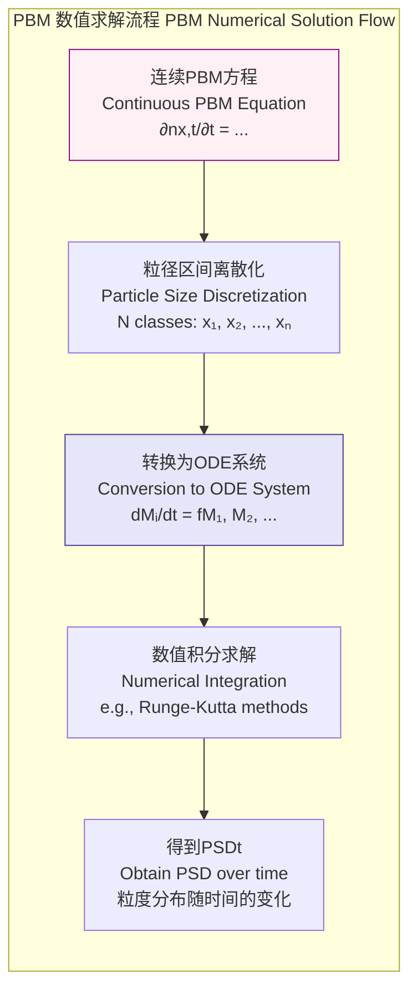
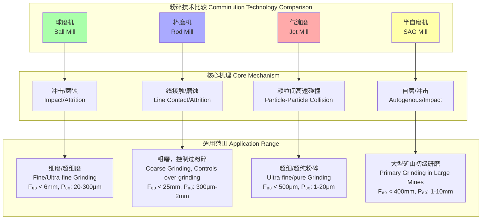

## 球磨 (Ball Milling)

球磨是一种利用研磨介质（如钢球、陶瓷球或卵石）在旋转或振动的筒体内对物料进行粉碎和混合的粉体工程技术。其核心原理是通过研磨介质的冲击、磨蚀和剪切作用，将大颗粒物料减小到所需的微米甚至纳米级别。该技术广泛应用于矿物加工、水泥生产、陶瓷、颜料、药物制备和机械合金化等领域。

### 核心概念与数学基础

#### 粉碎机理 (Grinding Mechanisms)
球磨过程中的能量传递和颗粒破碎主要通过三种基本机理实现：冲击 (Impact)、磨蚀 (Attrition/Abrasion) 和剪切 (Shear)。这些机理的相对重要性取决于磨机转速、介质尺寸、物料填充率和物料性质。

#### 能量-粒度关系 (Energy-Size Relationship)
粉碎过程的能量消耗与颗粒尺寸的减小程度之间存在经典的经验关系，主要有三大理论：

1.  **冯·里丁格定律 (Von Rittinger's Law, 1867)**
    该定律假设粉碎所需能量与产生的新表面积成正比，适用于脆性材料的细磨（< 50 μm）。
    $$ E = K_R \left( \frac{1}{d_p} - \frac{1}{d_f} \right) $$
    其中：
    *   $E$: 单位质量物料所需的能量 (J/kg)
    *   $K_R$: 里丁格常数，与材料性质有关 (J·m/kg)
    *   $d_f$: 物料的初始特征粒径 (m)
    *   $d_p$: 产品的最终特征粒径 (m)

2.  **基克定律 (Kick's Law, 1885)**
    该定律假设粉碎所需能量与物料的体积（或质量）成正比，与粒径的对数比相关，适用于粗碎（> 50 mm）。
    $$ E = K_K \ln\left(\frac{d_f}{d_p}\right) = K_K' \log_{10}\left(\frac{d_f}{d_p}\right) $$
    其中：
    *   $E$: 单位质量物料所需的能量 (J/kg)
    *   $K_K, K_K'$: 基克常数，与材料性质有关 (J/kg)
    *   $d_f, d_p$: 进料和产品的特征粒径 (m)

3.  **邦德第三理论 (Bond's Third Theory, 1952)**
    邦德理论是前两者的折中，被认为是工业应用中最实用和最广泛接受的模型，适用于中间粒度的粉碎。它假设能量消耗与产生的新裂纹长度成正比。
    $$ W = W_i \left( \frac{10}{\sqrt{P_{80}}} - \frac{10}{\sqrt{F_{80}}} \right) $$
    其中：
    *   $W$: 粉碎单位短吨 (short ton) 物料所需的能量 (kWh/short ton)
    *   $W_i$: 邦德功指数 (Bond Work Index)，表示将无限大物料磨至80%通过100微米筛所需能量 (kWh/short ton)。这是一个通过标准实验测定的材料常数。
    *   $P_{80}$: 产品中80%（按质量计）颗粒能够通过的筛网尺寸 (μm)
    *   $F_{80}$: 进料中80%（按质量计）颗粒能够通过的筛网尺寸 (μm)

#### 临界转速 (Critical Speed)
临界转速是磨机的一个关键操作参数，指筒壁对最外层研磨介质的离心力恰好等于其重力时的转速。此时，介质将贴在筒壁上随其旋转而不再下落，研磨作用停止。
$$ F_c = F_g $$
$$ m \omega_c^2 R = mg $$
$$ \omega_c = \sqrt{\frac{g}{R}} $$
转换为每分钟转数 (RPM)，并考虑介质直径：
$$ N_c = \frac{60}{2\pi} \omega_c = \frac{60}{2\pi} \sqrt{\frac{g}{(D-d)/2}} \approx \frac{42.3}{\sqrt{D-d}} $$
其中：
*   $N_c$: 临界转速 (RPM)
*   $g$: 重力加速度 (≈ 9.81 m/s²)
*   $D$: 磨机筒体内径 (m)
*   $d$: 研磨介质直径 (m)
实际操作转速通常设定为临界转速的65%至80%，以实现冲击和磨蚀作用的最佳平衡。

#### 研磨动力学与居群平衡模型 (Grinding Kinetics and Population Balance Model - PBM)
PBM是描述粉碎过程中粒度分布 (Particle Size Distribution, PSD) 随时间演化的最严谨的数学框架。它通过一个积分-微分方程来描述物料颗粒在不同尺寸级别间的迁移。
$$ \frac{\partial n(x, t)}{\partial t} = \underbrace{-S(x) n(x, t)}_{\text{破碎消失项}} + \underbrace{\int_{x}^{x_{max}} b(x, y) S(y) n(y, t) dy}_{\text{破碎生成项}} $$
其中：
*   $n(x, t)$: 在时间 $t$ 时，尺寸为 $x$ 的颗粒的数量密度函数。
*   $S(x)$: 选择函数 (Selection Function)，表示尺寸为 $x$ 的颗粒在单位时间内被选中并破碎的速率分数 (s⁻¹)。它与磨机功率、介质尺寸和物料硬度有关。
*   $b(x, y)$: 破碎分布函数 (Breakage Distribution Function)，表示尺寸为 $y$ 的颗粒破碎后，产生尺寸小于 $x$ 的碎片所占的质量（或数量）分数。它是一个累积分布函数，仅与物料性质有关，通常与磨机操作条件无关。$b(x,y)$ 描述了破碎事件的“后代”分布。

### 关键技术规格

#### 表1：典型行星式球磨机规格
| 参数 (Parameter) | 数值范围 (Value Range) | 单位 (Unit) | 描述 (Description) |
| :--- | :--- | :--- | :--- |
| 公转转速 (Planetary Speed) | 50 - 600 | RPM | 驱动整个行星盘旋转的速度 |
| 自转转速 (Jar Speed) | 100 - 1200 | RPM | 研磨罐自身的旋转速度 |
| 传动比 (Transmission Ratio) | 1:-1 to 1:-2.5 | - | 公转与自转的速度比，负号表示反向旋转 |
| 研磨罐容积 (Jar Volume) | 50 - 5000 | mL | 单个研磨罐的有效容积 |
| 最大装料量 (Max. Sample Load) | 罐容积的 1/3 | - | 物料填充量，过高或过低均影响效率 |
| 研磨球尺寸 (Ball Diameter) | 1 - 30 | mm | 介质尺寸，通常与物料初始粒径相关 |

#### 表2：常用研磨介质特性
| 材质 (Material) | 密度 (Density) | 硬度 (Hardness) | 特点 (Characteristics) |
| :--- | :--- | :--- | :--- |
| 氧化锆 (Zirconia, YSZ) | 5.8 - 6.1 | ~1200 HV | 高硬度、高韧性、低磨耗、防污染 |
| 氧化铝 (Alumina) | 3.6 - 3.9 | ~1500 HV | 硬度高、耐磨、成本较低 |
| 碳化钨 (Tungsten Carbide) | 14.5 - 15.5 | ~1600 HV | 极高密度和硬度，用于高能球磨和硬质材料 |
| 不锈钢 (Stainless Steel) | 7.8 - 8.0 | ~200 HV | 韧性好，成本低，但可能引入金属污染 |
| 玛瑙 (Agate) | 2.6 - 2.7 | ~6.5 Mohs | 天然材料，用于避免重金属污染的实验室应用 |

### 常见用例与性能指标

| 应用领域 (Application Area) | 目标 (Objective) | 典型最终粒径 (D₅₀) | 处理时间 (Time) | 关键性能指标 (KPI) |
| :--- | :--- | :--- | :--- | :--- |
| **矿物加工** (Minerals Processing) | 矿石单体解离 | 45 - 150 μm | 10 - 40 min | 吨矿能耗 (kWh/t)，回收率 (%) |
| **水泥生产** (Cement Production) | 熟料粉磨 | 10 - 30 μm | 20 - 60 min | 比表面积 (Blaine, m²/kg), 28天强度 (MPa) |
| **陶瓷制备** (Ceramics Preparation) | 原料超细化 | 0.5 - 5 μm | 1 - 24 h | 粒度分布跨度 (Span), 烧结密度 (%) |
| **药物研发** (Pharmaceuticals) | 提高生物利用度 | 100 - 1000 nm | 0.5 - 8 h | 结晶度 (%), 溶解速率 (mg/L/min) |
| **机械合金化** (Mechanical Alloying) | 制备固溶体/非晶 | < 1 μm (晶粒) | 10 - 100 h | 合金相纯度 (%), 晶粒尺寸 (nm) |

### 实现考量与模型复杂度

#### 工艺参数优化
球磨是一个多变量耦合的复杂过程。优化目标（如最小化能耗、达到目标粒径）需要对以下参数进行系统性调整：
*   **磨机转速 (Mill Speed):** 影响冲击/磨蚀比例。
*   **介质填充率 (Media Filling Ratio, Jc):** 通常为30-50%罐容积。
*   **球料比 (Ball-to-Powder Ratio, BPR):** 质量比，范围从 5:1 到 100:1。
*   **物料填充率 (Powder Filling Level, U):** 介质间隙的填充程度。
*   **研磨时间 (Milling Time):** 最直接的控制变量。
*   **干/湿磨 (Dry/Wet Milling):** 湿磨通常效率更高，可防止颗粒团聚。

#### 居群平衡模型的数值解法
PBM 方程没有解析解，必须通过数值方法求解。常用的方法是尺寸离散化：

1.  将连续的粒径区间 $[x_{min}, x_{max}]$ 划分为 $N$ 个离散的尺寸级别 $i=1, 2, ..., N$。
2.  积分-微分方程转化为一个常微分方程组 (System of ODEs)。

对于第 $i$ 个尺寸级别，其质量变化率 $dM_i/dt$ 可以写为：
$$ \frac{dM_i}{dt} = \underbrace{-S_i M_i}_{\text{从级别i消失}} + \underbrace{\sum_{j=1}^{i-1} b_{ij} S_j M_j}_{\text{从更大的级别j破碎生成}} $$
其中：
*   $M_i$: 第 $i$ 个尺寸级别的物料质量。
*   $S_i$: 第 $i$ 个尺寸级别的离散选择函数。
*   $b_{ij}$: 离散破碎分布函数，表示级别 $j$ 的物料破碎后，进入级别 $i$ 的质量分数。

**模型复杂度分析 (Complexity Analysis):**
该ODE系统可以用矩阵形式表示：
$$ \frac{d\mathbf{M}}{dt} = (\mathbf{B} - \mathbf{I})\mathbf{S}\mathbf{M} = \mathbf{K}\mathbf{M} $$
其中 $\mathbf{M}$ 是质量向量，$\mathbf{S}$ 是对角选择矩阵，$\mathbf{B}$ 是下三角破碎矩阵，$\mathbf{K}$ 是组合的速率矩阵。
*   **计算复杂度:** 求解该系统的主要计算成本在于矩阵-向量乘法。对于 $N$ 个尺寸级别，每次时间步进的计算复杂度为 $O(N^2)$。
*   **参数确定:** 模型的挑战在于实验确定 $S_i$ 和 $b_{ij}$。这通常需要进行一系列单尺寸示踪实验和反向拟合计算。

### 性能特征与统计度量

#### 粒度分布 (Particle Size Distribution - PSD)
PSD是评估球磨效果的核心指标。通常使用激光衍射法测量，并用以下统计量描述：
*   **D-Values:**
    *   $D_{10}$: 10%的颗粒尺寸小于该值。
    *   $D_{50}$: 中位径，50%的颗粒尺寸小于该值，代表了分布的中心趋势。
    *   $D_{90}$: 90%的颗粒尺寸小于该值，反映了粗颗粒的存在情况。
*   **分布宽度 (Span):**
    $$ \text{Span} = \frac{D_{90} - D_{10}}{D_{50}} $$
    Span值越小，表示粒度分布越窄，颗粒越均匀。一个理想的单峰分布的Span值通常在1.0到2.0之间。

#### 统计过程控制 (Statistical Process Control - SPC)
在工业生产中，为保证产品质量的稳定性，常采用SPC方法监控球磨过程。
*   **控制图 (Control Charts):** 例如，均值-极差图 (X-bar and R chart) 可用于监控最终产品 $D_{50}$ 的批次间波动。
*   **过程能力指数 (Process Capability Index, Cpk):**
    $$ C_{pk} = \min\left( \frac{USL - \mu}{3\sigma}, \frac{\mu - LSL}{3\sigma} \right) $$
    其中 $USL$ 和 $LSL$ 是规格上限和下限，$\mu$ 是过程均值，$\sigma$ 是过程标准差。$C_{pk} > 1.33$ 通常表示过程能力足够。
*   **置信区间 (Confidence Interval):** 对于测量的 $D_{50}$ 值，可以计算其95%置信区间，以评估测量结果的可靠性。例如，$D_{50} = 5.2 \pm 0.3$ μm (95% CI)。

### 相关技术与比较模型

球磨是众多粉碎技术中的一种。与其他技术相比，它在特定应用中具有独特优势。

**比较模型:**
*   **球磨机 vs. 棒磨机:** 棒磨机使用钢棒作为介质，产生线接触而非点接触，这使得它能选择性地破碎粗颗粒而减少细颗粒的过磨。其能量模型更接近基克定律。
*   **球磨机 vs. 气流磨:** 气流磨利用高速气流使颗粒相互碰撞来实现粉碎，无研磨介质，因此无介质磨损和污染。其能量效率在超细粉碎区（< 10 μm）远高于球磨机，但设备和运行成本更高。其粉碎过程更难用邦德理论描述，通常需要基于计算流体力学 (CFD) 和离散元方法 (DEM) 的复杂模型。

### 参考文献 (References)

1.  Austin, L. G., Klimpel, R. R., & Luckie, P. T. (1984). *Process Engineering of Size Reduction: Ball Milling*. Society of Mining Engineers of AIME. (This is a foundational textbook on the topic).
2.  Bond, F. C. (1952). The third theory of comminution. *Transactions of the American Institute of Mining, Metallurgical, and Petroleum Engineers*, 193, 484-494.
3.  Napier-Munn, T. J., Morrell, S., Morrison, R. D., & Kojovic, T. (1996). *Mineral comminution circuits: their operation and optimisation*. JKMRC Monograph Series in Mining and Mineral Processing No. 2. (DOI: [10.1016/B978-0-7506-5247-5.X5000-5](https://doi.org/10.1016/B978-0-7506-5247-5.X5000-5))
4.  Vogel, L., & Peukert, W. (2005). Breakage behaviour of particle systems in a stirred media mill. *Powder Technology*, 157(1-3), 151-157. (DOI: [10.1016/j.powtec.2005.05.011](https://doi.org/10.1016/j.powtec.2005.05.011))
5.  Suryanarayana, C. (2001). Mechanical alloying and milling. *Progress in Materials Science*, 46(1-2), 1-184. (DOI: [10.1016/S0079-6425(99)00010-9](https://doi.org/10.1016/S0079-6425(99)00010-9))