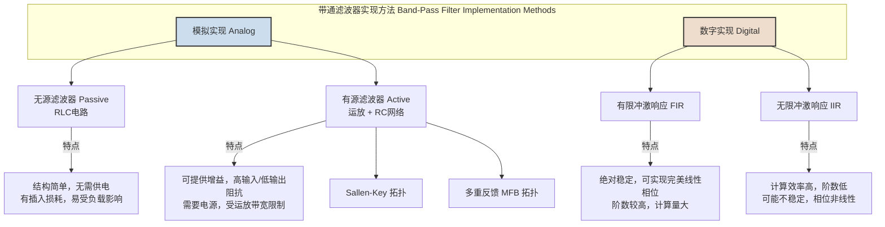
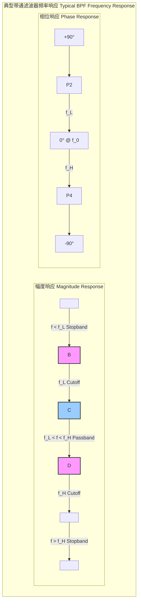
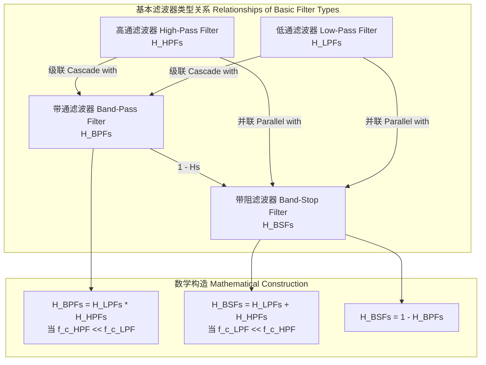

## 带通滤波器

带通滤波器（Band-Pass Filter, BPF）是一种电子滤波器或信号处理算法，它允许特定频率范围内的信号分量通过，同时极大地衰减该范围之外的频率分量。这个允许通过的频率范围被称为“通带”，而被衰减的频率范围被称为“阻带”。

### 核心概念与数学基础

#### 理想带通滤波器

一个理想的带通滤波器具有一个完美的矩形频率响应。它在通带内提供恒定的增益（通常为单位增益，即0 dB），并在阻带内提供无限的衰减。其幅度响应 $|H_{ideal}(j\omega)|$ 可以数学上表示为：

$$ |H_{ideal}(j\omega)| = \begin{cases} 1 & \text{for } \omega_L \le |\omega| \le \omega_H \\ 0 & \text{otherwise} \end{cases} $$

其中：
*   $\omega$ 是角频率，单位为弧度/秒 (rad/s)。
*   $\omega_L$ 是下截止角频率。
*   $\omega_H$ 是上截止角频率。

理想带通滤波器在物理上是不可实现的。根据佩利-维纳定理（Paley-Wiener theorem），一个因果系统（即输出不依赖于未来输入）的频率响应的平方的绝对值在对数尺度上必须是可积的。理想滤波器的矩形响应不满足此条件，其对应的冲激响应是无限长且非因果的。

#### 实际带通滤波器

实际的带通滤波器只能逼近理想特性。它们在通带和阻带之间存在一个有限宽度的“过渡带”，并且在阻带内的衰减是有限的。滤波器的设计是在通带平坦度、过渡带宽度和阻带衰减等指标之间进行权衡。

#### 传递函数与频率响应

滤波器的行为由其传递函数 $H(s)$（对于模拟滤波器，在拉普拉斯域中）或 $H(z)$（对于数字滤波器，在Z域中）完全描述。

频率响应 $H(j\omega)$ 是通过在传递函数中令 $s = j\omega$（或 $z = e^{j\omega}$）得到的。它是一个复数函数，可以分解为幅度响应和相位响应：

$$ H(j\omega) = |H(j\omega)| e^{j\phi(\omega)} $$

其中：
*   $|H(j\omega)|$ 是幅度响应，表示不同频率分量通过滤波器后的增益或衰减。
*   $\phi(\omega)$ 是相位响应，表示不同频率分量通过滤波器后产生的相移。

#### 从低通原型变换

设计带通滤波器的一种常用且系统的方法是，首先设计一个标准化的低通滤波器（称为“原型”），其截止频率 $\omega_c = 1$ rad/s，然后通过频率变换将其转换为带通滤波器。对于模拟滤波器，该变换为：

$$ s \rightarrow Q \left( \frac{s}{\omega_0} + \frac{\omega_0}{s} \right) $$

其中：
*   $s$ 是低通原型中的复频率变量。
*   $\omega_0$ 是目标带通滤波器的中心角频率，定义为 $\omega_0 = \sqrt{\omega_L \omega_H}$。
*   $Q$ 是品质因数，衡量滤波器的选择性，定义为 $Q = \frac{\omega_0}{BW}$。
*   $BW$ 是带宽，定义为 $BW = \omega_H - \omega_L$。

一个高Q值的滤波器具有窄的通带和高的选择性，而一个低Q值的滤波器具有宽的通带。

### 关键技术规格

以下是描述带通滤波器性能的关键技术规格，通常在滤波器的数据手册中提供。

| 参数 (Parameter) | 符号 (Symbol) | 描述 (Description) | 典型值 (Typical Value) | 单位 (Unit) |
| :--- | :--- | :--- | :--- | :--- |
| 中心频率 (Center Frequency) | $f_0$ 或 $\omega_0$ | 通带的几何中心频率。 | 10.7 MHz (IF), 2.45 GHz (WiFi) | Hz 或 rad/s |
| 截止频率 (Cutoff Frequencies) | $f_L, f_H$ | 功率响应降至通带内最大值一半（-3 dB）的频率点。 | - | Hz |
| 带宽 (Bandwidth) | $BW$ | 上下截止频率之差, $BW = f_H - f_L$。 | 180 kHz (FM IF), 20 MHz (WiFi) | Hz |
| 品质因数 (Quality Factor) | $Q$ | 中心频率与带宽之比, $Q = f_0/BW$。 | 0.5 (宽带) - 500+ (窄带) | 无量纲 |
| 通带增益 (Passband Gain) | $G_p$ | 滤波器在通带内的标称增益。 | 0 dB (无源), >0 dB (有源) | dB |
| 通带纹波 (Passband Ripple) | $R_p$ 或 $\delta_p$ | 通带内增益的最大峰峰值变化（例如切比雪夫滤波器）。 | 0.1 dB, 0.5 dB | dB |
| 阻带衰减 (Stopband Attenuation) | $A_s$ | 阻带内信号被衰减的最小量。 | 40 dB, 60 dB, 100 dB | dB |
| 滚降率 (Roll-off Rate) | - | 从通带到阻带的过渡区域的衰减速率。 | 20n dB/decade (n为阶数) | dB/decade 或 dB/octave |
| 群延迟 (Group Delay) | $\tau_g$ | 相位响应对频率的负导数, $\tau_g(\omega) = -d\phi(\omega)/d\omega$。 | 10 ns (RF), 5 ms (音频) | s |
| 插入损耗 (Insertion Loss) | IL | 由于滤波器插入电路而引起的信号功率损失，通常在中心频率处测量。 | 0.5 dB (SAW), 3 dB (LC) | dB |

### 常见用例

| 应用领域 (Domain) | 具体用例 (Specific Use Case) | 性能指标 (Performance Metric) |
| :--- | :--- | :--- |
| **无线电通信** | 超外差接收机中的中频(IF)滤波器 | **选择性**: 邻道抑制比 (ACRR) > 65 dB |
| | | **中心频率**: 10.7 MHz (FM), 455 kHz (AM) |
| **音频工程** | 图形均衡器或参数均衡器 | **Q值**: 可调范围 0.4 到 10 |
| | | **频率范围**: 20 Hz 到 20 kHz |
| **生物医学信号处理** | 从心电图(ECG)信号中提取QRS波群 | **通带**: 5 Hz - 15 Hz |
| | | **通带外衰减**: > 40 dB 以滤除基线漂移和工频干扰 |
| **光学与光子学** | 波分复用(WDM)系统中的信道解复用 | **带宽**: < 0.8 nm (100 GHz DWDM) |
| | | **插入损耗**: < 1.5 dB |
| **振动分析** | 隔离旋转机械的特定振动频率 | **Q值**: > 50 以精确定位故障频率 |
| | | **中心频率**: 与机器转速的谐波相关 |

### 实现考量

带通滤波器可以通过模拟电路或数字算法实现。

#### 模拟实现

一个简单的二阶无源RLC带通滤波器的传递函数为：

$$ H(s) = \frac{V_{out}(s)}{V_{in}(s)} = \frac{s\frac{R}{L}}{s^2 + s\frac{R}{L} + \frac{1}{LC}} $$

将此与标准二阶带通形式进行比较：

$$ H(s) = \frac{K \cdot \frac{\omega_0}{Q} s}{s^2 + \frac{\omega_0}{Q} s + \omega_0^2} $$

可以得到：
*   中心频率: $\omega_0 = \frac{1}{\sqrt{LC}}$
*   品质因数: $Q = \frac{1}{R}\sqrt{\frac{L}{C}}$
*   带宽: $BW = \frac{\omega_0}{Q} = \frac{R}{L}$
*   中心频率增益: $K = R$ (如果输出取自电阻两端)

#### 数字实现

数字滤波器通过对离散时间信号进行运算来实现滤波。

*   **FIR 滤波器**: 输出是当前和过去输入的加权和。
    $$ y[n] = \sum_{k=0}^{N-1} b_k x[n-k] $$
    其中 $y[n]$ 是输出样本，$x[n]$ 是输入样本，$b_k$ 是滤波器系数（即冲激响应），$N$ 是滤波器阶数。
    **算法复杂度**: 对于每个输出样本，需要 $N$ 次乘法和 $N-1$ 次加法，复杂度为 $O(N)$。

*   **IIR 滤波器**: 输出不仅依赖于输入，还依赖于过去的输出值。
    $$ \sum_{k=0}^{M} a_k y[n-k] = \sum_{k=0}^{P} b_k x[n-k] $$
    通常写为：
    $$ y[n] = \frac{1}{a_0} \left( \sum_{k=0}^{P} b_k x[n-k] - \sum_{k=1}^{M} a_k y[n-k] \right) $$
    **算法复杂度**: 对于每个输出样本，需要 $M+P+1$ 次乘法和 $M+P$ 次加法，复杂度为 $O(M+P)$。对于相同的衰减规格，IIR滤波器的阶数通常远小于FIR滤波器。

### 性能特征

#### 频率响应

下图示意了一个典型的二阶带通滤波器的波特图（Bode Plot）。

*   **幅度响应**: 在中心频率 $f_0$ 处达到峰值，在两个截止频率 $f_L$ 和 $f_H$ 处下降到峰值功率的一半（-3 dB）。
*   **相位响应**: 在低频时接近+90°，在高频时接近-90°，在中心频率 $f_0$ 处穿过0°。

#### 冲激响应与阶跃响应

*   **冲激响应**: 滤波器对狄拉克δ函数输入的时域响应。对于一个近似理想的带通滤波器，其冲激响应是一个被余弦波调制的sinc函数：
    $$ h(t) \propto \frac{\sin(\pi \cdot BW \cdot t)}{\pi \cdot BW \cdot t} \cos(2\pi f_0 t) $$
*   **阶跃响应**: 滤波器对单位阶跃函数输入的时域响应。其特征包括上升时间、过冲和振铃，这些都与滤波器的Q值和阶数密切相关。高Q值的滤波器通常会展现出更显著的过冲和振铃。

#### 统计度量

*   **噪声等效带宽 ($B_N$)**: 一个理想矩形滤波器的带宽，该滤波器会通过与实际滤波器相同数量的白噪声功率。
    $$ B_N = \frac{1}{|H(j\omega_0)|^2} \int_0^\infty |H(j\omega)|^2 d\omega $$
    对于一个简单的高Q值二阶RLC滤波器，$B_N \approx \frac{\pi}{2} BW$。

*   **信噪比 (SNR) 改善**: 通过滤除带外噪声，带通滤波器可以显著提高信噪比。SNR的改善因子与输入信号的原始噪声带宽和滤波器噪声带宽的比值成正比。

*   **置信区间**: 在实际测量中，滤波器参数（如 $f_0$）的估计值会受到噪声影响。统计分析可用于为这些估计值提供置信区间。例如，一个95%的置信区间可以表示为 $f_0 = \hat{f}_0 \pm 1.96 \cdot \sigma_{\hat{f}_0}$，其中 $\hat{f}_0$ 是测量均值，$\sigma_{\hat{f}_0}$ 是均值的标准误差。

### 相关技术

带通滤波器是滤波器家族中的一员，与其他基本滤波器类型密切相关。

*   **低通滤波器 (LPF)**: 允许低频通过，阻止高频。
*   **高通滤波器 (HPF)**: 允许高频通过，阻止低频。
*   **带阻滤波器 (BSF)**: 也称陷波滤波器，阻止一个特定频带，允许其他所有频率通过。

这些滤波器类型可以通过频率变换相互转换，或通过级联/并联组合来构建。例如，一个宽带带通滤波器可以简单地通过将一个低通滤波器和一个高通滤波器级联来实现，只要高通的截止频率远低于低通的截止频率。

### 参考文献

1.  Oppenheim, A. V., & Schafer, R. W. (2009). *Discrete-Time Signal Processing* (3rd ed.). Pearson.
2.  Sedra, A. S., & Smith, K. C. (2015). *Microelectronic Circuits* (7th ed.). Oxford University Press.
3.  Constantinides, A. G. (1970). Spectral transformations for digital filters. *Proceedings of the IEE*, 117(8), 1585-1590. doi:10.1049/piee.1970.0289.
4.  Zverev, A. I. (1967). *Handbook of Filter Synthesis*. John Wiley & Sons.