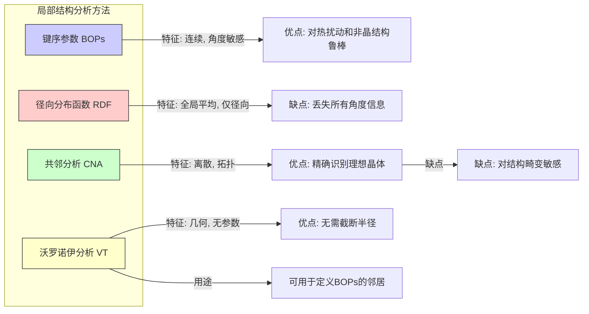

## 键序参数

键序参数（Bond Order Parameter, BOP），也称为 Steinhardt 参数，是一种用于定量描述凝聚态物质（如液体、玻璃体和晶体）中原子局部环境对称性的强大数学工具。该方法通过分析中心原子与其近邻原子之间形成的“键”的方向分布，来表征局部结构的有序程度和类型。它不依赖于外部参考坐标系，因为其最终形式是旋转不变的。

### 核心概念与数学基础

键序参数的核心思想是利用球谐函数 $Y_{lm}$ 作为基函数，来展开描述原子周围键矢量的空间分布。这使得复杂的局部几何结构能够被一组具有明确物理意义的系数所表征。

#### 1. 定义“键”与邻居

对于系统中的任意一个中心原子 $i$，首先需要确定其邻居原子集合。确定邻居的方法主要有两种：
*   **截断半径法 (Cutoff Radius)**：定义一个截断半径 $r_c$，所有与中心原子 $i$ 的距离 $r_{ij}$ 小于 $r_c$ 的原子 $j$ 都被视为其邻居。$r_c$ 的取值通常对应于径向分布函数 $g(r)$ 的第一个极小值位置。
*   **沃罗诺伊泰森划分法 (Voronoi Tessellation)**：对系统进行沃罗诺伊划分，与中心原子 $i$ 的沃罗诺伊胞共享一个面的原子被视为其邻居。这种方法无需预设参数，定义更为明确。

令原子 $i$ 的邻居原子数为 $N_b(i)$。连接原子 $i$ 和其任一邻居 $j$ 的矢量记为 $\vec{r}_{ij}$。该矢量的方向可以用单位矢量 $\hat{r}_{ij}$ 在球坐标系中的极角 $\theta_{ij}$ 和方位角 $\phi_{ij}$ 来描述。

#### 2. 局部键序参数 $Q_{lm}(i)$

对于每个中心原子 $i$，定义一组复数 $Q_{lm}(i)$，它们是所有指向邻居的键矢量在球谐函数 $Y_{lm}(\hat{r}_{ij})$ 基上的投影的平均值。

$$
\bar{Q}_{lm}(i) = \frac{1}{N_b(i)} \sum_{j=1}^{N_b(i)} Y_{lm}(\hat{r}_{ij})
$$

其中：
*   $i$ 是中心原子的索引。
*   $j$ 是原子 $i$ 的邻居原子的索引。
*   $N_b(i)$ 是原子 $i$ 的邻居数量。
*   $\hat{r}_{ij}$ 是从原子 $i$ 指向原子 $j$ 的单位矢量。
*   $Y_{lm}(\hat{r}_{ij})$ 是在 $\hat{r}_{ij}$ 方向上求值的 $(l, m)$ 阶球谐函数。$l$ 是非负整数，决定了对称性的阶数；$m$ 是整数，取值范围为 $[-l, l]$。

$\bar{Q}_{lm}(i)$ 的值依赖于坐标系的选取，因此在实际应用中较少直接使用。

#### 3. 二阶旋转不变量 $Q_l(i)$

为了消除坐标系依赖，构造了二阶旋转不变量 $Q_l(i)$。它表征了原子 $i$ 周围 $l$ 阶对称性的**强度**。

$$
Q_l(i) = \left( \frac{4\pi}{2l+1} \sum_{m=-l}^{l} |\bar{Q}_{lm}(i)|^2 \right)^{1/2}
$$

*   $Q_l(i)$ 是一个标量，其值在坐标系旋转下保持不变。
*   $l$ 的选择至关重要：
    *   $l=4$ 对立方对称性（如体心立方 BCC、面心立方 FCC）敏感。
    *   $l=6$ 对二十面体和六方对称性（如二十面体 Icosahedral、密排六方 HCP）敏感。
*   在完全无序的理想气体或高温液体中，$Q_l(i)$ 的值接近于零。在高度有序的晶体中，其值接近一个特定的非零常数。

#### 4. 三阶旋转不变量 $W_l(i)$

二阶不变量 $Q_l(i)$ 只能衡量对称性的强度，但无法区分具有相似强度但不同几何构型的结构（例如 FCC 和 HCP 的 $Q_6$ 值非常接近）。为了解决这个问题，引入了三阶旋转不变量 $W_l(i)$，它对对称性的**类型**或**形状**更为敏感。

$$
W_l(i) = \sum_{\substack{m_1, m_2, m_3 \\ m_1+m_2+m_3=0}} \begin{pmatrix} l & l & l \\ m_1 & m_2 & m_3 \end{pmatrix} \bar{Q}_{lm_1}(i) \bar{Q}_{lm_2}(i) \bar{Q}_{lm_3}(i)
$$

其中 $\begin{pmatrix} l & l & l \\ m_1 & m_2 & m_3 \end{pmatrix}$ 是 Wigner 3-j 符号。为了使其大小不依赖于 $Q_l(i)$ 的幅度，通常使用归一化的版本 $\hat{W}_l(i)$：

$$
\hat{W}_l(i) = \frac{W_l(i)}{\left( \sum_{m=-l}^{l} |\bar{Q}_{lm}(i)|^2 \right)^{3/2}}
$$

通过组合使用 $(Q_l, \hat{W}_l)$，可以更精确地识别和区分不同的局部原子构型。

### 关键技术规格

下表总结了键序参数法中的核心参数及其典型值。

| 参数 (Parameter) | 符号 (Symbol) | 描述 (Description) | 典型值/单位 (Typical Values/Units) |
| :--- | :--- | :--- | :--- |
| 对称性阶数 | $l$ | 球谐函数的阶数，决定了所探测的对称性类型。 | 无量纲整数，常用 $l=4, 6, 8$。 |
| 截断半径 | $r_c$ | 用于定义邻居原子的距离阈值。 | 通常取径向分布函数 $g(r)$ 的第一个极小值处，单位为长度（如 Å, nm）。 |
| 二阶不变量 | $Q_l$ | 衡量 $l$ 阶对称性的强度，旋转不变量。 | 无量纲。液体中 $\approx 0.1-0.3$，晶体中 $\approx 0.4-0.6$。 |
| 归一化三阶不变量 | $\hat{W}_l$ | 衡量 $l$ 阶对称性的形状，旋转不变量。 | 无量纲。其符号和数值可用于区分不同晶体结构。 |

### 常见用例与定量性能

键序参数被广泛应用于材料科学和凝聚态物理的计算机模拟（如分子动力学、蒙特卡洛）和实验数据（如三维原子探针）的分析中。

*   **相态识别**：
    *   **液体 (Liquid)**：原子排列无序，BOP 值较低且分布宽泛。例如，对于 Lennard-Jones 液体，$\langle Q_6 \rangle \approx 0.1-0.3$。
    *   **晶体 (Crystal)**：原子排列高度有序，BOP 值较高且分布尖锐。例如，完美 FCC 晶格中原子的 $Q_6 = 0.5745$。
    *   **玻璃体 (Glass)**：原子排列无长程有序但有短程和中程有序，BOP 值介于液体和晶体之间，分布较宽。

*   **晶体结构鉴定**：通过 $(Q_4, Q_6)$ 或 $(\hat{W}_4, \hat{W}_6)$ 的二维分布图可以清晰地区分不同的晶体结构。

| 晶体结构 | 理想 $Q_4$ 值 | 理想 $Q_6$ 值 | 理想 $\hat{W}_4$ 值 | 理想 $\hat{W}_6$ 值 |
| :--- | :--- | :--- | :--- | :--- |
| **FCC** (面心立方) | 0.1909 | 0.5745 | 0.1593 | -0.01316 |
| **HCP** (密排六方) | 0.0972 | 0.4848 | 0.1593 | 0.01316 |
| **BCC** (体心立方) | 0.5098 | 0.6281 | -0.1593 | 0.01316 |
| **Icosahedral** (二十面体) | 0.0 | 0.6633 | 0.0 | -0.16975 |

*   **成核与生长研究**：通过对体系中每个原子的 BOP 值进行监测，可以识别出“类晶体”原子的形成，从而追踪晶核的形成、长大或溶解过程。通常设定一个 $Q_6$ 阈值（如 $Q_6 > 0.5$）来定义固体原子。

### 实现考量与算法复杂度

计算键序参数的算法流程如下：

```mermaid
graph TD
    A[输入: 原子坐标 r_i] --> B对每个原子 i 进行循环;
    B --> C[确定邻居原子 j];
    subgraph "邻居确定方法"
        C1[截断半径法 r < r_c]
        C2[沃罗诺伊泰森划分法]
    end
    C --> C1;
    C --> C2;
    C1 --> D[计算键矢量 r_ij];
    C2 --> D;
    D --> E[计算球谐函数 Y_lmr_ij];
    E --> F[计算局部序参数 Q_lmi];
    F --> G[计算二阶不变量 Q_li];
    F --> H[计算三阶不变量 W_li];
    G & H --> I[输出: Q_li, W_li];
    B -- "循环结束" --> J[完成所有原子的计算];
```

**算法复杂度分析**:
*   **邻居搜索**：
    *   暴力搜索：对于一个有 $N$ 个原子的系统，复杂度为 $O(N^2)$。
    *   使用映象列表或单元列表法 (Cell Lists)：可以将复杂度优化至 $O(N)$。
    *   沃罗诺伊划分：高效算法的复杂度约为 $O(N \log N)$ 或 $O(N)$。
*   **BOP 计算**：对于每个原子，计算耗时与其邻居数 $N_b$ 和阶数 $l$ 相关。计算 $\bar{Q}_{lm}$ 的复杂度为 $O(N_b \cdot (2l+1))$。计算不变量的复杂度与 $l$ 的高次方相关。
*   **总复杂度**：在使用高效邻居搜索算法的情况下，计算系统中所有原子的键序参数的总复杂度通常为 $O(N)$。

### 性能特征

键序参数的性能体现在其对不同结构的区分能力和对热噪声的鲁棒性上。

*   **统计分布**：不同相态下 $Q_6$ 的概率分布函数 $P(Q_6)$ 有显著差异。
    *   **高温液体**：$P(Q_6)$ 呈现一个单峰、较宽的高斯分布，峰值位于较低的 $Q_6$ 值（例如 $\mu \approx 0.2$, $\sigma \approx 0.05$）。
    *   **过冷液体/玻璃体**：分布变宽，并可能出现肩峰，表明存在更多有序的局部结构。
    *   **晶体**：$P(Q_6)$ 呈现一个非常尖锐的峰，峰值位于该晶体结构的理想值附近（例如 FCC 中 $\mu \approx 0.57$, $\sigma \approx 0.02$），峰的宽度反映了热振动的影响。

*   **参数敏感性**：
    *   **截断半径 $r_c$**：$r_c$ 的选择对结果有较大影响。若 $r_c$ 太小，会遗漏第一近邻壳层的原子；若太大，会包含第二近邻壳层的原子，从而“稀释”局部对称性的信号。通常需要对 $r_c$ 的选择进行测试和验证。
    *   **平均化处理**：为了减少热噪声并更好地识别核心结构，Lechner 和 Dellago 提出了一种平均化的键序参数。首先计算每个原子的 $\bar{Q}_{lm}(i)$，然后计算该原子及其所有邻居的 $\bar{Q}_{lm}$ 的加权平均值，再基于这个平均值计算不变量。这种方法能更稳定地区分固态和液态原子。

### 相关技术与比较

键序参数是多种局部结构分析方法中的一种，其他常用方法包括：



*   **径向分布函数 (Radial Distribution Function, RDF/g(r))**
    *   **数学模型**: $g(r) = \frac{V}{N^2} \left\langle \sum_{i \neq j} \delta(r - |\vec{r}_i - \vec{r}_j|) \right\rangle$
    *   **比较**: RDF 提供了原子间距离的统计信息，是衡量径向有序度的标准方法。然而，它是一个全局平均量，并且完全丢失了关于键角的任何信息。BOPs 恰好弥补了这一点，专注于局部的、角度相关的结构信息。

*   **共邻分析 (Common Neighbor Analysis, CNA)**
    *   **数学模型**: 一种拓扑方法，通过分析一对中心原子及其共同邻居的连接方式来对原子对进行分类。例如，1421 指纹对应 FCC 结构，1422 对应 HCP 结构。
    *   **比较**: CNA 是一种离散的分类方法，对于识别完美的或接近完美的晶体结构非常有效。但其结果是“是”或“否”的分类，对于高度畸变、非晶或界面区域的结构描述能力不如 BOPs。BOPs 提供了一个连续的序参量，可以量化结构偏离理想构型的程度。

*   **沃罗诺伊分析 (Voronoi Analysis)**
    *   **数学模型**: 基于沃罗诺伊泰森划分，分析每个原子对应的沃罗诺伊多面体的几何特征（如面数、边数等）。常用沃罗诺伊指数 $\langle n_3, n_4, n_5, n_6, \dots \rangle$ 来表征，其中 $n_k$ 是有 $k$ 条边的面的数量。
    *   **比较**: 沃罗诺伊分析是一种强大的、无参数的几何分析方法。它本身就是一种结构表征工具，同时也可以作为 BOPs 分析中定义邻居的预处理步骤。与 BOPs 相比，它更侧重于描述原子周围的“空腔”几何，而 BOPs 更侧重于“键”的方向对称性。

### 参考文献

1.  Steinhardt, P. J., Nelson, D. R., & Ronchetti, M. (1983). Bond-orientational order in liquids and glasses. *Physical Review B*, 28(2), 784–805. DOI: [10.1103/PhysRevB.28.784](https://doi.org/10.1103/PhysRevB.28.784)
2.  Lechner, W., & Dellago, C. (2008). Accurate and general method for characterizing local atomic environments. *The Journal of Chemical Physics*, 129(11), 114707. DOI: [10.1063/1.2977970](https://doi.org/10.1063/1.2977970)
3.  Mickel, W., Kapfer, S. C., Schröder-Turk, G. E., & Mecke, K. (2013). Shortcomings of the bond orientational order parameters for the analysis of disordered particulate matter. *The Journal of Chemical Physics*, 138(4), 044501. DOI: [10.1063/1.4774084](https://doi.org/10.1063/1.4774084)