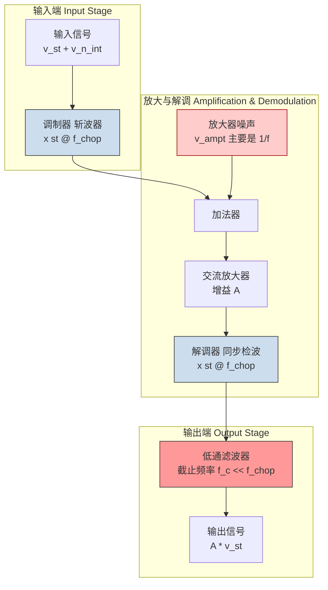
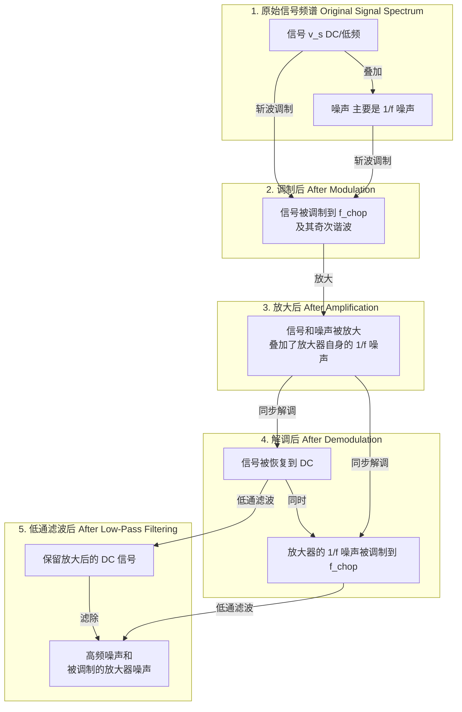
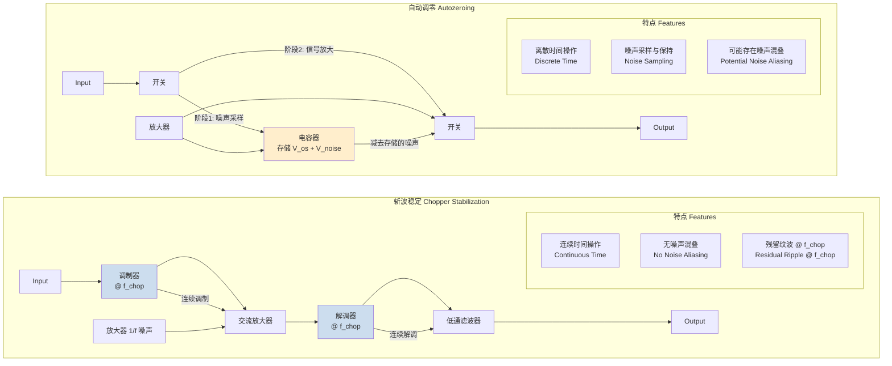

## 斩波频率

斩波（Chopping）是一种调制技术，用于在存在显著低频噪声和直流失调的环境中精确测量低电平、低频或直流信号。其核心思想是使用一个周期性波形（通常是方波）对输入信号进行调制，该波形的频率即为**斩波频率** ($f_{chop}$)。此过程将原始信号的频谱内容从近直流区域（DC）转移到斩波频率及其谐波处。随后，信号由一个交流耦合放大器进行放大，该放大器对低频噪声（如1/f噪声）和直流失调不敏感。最后，放大后的信号被同步解调回其原始频率（DC），并通过低通滤波器恢复出被放大的信号，同时抑制噪声。

### 核心概念与数学基础

斩波技术的基本原理是将测量问题从一个充满低频噪声的频域转移到一个更“干净”的高频频域。

#### 数学模型

假设输入信号 $V_{in}(t)$ 由一个微弱的直流或缓变信号分量 $v_s(t)$ 和一个噪声分量 $v_n(t)$ 组成。
$$ V_{in}(t) = v_s(t) + v_n(t) $$
其中，$v_n(t)$ 主要包含低频噪声成分，如闪烁噪声（1/f 噪声）和热噪声。

斩波过程将此输入信号与一个频率为 $f_{chop}$、幅度在+1和-1之间切换的方波开关函数 $s(t)$ 相乘。该理想方波的傅里叶级数展开为：
$$ s(t) = \frac{4}{\pi} \sum_{k=1,3,5,...}^{\infty} \frac{1}{k} \sin(2\pi k f_{chop} t) $$
调制后的信号 $V_{mod}(t)$ 为：
$$ V_{mod}(t) = V_{in}(t) \cdot s(t) = (v_s(t) + v_n(t)) \cdot s(t) $$
为简化分析，假设 $v_s(t)$ 是一个直流信号 $V_{DC}$。经过调制，其频谱从直流被搬移到了 $f_{chop}$ 及其奇次谐波上。

该信号随后通过一个增益为 $A$ 的放大器，放大器自身会引入内部噪声 $v_{amp}(t)$。放大器的噪声在低频段尤为显著，其功率谱密度（PSD）通常表现为 $S_{amp}(f) \propto 1/f^\alpha$（其中 $\alpha \approx 1$）。放大器的输出为：
$$ V_{amp\_out}(t) = A \cdot V_{mod}(t) + v_{amp}(t) $$
关键步骤是同步解调，即放大后的信号再次与同一个斩波信号 $s(t)$（或其精确相移版本）相乘。
$$ V_{demod}(t) = V_{amp\_out}(t) \cdot s(t) = \left[ A \cdot (V_{DC} + v_n(t)) \cdot s(t) + v_{amp}(t) \right] \cdot s(t) $$
由于理想方波 $s(t)$ 满足 $s(t)^2 = 1$，上式可简化为：
$$ V_{demod}(t) = A \cdot (V_{DC} + v_n(t)) + v_{amp}(t) \cdot s(t) $$
解调后，我们观察到：
1.  原始直流信号 $V_{DC}$ 被恢复到直流，并被放大了 $A$ 倍。
2.  原始输入噪声 $v_n(t)$ 也被解调回其原始频谱位置。
3.  **至关重要的是**，放大器的低频噪声 $v_{amp}(t)$ 被 $s(t)$ 调制，其频谱被搬移到了斩波频率 $f_{chop}$ 及其谐波处。

最后，一个截止频率 $f_c \ll f_{chop}$ 的低通滤波器（LPF）被应用于 $V_{demod}(t)$。该滤波器通过被放大的直流信号 $A \cdot V_{DC}$，同时滤除被上变频的放大器噪声、高频输入噪声以及调制过程产生的高次谐波。最终结果是信噪比（SNR）的显著提升。

#### 系统架构与频谱分析

下面的图表展示了斩波系统的工作流程和信号在频域中的变化。

### 关键技术规格

斩波频率的选择和相关参数对系统整体性能至关重要。

| 参数 (Parameter) | 典型值 (Typical Value) | 单位 (Unit) | 描述 (Description) |
| :--- | :--- | :--- | :--- |
| **斩波频率 (Chopping Frequency, $f_{chop}$)** | 1 kHz - 1 MHz | Hz | 调制频率。必须远高于信号带宽和1/f噪声转角频率，但受限于放大器带宽和开关速度。 |
| **频率稳定性 (Frequency Stability)** | < 100 | ppm | 斩波时钟的长期和短期频率漂移。高稳定性可减少解调失真。 |
| **时钟抖动 (Clock Jitter)** | 1 - 100 | ps (rms) | 斩波时钟边沿的时间不确定性。抖动会引入相位噪声，降低信噪比。 |
| **占空比 (Duty Cycle)** | 50 ± 1 | % | 斩波方波高电平时间占总周期的百分比。偏离50%会产生偶次谐波，可能导致直流失调。 |
| **上升/下降时间 (Rise/Fall Time)** | 1 - 100 | ns | 开关从关断到导通（或反之）所需的时间。非理想的边沿会影响高次谐波分量的能量。 |
| **残留纹波 (Residual Ripple)** | 1 - 100 | µV (p-p) | 输出端在斩波频率及其谐波处的残留电压波动。由不完美的滤波和电荷注入引起。 |

### 常见用例

斩波技术广泛应用于需要从强噪声背景中提取微弱信号的领域。

*   **锁定放大器 (Lock-in Amplifiers)**:
    *   **性能指标**: 可测量纳伏（nV）甚至皮伏（pV）级别的信号。
    *   **应用**: 物理学实验（如量子霍尔效应测量）、光学测量、扫描探针显微镜等。
    *   **量化性能**: 动态储备可达 120 dB，意味着可以在强度为信号 $10^6$ 倍的噪声中恢复信号。

*   **斩波稳定运算放大器 (Chopper-Stabilized Op-Amps)**:
    *   **性能指标**: 输入失调电压（$V_{os}$）可低至 1 µV 以下，失调电压温漂低于 0.01 µV/°C。
    *   **应用**: 高精度传感器接口（如应变片、热电偶）、精密数据采集系统、医疗仪器（如ECG）。
    *   **量化性能**: 输入电压噪声密度在 1 Hz 时可低至 5 nV/√Hz，有效消除了 1/f 噪声。

*   **光学测量系统 (Optical Measurement Systems)**:
    *   **实现**: 使用机械式光学斩波器（旋转叶片）来调制微弱的光束。
    *   **应用**: 红外光谱学、荧光测量、天文学光度测量。
    *   **量化性能**: 结合锁定放大器，可将探测器的信噪比提高数个数量级，实现对单光子级别的探测。

### 实现考量

斩波系统的实现方式多样，可以是机械的，也可以是电子的。

*   **机械斩波器**: 通常用于光学系统，由一个带开槽的旋转盘组成。
    *   **优点**: 可处理光束，开关对比度高。
    *   **缺点**: 体积大、有机械磨损、频率受限（通常为几 kHz）。
*   **电子斩波器**: 在集成电路中，通常使用MOSFET开关实现。
    *   **优点**: 体积小、速度快（可达 MHz）、无磨损、易于集成。
    *   **缺点**: 存在电荷注入（Charge Injection）和时钟馈通（Clock Feedthrough）效应，这会在解调后产生残留的失调和纹波。

#### 算法复杂性
斩波过程本身是一个周期性的调制/解调操作，其核心算法复杂度为 $O(1)$，因为它不依赖于输入数据的大小，而是一个连续的硬件过程。然而，系统设计复杂性体现在以下方面：
1.  **时钟生成与同步**: 需要高精度的时钟源，并且调制和解调时钟必须严格同步（同频同相）。
2.  **开关非理想性**: 必须处理电荷注入等非理想效应，这通常需要复杂的补偿电路（如伪差分开关、dummy switch）。
3.  **滤波器设计**: 输出低通滤波器的阶数和截止频率需要根据信噪比、建立时间和纹波抑制的要求进行权衡。

### 性能特征

斩波频率 $f_{chop}$ 的选择是一个关键的权衡过程。

*   **噪声性能**:
    *   为了有效避开 1/f 噪声， $f_{chop}$ 必须远大于放大器的 1/f 噪声转角频率 ($f_k$)。
    *   放大器的噪声功率谱密度（PSD）可以建模为：
        $$ S_{amp}(f) = S_{white} \left( 1 + \frac{f_k}{f} \right) $$
        其中 $S_{white}$ 是白噪声基底，$f_k$ 是转角频率。选择 $f_{chop} \gg f_k$ 可以使放大器工作在白噪声区域，从而最小化其对测量的影响。
*   **带宽限制**:
    *   斩波频率受到放大器增益带宽积（GBW）的限制。放大器必须在 $f_{chop}$ 处提供足够的增益。
    *   根据奈奎斯特采样定理，可测量的信号带宽 $BW_{sig}$ 理论上受限于 $f_{chop}/2$。实际上，它由输出低通滤波器的截止频率 $f_c$ 决定，通常 $BW_{sig} \approx f_c \ll f_{chop}$。
*   **统计度量**:
    *   **输出噪声方差**: 经过低通滤波后，输出噪声的方差 $\sigma_{out}^2$ 与滤波器的等效噪声带宽（ENBW）成正比。
        $$ \sigma_{out}^2 \approx \left( S_{demod\_white} \right) \cdot \text{ENBW} $$
        其中 $S_{demod\_white}$ 是解调后白噪声分量的PSD，ENBW $\approx \frac{\pi}{2} f_c$ （对于一阶RC滤波器）。
    *   **信噪比改善**: SNR的改善因子大致等于无斩波时在信号带宽内的总噪声与斩波后在同一带宽内的噪声之比。

### 相关技术比较

斩波稳定技术常与自动调零（Autozeroing）技术进行比较，两者都是为了降低放大器的失调和低频噪声。

#### 数学模型对比
*   **斩波 (Chopping)**: 如前所述，是一种**连续时间**的调制技术。噪声被连续地“搬移”到高频。
*   **自动调零 (Autozeroing)**: 是一种**离散时间**的采样技术。它分两个阶段工作：
    1.  **噪声采样阶段**: 输入端短路，放大器的失调和噪声 $V_{noise} = V_{os} + v_{amp}$ 被采样并存储在一个电容上。
    2.  **信号放大阶段**: 输入信号接入，存储的噪声电压从放大器输出中减去。
    其输出可以表示为：
    $$ V_{out}(t_n) = A \cdot [V_{in}(t_n) + V_{noise}(t_n)] - A \cdot V_{noise}(t_{n-1}) $$
    其中 $t_n$ 和 $t_{n-1}$ 是两个采样时刻。如果噪声变化缓慢，则 $V_{noise}(t_n) \approx V_{noise}(t_{n-1})$，噪声被有效消除。然而，这种采样过程会将高频噪声**混叠**（alias）到基带，成为新的噪声源。

#### 架构与特点对比

### 参考文献

1.  Enz, C. C., & Temes, G. C. (1996). Circuit techniques for reducing the effects of op-amp imperfections: autozeroing, correlated double sampling, and chopper stabilization. *Proceedings of the IEEE*, 84(11), 1584-1614. DOI: `10.1109/5.542410`
2.  Scofield, J. H. (1994). Frequency-domain description of a lock-in amplifier. *American Journal of Physics*, 62(2), 129-133. DOI: `10.1119/1.17629`
3.  Bakker, A., & Huijsing, J. H. (2000). A CMOS nested-chopper instrumentation amplifier with 100-nV offset. *IEEE Journal of Solid-State Circuits*, 35(12), 1883-1890. DOI: `10.1109/4.890303`