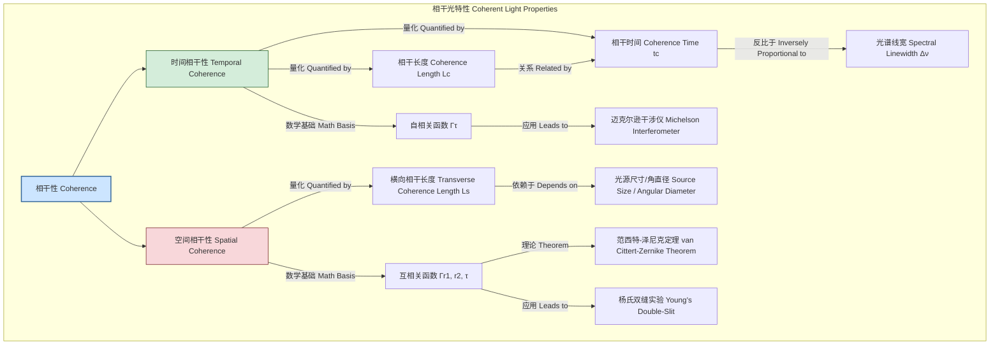
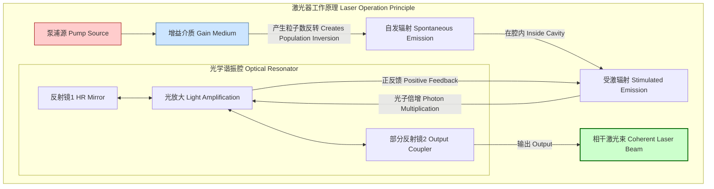

## 相干光

相干光是指电磁波（光）的一种特性，描述了其在空间不同点或在时间不同点上相位关系的确定性。具有高度相干性的光波表现出稳定的干涉图样，这是许多现代光学技术（如全息术、干涉测量和激光通信）的基础。相干性通常分为两个主要类别：时间相干性和空间相干性。

### 核心概念与数学基础

#### 1. 时间相干性 (Temporal Coherence)

时间相干性描述了光波场在某一空间点、不同时刻之间的相位相关性。一束理想的单色光（频率完全单一）具有无限的时间相干性。然而，实际光源总是具有一定的频谱宽度（线宽），这限制了其时间相干性。

**自相关函数 (Autocorrelation Function)**
时间相干性可以通过电场 $E(t)$ 的自相关函数 $\Gamma(\tau)$ 来量化，它衡量了信号与其自身在时间延迟 $\tau$ 后的相似度。

$$ \Gamma(\tau) = \langle E(t) E^*(t-\tau) \rangle = \lim_{T\to\infty} \frac{1}{T} \int_{-T/2}^{T/2} E(t) E^*(t-\tau) dt $$

其中：
*   $E(t)$ 是在特定空间点的复电场。
*   $E^*(t-\tau)$ 是在时间延迟 $\tau$ 后的复共轭电场。
*   $\langle \cdot \rangle$ 表示时间平均。

**复相干度 (Complex Degree of Coherence)**
标准化的自相关函数被称为复相干度 $\gamma(\tau)$：

$$ \gamma(\tau) = \frac{\Gamma(\tau)}{\Gamma(0)} = \frac{\langle E(t) E^*(t-\tau) \rangle}{\langle |E(t)|^2 \rangle} $$

$|\gamma(\tau)|$ 的值介于0和1之间，其中1表示完全相干，0表示完全不相干。

**相干时间 (Coherence Time) 与相干长度 (Coherence Length)**
相干时间 $t_c$ 是指 $|\gamma(\tau)|$ 保持显著（例如，大于 $1/e$）的时间延迟 $\tau$ 的范围。它与光源的频谱宽度（线宽）$\Delta\nu$ 成反比。

$$ t_c \approx \frac{1}{\Delta\nu} $$

相干长度 $L_c$ 是光在相干时间内传播的距离，它是在干涉仪（如迈克尔逊干涉仪）中可以观察到干涉条纹的最大光程差。

$$ L_c = c \cdot t_c \approx \frac{c}{\Delta\nu} = \frac{\lambda_0^2}{\Delta\lambda} $$

其中：
*   $c$ 是真空中的光速 ($\approx 3 \times 10^8$ m/s)。
*   $\nu$ 是光的频率，$\lambda$ 是光的波长。
*   $\lambda_0$ 是中心波长。
*   $\Delta\nu$ 和 $\Delta\lambda$ 分别是频率和波长上的频谱宽度 (FWHM)。

#### 2. 空间相干性 (Spatial Coherence)

空间相干性描述了在同一时刻，波前上不同空间点之间的相位相关性。它与光源的尺寸和几何形状密切相关。

**互相关函数 (Mutual Coherence Function)**
对于波前上的两个不同点 $\mathbf{r}_1$ 和 $\mathbf{r}_2$，其空间相干性由互相关函数 $\Gamma(\mathbf{r}_1, \mathbf{r}_2, \tau)$ 描述：

$$ \Gamma(\mathbf{r}_1, \mathbf{r}_2, \tau) = \langle E(\mathbf{r}_1, t) E^*(\mathbf{r}_2, t-\tau) \rangle $$

当时间延迟 $\tau=0$ 时，我们得到纯粹的空间相干性，由互强度 $J(\mathbf{r}_1, \mathbf{r}_2) = \Gamma(\mathbf{r}_1, \mathbf{r}_2, 0)$ 描述。

**复空间相干度 (Complex Degree of Spatial Coherence)**
标准化的互强度 $\mu_{12}$ 定义为：

$$ \mu(\mathbf{r}_1, \mathbf{r}_2) = \frac{J(\mathbf{r}_1, \mathbf{r}_2)}{\sqrt{J(\mathbf{r}_1, \mathbf{r}_1) J(\mathbf{r}_2, \mathbf{r}_2)}} = \frac{\langle E(\mathbf{r}_1, t) E^*(\mathbf{r}_2, t) \rangle}{\sqrt{\langle |E(\mathbf{r}_1, t)|^2 \rangle \langle |E(\mathbf{r}_2, t)|^2 \rangle}} $$

$|\mu(\mathbf{r}_1, \mathbf{r}_2)|$ 的值同样介于0和1之间。

**范西特-泽尼克定理 (Van Cittert-Zernike Theorem)**
该定理是空间相干性理论的基石。它指出，一个非相干的、扩展光源在远场产生的空间相干度函数，与其光源强度分布的傅里叶变换成正比。对于一个角直径为 $\theta$ 的圆形非相干光源，其横向相干长度 $L_s$（在该距离内，两点保持空间相干）近似为：

$$ L_s \approx 0.61 \frac{\lambda}{\theta} $$

这解释了为什么像恒星这样的远距离物体（角直径小）可以产生具有显著空间相干性的光，从而在干涉测量中产生条纹。

### 相干性概念关系图

### 关键技术规格

下表比较了不同光源的典型相干性参数。

| 光源类型 | 中心波长 ($\lambda_0$) | 光谱线宽 ($\Delta\lambda$) | 相干时间 ($t_c$) | 相干长度 ($L_c$) |
| :--- | :--- | :--- | :--- | :--- |
| 氦氖激光器 (He-Ne Laser) | 632.8 nm | ~0.002 pm (~1.5 MHz) | ~0.67 µs | ~200 m |
| 稳频半导体激光器 (DFB Laser) | 1550 nm | ~0.08 pm (~10 MHz) | ~100 ns | ~30 m |
| 飞秒激光器 (Femtosecond Laser) | 800 nm | >50 nm | < 50 fs | < 15 µm |
| 发光二极管 (LED) | 550 nm | ~30 nm | ~10 fs | ~3 µm |
| 太阳光 (Sunlight) | ~500 nm | ~500 nm (全谱) | ~1 fs | ~0.3 µm |

### 常见用例与性能指标

*   **全息术 (Holography)**
    *   **要求**: 高时间和空间相干性。
    *   **性能指标**: 相干长度必须大于被记录物体的最大深度。例如，要记录一个深度为 50 cm 的物体，需要 $L_c > 0.5$ m。空间相干性必须覆盖整个物体的横向尺寸。

*   **干涉测量法 (Interferometry)**
    *   **要求**: 极高的时间相干性（对于长基线干涉仪）。
    *   **性能指标**: 在LIGO（激光干涉引力波天文台）等应用中，激光器的相干长度可达数千公里。关键指标是相位噪声的功率谱密度，通常要求低于 $10^{-7} \text{rad}/\sqrt{\text{Hz}}$ @ 100 Hz。

*   **光学相干断层扫描 (OCT)**
    *   **要求**: **低**时间相干性（宽光谱）和**高**空间相干性。
    *   **性能指标**: 轴向分辨率 $\Delta z$ 直接取决于光源的相干长度。低相干性（宽光谱）可实现高分辨率。
        $$ \Delta z = \frac{2 \ln 2}{\pi} \frac{\lambda_0^2}{\Delta\lambda} \approx 0.44 \frac{\lambda_0^2}{\Delta\lambda} $$
        对于 $\lambda_0 = 1300$ nm, $\Delta\lambda = 100$ nm 的光源，轴向分辨率可达 $\Delta z \approx 7.4$ µm。

*   **相干光通信 (Coherent Optical Communication)**
    *   **要求**: 高时间相干性，以用作本地振荡器（LO）。
    *   **性能指标**: 对于高速调制格式（如QPSK, 16-QAM），要求发射器和本地振荡器的线宽非常窄（例如 < 100 kHz），以将相位噪声引起的误码率（BER）保持在可接受的水平（如 $< 10^{-12}$）。

### 实现考量

#### 相干光的产生：激光器

相干光最常见的来源是激光器（LASER: Light Amplification by Stimulated Emission of Radiation）。其高相干性源于两个核心机制：

1.  **受激辐射 (Stimulated Emission)**: 入射光子触发激发态的原子/分子释放一个与入射光子在频率、相位、偏振和传播方向上完全相同的光子。这确保了光子之间的内在相位锁定。
2.  **光学谐振腔 (Optical Resonator)**: 由两面或多面反射镜构成的谐振腔对特定模式（频率和空间分布）的光进行选择性放大。只有在腔内来回反射后能实现相长干涉的光波模式才能持续振荡，从而极大地压缩了光谱线宽（提高时间相干性）并形成稳定的空间模式（提高空间相干性）。

#### 相干性的测量与分析

测量相干性通常涉及干涉实验。
*   **时间相干性**: 使用迈克尔逊干涉仪，通过改变其中一个臂的长度来引入时间延迟 $\tau$，并测量干涉条纹的可见度（Visibility, $V$）。可见度与相干度模量直接相关：
    $$ V(\tau) = \frac{I_{max} - I_{min}}{I_{max} + I_{min}} = |\gamma(\tau)| $$
*   **空间相干性**: 使用杨氏双缝干涉仪，通过改变两狭缝的间距来探测不同空间点之间的相关性。
*   **算法复杂度**: 在数字全息和OCT等应用中，从干涉图样重建图像通常涉及傅里叶变换。使用快速傅里叶变换（FFT）算法，对于一个包含 $N$ 个数据点（或像素）的信号，其计算复杂度为 $O(N \log N)$，这使得实时处理成为可能。

### 性能特征与统计测量

光的相干性在更深层次上由其光子统计特性决定。

**一阶相干性 (First-Order Coherence)**
前面讨论的 $\gamma(\tau)$ 和 $\mu(\mathbf{r}_1, \mathbf{r}_2)$ 描述的是一阶相干性，与场幅度的相关性有关，它决定了干涉条纹的可见度。

**二阶相干性 (Second-Order Coherence)**
二阶相干性描述了光强度的相关性，由归一化的二阶相关函数 $g^{(2)}(\tau)$ 定义：

$$ g^{(2)}(\tau) = \frac{\langle I(t) I(t+\tau) \rangle}{\langle I(t) \rangle^2} $$

其中 $I(t)$ 是光强度。$g^{(2)}(\tau)$ 揭示了光子的时间分布特性（光子统计）：
*   **相干光 (Coherent Light, 如理想激光)**: 光子随机独立到达，遵循泊松分布。$g^{(2)}(\tau) = 1$ 对所有 $\tau$ 成立。
*   **热光 (Thermal Light, 如灯泡)**: 光子倾向于成“群”到达（光子聚束, photon bunching）。$g^{(2)}(0) = 2$，当 $\tau \to \infty$ 时，$g^{(2)}(\tau) \to 1$。
*   **单光子源 (Single-Photon Source)**: 光子一个一个到达（光子反聚束, photon anti-bunching）。$g^{(2)}(0) = 0$。

**相位噪声 (Phase Noise)**
对于高度相干的光源（如激光器），其相干性的主要限制因素是相位噪声，即电场相位 $\phi(t)$ 的随机波动。其统计特性通常用相位噪声的功率谱密度 (PSD) $S_\phi(f)$ 来描述，单位是 $\text{rad}^2/\text{Hz}$。激光器的线宽 $\Delta\nu$ 与其频率噪声（相位噪声的时间导数）的白噪声基底直接相关。

### 相关技术与比较

| 特性 | 相干光 (激光) | 部分相干光 (LED) | 非相干光 (热光源) |
| :--- | :--- | :--- | :--- |
| **数学模型** | 近似单色平面波: $E_0 e^{i(kz - \omega_0 t)}$ | 宽带随机过程 | 极宽带高斯随机过程 |
| **时间相干性** | 非常高 ($t_c \sim \text{ns} - \text{s}$) | 低 ($t_c \sim \text{fs}$) | 极低 ($t_c \sim \text{fs}$) |
| **空间相干性** | 非常高 (衍射极限) | 低 (取决于芯片尺寸) | 极低 (取决于光源尺寸) |
| **光谱线宽** | 非常窄 (MHz - GHz) | 宽 (几十 nm) | 非常宽 (几百 nm) |
| **光子统计 ($g^{(2)}(0)$)** | $g^{(2)}(0) = 1$ (泊松) | 介于1和2之间 | $g^{(2)}(0) = 2$ (超泊松) |
| **方向性** | 高度准直 | 朗伯分布 | 各向同性 |

### 参考文献

1.  Glauber, R. J. (1963). The Quantum Theory of Optical Coherence. *Physical Review*, 130(6), 2529–2539. DOI: [10.1103/PhysRev.130.2529](https://doi.org/10.1103/PhysRev.130.2529)
2.  Huang, D., Swanson, E. A., Lin, C. P., Schuman, J. S., Stinson, W. G., Chang, W., ... & Puliafito, C. A. (1991). Optical Coherence Tomography. *Science*, 254(5035), 1178–1181. DOI: [10.1126/science.1957169](https://doi.org/10.1126/science.1957169)
3.  Born, M., & Wolf, E. (1999). *Principles of Optics: Electromagnetic Theory of Propagation, Interference and Diffraction of Light* (7th ed.). Cambridge University Press. (本书是光学领域的经典教科书，第七章详细讨论了相干性理论。)
4.  Saleh, B. E. A., & Teich, M. C. (2019). *Fundamentals of Photonics* (3rd ed.). Wiley. (本书提供了关于相干性、光子学和激光的全面介绍。)