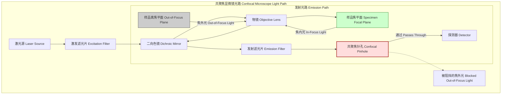
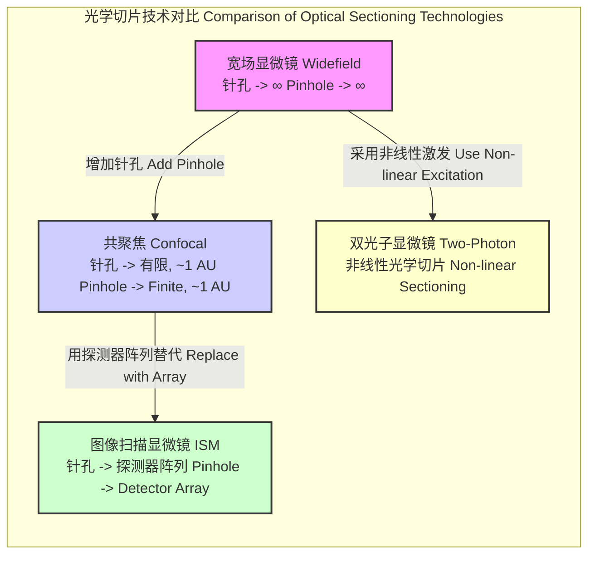

## 共聚焦针孔

### 核心概念与数学基础

共聚焦针孔是共聚焦扫描显微镜的核心部件，它赋予了显微镜标志性的光学切片能力。它是一个物理光阑，通常为圆形，放置在与物镜焦平面共轭的成像焦平面上。其主要功能是滤除来自非焦平面的光线，从而与传统的宽场显微镜相比，极大地提高了图像对比度和轴向分辨率。

**工作原理:**
在共聚焦显微镜中，一个点状光源（通常是激光）照亮样品中的一个点。来自该点的荧光发射或反射光被物镜收集并聚焦到探测器上。共聚焦针孔就放置在探测器的正前方。

*   **焦内光:** 从样品焦平面上的点发出的光，被精确地聚焦到针孔上，并穿过针孔到达探测器。
*   **焦外光:** 从焦平面上方或下方发出的光，其焦点会落在针孔的前方或后方。因此，光锥在到达针孔平面时已经变得很大，大部分焦外光会被针孔的物理边缘阻挡。

该过程如下图所示。



**数学基础:**

共聚焦针孔的性能可以通过点扩散函数（Point Spread Function, PSF）和艾里斑（Airy disk）的概念得到最好的理解。

**艾里斑与艾里单位 (AU):**
当一个点光源通过一个完美的、衍射受限的透镜成像时，得到的像不是一个点，而是一个被称为艾里斑的衍射图样。该图样的中心亮斑被称为艾里斑。其半径，在投影回物空间时，由下式给出：

$$ r_{\text{Airy}} = \frac{0.61 \lambda_{\text{em}}}{NA} $$

其中:
*   $r_{\text{Airy}}$ 是艾里斑在物空间中的半径（第一暗环处）。
*   $\lambda_{\text{em}}$ 是发射光的波长。
*   $NA$ 是物镜的数值孔径。

针孔的尺寸最常用**艾里单位（Airy Units, AU）**来表示。1 AU 大小的针孔，其直径等于艾里斑投影到针孔平面上的直径。投影到像平面的艾里斑直径为：

$$ D_{\text{Airy, image}} = M \times \frac{1.22 \lambda_{\text{em}}}{NA} $$

其中:
*   $M$ 是系统从物镜到针孔的总放大倍率。
*   因子 1.22 对应于直径 ($2 \times 0.61$)。

因此，以 AU 为单位的针孔尺寸定义为：

$$ \text{针孔尺寸 [AU]} = \frac{D_{\text{pinhole}}}{D_{\text{Airy, image}}} = \frac{D_{\text{pinhole}}}{M \times \frac{1.22 \lambda_{\text{em}}}{NA}} $$

其中 $D_{\text{pinhole}}$ 是针孔的物理直径。设置为 1 AU 是一个常见的折衷选择，它能阻挡大部分焦外光，同时允许大约 84% 的焦内光（艾里斑第一暗环内的能量）通过。

**光学切片与分辨率:**
针孔的主要作用是影响轴向（z轴）分辨率。整个系统的点扩散函数 $PSF_{\text{confocal}}$ 可以近似为照明PSF ($PSF_{\text{ill}}$) 和探测PSF ($PSF_{\text{det}}$) 的乘积。对于一个点状针孔，这可以简化为：

$$ I_{\text{confocal}}(x, y, z) \propto |h_{\text{ill}}(x, y, z)|^2 \cdot |h_{\text{det}}(x, y, z)|^2 \approx |h_{\text{point}}(x, y, z)|^4 $$

这是一个简化模型。更准确地说，探测PSF是理想探测PSF与针孔函数 $P(x,y)$ 的卷积：

$$ PSF_{\text{confocal}}(x, y, z) = PSF_{\text{ill}}(x, y, z) \cdot (PSF_{\text{det}}(x, y, z) \otimes P(x,y)) $$

其中 $\otimes$ 表示卷积。这个数学关系表明，针孔在探测光路中充当了一个空间滤波器。

轴向分辨率通常用轴向PSF的半峰全宽（Full Width at Half Maximum, FWHM）来量化，它强烈依赖于针孔的大小。当针孔尺寸趋近于零时，理论上的轴向分辨率为：

$$ \text{FWHM}_{\text{axial}} \approx \frac{0.88 \lambda_{\text{em}}}{n - \sqrt{n^2 - NA^2}} \approx \frac{1.4 n \lambda_{\text{em}}}{NA^2} \quad (\text{对于高NA值}) $$

其中:
*   $n$ 是浸没介质的折射率。

随着针孔尺寸的增大，轴向分辨率会变差，最终接近传统宽场显微镜的水平。

### 关键技术规格

| 参数 | 典型值/范围 | 单位 | 重要性 |
| :--- | :--- | :--- | :--- |
| 物理直径 | 20 - 600 | $\mu m$ | 决定通过光线的绝对数量。 |
| 艾里单位 (AU) 尺寸 | 0.5 - 5 (可调) | AU | 标准化尺寸；平衡分辨率和信号强度的关键。 |
| 材料 | 金属箔, 陶瓷 | - | 必须不透明、无反射且热稳定。 |
| 厚度 | 10 - 50 | $\mu m$ | 影响边缘的光传输（隧道效应）；应尽可能薄。 |
| 形状 | 圆形, 方形 | - | 圆形是标准选择，以匹配艾里斑的对称性。 |
| 调节机制 | 连续可变光阑, 固定尺寸滑块 | - | 提供灵活性（可变）或稳定性/可重复性（固定）。 |

### 常见用例

| 用例 | 针孔设置 (AU) | 关键性能指标 | 典型值 |
| :--- | :--- | :--- | :--- |
| 高分辨率三维成像 | 0.7 - 1.0 | 轴向分辨率 (FWHM) | 500 - 700 nm |
| 标准活细胞成像 | 1.0 - 1.5 | 信噪比 (SNR) | > 5, 以区分信号与背景 |
| 暗样品 / 高速成像 | > 1.5 | 光子计数率 | > 10^5 counts/sec |
| 荧光相关光谱 (FCS) | 0.5 - 0.8 | 共聚焦体积大小 | 0.1 - 0.5 fL (飞升) |

### 实现考量

**对准:**
将聚焦的激光光斑与针孔中心精确对准至关重要。未对准会导致信号急剧损失，并可能在最终图像中引入伪影，如阴影或畸变。这需要高精度的机械平台和稳健的对准程序。

**最佳针孔尺寸选择:**
针孔尺寸的选择是一个关键的实验参数，它涉及到分辨率和信号强度之间的权衡。以下流程图说明了决策过程。

```mermaid
graph TD
    subgraph "针孔尺寸优化流程 Pinhole Size Optimization Flowchart"
        A["开始: 定义实验目标 Start: Define Goal"] --> B["需要最高分辨率吗? Need max resolution?[";
        B -- "是 Yes" --> C["设置针孔为 0.7-1.0 AU Set pinhole to 0.7-1.0 AU"];
        C --> D["结果: 最佳光学切片, 但信号较弱, 可能需要更长的采集时间 Result: Best sectioning, weaker signal, may need longer acquisition"];
        B -- "否 No" --> E["样品是否暗淡或光敏感? Sample dim or photosensitive?[";
        E -- "是 Yes" --> F["设置针孔为 > 1.2 AU 例如 1.5-2.0 AU Set pinhole > 1.2 AU"];
        F --> G["结果: 信号增强, 光毒性降低, 但轴向分辨率下降 Result: More signal, less phototoxicity, worse axial resolution"];
        E -- "否 No" --> H["设置针孔为 1.0-1.2 AU 标准 Set pinhole to 1.0-1.2 AU standard"];
        H --> I["结果: 分辨率和信号之间的良好平衡 Result: Good balance of resolution and signal"];
        D --> End["结束 End"];
        G --> End["结束 End"];
        I --> End["结束 End"];
    end

    style C fill:#cde4ff
    style F fill:#ffcdd2
    style H fill:#dcedc8
```

**系统复杂度:**
在此背景下，“算法复杂度”转化为光机系统的复杂度。具有连续可变针孔的系统比具有固定针孔的系统更复杂，但灵活性更高。对准灵敏度很高，意味着微小的机械漂移都可能显著影响性能。从计算角度看，复杂度是 $O(1)$，但物理实现所需的精度在亚微米级别。

### 性能特征

**对分辨率的影响:**
*   **轴向分辨率:** 当针孔尺寸从大值减小时，轴向分辨率（FWHM）显著提高（值变小）。当针孔尺寸接近约 0.5 AU 时，这种改善趋于饱和，进一步缩小针孔对分辨率的增益微乎其微，但会急剧削减信号。
*   **横向分辨率:** 针孔对横向分辨率的影响较小，但通过滤除会使图像模糊的散射光，小针孔可以略微改善横向分辨率，使其优于理论衍射极限 $FWHM_{\text{lateral}} \approx \frac{0.51 \lambda_{\text{em}}}{NA}$。

**对信噪比 (SNR) 的影响:**
这种关系并非简单的线性关系。信号（$S$）是焦内PSF在针孔面积上的积分。噪声包括光子散粒噪声（$\sqrt{S_{total}}$）和探测器噪声（$\sigma_d$）。

$$ SNR = \frac{S_{\text{in-focus}}}{\sqrt{S_{\text{in-focus}} + S_{\text{out-of-focus}} + \sigma_d^2}} $$

减小针孔尺寸会同时降低 $S_{\text{in-focus}}$ 和 $S_{\text{out-of-focus}}$。最初，对大量 $S_{\text{out-of-focus}}$ 的滤除占主导地位，SNR 得到改善。然而，对于非常小的针孔（< 1 AU），$S_{\text{in-focus}}$ 的损失变得占主导地位，SNR 开始下降，尤其是在散粒噪声受限的情况下。因此，SNR 最佳的针孔尺寸通常略大于分辨率最佳的针孔尺寸。

**统计测量:**
性能指标应附带统计置信度。例如，测得的 550 nm 轴向 FWHM 应附带基于多次测量的标准差或置信区间（例如，550 ± 25 nm，95% C.I.），以反映系统的稳定性和测量精度。

### 相关技术与比较模型

通过与替代的光学切片技术进行比较，可以更好地理解共聚焦针孔。



**数学模型比较:**

*   **宽场显微镜 (无限大针孔):** 没有焦外光抑制。图像是三维物体与系统三维PSF卷积后在二维平面上的投影。
    $$ I_{\text{WF}}(x, y) = \int_{-\infty}^{\infty} O(x, y, z) \otimes PSF(x, y, z) dz $$
    其中 $O(x, y, z)$ 是物体函数。

*   **共聚焦显微镜 (有限尺寸针孔):** 提供光学切片。有效PSF被锐化。
    $$ PSF_{\text{confocal}} \approx (PSF_{\text{point}})^2 \quad (\text{对于理想针孔}) $$
    PSF的这种“平方效应”是分辨率增强和光学切片能力的关键。

*   **图像扫描显微镜 (ISM) / Airyscan:** 用探测器阵列取代单个针孔。每个探测器单元都像一个微小的、有位移的针孔。利用所有单元的信息重建出更高分辨率的图像。理论上，分辨率比标准共聚焦提高 $\sqrt{2}$ 倍。
    $$ PSF_{\text{ISM}} \approx PSF_{\text{ill}} \cdot (\sum_i \delta(\mathbf{r}-\mathbf{r}_i/M) \otimes PSF_{\text{det}}) $$
    最终图像通过将来自位置为 $\mathbf{r}_i$ 的每个探测器单元 $i$ 的部分图像移动一个因子 $1/M$ 并求和来重建。

*   **双光子显微镜:** 无需针孔即可实现光学切片。由于需要近乎同时吸收两个光子，激发是非线性的，并且被限制在焦体积内。激发概率与激光强度的平方（$I^2$）成正比，自然地产生了一个局域化的激发PSF。这是一种实现光学切片的完全不同的物理原理。

### 参考文献

1.  Wilson, T., & Sheppard, C. J. R. (1984). *Theory and practice of scanning optical microscopy*. Academic Press. (这是该领域的基础性著作).
2.  Pawley, J. B. (Ed.). (2006). *Handbook of biological confocal microscopy*. Springer Science & Business Media. DOI: [10.1007/978-0-387-45524-2](https://doi.org/10.1007/978-0-387-45524-2)
3.  Jonkman, J., & Brown, C. M. (2015). Any way you slice it—a guide to practical confocal microscopy. *Journal of Cell Science*, 128(24), 4439-4442. DOI: [10.1242/jcs.175955](https://doi.org/10.1242/jcs.175955)
4.  Sheppard, C. J. R., & Mehta, S. B. (2020). Image scanning microscopy. *Applied Optics*, 59(13), D1-D15. DOI: [10.1364/AO.386873](https://doi.org/10.1364/AO.386873)