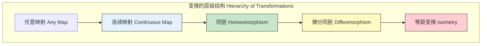
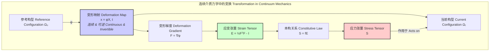

## 连续变换 (Continuous Transformation)

连续变换，在数学和科学领域，是一个基础且强大的概念。其核心思想是描述一种“平滑”或“无断裂”的映射过程，其中空间中的点在变换后，其邻近关系得以保持。本文档将从数学的严谨性出发，深入探讨连续变换的定义、性质、应用及其相关的技术细节。

### 核心概念详解

从最直观的角度看，一个连续变换不会将一个连通的对象“撕裂”成多个部分，也不会将原本分离的点“粘合”在一起。这种直观理解在数学中有多种精确的定义，其普适性与严谨性随数学框架的抽象程度而递增。

#### 1. 拓扑学定义 (Topological Definition)

最普适的定义来自于拓扑学，它不依赖于距离或度量的概念。

一个函数 $f: X \to Y$，其中 $(X, \mathcal{T}_X)$ 和 $(Y, \mathcal{T}_Y)$ 是两个拓扑空间，被称为**连续的**，如果对于 $Y$ 中的任意开集 $V \in \mathcal{T}_Y$，其在 $f$ 下的原像 (preimage) $f^{-1}(V)$ 是 $X$ 中的一个开集，即 $f^{-1}(V) \in \mathcal{T}_X$。

$$ f \text{ is continuous} \iff \forall V \in \mathcal{T}_Y, f^{-1}(V) = \{x \in X \mid f(x) \in V\} \in \mathcal{T}_X $$

-   **$X, Y$**: 集合。
-   **$\mathcal{T}_X, \mathcal{T}_Y$**: 分别为集合 $X$ 和 $Y$ 上定义的拓扑（即开集的集合）。
-   **$f^{-1}(V)$**: $V$ 的原像，即 $X$ 中所有被 $f$ 映射到 $V$ 中的点的集合。

这个定义优雅地捕捉了连续性的本质：保持“开放性”，从而保持点的邻域结构。

#### 2. 度量空间定义 (Metric Space Definition: $\epsilon-\delta$)

在更为具体的度量空间中，我们可以使用大家所熟知的 $\epsilon-\delta$ 语言来定义连续性。

一个函数 $f: X \to Y$，其中 $(X, d_X)$ 和 $(Y, d_Y)$ 是两个度量空间，被称为在点 $c \in X$ **连续的**，如果对于任意给定的 $\epsilon > 0$，都存在一个 $\delta > 0$，使得对于所有 $x \in X$，只要 $d_X(x, c) < \delta$，就有 $d_Y(f(x), f(c)) < \epsilon$。

$$ \forall c \in X, \forall \epsilon > 0, \exists \delta > 0 \text{ such that } \forall x \in X, (d_X(x, c) < \delta \implies d_Y(f(x), f(c)) < \epsilon) $$

-   **$d_X, d_Y$**: 分别为空间 $X$ 和 $Y$ 上的度量函数（距离函数）。
-   **$\epsilon$ (Epsilon)**: 输出空间中允许的误差或邻域半径。
-   **$\delta$ (Delta)**: 输入空间中为满足 $\epsilon$ 误差所需的邻域半径。

如果函数 $f$ 在其定义域 $X$ 中的每一点都连续，则称 $f$ 是一个**连续函数**或**连续变换**。

#### 3. 关键性质
连续变换具有一些极其重要的性质，这些性质是其在各个领域广泛应用的基础。
-   **复合性**: 两个连续变换的复合仍然是连续的。如果 $f: X \to Y$ 和 $g: Y \to Z$ 都是连续的，则复合函数 $g \circ f: X \to Z$ 也是连续的。
-   **紧致性保持**: 紧致集在连续变换下的像仍然是紧致的。这是极值定理（即连续函数在紧致集上必能取到最大值和最小值）的拓扑学推广。
-   **连通性保持**: 连通集在连续变换下的像仍然是连通的。这是介值定理的拓扑学推广。
-   **同胚 (Homeomorphism)**: 一种特殊的连续变换。如果一个函数 $f: X \to Y$ 是双射（即一一对应），且 $f$ 和其逆函数 $f^{-1}$ 都是连续的，则称 $f$ 是一个**同胚**。同胚在拓扑上连接了两个空间，意味着它们具有完全相同的拓扑性质（例如，一个咖啡杯和一个甜甜圈在拓扑上是同胚的）。

### 关键技术规格

我们可以将连续变换的不同“强度”或“类型”视为其技术规格。这些规格定义了变换的平滑程度和行为。

| 属性 (Property) | 数学规约 (Mathematical Specification) | 蕴涵/应用 (Implication/Application) |
| :--- | :--- | :--- |
| **连续性 (Continuity)** | $\forall \epsilon > 0, \exists \delta > 0 \text{ s.t. } d(x,c)<\delta \Rightarrow d(f(x),f(c))<\epsilon$ | 保持极限和局部邻域结构，是分析的基础。 |
| **一致连续性 (Uniform Continuity)** | $\forall \epsilon > 0, \exists \delta > 0 \text{ s.t. } \forall x,y \in X, d(x,y)<\delta \Rightarrow d(f(x),f(y))<\epsilon$ | $\delta$ 的选择与点无关，对整个定义域一致有效。在数值积分和微分方程求解中至关重要。 |
| **利普希茨连续性 (Lipschitz Continuity)** | $\exists K \ge 0 \text{ s.t. } d(f(x),f(y)) \le K \cdot d(x,y)$ | 变换的“拉伸”程度有界，由利普希茨常数 $K$ 控制。保证了微分方程解的存在性和唯一性。 |
| **可微性 ($C^1$-Smoothness)** | 导数 $f'$ 存在且连续。 | 允许使用线性函数（切线或切平面）进行局部逼近，是牛顿法和梯度下降等优化算法的基础。 |
| **同胚 (Homeomorphism)** | $f$ 是连续双射，且 $f^{-1}$ 也连续。 | 拓扑等价，保持所有拓扑性质（如孔洞数量）。 |
| **微分同胚 (Diffeomorphism)** | $f$ 是同胚，且 $f$ 和 $f^{-1}$ 都是光滑的（无限可微）。 | 保持拓扑结构和微分结构，是微分几何和流形理论的核心。 |

### 常见用例

连续变换是描述物理世界和抽象系统的通用语言。

| 应用领域 | 用例描述 | 定量性能度量 |
| :--- | :--- | :--- |
| **连续介质力学** | **变形映射** $\phi: \Omega_0 \to \Omega_t$ 将物体从未变形的参考构型 $\Omega_0$ 映射到当前构型 $\Omega_t$。连续性保证了物质的完整性。 | **应变张量**: 例如，格林-拉格朗日应变张量 $E = \frac{1}{2}(F^T F - I)$，其中 $F=\nabla\phi$。钢材的典型弹性应变值 < 0.002 (0.2%)。 |
| **动力系统** | **流映射** $\Phi_t(x_0)$ 描述了由常微分方程 $\dot{x} = f(x,t)$ 定义的系统状态随时间 $t$ 的演化。流映射是初始条件 $x_0$ 的连续变换。 | **李雅普诺夫指数 ($\lambda$)**: 衡量相邻轨道分离或汇合的平均速率。对于洛伦兹吸引子，最大指数 $\lambda \approx 0.906$，表示混沌行为。 |
| **计算机图形学** | **纹理映射**，将2D纹理图像连续地“粘贴”到3D模型表面。**形状渐变 (Morphing)**，在两个或多个形状之间创建平滑的过渡动画。 | **畸变能量 (Distortion Energy)**: 衡量映射对面积或角度的改变程度。一个好的映射应使畸变能量最小化，例如保角映射的畸变能量接近于0。 |
| **广义相对论** | **坐标变换**。时空被建模为四维洛伦兹流形，不同观测者使用的坐标系之间的变换是微分同胚，保证了物理定律的协变性。 | **度规张量 ($g_{\mu\nu}$)**: 在弱引力场下，$g_{\mu\nu} \approx \eta_{\mu\nu} + h_{\mu\nu}$，其中 $\eta_{\mu\nu}$ 是闵可夫斯基度规，扰动 $|h_{\mu\nu}| \ll 1$。 |

### 实现考量

在计算机上处理连续变换需要将其离散化，这引入了算法和数值稳定性的问题。

-   **表示方法**:
    *   **网格/格点**: 在定义域上使用有限的采样点（例如，图像像素、有限元网格）来存储函数值。
    *   **基函数展开**: 将函数表示为一组已知基函数（如多项式、B样条、傅里叶级数）的线性组合。例如，一个三次B样条曲线由一系列控制点定义。

-   **算法复杂度**:
    *   **函数求值**: 对于一个 $N$ 阶多项式，使用霍纳法则求值的复杂度为 $O(N)$。对于一个由 $M$ 个控制点定义的B样条曲线，求值复杂度为 $O(k^2)$，其中 $k$ 是样条的阶数。
    *   **连续性检验**: 在数值上无法绝对证明连续性，但可以检验函数值是否存在大于阈值的“跳跃”。对于一个有 $N$ 个采样点的函数，这需要 $O(N)$ 的时间。
    - **变换复合**: 复合两个基于基函数的变换可能非常复杂。例如，复合两个次数分别为 $N$ 和 $M$ 的多项式，会得到一个次数为 $N \times M$ 的新多项式。

-   **数值稳定性**:
    *   浮点运算会引入舍入误差。一个具有较小利普希茨常数 $K$ 的变换对输入误差不敏感，数值上更稳定。
    *   在迭代计算中（如模拟物理过程），误差会逐时间步累积。选择保持体积或能量等不变量的数值积分方案（辛积分器）至关重要。

### 性能特征

变换的“性能”通常指其在特定应用中保持期望性质或引入不期望畸变的程度。

-   **畸变度量 (Distortion Measurement)**:
    *   **雅可比矩阵 (Jacobian Matrix)**: $J(f)$ 是一个变换的局部线性逼近。其行列式 $|J(f)|$ 衡量了局部体积的变化。
        *   $|J(f)| = 1$: 保体积变换。
        *   $|J(f)| > 0$: 保持局部朝向。
        *   $J(f)^T J(f) = I$: 等距变换（刚性运动），保持距离和角度。
    *   **统计度量**: 在整个定义域上计算雅可比行列式的均值和方差。例如，一个高质量的准共形映射（quasiconformal map）应具有接近于0的 $\text{Var}(|J(f)|)$。95%置信区间可以用来评估畸变的分布范围。

-   **收敛速率 (Convergence Rate)**:
    *   在依赖连续变换的迭代算法中（如定点迭代 $x_{k+1} = f(x_k)$），收敛到解的速度是关键性能指标。
    *   **线性收敛**: 如果 $|f'(x^*)| \in (0, 1)$，其中 $x^*$ 是不动点。
    *   **二次收敛**: 如果 $f'(x^*) = 0$ 且 $f''(x^*) \ne 0$。牛顿法在良好条件下具有二次收敛性，这使其在数值求解中非常高效。

### 相关技术与比较

连续变换是一大类函数中的一个子集。理解其与其他变换类型的关系有助于选择正确的数学工具。

-   **连续变换 vs. 可微变换**:
    *   **模型**: 连续但不可微的典型例子是绝对值函数 $f(x) = |x|$，它在 $x=0$ 处连续但不可导。魏尔斯特拉斯函数则是一个处处连续但处处不可导的极端例子。
    *   **区别**: 可微性是一个更强的条件，它不仅要求函数图像没有断点，还要求其足够“平滑”以至于在每一点都存在唯一的切线。

-   **线性变换 (Linear Transformation)**:
    *   **模型**: $f(\mathbf{v}) = \mathbf{A}\mathbf{v}$，其中 $\mathbf{A}$ 是一个矩阵。
    *   **性质**: 保持向量加法和标量乘法。在有限维空间中，所有线性变换都是利普希茨连续的，因此也是连续的。它们是许多复杂变换的局部逼近基础。

-   **仿射变换 (Affine Transformation)**:
    *   **模型**: $f(\mathbf{v}) = \mathbf{A}\mathbf{v} + \mathbf{b}$，即一个线性变换加上一个平移。
    *   **性质**: 保持直线性、平行性和共线点间的距离比。在计算机图形学中用于实现旋转、缩放、剪切和平移。

-   **投影变换 (Projective Transformation)**:
    *   **模型**: 在齐次坐标下，$\mathbf{y}' = \mathbf{P}\mathbf{x}'$，其中 $\mathbf{P}$ 是一个可逆的 $(n+1) \times (n+1)$ 矩阵。
    *   **性质**: 最一般的保持直线的变换。平行线在投影变换下可能不再平行（例如，汇聚到灭点）。这是计算机视觉中相机成像的数学模型。

下面的图表展示了连续变换在连续介质力学中的核心作用。

### 参考文献

1.  Munkres, J. R. (2000). *Topology* (2nd ed.). Prentice Hall. (这是拓扑学领域的经典教材，详细介绍了连续性的严格定义。)
2.  Strogatz, S. H. (2018). *Nonlinear Dynamics and Chaos: With Applications to Physics, Biology, Chemistry, and Engineering*. CRC Press. DOI: [10.1201/9780429492563](https://doi.org/10.1201/9780429492563) (该书深入探讨了动力系统中的连续变换，即流。)
3.  Malvern, L. E. (1969). *Introduction to the Mechanics of a Continuous Medium*. Prentice-Hall. (连续介质力学的经典著作，以变形映射作为理论起点。)
4.  Press, W. H., Teukolsky, S. A., Vetterling, W. T., & Flannery, B. P. (2007). *Numerical Recipes: The Art of Scientific Computing* (3rd ed.). Cambridge University Press. (提供了大量关于如何在计算机上实现和处理数学变换的实用算法。)