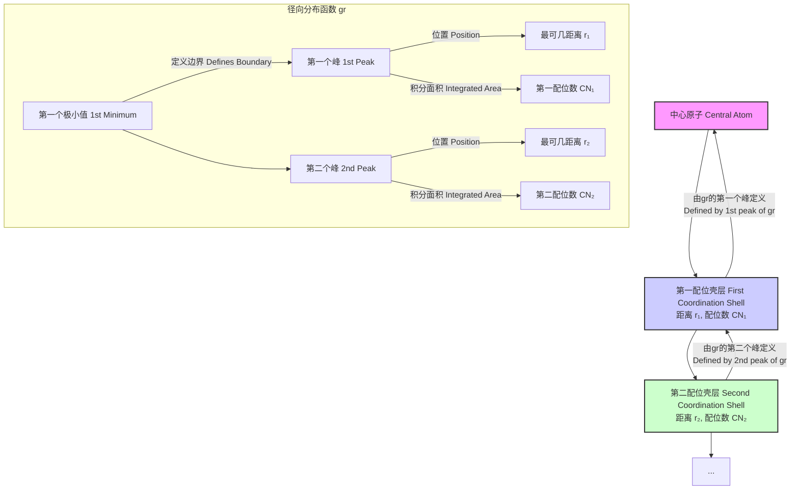
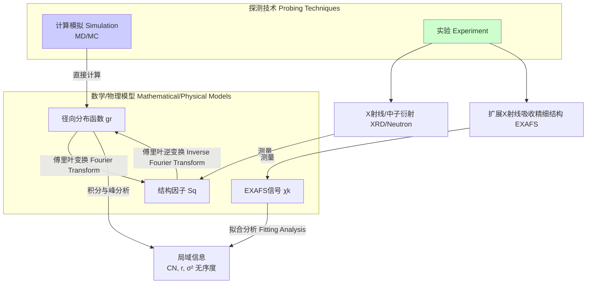

## 配位壳层

配位壳层（Coordination Shell）是化学、物理学和材料科学中的一个基本概念，用于描述在原子或分子尺度上，一个中心原子或离子周围的邻近原子、离子或分子的空间排布。这个概念对于理解液体、非晶固体和晶体材料的结构、性质以及化学反应机理至关重要。第一配位壳层由与中心原子直接成键或最邻近的粒子组成，其后的第二、第三配位壳层则依次由更远的粒子构成。

### 核心概念与数学基础

描述配位壳层结构的核心数学工具是**径向分布函数 (Radial Distribution Function, RDF)**，通常表示为 $g(r)$。它描述了以一个粒子为中心，在距离 $r$ 处找到另一个粒子的概率密度，并与系统的平均密度进行比较。

#### 径向分布函数 (RDF), $g(r)$

$g(r)$ 的值表示在距离中心粒子 $r$ 处，局部粒子数密度 $\rho(r)$ 与系统宏观平均粒子数密度 $\rho_0$ 的比值。

$$
g(r) = \frac{\rho(r)}{\rho_0}
$$

- 当 $r \to \infty$ 时，$g(r) \to 1$，表示在远距离处，粒子分布趋于均匀，局部密度等于平均密度。
- 当 $g(r) > 1$ 时，表示在距离 $r$ 处找到粒子的概率大于随机分布的概率，通常对应于一个有序的配位壳层。$g(r)$ 的峰位对应于最可几的配位距离。
- 当 $g(r) < 1$ 时，（尤其是在 $r$ 很小时 $g(r) \to 0$），表示由于粒子间的排斥作用（如泡利不相容原理），在该距离处找到另一个粒子的概率很低。

在由 $N$ 个粒子组成的体积为 $V$ 的系统中，其形式化定义为：
$$
g(r) = \frac{V}{4\pi r^2 N^2} \left\langle \sum_{i=1}^N \sum_{j \ne i}^N \delta(r - |\vec{r}_i - \vec{r}_j|) \right\rangle
$$
其中：
- $\langle \dots \rangle$ 表示系综平均（或在分子动力学模拟中的时间平均）。
- $\vec{r}_i$ 和 $\vec{r}_j$ 是粒子 $i$ 和 $j$ 的位置矢量。
- $\delta(x)$ 是狄拉克 $\delta$ 函数。
- $4\pi r^2$ 是半径为 $r$ 的球壳表面积。

#### 配位数 (Coordination Number, CN)

配位数是指在特定配位壳层内的粒子总数。第一配位数通常定义为从 $r=0$ 到 $g(r)$ 的第一个极小值 $r_{min}$ 之间的积分。
$$
CN(R) = 4\pi \rho_0 \int_0^R r^2 g(r) dr
$$
其中：
- $CN(R)$ 是半径为 $R$ 的球体内包含的平均粒子数。
- $\rho_0 = N/V$ 是系统的平均数密度。
- $R$ 是积分上限，通常取为 $g(r)$ 的第一个极小值位置，以计算第一配位数。



### 关键技术参数

下表列出了一些典型材料中通过实验或模拟确定的第一配位壳层参数。

| 材料系统 (System) | 状态 (State) | 中心原子 (Central Atom) | 第一配位距离 $r_1$ (Å) | 第一配位数 $CN_1$ | 数据来源 (Source) |
| :--- | :--- | :--- | :--- | :--- | :--- |
| 液氩 (Liquid Argon) | 85 K, 1 atm | Ar | 3.75 ± 0.05 | ~12 | 模拟/衍射 |
| 水 (Water, H₂O) | 298 K, 1 atm | O | 2.80 ± 0.05 (O-O) | 4.4 ± 0.2 | X射线衍射 |
| 铜 (Copper, Cu) | 晶体 (Crystal) | Cu | 2.556 | 12 (精确) | 晶体学 |
| 铜 (Copper, Cu) | 液体 (Liquid, 1423 K) | Cu | 2.52 ± 0.03 | 11.3 ± 0.5 | 中子衍射 |
| 氯化钠 (NaCl) | 晶体 (Crystal) | Na⁺ | 2.82 | 6 (Cl⁻) | 晶体学 |
| 二氧化硅 (a-SiO₂) | 非晶 (Amorphous) | Si | 1.61 ± 0.02 (Si-O) | 4.0 ± 0.1 | 中子衍射 |

### 常见用例与量化性能指标

| 用例 (Use Case) | 描述 (Description) | 量化性能指标 (Quantitative Performance Metrics) |
| :--- | :--- | :--- |
| **液体结构分析** | 确定液体（如水、液态金属）的短程有序结构。 | - $g(r)$ 峰位和峰高：指示平均键长和有序度。<br>- $g(r)$ 峰宽 (FWHM)：指示距离分布的离散程度，越宽表示越无序。<br>- 配位数及其分布 $P(CN)$。 |
| **非晶材料表征** | 研究金属玻璃、非晶半导体等的原子排布，区分不同的非晶结构模型。 | - 与对应晶体的 $g(r)$ 对比：非晶的峰更宽、更高阶的峰被抑制。<br>- 第一、第二配位数的比值，用于验证二十面体等局域结构模型。 |
| **溶剂化效应** | 分析溶液中溶质离子周围的溶剂分子排布（溶剂化壳层）。 | - 溶剂化数（特定配位数）：例如，水溶液中 $Na^+$ 的第一水合壳层有约 5-6 个水分子。<br>- 溶剂分子的取向分布。 |
| **晶体缺陷研究** | 探测晶格中空位、间隙原子或杂质原子周围的局域结构弛豫。 | - 缺陷周围 $g(r)$ 的变化：峰位移动表示键长变化，峰高降低表示有序度下降。<br>- CN的变化：空位导致周围原子的CN降低。 |

### 实现考量与算法复杂度

在计算机模拟（如分子动力学MD或蒙特卡洛MC）中计算 $g(r)$ 是分析配位壳层的标准步骤。

#### 算法流程

```mermaid
graph TD
    A["输入: N个原子的坐标 rᵢ 来自MD/MC"] --> B["循环遍历所有原子对 i, j[";
    B -- "优化: 使用Verlet列表或单元列表" --> B_opt["仅遍历邻近原子对"];
    B --> C["计算距离 r = |rᵢ - rⱼ|"];
    C --> D["将距离r分配到预设的直方图格点中<br>histogram[k]++, 其中 k = floorr / Δr"];
    D -- "完成所有对的计算后" --> E["对直方图进行归一化"];
    E --> F["grₖ = Nrₖ / 4πrₖ²Δr ρ₀ N_pairs"];
    F --> G["输出: 径向分布函数 gr"];

    style A fill:#lightblue
    style G fill:#lightgreen
```

#### 算法复杂度分析

- **朴素算法 (Naive Algorithm)**:
  - 遍历所有原子对需要计算 $N(N-1)/2$ 个距离。
  - 复杂度为 $O(N^2)$。对于大规模系统（$N > 10^4$），该算法计算成本过高。

- **优化算法 (Optimized Algorithm)**:
  - **单元列表 (Cell Lists)**: 将模拟盒子划分为边长不小于截断半径 $r_c$ 的网格单元。计算一个原子的相互作用时，只需考虑其所在单元及相邻单元内的其他原子。
  - **Verlet 列表 (Verlet Lists)**: 为每个原子 $i$ 创建一个列表，包含所有与它距离小于 $r_c + \delta$ 的原子 $j$。该列表在多个时间步内可以复用。
  - 这两种方法的平均复杂度均为 $O(N)$，因为每个原子仅需与常数数量的邻近原子进行计算。这是进行大规模模拟的必要优化。

### 性能特征与统计度量

由于热运动和系统的动态性，配位壳层参数具有统计性质。

- **配位数分布 $P(CN)$**: 在液体和非晶中，配位数不是一个固定的整数，而是一个分布。$P(CN)$ 的均值是平均配位数，其方差 $\sigma^2_{CN}$ 反映了配位环境的多样性。
- **峰宽 (Peak Width)**: $g(r)$ 峰的半峰全宽 (FWHM) 是衡量结构无序度的直接指标。在晶体中，热振动导致峰具有一定宽度；在液体和非晶中，静态无序使得峰宽显著增加。
- **统计不确定性**: 在模拟中，$g(r)$ 是通过对有限时间和有限尺寸的系统进行平均得到的。其统计误差可以通过**块平均法 (Block Averaging)** 进行估计，从而为 $g(r)$ 曲线和计算出的CN提供置信区间（例如，95% CI）。一个典型的模拟结果可能会报告 $CN_1 = 11.3 \pm 0.2$。

### 相关技术与比较数学模型

配位壳层结构不仅可以通过模拟计算，还可以通过多种实验技术进行探测。



#### 1. X射线与中子衍射 (X-ray and Neutron Diffraction)

衍射实验测量的是倒易空间中的**结构因子 $S(q)$**，其中 $q$ 是波矢传递的大小。$S(q)$ 与 $g(r)$ 通过傅里叶变换相关联：
$$
S(q) = 1 + 4\pi \rho_0 \int_0^\infty [g(r) - 1] \frac{\sin(qr)}{qr} r^2 dr
$$
- **$q$**: 散射矢量的大小, $q = \frac{4\pi}{\lambda} \sin(\theta)$, 其中 $\lambda$ 是入射波长, $2\theta$ 是散射角。
- 通过对实验测得的 $S(q)$ 进行傅里叶逆变换，可以得到实空间中的 $g(r)$。

#### 2. 扩展X射线吸收精细结构 (EXAFS)

EXAFS是一种元素选择性的技术，能够探测特定吸收原子周围的局域原子环境（通常到约5-6 Å）。其信号 $\chi(k)$ 可由以下方程描述：
$$
\chi(k) = \sum_j \frac{N_j S_0^2}{k R_j^2} |f_j(k, \pi)| e^{-2k^2\sigma_j^2} e^{-2R_j/\lambda(k)} \sin[2kR_j + \delta_j(k)]
$$
- **$k$**: 光电子的波矢。
- **$j$**: 标识不同的配位壳层。
- **$N_j$**: 第 $j$ 壳层的配位数。
- **$R_j$**: 第 $j$ 壳层的平均配位距离。
- **$\sigma_j^2$**: Debye-Waller因子，表示距离分布的均方根偏差（静态和动态无序）。
- **$S_0^2$**: 振幅修正因子。
- **$f_j(k, \pi)$**: 背散射振幅。
- **$\lambda(k)$**: 电子非弹性平均自由程。
- **$\delta_j(k)$**: 相移。

通过拟合实验测得的 $\chi(k)$ 谱，可以精确提取出中心原子周围几个配位壳层的 $N_j$, $R_j$, 和 $\sigma_j^2$ 等参数。与衍射相比，EXAFS对局域结构更敏感，但探测距离较短。

### ## References

1.  Rahman, A. (1964). Correlations in the Motion of Atoms in Liquid Argon. *Physical Review*, 136(2A), A405–A411. DOI: `10.1103/PhysRev.136.A405`
2.  Allen, M. P., & Tildesley, D. J. (1989). *Computer Simulation of Liquids*. Oxford University Press. (A foundational textbook on molecular simulation that extensively covers the calculation and interpretation of RDFs).
3.  Rehr, J. J., & Albers, R. C. (2000). Theoretical approaches to x-ray absorption fine structure. *Reviews of Modern Physics*, 72(3), 621–654. DOI: `10.1103/RevModPhys.72.621`
4.  Waseda, Y. (1980). *The Structure of Non-Crystalline Materials: Liquids and Amorphous Solids*. McGraw-Hill. (A classic text on using diffraction to study disordered materials).