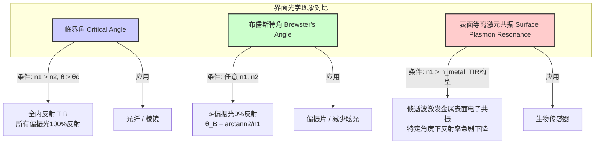

## 临界角

临界角（critical angle）是光学中的一个基本概念，描述了当光从光密介质（折射率较高的介质）传播到光疏介质（折射率较低的介质）时，发生全内反射（Total Internal Reflection, TIR）的最小入射角。当入射角大于临界角时，光线将不再发生折射，而是全部被反射回第一介质。这一现象是许多光学仪器和技术的核心原理。

### 核心概念与数学基础

临界角的物理基础是斯涅尔定律（Snell's Law），该定律描述了光在两种不同介质界面上的折射行为。

#### 斯涅尔定律

斯涅尔定律的数学表达式为：
$$ n_1 \sin(\theta_1) = n_2 \sin(\theta_2) $$
其中：
*   $n_1$ 是光线起始介质的折射率。
*   $\theta_1$ 是入射角，即入射光线与界面法线之间的夹角。
*   $n_2$ 是光线进入介质的折射率。
*   $\theta_2$ 是折射角，即折射光线与界面法线之间的夹角。

#### 临界角的推导

临界角现象仅在光从光密介质向光疏介质传播时发生，即 $n_1 > n_2$。在这种情况下，随着入射角 $\theta_1$ 的增大，折射角 $\theta_2$ 也会增大，且 $\theta_2 > \theta_1$。当折射角 $\theta_2$ 达到其最大可能值 $90^\circ$ 时（即折射光线沿着界面传播），此时的入射角被称为临界角，记为 $\theta_c$。

将 $\theta_1 = \theta_c$ 和 $\theta_2 = 90^\circ$ 代入斯涅尔定律：
$$ n_1 \sin(\theta_c) = n_2 \sin(90^\circ) $$
由于 $\sin(90^\circ) = 1$，我们得到：
$$ n_1 \sin(\theta_c) = n_2 $$
因此，临界角的计算公式为：
$$ \theta_c = \arcsin\left(\frac{n_2}{n_1}\right) $$
从这个公式可以看出，只有当 $n_1 > n_2$ 时，$\frac{n_2}{n_1} < 1$，$\arcsin$ 函数才有实数解，这与临界角存在的物理条件一致。

#### 全内反射 (TIR)

当入射角 $\theta_1$ 满足以下条件时，会发生全内反射：
$$ \theta_1 > \theta_c $$
此时，没有光线折射进入第二介质，所有入射光的能量几乎100%被反射回第一介质。

```mermaid
graph TD
    subgraph "光线行为与入射角的关系 n1 > n2"
        A[入射光线] --> B入射角 θ1;
        B -- "θ1 < θc" --> C[部分反射和部分折射];
        B -- "θ1 = θc" --> D["临界角: 折射角 θ2 = 90°"];
        B -- "θ1 > θc" --> E[全内反射 TIR];
        
        C --> C1[反射光];
        C --> C2[折射光];
        D --> D1[反射光];
        D --> D2[沿界面传播的光];
        E --> E1[全反射光];
    end

    style E fill:#ccffcc,stroke:#006600,stroke-width:2px
    style D fill:#ffcccc,stroke:#990000,stroke-width:2px
```

### 关键技术规格

不同材料组合的临界角是其光学特性的重要指标。下表列出了一些常见材料界面在标准波长（钠D线，589.3 nm）下的临界角。

| 介质 1 (光密) | 折射率 ($n_1$) | 介质 2 (光疏) | 折射率 ($n_2$) | 折射率比 ($n_2/n_1$) | 临界角 ($\theta_c$) |
| :--- | :---: | :--- | :---: | :---: | :---: |
| 水 | 1.333 | 空气 | 1.0003 | 0.750 | 48.75° |
| 冕牌玻璃 (Crown Glass) | 1.52 | 空气 | 1.0003 | 0.658 | 41.14° |
| 燧石玻璃 (Flint Glass) | 1.66 | 水 | 1.333 | 0.803 | 53.41° |
| 蓝宝石 | 1.77 | 空气 | 1.0003 | 0.565 | 34.42° |
| 钻石 | 2.417 | 空气 | 1.0003 | 0.414 | 24.42° |

*注：折射率是无量纲的。空气的折射率在标准状况下约等于1.0003。*

### 常见用例与性能指标

临界角和全内反射是众多光学技术的基础。

*   **光纤通信 (Optical Fibers)**
    *   **原理**: 光纤由高折射率的纤芯（core）和低折射率的包层（cladding）构成。光信号以大于临界角的角度在纤芯内传播，通过连续的全内反射被约束在纤芯中，实现长距离高效传输。
    *   **性能指标**:
        *   **数值孔径 (Numerical Aperture, NA)**: 衡量光纤接收光的能力，与临界角直接相关。$NA = \sqrt{n_{core}^2 - n_{cladding}^2}$。典型的单模光纤NA约为0.14。
        *   **传输损耗**: 由于TIR的反射率接近100%，光纤的主要损耗来自材料吸收和瑞利散射。现代石英光纤在1550 nm波长的损耗可低于 0.2 dB/km。

*   **双筒望远镜和潜望镜中的棱镜**
    *   **原理**: 使用普罗棱镜（Porro prism）或屋脊棱镜（roof prism）通过全内反射来改变光路方向和校正图像。
    *   **性能指标**:
        *   **反射率**: TIR的反射率理论上为100%，远高于金属镀膜反射镜（如银膜约为95-98%），从而提供更明亮、对比度更高的图像。

*   **钻石切割**
    *   **原理**: 钻石具有极高的折射率（~2.42），导致其与空气的临界角非常小（~24.4°）。精密的切割工艺（如明亮式切割）旨在让进入钻石的光在内部经历多次全内反射，最终从顶部（台面）射出，产生强烈的色散和“火彩”（brilliance and fire）。

### 实现考量与算法分析

在计算光学和物理仿真（如光线追踪）中，正确实现临界角和TIR的判断至关重要。

#### 光线追踪中的TIR算法

对于一个与介质界面相交的光线，其处理逻辑如下：

1.  **获取介质信息**: 确定入射介质折射率 $n_1$ 和出射介质折射率 $n_2$。
2.  **检查TIR条件**: 判断是否 $n_1 > n_2$。如果不是，则不可能发生TIR，直接计算折射和反射。
3.  **计算入射角**: 计算入射光线方向向量 $\vec{d}$ 和界面法向量 $\vec{N}$。入射角 $\theta_1$ 可由点积得到：$\cos(\theta_1) = -\vec{d} \cdot \vec{N}$。
4.  **计算临界角**: $\theta_c = \arcsin(n_2/n_1)$。
5.  **逻辑判断**:
    *   如果 $\theta_1 > \theta_c$，则发生全内反射。计算反射光线的方向并继续追踪。
    *   如果 $\theta_1 \le \theta_c$，则光线同时发生反射和折射。使用菲涅尔方程（Fresnel Equations）计算反射和折射光线的能量比例，并分别追踪两条光线。

#### 算法复杂度

*   对于单条光线与单个平面的交互，上述判断逻辑的计算复杂度为 $O(1)$，因为它只涉及几次三角函数和代数运算。
*   在一个包含 $N$ 个物体和 $R$ 条初始光线的复杂场景中，总复杂度取决于光线-物体相交测试的效率。使用空间加速结构（如BVH或k-d树）可以将平均复杂度优化到 $O(R \log N)$。

### 性能特征与统计度量

全内反射并非一个理想的瞬时现象，其性能特征涉及一些细微的物理效应。

*   **反射率**: 在理想情况下，当 $\theta_1 > \theta_c$ 时，反射率 $R=1$。在实际应用中，由于表面微观粗糙度或材料内部的微量吸收，反射率会略低于100%，但通常 > 99.9%。

*   **倏逝波 (Evanescent Wave)**: 即使在TIR条件下，电磁场也会穿透到第二介质（光疏介质）一个非常短的距离，形成倏逝波。该波的振幅随离界面距离的增加而呈指数衰减，并且不向外传播能量。其穿透深度 $d_p$ 定义为振幅衰减到 $1/e$ 时的距离：
    $$ d_p = \frac{\lambda_0}{2\pi \sqrt{n_1^2 \sin^2\theta_1 - n_2^2}} $$
    其中 $\lambda_0$ 是光在真空中的波长。倏逝波是全反射衰减（ATR）光谱学和全内反射荧光显微镜（TIRF）等技术的基础。

*   **古斯-汉欣位移 (Goos-Hänchen Shift)**: 在TIR中，反射光束的实际出射点会相对于几何光学的预测点有一个微小的横向位移，这个位移称为古斯-汉欣位移。该位移大小与光的波长相当，并依赖于偏振态。
    *   对于s-偏振（电场垂直于入射面）: $\delta_s = \frac{\lambda_0}{2\pi} \frac{1}{\sqrt{n_1^2 \sin^2\theta_1 - n_2^2}}$
    *   对于p-偏振（电场平行于入射面）: $\delta_p = \delta_s \cdot \frac{n_1^2/n_2^2}{(n_1^2/n_2^2+1)\sin^2\theta_1 - 1}$

*   **统计不确定性**: 材料的折射率 $n$ 可能因温度、压力或杂质而有微小波动，这会导致临界角 $\theta_c$ 的计算值存在不确定性。若 $n_1$ 和 $n_2$ 的标准差分别为 $\sigma_{n_1}$ 和 $\sigma_{n_2}$，则 $\theta_c$ 的不确定度 $\sigma_{\theta_c}$ 可通过误差传播公式估算：
    $$ \sigma_{\theta_c}^2 \approx \left(\frac{\partial \theta_c}{\partial n_1}\right)^2 \sigma_{n_1}^2 + \left(\frac{\partial \theta_c}{\partial n_2}\right)^2 \sigma_{n_2}^2 = \frac{1}{1-(n_2/n_1)^2} \left[ \left(-\frac{n_2}{n_1^2}\right)^2 \sigma_{n_1}^2 + \left(\frac{1}{n_1}\right)^2 \sigma_{n_2}^2 \right] $$

### 相关技术与比较模型

临界角与其他界面光学现象密切相关，但又有本质区别。



#### 布儒斯特角 (Brewster's Angle)

*   **定义**: 当非偏振光以特定角度（布儒斯特角 $\theta_B$）入射到介质界面时，反射光为完全线偏振光（s-偏振）。
*   **数学模型**:
    $$ \theta_B = \arctan\left(\frac{n_2}{n_1}\right) $$
*   **与临界角的比较**:
    *   **发生条件**: 临界角要求 $n_1 > n_2$；布儒斯特角对 $n_1$ 和 $n_2$ 的大小关系没有要求。
    *   **物理现象**: 临界角涉及全反射；布儒斯特角涉及特定偏振光的零反射。
    *   **关系**: 对于 $n_1 > n_2$ 的情况，$\theta_c + \theta_B' = 90^\circ$，其中 $\theta_B' = \arctan(n_1/n_2)$ 是从介质2到介质1的布儒斯特角。

#### 表面等离激元共振 (Surface Plasmon Resonance, SPR)

*   **定义**: 在TIR配置下，如果在高折射率介质（如棱镜）和低折射率介质（如样品）之间放置一层薄金属膜（如金），在特定入射角下，倏逝波的波矢可以与金属表面的自由电子振荡（表面等离激元）发生共振匹配。
*   **数学模型**: 共振条件为入射光在界面方向的波矢 $k_x$ 与表面等离激元波矢 $k_{sp}$ 相等。
    $$ k_x = \frac{\omega}{c} n_p \sin\theta_{SPR} = k_{sp} \approx \frac{\omega}{c} \sqrt{\frac{\epsilon_m \epsilon_d}{\epsilon_m + \epsilon_d}} $$
    其中：
    *   $\omega$ 是光的角频率。
    *   $c$ 是真空光速。
    *   $n_p$ 是棱镜的折射率。
    *   $\theta_{SPR}$ 是发生共振的入射角。
    *   $\epsilon_m$ 和 $\epsilon_d$ 分别是金属和电介质（样品）的介电常数（$\epsilon = n^2$）。
*   **与临界角的比较**: SPR是一种基于TIR和倏逝波的共振现象。它表现为在大于临界角的某个特定角度 $\theta_{SPR}$ 处，反射率急剧下降形成一个深谷，而不是TIR的100%反射。这个角度对金属表面的介电环境（即 $n_d$）极其敏感，使其成为一种强大的传感技术。

### 参考文献

1.  Born, M., & Wolf, E. (1999). *Principles of Optics: Electromagnetic Theory of Propagation, Interference and Diffraction of Light* (7th ed.). Cambridge University Press. (This is a foundational text covering all aspects of classical optics).
2.  Goos, F., & Hänchen, H. (1947). Ein neuer und fundamentaler Versuch zur Totalreflexion. *Annalen der Physik*, 436(7-8), 333–346. DOI: [10.1002/andp.19474360704](https://doi.org/10.1002/andp.19474360704). (The original paper on the Goos-Hänchen shift).
3.  Homola, J., Yee, S. S., & Gauglitz, G. (1999). Surface plasmon resonance sensors: review. *Sensors and Actuators B: Chemical*, 54(1-2), 3–15. DOI: [10.1016/S0925-4005(98)00321-9](https://doi.org/10.1016/S0925-4005(98)00321-9). (A comprehensive review of SPR technology).
4.  Snyder, A. W., & Love, J. D. (1983). *Optical Waveguide Theory*. Chapman and Hall. (A classic text on the theory of optical fibers, where TIR is a central concept).