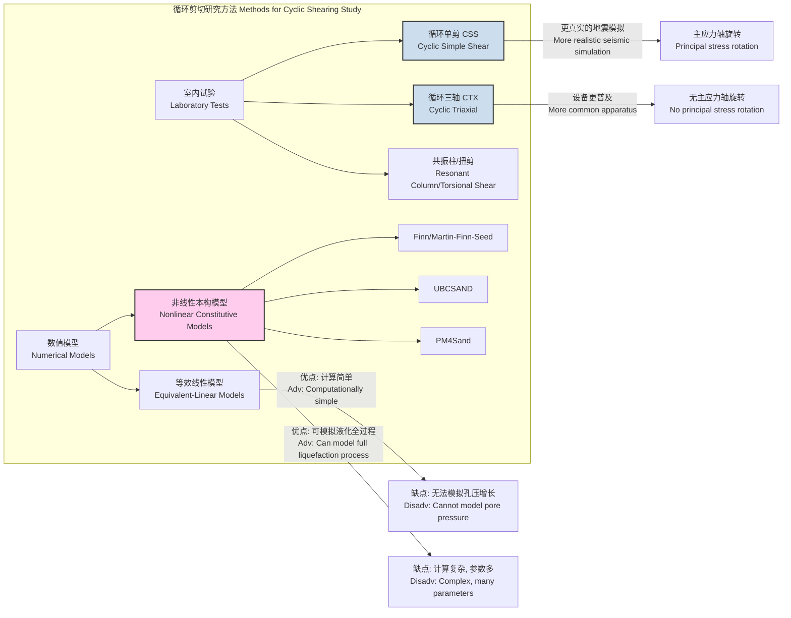

## 循环剪切 (Cyclic Shearing)

循环剪切是指材料在重复施加的、方向交替的剪切应力或剪切应变作用下的力学行为。该概念在多个科学和工程领域至关重要，尤其是在岩土工程、材料科学和流变学中。本文档将重点阐述其在岩土工程中的应用，特别是在模拟地震荷载下饱和无粘性土（如砂土和粉土）的响应。

在岩土工程中，循环剪切是研究土体液化、循环软化、刚度退化和累积变形等现象的核心手段。当饱和松散的砂土在不排水条件下承受循环剪切时，土颗粒有重新排列并趋于密实的倾向。由于水无法排出，这种体积压缩的趋势会将荷载从土骨架转移到孔隙水，导致孔隙水压力 ($u$) 持续升高。当孔隙水压力上升至等于初始有效围压 ($\sigma'_{v0}$) 时，土体有效应力 ($\sigma'$) 降至零，从而完全丧失抗剪强度，呈现出类似液体的状态，这一现象被称为**液化 (liquefaction)**。

### 核心概念与数学基础

循环剪切行为由几个关键参数和方程描述。

**1. 剪应力 (Shear Stress, $\tau$) 和剪应变 (Shear Strain, $\gamma$)**
在应力控制的循环剪切试验中，施加的剪应力通常为正弦波形：
$$ \tau(t) = \tau_{cyc} \sin(2\pi f t) $$
其中：
*   $\tau(t)$ 是随时间 $t$ 变化的瞬时剪应力 (Pa)。
*   $\tau_{cyc}$ 是循环剪应力幅值 (Pa)。
*   $f$ 是加载频率 (Hz)，对于地震模拟通常取 0.5-2.0 Hz。
*   $t$ 是时间 (s)。

材料产生的剪应变响应为：
$$ \gamma(t) = \gamma_{cyc} \sin(2\pi f t + \delta) $$
其中：
*   $\gamma(t)$ 是瞬时剪应变 (无量纲)。
*   $\gamma_{cyc}$ 是循环剪应变幅值 (无量纲)。
*   $\delta$ 是应力与应变之间的相位滞后角，反映了材料的能量耗散。

**2. 循环应力比 (Cyclic Stress Ratio, CSR)**
CSR 是评估地震荷载强度的标准化关键参数，定义为循环剪应力幅值与初始有效竖向应力之比：
$$ CSR = \frac{\tau_{cyc}}{\sigma'_{v0}} $$
其中：
*   $\sigma'_{v0}$ 是初始有效竖向固结应力 (Pa)。CSR 是一个无量纲参数，它将外部荷载与土体的初始应力状态联系起来。

**3. 孔隙水压力比 (Pore Pressure Ratio, $r_u$)**
该参数用于量化孔隙水压力的增长程度，定义为超孔隙水压力 ($u_e$，即总孔压减去静水压力) 与初始有效固结应力之比：
$$ r_u = \frac{u_e}{\sigma'_{v0}} $$
*   当 $r_u$ 达到 1.0 时，有效应力 $\sigma' = \sigma'_{v0} - u_e$ 降为零，通常认为此时土体发生**初始液化 (initial liquefaction)**。

### 关键技术规格

循环剪切试验的实施需要精确控制一系列参数。下表以循环单剪试验 (Cyclic Simple Shear, CSS) 为例，列出了典型的技术规格。

| 参数 (Parameter) | 典型值 (Typical Value) | 单位 (Unit) | 描述 (Description) |
| :--- | :--- | :--- | :--- |
| 试样直径 (Sample Diameter) | 65 - 100 | mm | 标准圆柱形试样尺寸 |
| 试样高度 (Sample Height) | 20 - 30 | mm | 保证剪应力分布相对均匀 |
| 初始有效围压 ($\sigma'_{v0}$) | 50 - 400 | kPa | 模拟不同埋深处的地应力 |
| 循环应力比 (CSR) | 0.05 - 0.5 | 无量纲 | 模拟从弱到强的地震动强度 |
| 加载频率 (f) | 0.1 - 2.0 | Hz | 典型地震波的卓越频率范围 |
| 固结方式 (Consolidation) | K0 固结 | - | 模拟侧向土压力受限的现场条件 |
| 试验终止条件 | $r_u \ge 0.95$ 或 $\gamma_{DA} \ge 5\%$ | - | 定义液化或大变形失效的标准 |

*注：$\gamma_{DA}$ 指双幅剪应变 (Double-Amplitude Shear Strain)。*

### 常见用例与量化性能指标

循环剪切试验的结果直接应用于多个工程领域。

*   **地震工程 (Earthquake Engineering)**
    *   **应用**: 评估饱和砂土地基的液化潜势。
    *   **方法**: 采用Seed & Idriss (1971) 提出的简化方法，首先根据地震震级 ($M_w$) 和峰值地面加速度 ($a_{max}$) 计算地震引起的循环应力比 (CSR)。然后，将CSR与从室内试验或原位测试（如SPT、CPT）得到的土体循环抗力比 (Cyclic Resistance Ratio, CRR) 进行比较。
    *   **量化指标**: 液化安全系数 ($FS_{liq}$) 定义为：
        $$ FS_{liq} = \frac{CRR}{CSR} $$
        当 $FS_{liq} < 1.0$ 时，认为场地有很高的液化风险。例如，对于一个7.5级地震，相对密度为50%的清洁砂的 $CRR_{7.5}$ 值通常在0.15左右。

*   **海洋工程 (Offshore Engineering)**
    *   **应用**: 设计承受海浪荷载的海上平台、风力涡轮机和海底管道的基础。
    *   **方法**: 根据海洋环境条件确定风暴期间的波浪荷载循环次数 ($N$) 和应力幅值 ($\tau_{cyc}$)。利用实验室获得的 CSR-N 曲线（液化抗力曲线）来评估地基在设计寿命内的稳定性和累积变形。
    *   **量化指标**: 在30年设计寿命内，地基累积剪应变通常要求小于1-2%。

### 实施考量

循环剪切试验的实现依赖于精密的设备和控制算法。

```mermaid
graph TD
    subgraph "循环剪切试验流程 Cyclic Shearing Test Process"
        A[准备试样<br>Sample Preparation] --> B[固结<br>Consolidation];
        B --> C["施加循环荷载 应力/应变控制<br>Apply Cyclic Load Stress/Strain Control"];
        C --> D["数据采集<br>Data Acquisition<br>τ, γ, u, N[";
        D --> E["实时分析<br>Real-time Analysis"];
        E --> F["达到终止条件?<br>Termination Criteria Met?[";
        F -- "否 No" --> C;
        F -- "是 Yes" --> G["试验结束<br>End of Test"];
        G --> H["数据后处理与分析<br>Post-processing & Analysis"];
        H --> I["滞回圈<br>Hysteresis Loops"];
        H --> J["刚度退化曲线<br>Stiffness Degradation"];
        H --> K["孔压增长曲线<br>Pore Pressure Generation"];
        I & J & K --> L["评估液化潜势/变形<br>Evaluate Liquefaction Potential/Deformation"];
    end
    style G fill:#f9f,stroke:#333,stroke-width:2px
    style L fill:#ccf,stroke:#333,stroke-width:2px
```

*   **试验设备 (Apparatus)**
    *   **循环单剪仪 (Cyclic Simple Shear, CSS)**: 通过在试样水平面施加剪切来模拟地震剪切波（S波）的垂直传播。试验期间通常保持试样高度不变，以模拟不排水条件。CSS能更好地再现地震荷载下的应力路径，特别是主应力轴的旋转。
    *   **循环三轴仪 (Cyclic Triaxial, CTX)**: 通过对圆柱状试样施加循环变化的轴向偏应力 ($\sigma_d = \sigma_1 - \sigma_3$) 来诱发剪切。CTX设备更普及，但其应力路径不涉及主应力轴旋转，与地震剪切的模拟存在一定偏差。其结果通常需要一个修正系数 ($C_r$) 才能与CSS结果等效。

*   **控制算法 (Control Algorithm)**
    *   **应力控制**: 伺服液压或电-气作动器根据荷载传感器的反馈，通过PID（比例-积分-微分）控制器调节输出，以精确匹配目标正弦应力波形。
    *   **应变控制**: PID控制器利用位移传感器（LVDT）的反馈来施加目标位移波形。
    *   **算法复杂性**: 复杂性主要不在于波形生成，而在于多通道的耦合控制，例如在施加循环剪切的同时精确维持不排水条件（即恒定体积）或恒定法向应力。这要求高速的数据采集和控制系统，控制回路的频率可能高达10 kHz，以确保对1-2 Hz的力学试验进行精确控制。

### 性能特征

循环剪切试验产生一系列特征曲线，用于描述土体的动力响应。

*   **滞回行为 (Hysteretic Behavior)**: 剪应力-剪应变 ($\tau$-$\gamma$)关系图呈现为一系列滞回圈。每个回线的面积代表在一个加载循环中耗散的能量（阻尼），而回线骨架的斜率代表割线剪切模量 ($G_{sec}$)。
*   **刚度退化 (Stiffness Degradation)**: 随着循环次数 ($N$) 的增加，土体逐渐软化，割线剪切模量 ($G_{sec} = \tau_{cyc} / \gamma_{cyc}$) 显著下降。
*   **孔压增长 (Pore Pressure Generation)**: 孔压比 ($r_u$) 随循环次数 ($N$) 的增长曲线通常呈"S"形：初始增长缓慢，随后急剧加速，最终趋于平缓并接近1.0。
*   **统计度量 (Statistical Measures)**: 液化抗力曲线 (CRR vs. $N_L$，其中 $N_L$ 是达到液化的循环次数) 本质上是统计性的。由于土体性质的天然变异性，试验数据存在离散性。因此，抗力曲线通常表示为具有特定液化概率（如50%）的平均曲线。数据的不确定性可以通过标准差或置信区间来量化，例如，一个CRR值可以表示为 $0.15 \pm 0.02$ (95% 置信区间)。

### 相关技术

循环剪切的研究涉及不同的试验方法和数值模拟技术。



**1. 试验方法比较 (Comparison of Test Methods)**
*   **CSS vs. CTX**: CSS通过在水平面施加剪切，能更好地模拟地震S波引起的应力状态，包括主应力轴的连续旋转。而CTX通过改变轴向应力来产生剪切，其45度平面上的最大剪应力为 $\tau_{max} = (\sigma_1 - \sigma_3) / 2$，不涉及主应力轴旋转。因此，CTX的结果需要修正才能用于模拟水平场地地震响应。

**2. 本构模型 (Constitutive Models)**
为了在有限元等数值分析中模拟土体的循环行为，研究人员开发了多种本构模型。
*   **Martin-Finn-Seed 孔压模型**: 一个早期的经验模型，将不排水条件下循环剪切引起的塑性体积应变增量与剪应变幅值联系起来。孔压的增量通过流体的压缩模量与体积应变增量关联。
    $$ \Delta \epsilon_{vd} = C_1 (\gamma - C_2 \epsilon_{vd}) + \frac{C_3 \epsilon_{vd}^2}{\gamma + C_4 \epsilon_{vd}} $$
    其中：
    *   $\Delta \epsilon_{vd}$ 是一个加载循环内的塑性体积应变增量。
    *   $\gamma$ 是该循环的剪应变幅值。
    *   $\epsilon_{vd}$ 是累积塑性体积应变。
    *   $C_1, C_2, C_3, C_4$ 是与土体相对密度相关的模型参数。

*   **PM4Sand (V3) 模型**: 一个先进的、基于临界状态土力学和边界面塑性理论的砂土本构模型。它在有效应力空间内进行计算，能够模拟液化前后的完整行为，包括循环流动性（cyclic mobility）和液化后的大变形。其塑性模量的核心方程之一为：
    $$ K_p = h_{po} \cdot p' \cdot \left( \frac{M_{peak}}{M} - 1 \right)^m $$
    其中：
    *   $K_p$ 是塑性模量。
    *   $h_{po}$ 和 $m$ 是模型参数，控制硬化率。
    *   $p'$ 是平均有效应力。
    *   $M$ 是当前应力比 ($q/p'$)。
    *   $M_{peak}$ 是峰值应力比，它随土体状态和剪胀/剪缩行为而演化。

### 参考文献 (References)

1.  Seed, H. B., & Idriss, I. M. (1971). Simplified procedure for evaluating soil liquefaction potential. *Journal of the Soil Mechanics and Foundations Division*, 97(9), 1249-1273. (这是评估液化潜势的开创性论文，是该领域的经典之作).
2.  Ishihara, K. (1993). Liquefaction and flow failure during earthquakes. *Géotechnique*, 43(3), 351-415. DOI: [10.1680/geot.1993.43.3.351](https://doi.org/10.1680/geot.1993.43.3.351).
3.  Boulanger, R. W., & Idriss, I. M. (2014). *CPT and SPT based liquefaction triggering procedures*. Report No. UCD/CGM-14/01, Center for Geotechnical Modeling, Department of Civil and Environmental Engineering, University of California, Davis, CA. (对简化方法的现代更新).
4.  Boulanger, R. W., & Ziotopoulou, K. (2015). *PM4Sand (Version 3): A Sand Plasticity Model for Earthquake Engineering Applications*. Report No. UCD/CGM-15/01, Center for Geotechnical Modeling, University of California, Davis. (PM4Sand模型的官方技术报告).