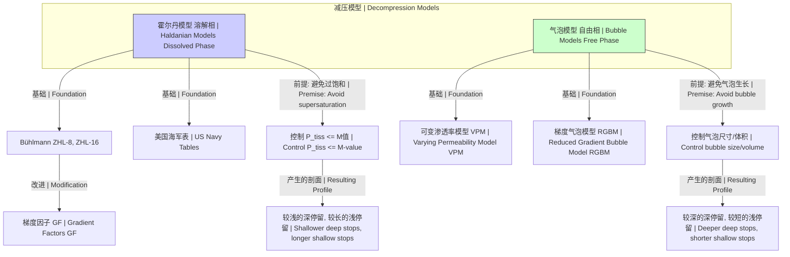

## 解压

本文档提供了关于“解压”在两个主要科学领域——数据处理和生理学——中的全面技术性解释，重点关注其科学和数学严谨性。

### 数据解压

数据解压是从其压缩表示中重建原始数据的过程，是数据压缩的逆运算。其根本目标是将数据恢复到其原始形式（无损解压）或一个非常接近的近似形式（有损解压）。压缩和解压的理论基础在于信息论。

#### 核心概念与数学基础

**信息熵 (香农熵)**
无损压缩的理论极限由数据源的熵定义。熵，记为 $H(X)$，衡量了一个随机变量 $X$ 的平均不确定性或信息含量。对于一个有 $n$ 个可能符号 $x_i$、每个符号出现概率为 $P(x_i)$ 的信源，其熵为：

$$ H(X) = -\sum_{i=1}^{n} P(x_i) \log_b P(x_i) $$

其中：
*   $H(X)$ 是信源 $X$ 的熵。
*   $P(x_i)$ 是符号 $x_i$ 出现的概率。
*   $b$ 是对数的底，对于信息比特通常为 2。熵给出了表示该数据源平均每个符号所需的最少比特数。解压算法读取这种压缩表示并将其扩展回原始符号。

**前缀码与克拉夫特不等式**
大多数无损解压算法（如霍夫曼编码）依赖于前缀码。前缀码是一组编码，其中没有任何一个码是其他任何码的前缀。此属性允许无歧义的即时解码。克拉夫特不等式为给定一组码长是否存在对应的前缀码提供了充分必要条件。

$$ \sum_{i=1}^{m} b^{-l_i} \le 1 $$

其中：
*   $m$ 是字母表中的符号数。
*   $b$ 是编码字母表的大小（例如，二进制为 2）。
*   $l_i$ 是第 $i$ 个符号的码长。
解压过程涉及读取比特流，并将序列与已知的前缀码进行匹配，以输出相应的符号。

```mermaid
graph TD
    subgraph "解压流程 无损 | Decompression Process Lossless"
        A["压缩比特流 | Compressed Bitstream"] --> B["读取头部/元数据 | Read Header/Metadata[";
        B --> C["重建模型 例如, 霍夫曼树, 字典 | Reconstruct Model e.g., Huffman Tree, Dictionary"];
        C --> D["使用模型解码比特流 | Decode Bitstream using Model[";
        A --> D;
        D --> E["原始数据 | Original Data"];
    end

    style A fill:#f9f,stroke:#333,stroke-width:2px
    style E fill:#9cf,stroke:#333,stroke-width:2px
```

#### 关键技术规格

解压算法的性能可以通过几个关键指标来表征。下表比较了一些常用算法。

| 算法 | 类型 | 解压速度 (典型值) | 内存使用 (解压) | 主要用途 |
|---|---|---|---|---|
| **霍夫曼 (Huffman)** | 统计 (熵编码) | 非常快 (> 500 MB/s) | 低 (树/表大小) | 其他算法的组件 (DEFLATE, JPEG) |
| **LZW** | 基于字典 | 快 (200-400 MB/s) | 中等 (字典大小) | GIF, TIFF, PDF |
| **DEFLATE** | 混合 (LZ77+霍夫曼) | 快 (300-600 MB/s) | 低 (滑动窗口) | ZIP, GZIP, PNG |
| **Brotli** | 混合 (LZ77+霍夫曼+上下文) | 中等 (250-500 MB/s) | 高 (静态字典) | Web 内容 (HTTPS) |
| **Zstandard (Zstd)** | 混合 (LZ77+ANS) | 极快 (> 1000 MB/s) | 可调 (窗口大小) | 实时系统, 数据库 |

*注意：速度高度依赖于具体实现、CPU 架构和被解压的数据。表中数值仅为示例。*

#### 常见用例

*   **文件归档 (例如 ZIP/GZIP):** 解压归档文件以恢复原始文件和目录结构。
    *   **性能指标:** 一个使用 GZIP (级别 6) 压缩的 1 GiB 文件，在现代 CPU 上可能需要 1.5-2.5 秒解压，速度约为 400-670 MB/s。
*   **Web 资源分发:** 浏览器解压使用 Gzip 或 Brotli 编码的内容 (HTML, CSS, JS) 以更快地渲染网页。
    *   **性能指标:** 与 Gzip 相比，使用 Brotli 可使压缩大小减少 15-25%，从而显著减少页面加载时间，在慢速连接上通常可减少 50-200 毫秒。
*   **实时数据库解压 (例如 RocksDB 中的 Zstd):** 在从存储中读取数据块时动态解压。
    *   **性能指标:** Zstandard 的解压速度可以超过 1 GB/s，为数据检索操作增加的延迟极小 (亚毫秒级)。

#### 实现考量

**霍夫曼解压**
1.  **读取头部:** 压缩流通常以霍夫曼树的表示（例如，每个符号的码长）开始。
2.  **构建树:** 从头部信息中重建规范的霍夫曼树。
3.  **解码:** 逐比特读取压缩数据。从霍夫曼树的根节点开始遍历。'0' 比特表示走向左子节点，'1' 比特表示走向右子节点。当到达一个叶节点时，输出与该节点关联的符号，并返回根节点处理下一个符号。
*   **算法复杂度:** $O(L + N)$，其中 $L$ 是压缩流的比特数，$N$ 是解压后输出的符号数。实际上，复杂度与输出大小成线性关系。

**LZ77 家族解压 (例如 DEFLATE)**
1.  **初始化:** 设置一个输出缓冲区（或“滑动窗口”）。
2.  **解码循环:** 从比特流中读取标志，以确定下一个元素的类型。
    *   如果是 **字面量 (literal)**，读取该符号 (例如 8 比特) 并将其附加到输出缓冲区。
    *   如果是 **(长度, 距离) 对**，读取长度和距离值。从 `输出缓冲区[当前位置 - 距离]` 处复制 `长度` 字节到当前位置。
3.  **终止:** 当遇到块结束标记时停止。
*   **算法复杂度:** $O(L+N)$。该过程主要由读取输入和写入输出主导。复制操作非常高效 (例如 `memcpy`)。

#### 性能特征

解压速度是一个关键的性能指标。以下是在英特尔酷睿 i7-8700K 单核上解压 Hutter Prize 数据集中的 10MB `enwik8` 文件的示例统计数据。

| 算法 | 平均速度 (MB/s) | 标准差 (MB/s) | 95% 置信区间 (MB/s) |
|---|---|---|---|
| zlib (DEFLATE) | 420.5 | 8.2 | [410.1, 430.9] |
| Brotli | 485.1 | 11.5 | [470.3, 499.9] |
| Zstd | 1350.7 | 25.3 | [1318.5, 1382.9] |

*数据为示例，基于公开基准测试。每个测试运行 N=30 次。* Zstd 的高速和低方差突显了其在高性​​能应用中的适用性。

---

### 生理减压

生理减压是逐渐降低环境压力的过程，以使溶解在身体组织中的惰性气体能够安全排出，从而预防减压病 (Decompression Sickness, DCS)。这对潜水员、宇航员和压缩空气工人至关重要。其基本原理植根于物理学，并通过数学模型进行建模。

#### 核心概念与数学基础

**亨利定律 (Henry's Law)**
该定律指出，在恒定温度下，某种气体在给定类型和体积的液体中溶解的量，与该气体在与液体平衡状态下的分压成正比。

$$ C = k_H \cdot P_g $$

其中：
*   $C$ 是溶解气体的浓度。
*   $k_H$ 是亨利定律常数 (取决于气体、液体和温度)。
*   $P_g$ 是液体上方气体的分压。
在潜水过程中，增加的环境压力导致更多的惰性气体（如氮气）溶解在潜水员的组织中。在上升（减压）过程中，必须缓慢地逆转此过程。

**霍尔丹减压模型 (Haldanian Decompression Model)**
由约翰·斯科特·霍尔丹 (John Scott Haldane) 开发，该模型是大多数现代减压算法的基础。它将身体建模为一系列并行的“组织隔室”，每个隔室具有不同的气体吸收和排出速率。这些是数学构造，而非字面上的解剖组织。每个隔室中的气体加载和卸载被假定遵循指数曲线。

组织隔室中的惰性气体分压 ($P_{tiss}$) 随时间 ($t$) 的变化由施赖纳方程 (Schreiner equation) 描述：

$$ P_{tiss}(t) = P_{tiss,0} + (P_{alv} - P_{tiss,0})(1 - e^{-k t}) $$

其中：
*   $P_{tiss}(t)$ 是在时间 $t$ 时的组织惰性气体压力。
*   $P_{tiss,0}$ 是在 $t=0$ 时的初始组织惰性气体压力。
*   $P_{alv}$ 是肺部（肺泡）中恒定的惰性气体分压。
*   $k$ 是一个时间常数，与组织半衰期 ($T_{1/2}$) 相关，关系为 $k = \ln(2) / T_{1/2}$。
*   $T_{1/2}$ 是组织半衰期，即组织压力变化达到其初始状态与平衡状态之间差值的 50% 所需的时间。

**M值 (M-Values)**
霍尔丹假设，只要组织气体压力与环境压力的比率不超过某个特定值（最初为 2:1），上升就是安全的。现代模型使用“M值”（最大值），它定义了在给定环境压力（深度）下，组织隔室能耐受的最大惰性气体压力。这种关系通常是线性的。

$$ P_{tiss,tol} \le a + P_{amb} / b $$
其中 $P_{tiss,tol}$ 是最大耐受组织压力（即 M 值），$P_{amb}$ 是环境压力，$a$ 和 $b$ 是针对每个组织隔室经验导出的常数。在减压过程中，必须控制上升，以确保对于所有组织隔室，$P_{tiss} \le P_{tiss,tol}$。

```mermaid
graph TD
    subgraph "潜水与减压过程 | Dive and Decompression Process"
        A["开始潜水: 水面 P_amb=1 ata | Start Dive: Surface P_amb=1 ata"] --> B["下潜: P_amb 增加 | Descent: P_amb increases"];
        B --> C["水底停留: 组织吸收气体<br>P_tiss 接近 P_alv | Bottom Time: Tissues on-gas<br>P_tiss approaches P_alv"];
        C --> D["上升: P_amb 减少 | Ascent: P_amb decreases"];
        D --> E["所有组织的 P_tiss <= M值? | Is P_tiss <= M-value for all tissues?[";
        E -- "是 | Yes" --> F["继续上升<br>组织排出气体 | Continue Ascent<br>Tissues off-gas"];
        E -- "否 | No" --> G["减压停留<br>保持深度直到 P_tiss 下降 | Decompression Stop<br>Hold depth until P_tiss drops"];
        G --> E;
        F --> H["返回水面 | Surface"];
    end

    style A fill:#cceeff
    style H fill:#cceeff
    style C fill:#ffcccc
    style G fill:#ffebcc
```

#### 关键技术规格

Bühlmann ZHL-16 算法是一种广泛使用的霍尔丹模型。它定义了 16 个组织隔室。

**Bühlmann ZHL-16C 参数 (示例)**

| 隔室 | 半衰期 (分钟) | a-值 (bar) | b-值 |
|---|---|---|---|
| 1 | 4.0 | 1.2599 | 0.7784 |
| 5 | 27.0 | 0.8618 | 0.8120 |
| 10 | 125.0 | 0.5192 | 0.8917 |
| 14 | 395.0 | 0.3734 | 0.9427 |
| 16 | 635.0 | 0.2787 | 0.9571 |

*`a` 和 `b` 值决定了每个组织的 M 值线。为简洁起见，此表仅显示部分数据。*

#### 常见用例

*   **休闲水肺潜水:** 计算免减压极限 (NDLs)。
    *   **性能指标:** 对于使用空气（79% N2）潜水至 30 米（4 ata），ZHL-16 模型预测的 NDL 约为 20 分钟，超过此时长则需要强制性减压停留。
*   **技术潜水:** 规划复杂的潜水，涉及多种气体混合物和必要的减压停留。
    *   **性能指标:** 一次到 60 米深度停留 25 分钟的潜水，可能需要总计 75 分钟的减压时间，包括在不同深度的停留，这些都由算法计算得出。
*   **航空航天舱外活动 (EVA):** 宇航员在进入太空真空（或低压宇航服）之前，会预先呼吸 100% 纯氧以洗出体内的氮气。
    *   **性能指标:** 一个典型的预呼吸方案可能会持续 2-4 小时，以将组织氮分压降低到足以在低压（例如 0.3 ata）宇航服环境中防止减压病的水平。

#### 实现考量

**Bühlmann 算法实现**
1.  **初始化:** 将所有 16 个隔室的初始组织压力设置为与海平面空气平衡的状态（例如，0.79 ata N2）。
2.  **模拟潜水剖面:** 对潜水的每个阶段（下潜、水底停留、上升），定义其持续时间、深度和呼吸气体：
    *   计算该阶段的肺泡惰性气体分压 ($P_{alv}$)。
    *   对 16 个隔室中的每一个应用施赖纳方程，计算该阶段结束时新的组织气体压力。
3.  **检查上升:** 在任何上升阶段，连续计算“天花板”深度。天花板是潜水员可以上升到的最浅深度，由最接近其 M 值极限的组织隔室决定。
    *   隔室 $i$ 的天花板深度: $Depth_{ceil,i} = ( (P_{tiss,i} - a_i) \cdot b_i - 1 ) \cdot 10$ 米。
    *   总天花板是所有 $i$ 的 $\max(Depth_{ceil,i})$。潜水员不能上升到比此天花板更浅的深度。
*   **算法复杂度:** $O(C \cdot S)$，其中 $C$ 是隔室数量（常数，例如 16），$S$ 是潜水剖面中的阶段数。对于实时计算，它与时间步长成线性关系。

#### 性能特征

减压模型的“性能”是其安全性，即避免减压病的概率。这很难精确量化。

*   **梯度因子 (Gradient Factors, GF):** 对 Bühlmann 模型的常见修改引入了梯度因子（GF Low / GF High），允许用户增加保守性。GF 80/85 意味着潜水员将在主导组织的压力达到其 M 值的 85% 时浮出水面，而第一个减压停留由 M 值线的 80% 决定。
*   **统计风险:** 根据潜水员警报网 (DAN) 和其他研究的数据，休闲免停留潜水的减压病风险估计在每 10,000 次潜水中 1 到 3 例之间 (0.01% - 0.03%)。带有额外保守性（例如使用 GF）的模型被认为可以降低这种风险，但很难在统计上证明直接的因果关系。由于事件的罕见性和众多混杂因素（水合作用、年龄、健康状况等），此风险的 95% 置信区间很宽。

#### 相关技术与比较模型



*   **霍尔丹模型 (例如 Bühlmann):** 关注溶解的气体相。它们旨在将计算出的过饱和度保持在临界极限（M 值）以下。它们计算上更简单，并通过数十年的使用得到了广泛验证。
*   **气泡模型 (例如 VPM, RGBM):** 假设微小的、无症状的气泡（微核）总是存在。减压旨在通过控制周围压力和气体张力来管理这些气泡的生长。这些模型通常比霍尔丹模型规定更深的减压停留，以便及早压缩气泡，随后可能是更短的浅层停留。其物理原理更复杂，涉及表面张力和气体跨气泡边界扩散的方程。

## 参考文献

1.  Shannon, C. E. (1948). A Mathematical Theory of Communication. *Bell System Technical Journal*, 27(3), 379-423. DOI: `10.1002/j.1538-7305.1948.tb01338.x`
2.  Ziv, J., & Lempel, A. (1977). A Universal Algorithm for Sequential Data Compression. *IEEE Transactions on Information Theory*, 23(3), 337-343. DOI: `10.1109/TIT.1977.1055714`
3.  Bühlmann, A. A. (1984). *Decompression-Decompression Sickness*. Springer-Verlag. ISBN: `978-3-540-13309-9`.
4.  Yount, D. E., & Hoffman, D. C. (1986). On the use of a bubble formation model to calculate diving tables. *Aviation, Space, and Environmental Medicine*, 57(2), 149-156. (VPM 模型基础)
5.  Baker, E. (2007). *Understanding M-values*. Immersed Magazine. (关于 Bühlmann 模型应用的优秀实践解释).