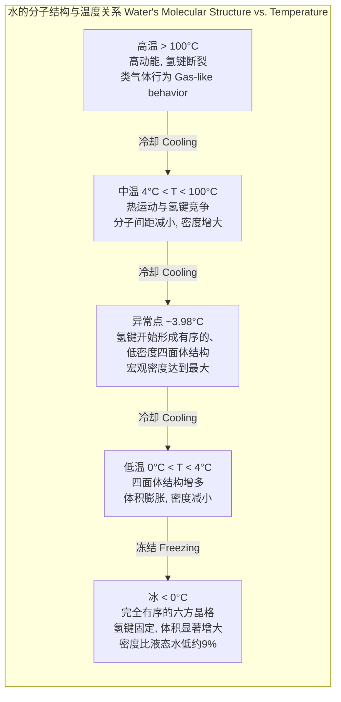
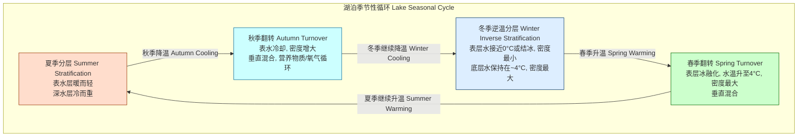
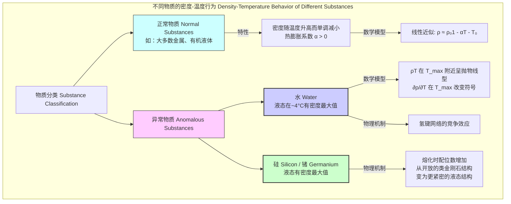

## 密度异常

密度异常 (Density Anomaly) 是指特定物质在一定条件下，其密度随温度的变化行为与大多数物质相反的现象。最典型和最重要的例子是水的密度异常：在标准大气压下，液态水在冷却过程中，密度会持续增加，但在约 3.98°C 时达到其最大值，之后若继续冷却至 0°C（冰点），其密度反而会下降。这种行为与绝大多数物质“热胀冷缩”（即温度越低，密度越大）的规律相悖。

### 核心概念与物理基础

水的密度异常源于其独特的分子间相互作用——氢键 (Hydrogen Bond)。

*   **高温区 (T > 4°C)**: 在较高的温度下，水分子的热运动（动能）占主导地位。分子间距较大，氢键不断地断裂和形成，结构相对混乱。当温度降低时，分子的热运动减弱，分子间能够靠得更近，从而导致整体密度增加。这与正常液体的行为一致。

*   **低温区 (0°C < T < 4°C)**: 当温度降至 4°C 以下时，氢键的作用变得越来越显著。水分子开始倾向于形成一种更有序、更开放的局部结构，即四面体网络结构。这种结构类似于固态冰的晶体结构，但仅在局部和瞬时存在。这种开放的结构占据了更大的体积，从而有降低密度的趋势。

*   **异常点 (T ≈ 3.98°C)**: 在这一点，两种效应达到了平衡：分子热运动减弱导致的“热收缩”效应，与氢键网络形成导致的“结构膨胀”效应。此时，水的宏观密度达到峰值。当温度进一步从 4°C 降至 0°C 时，“结构膨胀”效应超过了“热收缩”效应，导致密度减小。

*   **固态（冰）**: 当水结成冰时，所有水分子都被固定在一种完全有序、开放的六方晶格结构中。这种结构比液态水稀疏得多，导致冰的密度比液态水低约 9%，因此冰会浮在水面上。

### 数学描述

密度异常在数学上表现为热膨胀系数 $\alpha_V$ 的符号变化。体热膨胀系数定义为：

$$ \alpha_V = \frac{1}{V_m} \left( \frac{\partial V_m}{\partial T} \right)_P = -\frac{1}{\rho} \left( \frac{\partial \rho}{\partial T} \right)_P $$

其中：
*   $\rho$ 是物质的密度 (kg/m³)。
*   $V_m$ 是摩尔体积 (m³/mol)。
*   $T$ 是绝对温度 (K)。
*   $P$ 是压力 (Pa)。
*   $\left( \frac{\partial \cdot}{\partial T} \right)_P$ 表示在恒定压力下的偏导数。

对于大多数“正常”液体，$\alpha_V > 0$，意味着温度升高，体积膨胀，密度降低。然而，对于水，在 0°C 到 3.98°C 的区间内，$\left( \frac{\partial \rho}{\partial T} \right)_P > 0$，因此 $\alpha_V < 0$，表现为“冷胀热缩”。在 $T \approx 3.98^\circ\text{C}$ 时，$\left( \frac{\partial \rho}{\partial T} \right)_P = 0$ 且 $\alpha_V = 0$。

---

## 关键技术规格

下表列出了纯水在标准大气压 (101.325 kPa) 下与密度异常相关的关键物理性质。

| 参数 (Parameter) | 值 (Value) | 单位 (Unit) | 注释 (Notes) |
| :--- | :--- | :--- | :--- |
| 最大密度温度 (Temp. of Max. Density) | 3.98 | °C | 对应 277.13 K |
| 最大密度 (Maximum Density) | 999.97495 | kg/m³ | 基于 IAPWS-95 标准 |
| 0°C 时液态水密度 (Liquid Density at 0°C) | 999.8426 | kg/m³ | |
| 0°C 时冰的密度 (Ice Ih Density at 0°C) | 916.7 | kg/m³ | 约比同温液态水低 8.3% |
| 三相点温度 (Triple Point Temperature) | 0.01 | °C | 273.16 K, 定义开尔文温标 |
| 三相点压力 (Triple Point Pressure) | 611.657 | Pa | |
| 热膨胀系数在 20°C (Thermal Exp. Coeff. at 20°C) | $2.07 \times 10^{-4}$ | K⁻¹ | 正常正值 |
| 热膨胀系数在 2°C (Thermal Exp. Coeff. at 2°C) | $-0.31 \times 10^{-4}$ | K⁻¹ | 异常负值 |

---

## 常见用例

水的密度异常对自然生态系统和人类活动具有深远的影响。

*   **湖沼学 (Limnology)**: 这是密度异常最重要的应用领域。它驱动了温带地区湖泊的季节性垂直循环（翻转）。
    *   **夏季分层**: 太阳加热表层水，使其密度变小，浮在温度较低、密度较大的深层水之上，形成稳定的分层结构，阻碍了物质交换。
    *   **秋季翻转**: 随着气温下降，表层水冷却，密度增大。当表层水温降至约 4°C 时，其密度超过深层水，导致其下沉，从而引发整个水体的垂直对流。这个过程将表层的氧气带到底部，并将底部的营养物质带到表层。
    *   **冬季分层**: 继续冷却，表层水温降至 4°C 以下，密度反而减小，形成“逆温分层”。最冷的水（甚至冰）位于顶部。
    *   **春季翻转**: 春季回暖，表层冰融化，水温升向 4°C，密度再次增大并下沉，引发春季翻转。
    *   **性能指标**: 湖泊翻转的效率直接影响水生生物的生存。一次完全的翻转可以将湖底的缺氧状态（< 2 mg/L O₂）改善至接近饱和（> 8 mg/L O₂）。

*   **生物学 (Biology)**: 冰浮在水面上，形成一个绝缘层，保护下方的水体不会完全冻结。这使得鱼类和其他水生生物能够在寒冷的冬季存活。如果没有密度异常，湖泊和河流会从底部开始冻结，最终可能完全冻成冰块，摧毁整个生态系统。

*   **海洋学 (Oceanography)**: 海水的盐度会改变水的密度行为。盐度越高，最大密度温度和冰点都越低。当盐度超过 24.7 psu (实用盐度单位) 时，最大密度温度将低于冰点，这意味着海水在冻结前其密度会一直随温度降低而增加，不会出现密度异常导致的翻转。这在高纬度极地海域的深层水形成过程中至关重要。

*   **工程与日常生活 (Engineering & Daily Life)**: 水在结冰时体积膨胀（约 9%），会对管道、容器和岩石裂缝产生巨大的压力（可达 200 MPa 以上），导致水管爆裂和冻融风化等地质作用。

---

## 建模与实现考量

为了在科学计算和工程应用中精确描述水的密度，通常使用经验或半经验的状态方程。

### 多项式模型
在特定温度范围内，水的密度可以很好地用关于温度的多项式来近似。一个常用的简化形式如下：

$$ \rho(T) = a_0 + a_1 T + a_2 T^2 + a_3 T^3 + a_4 T^4 + a_5 T^5 $$

其中，$T$ 是摄氏温度 (°C)，$\rho(T)$ 是密度 (kg/m³)。系数 $a_i$ 是通过拟合高精度实验数据得到的。例如，一个适用于 0°C 到 40°C 的常用拟合为：
*   $a_0 = 999.83952$
*   $a_1 = 16.945176 \times 10^{-3}$
*   $a_2 = -7.9870401 \times 10^{-6}$
*   $a_3 = -46.170461 \times 10^{-9}$
*   $a_4 = 105.56302 \times 10^{-12}$
*   $a_5 = -280.54253 \times 10^{-15}$

### 算法复杂度分析
对于一个 $n$ 阶多项式，计算给定温度 $T$ 下的密度值，如果直接计算每一项，需要 $n$ 次加法和 $n(n+1)/2$ 次乘法。然而，使用 **霍纳法则 (Horner's Method)**，可以将计算优化。
$$ \rho(T) = a_0 + T(a_1 + T(a_2 + T(a_3 + T(a_4 + T a_5)))) $$
使用霍纳法则，计算一个 $n$ 阶多项式只需要 $n$ 次乘法和 $n$ 次加法。因此，该模型的计算复杂度为 **O(n)**，其中 $n$ 是多项式的阶数。这在计算上是非常高效的。对于大多数应用，一个 4-5 阶的多项式已经足够精确。

### 国际标准
对于最高精度的科学和工业应用，应使用国际水和水蒸气性质协会 (IAPWS) 发布的官方公式，如 **IAPWS-95**。这是一个非常复杂的状态方程，以亥姆霍兹自由能为基本函数，涵盖了极宽的温度和压力范围，其不确定度在大多数区域优于 0.01%。

---

## 性能与统计特征

*   **曲线形状**: 水的密度-温度曲线在 3.98°C 附近呈现一个平滑的抛物线形顶点。这意味着在最大密度点附近，密度的变化非常缓慢。例如，从 3°C 到 5°C，密度的变化小于 0.001%。
*   **测量精度**: 最大密度温度 $T_{max}$ 的现代测量值非常精确。在标准大气压下，$T_{max} = 3.98 \pm 0.01$ °C，置信区间为 95%。最大密度值 $\rho_{max}$ 的不确定度约为 $1 \times 10^{-3}$ kg/m³。
*   **压力效应**: 增加压力会使最大密度温度降低。大约每增加 10 MPa (约 100 个大气压)，$T_{max}$ 会降低约 1°C。当压力超过约 200 MPa 时，密度异常现象消失。

---

## 相关现象与比较

水的密度异常并非独一无二，但却是最广为人知和最重要的。

*   **正常物质 (Normal Substances)**: 大多数液体，如乙醇、汞、苯等，其密度随温度降低而单调增加，直到凝固点。它们的固态通常比液态更致密。其密度-温度关系在小范围内可由线性模型近似：
    $$ \rho(T) \approx \rho_0 [1 - \alpha_V (T - T_0)] $$
    其中 $\alpha_V$ 是一个正常数。

*   **其他异常物质**:
    *   **硅 (Si)**、**锗 (Ge)**、**镓 (Ga)**、**铋 (Bi)** 和 **锑 (Sb)** 等元素也表现出密度异常。它们在熔化时体积会收缩（即固态比液态密度小），并且其液态在一定温度下也存在密度最大值。
    *   **物理原因**: 这些物质的密度异常也与局域原子结构的变化有关。例如，固态硅具有开放的、低配位数（配位数为4）的金刚石结构。熔化后，其液态结构变得更紧密，平均配位数增加到 6-7，导致密度增大。在液态冷却过程中，可能存在向类固态的低配位数结构转变的趋势，从而在特定温度产生密度最大值。

---

## 核心数学方程汇总

1.  **体热膨胀系数 (Volume Thermal Expansion Coefficient)**:
    $$ \alpha_V = -\frac{1}{\rho} \left( \frac{\partial \rho}{\partial T} \right)_P $$
    *   描述了物质密度随温度变化的相对速率。对于水，在 $0^\circ\text{C} < T < 3.98^\circ\text{C}$ 时 $\alpha_V < 0$。

2.  **水密度的简化抛物线模型 (Simplified Parabolic Model for Water Density)**:
    $$ \rho(T) \approx \rho_{max} \left[ 1 - \beta (T - T_{max})^2 \right] $$
    *   这是一个在最大密度点 $T_{max}$ 附近的泰勒展开近似，非常适合描述异常行为。
    *   $\rho_{max}$ 是最大密度。
    *   $T_{max}$ 是最大密度对应的温度（摄氏度或开尔文）。
    *   $\beta$ 是一个经验拟合系数，对于水约为 $8 \times 10^{-6}$ K⁻²。
    *   $T$ 是温度。

3.  **克劳修斯-克拉佩龙方程 (Clausius-Clapeyron Relation)**:
    $$ \frac{dP}{dT} = \frac{L}{T \Delta V_m} = \frac{\Delta S_m}{\Delta V_m} $$
    *   描述了相变线上压力随温度的变化率。
    *   $L$ 是相变潜热 (J/mol)。
    *   $T$ 是相变温度 (K)。
    *   $\Delta V_m = V_{m, liquid} - V_{m, solid}$ 是相变过程中的摩尔体积变化 (m³/mol)。
    *   $\Delta S_m$ 是摩尔熵变 (J/(mol·K))。
    *   对于水的固液相变，$\Delta V_m < 0$（冰的体积比水大），因此 $\frac{dP}{dT} < 0$。这意味着增加压力会使水的熔点降低，这是滑冰等现象的（部分）原因。

---

## 参考文献

1.  Wagner, W., & Pruß, A. (2002). The IAPWS Formulation 1995 for the Thermodynamic Properties of Ordinary Water Substance for General and Scientific Use. *Journal of Physical and Chemical Reference Data*, 31(2), 387-535. **DOI**: [10.1063/1.1461829](https://doi.org/10.1063/1.1461829)
2.  Gallo, P., Amann-Winkel, K., Angell, C. A., Anisimov, M. A., Caupin, F., Chakravarty, C., ... & Stanley, H. E. (2016). Water: A tale of two liquids. *Chemical Reviews*, 116(13), 7463-7500. **DOI**: [10.1021/acs.chemrev.5b00750](https://doi.org/10.1021/acs.chemrev.5b00750)
3.  Chaplin, M. (2019). Water Structure and Science. *London South Bank University*. Website: [http://www1.lsbu.ac.uk/water/density_anomalies.html](http://www1.lsbu.ac.uk/water/density_anomalies.html) (一个关于水异常性质的综合性学术资源网站)
4.  Sasaki, H., et al. (2008). Density of liquid silicon. *Journal of Crystal Growth*, 310(5), 1053-1058. **DOI**: [10.1016/j.jcrysgro.2007.12.046](https://doi.org/10.1016/j.jcrysgro.2007.12.046)