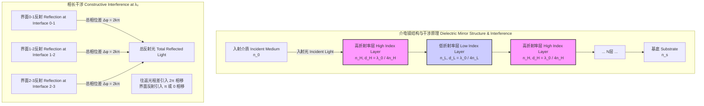
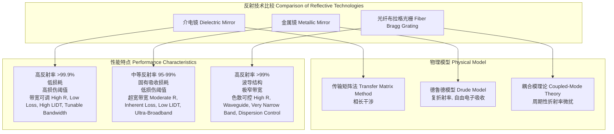

好的，遵照您的指示，我将以科学和数学的严谨性为重点，创建一份关于“介电镜”的综合性技术文档。文档将仅基于标题“介电镜”，所有推理过程在内部以英文进行，最终输出为简体中文。

## 介电镜

介电镜（Dielectric Mirror），又称介质反射镜或布拉格反射镜（Bragg Mirror），是一种通过在基底上交替沉积具有不同折射率的透明介电材料薄膜而制成的光学反射元件。其工作原理并非基于材料的本征吸收和反射，而是利用多层膜界面反射光的相长干涉（Constructive Interference）效应，从而在特定波长范围内实现极高的反射率（可超过99.999%）。

### 核心概念与数学基础

介电镜的核心是利用布拉格反射原理。当光波从一层介质传播到另一层具有不同折射率（$n$）的介质时，在界面处会发生部分反射和折射。通过精确控制每一层膜的厚度（$d$），可以使从不同界面反射回来的光波在返回到入射介质时相位相同，从而产生相长干涉，极大地增强总反射光强度。

#### 1. 菲涅尔方程 (Fresnel Equations)

在法向入射（$\theta_i = 0$）的情况下，光波从折射率为 $n_1$ 的介质进入折射率为 $n_2$ 的介质时，其振幅反射系数 $r$ 和透射系数 $t$ 由菲涅尔方程给出：

$$ r = \frac{n_1 - n_2}{n_1 + n_2} $$
$$ t = \frac{2n_1}{n_1 + n_2} $$

强度反射率 $R$ 和透射率 $T$ 分别为：

$$ R = |r|^2 = \left( \frac{n_1 - n_2}{n_1 + n_2} \right)^2 $$
$$ T = \frac{n_2}{n_1} |t|^2 = \frac{4n_1 n_2}{(n_1 + n_2)^2} $$

其中，$R+T=1$（假设介质无吸收）。

当光从低折射率介质射向高折射率介质时（$n_1 < n_2$），反射系数 $r$ 为负，表示反射光存在 $\pi$ 的相位突变。反之，从高折射率射向低折射率介质时（$n_1 > n_2$），无相位突变。

#### 2. 四分之一波长膜堆 (Quarter-Wave Stack)

最常见和基础的介电镜结构是四分之一波长膜堆。它由两种折射率分别为 $n_H$（高）和 $n_L$（低）的材料交替组成。对于中心设计波长 $\lambda_0$，每一层的光学厚度（折射率与物理厚度的乘积）都被精确控制为 $\lambda_0/4$。

$$ n_H d_H = n_L d_L = \frac{\lambda_0}{4} $$

*   $n_H, n_L$: 分别为高、低折射率材料的折射率。
*   $d_H, d_L$: 分别为高、低折射率材料的物理厚度。
*   $\lambda_0$: 镜子的中心工作波长。

在这种设计下，从每个界面反射的光波到达顶层表面时的光程差恰好是半波长的偶数倍，导致所有反射光同相叠加，实现最大反射率。

#### 3. 传输矩阵法 (Transfer Matrix Method, TMM)

对于任意多层膜结构，传输矩阵法是计算其光学特性（反射率、透射率、相位）的严谨数学工具。该方法将电场和磁场在不同界面处的边界条件表示为矩阵形式。

对于第 $j$ 层膜，其特性矩阵 $M_j$ 定义为：

$$ M_j = \begin{pmatrix} \cos(\delta_j) & \frac{i}{\eta_j}\sin(\delta_j) \\ i\eta_j\sin(\delta_j) & \cos(\delta_j) \end{pmatrix} $$

其中：
*   $\delta_j = \frac{2\pi}{\lambda} n_j d_j \cos(\theta_j)$ 是光在第 $j$ 层膜中单次通过的相移。
*   $\lambda$ 是真空中的波长。
*   $d_j$ 是第 $j$ 层的物理厚度。
*   $\theta_j$ 是光在第 $j$ 层中的传播角度，由斯涅尔定律（$n_{j-1}\sin\theta_{j-1} = n_j\sin\theta_j$）决定。
*   $\eta_j$ 是第 $j$ 层的光学导纳，其值取决于光的偏振态：
    *   s-偏振 (TE): $\eta_j = n_j \cos(\theta_j)$
    *   p-偏振 (TM): $\eta_j = n_j / \cos(\theta_j)$

一个由 $N$ 层膜组成的膜堆，其总系统矩阵 $M$ 是各层特性矩阵的乘积：

$$ M = M_1 M_2 \cdots M_N = \begin{pmatrix} m_{11} & m_{12} \\ m_{21} & m_{22} \end{pmatrix} $$

整个膜系（包括入射介质 $n_0$ 和基底 $n_s$）的振幅反射系数 $r$ 和透射系数 $t$ 可以通过矩阵元素计算：

$$ r = \frac{(\eta_0 m_{11} + \eta_0 \eta_s m_{12}) - (m_{21} + \eta_s m_{22})}{(\eta_0 m_{11} + \eta_0 \eta_s m_{12}) + (m_{21} + \eta_s m_{22})} $$
$$ t = \frac{2\eta_0}{(\eta_0 m_{11} + \eta_0 \eta_s m_{12}) + (m_{21} + \eta_s m_{22})} $$

最终，强度反射率 $R$ 和透射率 $T$ 为：

$$ R = |r|^2 $$
$$ T = \frac{\eta_s}{\eta_0} |t|^2 $$

### 关键技术指标

介电镜的性能由一系列精确的技术指标来定义。

| 技术指标 (Technical Specification) | 典型值 (Typical Value) | 单位 (Unit) | 说明 (Description) |
| :--- | :--- | :--- | :--- |
| 中心波长 (Center Wavelength, CWL) | 532, 800, 1064, 1550 | nm | 反射率达到峰值的波长。 |
| 反射率 (Reflectivity) | > 99.9% (标准), > 99.999% (超高反) | % | 在中心波长和指定带宽内的反射光功率比例。 |
| 反射带宽 (Stopband Width) | 10 - 200 | nm | 反射率高于某一特定值（如99%）的波长范围。 |
| 激光损伤阈值 (LIDT) | 5 - 50 (ns脉冲), 0.1 - 2 (fs脉冲) | J/cm² | 镜面在不发生永久性损伤的情况下能承受的最大激光能量密度或功率密度。 |
| 群延迟色散 (GDD) | -1000 to +1000, or near zero | fs² | 反射光的相位随频率的二阶导数，对超快激光脉冲的展宽有决定性影响。 |
| 入射角 (Angle of Incidence, AOI) | 0, 45 | 度 (°) | 设计时所依据的光线入射角度。 |
| 偏振依赖性 (Polarization Dependence) | < 1% (对于0°), > 10% (对于45°) | % | s-偏振和p-偏振光反射率的差异，在非正入射时显著。 |
| 表面质量 (Surface Quality) | 10-5, 20-10 | Scratch-Dig | 依据MIL-PRF-13830B标准，描述表面的划痕和麻点缺陷。 |
| 常用材料 (Common Materials) | TiO₂, Ta₂O₅, HfO₂ (高折射率); SiO₂, MgF₂ (低折射率) | - | 材料选择决定了折射率对比度、损伤阈值和工作波段。 |

### 常见用例与性能指标

| 应用领域 (Use Case) | 关键性能指标 (Key Performance Metric) | 定量要求 (Quantitative Requirement) |
| :--- | :--- | :--- |
| **激光谐振腔镜** (Laser Cavity Mirrors) | 反射率, 损耗 | R > 99.98% (输出镜), R > 99.995% (全反镜), 总损耗 < 50 ppm |
| **超快激光系统** (Ultrafast Laser Systems) | 群延迟色散 (GDD) | GDD < ±20 fs² (低色散镜), GDD = -500 fs² (色散补偿镜) |
| **滤光片/分束器** (Filters/Beamsplitters) | 反射/透射光谱 | 在特定波段 R > 99.5%, T < 0.5%; 另一波段 T > 95% |
| **高功率激光传输** (High-Power Laser Delivery) | 激光损伤阈值 (LIDT) | LIDT > 20 J/cm² @ 1064 nm, 10 ns |
| **天文望远镜** (Astronomical Telescopes) | 宽带反射率 | R_avg > 98% over 400-900 nm |

### 实现考量

#### 设计算法
介电镜的设计是一个优化问题，目标是在给定约束下（如材料、层数）最大化或定制光谱性能。
*   **传输矩阵法 (TMM)**: 这是分析给定膜系性能的基础。其计算复杂度与膜层数 $N$ 呈线性关系，即 $O(N)$。对于每个波长点的计算，都需要进行一次矩阵乘法链。
*   **优化算法**: 对于复杂的光谱目标（如宽带、特定色散），需要使用数值优化算法。
    *   **Needle/Refinement 方法**: 从一个初始设计开始，通过在膜系中“插入”新的薄层（Needle）来迭代地改善性能。这是一种强大的全局优化方法。
    *   **单纯形法/遗传算法**: 其他常用于多维参数空间（各层厚度）优化的算法。
    这些优化算法的计算复杂度远高于单次TMM计算，因为它们需要对成千上万个候选设计进行评估。

#### 制造工艺
薄膜的沉积工艺直接决定了介电镜的最终性能和可靠性。
*   **电子束蒸发 (EBE)**: 成本较低，但膜层致密性差，易受环境湿度影响导致光谱漂移。
*   **离子辅助沉积 (IAD)**: 在EBE基础上增加离子源轰击，提高膜层致密性和稳定性。
*   **离子束溅射 (IBS)**: 能够制造出最致密、最稳定、散射和吸收损耗最低的膜层。这是制造超高反射率镜和低损耗镜的首选技术，但成本最高，沉积速率慢。
*   **原子层沉积 (ALD)**: 提供无与伦比的厚度控制精度（原子层级别），非常适合制造结构复杂的特种滤光片。

### 性能特征

#### 反射带宽 (Stopband)
对于一个标准的四分之一波长堆，其高反射带（称为Stopband）的宽度 $\Delta g$ 由高低折射率材料的对比度决定：

$$ \Delta g = \frac{\Delta \lambda}{\lambda_0} = \frac{4}{\pi} \arcsin\left(\frac{n_H - n_L}{n_H + n_L}\right) $$

*   $\Delta \lambda$: 反射带宽的宽度 (nm)。
*   $\lambda_0$: 中心波长。
*   $n_H, n_L$: 高低折射率。

可见，折射率对比度 $(n_H/n_L)$ 越大，反射带宽越宽。

#### 色散特性
反射光的相位 $\phi_R$ 随角频率 $\omega$ 的变化引入了色散。群延迟（GD）和群延迟色散（GDD）定义为：

$$ GD(\omega) = \frac{d\phi_R}{d\omega} $$
$$ GDD(\omega) = \frac{d^2\phi_R}{d\omega^2} = \frac{-\lambda^3}{2\pi c^2} \frac{d^2\phi_R}{d\lambda^2} $$

标准介电镜在反射带边缘具有很大的正GDD，会严重展宽飞秒激光脉冲。为解决此问题，发展出了**啁啾镜（Chirped Mirrors）**，其层厚不再是严格的 $\lambda_0/4$，而是经过计算机优化设计，以在宽光谱范围内提供特定的（通常是负的）GDD来补偿激光系统中的正色散。

#### 统计与公差
制造过程中的层厚误差是影响性能的主要因素。假设第 $j$ 层的厚度误差 $\Delta d_j$ 是一个服从正态分布 $N(0, \sigma_d^2)$ 的随机变量，其中 $\sigma_d$ 是厚度控制的标准差（对于IBS工艺，可低至0.1 nm）。这些随机误差会导致：
*   **中心波长偏移**: 整个反射谱发生蓝移或红移。
*   **峰值反射率下降**: 干涉条件被轻微破坏。
*   **光谱形状畸变**: 出现不期望的波纹。
通过蒙特卡洛模拟，可以评估在给定制造公差（例如，层厚误差在95%置信区间内为 ±0.5 nm）下，成品率和性能参数（如CWL, R_peak）的统计分布。

### 相关技术与比较

#### 1. 金属镜 (Metallic Mirrors)
*   **数学模型**: 金属的光学特性由其复数折射率 $\hat{n} = n + i\kappa$ 描述，其中 $\kappa$ 是消光系数，代表了光的吸收。该模型通常基于德鲁德模型（Drude Model）。反射率由菲涅尔方程直接计算，但使用复数折射率。
$$ R = \left| \frac{\hat{n}_1 - \hat{n}_2}{\hat{n}_1 + \hat{n}_2} \right|^2 $$
*   **性能对比**:
    *   **优点**: 金属镜（如金、银、铝）在极宽的光谱范围（从可见光到远红外）内都具有良好的反射率，且对入射角和偏振不敏感。
    *   **缺点**: 由于存在吸收（$\kappa > 0$），其反射率无法达到介电镜的水平（通常为95%-99%），且吸收的能量使其激光损伤阈值远低于介电镜。

#### 2. 光纤布拉格光栅 (Fiber Bragg Gratings, FBG)
*   **数学模型**: FBG的分析通常使用耦合模理论（Coupled-Mode Theory）。该理论描述了在周期性折射率微扰下，前向传播和后向传播模式之间的能量耦合。其反射光谱由耦合系数 $\kappa_{ac}$ 和光栅周期 $\Lambda$ 决定。
*   **性能对比**:
    *   **相似性**: FBG和介电镜都利用周期性结构实现布拉格反射。
    *   **差异**: FBG是在光纤波导内形成的，仅对纤芯中传输的导模起作用，而介电镜用于自由空间光束。FBG的反射带宽通常非常窄（可窄至pm量级），使其在传感和密集波分复用（DWDM）中非常有用。

### 参考文献
1.  Macleod, H. A. (2010). *Thin-Film Optical Filters* (4th ed.). CRC Press. (这是该领域的权威教科书，全面介绍了理论、设计和制造。)
2.  Szipőcs, R., Ferencz, K., Spielmann, C., & Krausz, F. (1994). Chirped multilayer coatings for broadband dispersion control in femtosecond lasers. *Optics Letters*, 19(3), 201-203. DOI: [10.1364/OL.19.000201](https://doi.org/10.1364/OL.19.000201) (这是关于啁啾镜的开创性论文之一。)
3.  Abelès, F. (1950). La théorie générale des couches minces. *Le Journal de Physique et le Radium*, 11(7), 307-310. DOI: [10.1051/jphysrad:01950001107030700](https://doi.org/10.1051/jphysrad:01950001107030700) (介绍了传输矩阵法的早期工作。)
4.  Bovard, B. G. (1993). Derivation of a matrix describing a rugate dielectric thin film. *Applied Optics*, 32(28), 5427-5432. DOI: [10.1364/AO.32.005427](https://doi.org/10.1364/AO.32.005427) (对传输矩阵法在更复杂膜系中的应用进行了深入探讨。)