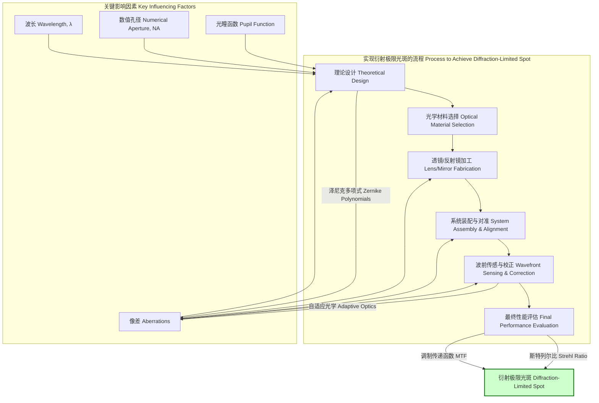
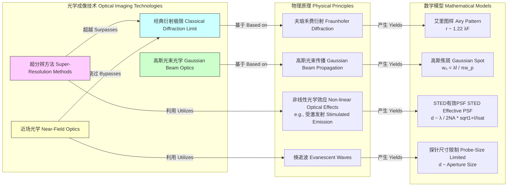

## 衍射极限光斑

衍射极限光斑（Diffraction-Limited Spot）是光学系统性能的理论极限。由于光的波动性，即使一个“完美”的、没有任何几何像差的光学系统，也无法将一个点光源的光线汇聚成一个无限小的点。相反，它会形成一个具有特定尺寸和结构的焦斑，这个最小的焦斑就是衍射极限光斑。其形态和尺寸由光的波长、光学系统的孔径大小和形状决定。最典型的例子是通过圆形光阑（例如透镜的边缘）聚焦时形成的艾里斑（Airy Disk）。

### 核心概念与数学基础

#### 惠更斯-菲涅尔原理与夫琅禾费衍射
衍射现象的根源在于惠更斯-菲涅尔原理，该原理指出波前的每一点都可以被视为一个新的球面子波的源点，而在某点的波场是所有这些子波相干叠加的结果。当平面波通过一个有限大小的孔径（如透镜）时，这些子波会发生干涉，导致光线偏离直线传播路径，从而形成衍射图样。

在透镜的焦平面上观察到的衍射图样属于夫琅禾费衍射（远场衍射）。在这种情况下，焦平面上的复振幅分布可以被精确地描述为出射光瞳处复振幅分布的傅里叶变换。

#### 艾里斑的强度分布
对于一个半径为 $a$ 的圆形光阑，当一束均匀的单色平面波（波长为 $\lambda$）垂直入射并通过透镜聚焦时，在焦平面上形成的衍射图样的光强度 $I$ 分布由以下公式描述：

$$
I(\theta) = I_0 \left[ \frac{2 J_1(k a \sin\theta)}{k a \sin\theta} \right]^2
$$

其中：
*   $I(\theta)$ 是离光轴夹角为 $\theta$ 处的光强度。
*   $I_0$ 是衍射图样中心（$\theta=0$）的最大光强度。
*   $J_1$ 是第一类一阶贝塞尔函数（Bessel function of the first kind of order one）。
*   $k$ 是波数（wavenumber），定义为 $k = 2\pi / \lambda$。
*   $a$ 是圆形光阑的半径。
*   $\theta$ 是从光轴中心指向焦平面上某点的角度。

这个强度分布图样被称为艾里图样（Airy pattern），其中心最亮的区域被称为艾里斑。

#### 瑞利判据与光斑尺寸
瑞利判据（Rayleigh Criterion）定义了光学系统能够分辨两个点源的最小角距离。它规定，当一个点源的艾里图样中心恰好落在另一个点源的艾里图样的第一个暗环上时，这两个点源被认为是恰好可分辨的。

艾里图样的第一个暗环出现在 $J_1(x)$ 的第一个非零根处，即 $x \approx 3.8317$。因此，我们有：
$$
k a \sin\theta = \frac{2\pi}{\lambda} a \sin\theta \approx 3.8317
$$

对于小的角度，$\sin\theta \approx \theta$。光学系统的孔径直径 $D = 2a$。由此可得最小分辨角 $\theta_{\text{min}}$：
$$
\theta_{\text{min}} \approx \frac{3.8317 \lambda}{2\pi a} = \frac{1.2197 \lambda}{D} \approx 1.22 \frac{\lambda}{D} \quad (\text{in radians})
$$

这个角度 $\theta_{\text{min}}$ 也就是艾里斑的角半径。在焦平面上，对应的物理半径 $r_{\text{Airy}}$ 为：
$$
r_{\text{Airy}} = f \tan\theta_{\text{min}} \approx f \theta_{\text{min}} = 1.22 \frac{\lambda f}{D}
$$

其中 $f$ 是透镜的焦距。我们定义光学系统的 F 数（f-number）为 $F = f/D$，因此艾里斑的半径可以简化为：
$$
r_{\text{Airy}} = 1.22 \lambda F
$$

### 关键技术规格

下表总结了衍射极限光斑（艾里图样）的关键规格。

| 技术规格 (Specification) | 数学表达式 (Mathematical Expression) | 典型值/描述 (Typical Value/Description) |
| :--- | :--- | :--- |
| **艾里斑半径 (Airy Disk Radius)** | $r_{\text{Airy}} = 1.22 \lambda F$ | 衍射图样中心到第一个暗环的距离。 |
| **半高全宽 (FWHM)** | $r_{\text{FWHM}} \approx 1.029 \lambda F$ | 中心亮斑强度下降到一半处的直径。 |
| **斯特列尔比 (Strehl Ratio)** | $S = \frac{I_{\text{peak, actual}}}{I_{\text{peak, ideal}}}$ | 实际系统峰值强度与理想系统峰值强度的比值。对于衍射极限系统，$S \ge 0.8$。 |
| **环绕能量 (Encircled Energy)** | $E(r) = \int_0^{2\pi} \int_0^r I(\rho) \rho \,d\rho \,d\phi$ | 特定半径内包含的总能量百分比。 |
| - 艾里斑内能量 | - | 约 83.8% |
| - 第一亮环内能量 | - | 约 7.2% |
| - 第二亮环内能量 | - | 约 2.8% |
| **截止频率 (Cutoff Frequency)** | $f_c = \frac{D}{\lambda f} = \frac{1}{\lambda F}$ | 系统能够传递对比度的最大空间频率。 |

### 常见用例

衍射极限聚焦在许多高精度光学应用中至关重要。

| 应用领域 (Application Area) | 性能指标 (Quantitative Performance Metric) | 描述 (Description) |
| :--- | :--- | :--- |
| **显微成像 (Microscopy)** | 分辨率 (Resolution): $d \approx 0.61 \frac{\lambda}{\text{NA}}$ | 共聚焦显微镜和超分辨显微镜追求衍射极限以获得最高图像清晰度。NA 是数值孔径。 |
| **天文观测 (Astronomy)** | 角分辨率 (Angular Res.): $\theta \approx 1.22 \frac{\lambda}{D}$ | 大型望远镜（如哈勃太空望远镜）的分辨能力直接受其主镜直径 $D$ 决定的衍射极限限制。 |
| **光刻技术 (Lithography)** | 最小特征尺寸 (CD): $CD = k_1 \frac{\lambda}{\text{NA}}$ | 在半导体制造中，投影系统的衍射极限决定了芯片上可以制造的最小电路尺寸。$k_1$ 是工艺因子。 |
| **激光加工 (Laser Processing)** | 功率密度 (Power Density): $P/A \propto 1/(\lambda F)^2$ | 激光切割和焊接需要将能量聚焦到尽可能小的点上，以实现极高的功率密度。 |
| **光镊 (Optical Tweezers)** | 捕获力 (Trapping Force): $F \propto \nabla I$ | 梯度力与光强度的梯度成正比，紧密聚焦的光斑产生强大的力场以捕获微小颗粒。 |

### 实现考量

在实际光学系统中实现衍射极限性能需要精心的设计和制造。

*   **像差控制 (Aberration Control)**: 必须将所有几何像差（如球差、彗差、像散）和色差校正到极低的水平。通常使用泽尼克多项式（Zernike polynomials）来量化波前误差。根据马雷夏尔判据（Marechal criterion），当波前均方根（RMS）误差 $\sigma < \lambda/14$ 时，斯特列尔比 $S > 0.8$，系统可被视为衍射极限。
*   **光瞳照明 (Pupil Illumination)**: 上述艾里斑的公式假设了均匀的光瞳照明。在实际应用中，例如激光系统，光束通常是高斯分布的。高斯光束聚焦后会形成一个高斯形状的焦斑，而不是艾里图样。这会改变焦斑尺寸和旁瓣能量分布。
*   **数值孔径 (Numerical Aperture, NA)**: 为了获得更小的衍射极限光斑，需要尽可能增大系统的数值孔径（$\text{NA} = n \sin\theta_{\text{max}}$，其中 $n$ 是介质折射率）。这是显微物镜和光刻镜头的关键设计目标。
*   **算法复杂度分析 (Algorithmic Complexity Analysis)**: 光学系统的设计和分析严重依赖计算工具。
    *   **光线追迹 (Ray Tracing)**: 复杂度与追迹的光线数量成正比，适用于几何光学分析。
    *   **波前传播 (Wave Propagation)**: 通常使用基于快速傅里叶变换（FFT）的算法来模拟衍射。对于一个 $N \times N$ 的计算网格，其复杂度约为 $O(N^2 \log N)$。这对于精确预测衍射极限光斑的形态至关重要。

### 性能特征

衍射极限系统的性能通过一系列相互关联的指标来表征。

*   **点扩展函数 (Point Spread Function, PSF)**: PSF是系统对一个理想点光源的响应，即焦斑的强度分布。对于无像差的圆形孔径系统，其PSF就是艾里图样。
*   **斯特列尔比 (Strehl Ratio)**: 这是衡量成像质量最常用的单一指标。它与波前误差的方差 $\sigma^2$ 有直接关系，可以通过一个近似公式表达：
    $$
    S \approx e^{-(k\sigma)^2} = e^{-(2\pi\sigma/\lambda)^2}
    $$
    其中 $\sigma$ 是波前误差的均方根（RMS wavefront error）。此公式表明，波前误差越小，斯特列尔比越接近1，系统性能越接近衍射极限。
*   **调制传递函数 (Modulation Transfer Function, MTF)**: MTF是点扩展函数（PSF）的傅里叶变换的模，它描述了系统在不同空间频率下传递物体对比度的能力。一个衍射极限系统的MTF是所有可能实现的MTF中的上限。其截止频率 $f_c$ 完全由 $\lambda$ 和 $F$ 数决定，超过该频率，系统无法传递任何信息。

### 相关技术

经典衍射极限为光学分辨率设定了标准，但也催生了超越这一极限的技术。

#### 高斯光束聚焦 (Gaussian Beam Focusing)
激光器发出的光束通常具有高斯强度分布，而不是均匀分布。一个基模高斯光束（TEM₀₀）在经过透镜聚焦后，其焦斑半径（光强降至 $1/e^2$ 处）为：
$$
w_0 = \frac{\lambda f}{\pi w_p} = \frac{\lambda}{\pi \cdot \text{NA}}
$$
其中 $w_p$ 是光束在透镜入瞳处的半径。与艾里斑（$r_{\text{Airy}} \approx 0.61 \lambda / \text{NA}$）相比，高斯光束的 $1/e^2$ 半径更小，但其能量分布更为分散，没有明显的暗环。真实激光束的质量通过 $M^2$ 因子来衡量，它表示真实光束与理想高斯光束的偏离程度。

#### 超分辨技术 (Super-Resolution Techniques)
这些技术通过物理或化学手段绕过或“欺骗”衍射极限，以实现更高的分辨率。
*   **受激发射损耗显微镜 (STED)**: STED使用两束光：一束激发光（高斯形）和一束损耗光（甜甜圈形）。损耗光通过受激发射使激发区域外围的荧光分子回到基态，从而有效减小了发光区域的尺寸。其有效分辨率 $d$ 可以近似为：
    $$
    d \approx \frac{\lambda}{2\text{NA}\sqrt{1 + I_{\text{dep}}/I_{\text{sat}}}}
    $$
    其中 $I_{\text{dep}}$ 是损耗光强度，$I_{\text{sat}}$ 是饱和强度。理论上，通过增加损耗光强度，分辨率可以无限提高。
*   **近场扫描光学显微镜 (NSOM/SNOM)**: NSOM通过一个尺寸远小于波长的探针（如尖锐的光纤尖端）在样品表面极近的距离（近场区域）进行扫描。分辨率由探针尺寸决定，而非光的波长，从而打破衍射极限。

### 参考文献

1.  Born, M., & Wolf, E. (1999). *Principles of Optics: Electromagnetic Theory of Propagation, Interference and Diffraction of Light* (7th ed.). Cambridge University Press.
2.  Hecht, E. (2017). *Optics* (5th ed.). Pearson.
3.  Goodman, J. W. (2005). *Introduction to Fourier Optics* (3rd ed.). Roberts and Company Publishers.
4.  Strehl, K. (1902). Über Luftschlieren und Zonenfehler. *Zeitschrift für Instrumentenkunde*, 22, 213–217. (This is the original paper defining the Strehl ratio).
5.  Hell, S. W., & Wichmann, J. (1994). Breaking the diffraction resolution limit by stimulated emission: stimulated-emission-depletion fluorescence microscopy. *Optics Letters*, 19(11), 780-782. DOI: [10.1364/OL.19.000780](https://doi.org/10.1364/OL.19.000780)