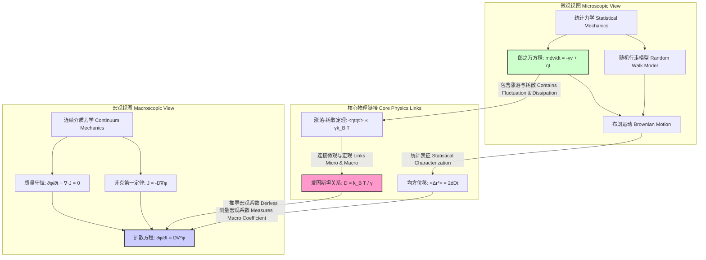
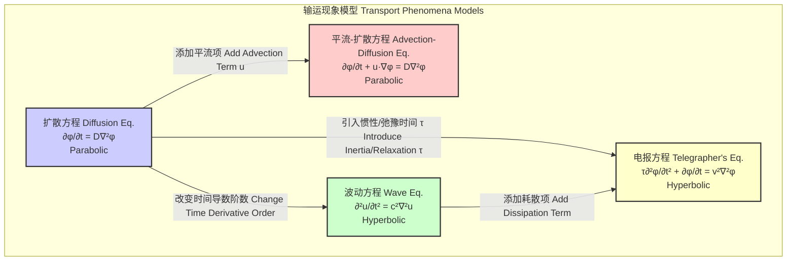

## 扩散动力学

扩散动力学（Diffusive Dynamics）是研究粒子、能量、信息或其他实体因随机运动而在介质中从高浓度区域向低浓度区域净迁移过程的物理学和数学分支。该过程的根本驱动力是系统的熵增原理，即系统倾向于达到最大程度的无序和均匀分布状态。扩散动力学在从物理学、化学、生物学到材料科学、金融工程和环境科学等众多领域都具有核心重要性。

本文档旨在提供关于扩散动力学的全面技术性概述，重点强调其数学基础、技术规格、应用和实现。

### 1. 核心概念与数学基础

扩散动力学的宏观行为和微观起源可以通过互补的理论框架来理解。

#### 1.1 宏观描述：菲克定律与扩散方程

在宏观尺度上，扩散过程由菲克定律（Fick's Laws）描述。

**菲克第一定律 (Fick's First Law)**

该定律指出，在稳态条件下，扩散通量（单位时间内垂直于单位面积通过的物质的量）与浓度梯度成正比。其数学表达式为：

$$
J = -D \nabla \phi
$$

其中：
*   $J$ 是扩散通量（diffusion flux），单位为 $\text{mol} \cdot \text{m}^{-2} \cdot \text{s}^{-1}$ 或 $\text{kg} \cdot \text{m}^{-2} \cdot \text{s}^{-1}$。它是一个矢量，表示物质流动的方向和速率。
*   $D$ 是扩散系数（diffusion coefficient）或弥散度（diffusivity），单位为 $\text{m}^2 \cdot \text{s}^{-1}$。它量化了粒子扩散的快慢，取决于粒子、介质和温度。
*   $\phi$ 是浓度（concentration），单位为 $\text{mol} \cdot \text{m}^{-3}$ 或 $\text{kg} \cdot \text{m}^{-3}$。
*   $\nabla$ 是梯度算子（gradient operator）。负号表示扩散方向与浓度梯度方向相反，即从高浓度区域流向低浓度区域。

**菲克第二定律 (Fick's Second Law) - 扩散方程**

该定律描述了非稳态条件下浓度随时间和空间的变化，它是一个二阶偏微分方程，也称为扩散方程（The Diffusion Equation）。它可以通过结合菲克第一定律和质量守恒的连续性方程 $\frac{\partial \phi}{\partial t} + \nabla \cdot J = 0$ 推导得出。

假设扩散系数 $D$ 是一个常数，则方程为：

$$
\frac{\partial \phi(\mathbf{r}, t)}{\partial t} = D \nabla^2 \phi(\mathbf{r}, t)
$$

其中：
*   $\frac{\partial \phi}{\partial t}$ 是浓度随时间的变化率。
*   $\mathbf{r}$ 是空间位置矢量。
*   $t$ 是时间。
*   $\nabla^2$ 是拉普拉斯算子（Laplace operator），在笛卡尔坐标系中为 $\nabla^2 = \frac{\partial^2}{\partial x^2} + \frac{\partial^2}{\partial y^2} + \frac{\partial^2}{\partial z^2}$。

此方程是描述耗散系统（dissipative systems）中最基本的方程之一。其解描述了初始浓度分布如何随时间演变并趋于均匀。例如，在一维空间中，一个在 $t=0$ 时位于 $x=0$ 的点源（狄拉克δ函数）的解是高斯函数：

$$
\phi(x, t) = \frac{1}{\sqrt{4\pi Dt}} \exp\left(-\frac{x^2}{4Dt}\right)
$$

这个解表明，随着时间的推移，浓度分布的峰值降低，宽度增加，但总物质的量（曲线下的面积）保持不变。

#### 1.2 微观描述：布朗运动与郎之万方程

在微观尺度上，扩散是大量粒子无规则热运动的集体表现。

**布朗运动 (Brownian Motion)**

布朗运动是指悬浮在流体中的微小颗粒所进行的不规则的、永不停息的运动。这种运动的根源是流体分子对颗粒不平衡的、随机的碰撞。

**均方位移 (Mean Squared Displacement, MSD)**

描述布朗运动粒子位移的关键统计量是均方位移（MSD）。对于一个在 $d$ 维空间中进行正常扩散（normal diffusion）的粒子，其MSD与时间成线性关系：

$$
\langle |\mathbf{r}(t) - \mathbf{r}(0)|^2 \rangle = 2dDt
$$

其中：
*   $\langle \cdot \rangle$ 表示对大量粒子或长时间轨迹的系综平均（ensemble average）。
*   $\mathbf{r}(t)$ 是粒子在时间 $t$ 的位置。
*   $d$ 是空间的维度。

这个关系是连接微观随机运动和宏观扩散系数 $D$ 的桥梁。

**郎之万方程 (Langevin Equation)**

郎之万方程是一个随机微分方程，它为单个布朗粒子的运动提供了动力学模型。它将牛顿第二定律扩展到包含随机力：

$$
m \frac{d\mathbf{v}(t)}{dt} = \mathbf{F}_{\text{drag}} + \mathbf{F}_{\text{random}}(t) = -\gamma \mathbf{v}(t) + \boldsymbol{\eta}(t)
$$

其中：
*   $m$ 是粒子的质量。
*   $\mathbf{v}(t)$ 是粒子的速度。
*   $\mathbf{F}_{\text{drag}} = -\gamma \mathbf{v}(t)$ 是流体施加的阻力（drag force），与粒子速度成正比，$\gamma$ 是摩擦系数。
*   $\mathbf{F}_{\text{random}}(t) = \boldsymbol{\eta}(t)$ 是由流体分子碰撞引起的随机力（stochastic force）。它是一个白噪声项，具有以下统计特性：
    *   $\langle \eta_i(t) \rangle = 0$
    *   $\langle \eta_i(t) \eta_j(t') \rangle = 2\Gamma \delta_{ij} \delta(t-t')$

    这里的 $\Gamma$ 是噪声强度，$i, j$ 代表坐标分量。

**涨落-耗散定理 (Fluctuation-Dissipation Theorem)**

随机力（涨落）和阻力（耗散）并非独立，它们都源于与周围流体分子的相互作用。在热平衡状态下，它们通过涨落-耗散定理联系在一起，该定理将噪声强度与系统的物理参数联系起来：

$$
\Gamma = \gamma k_B T
$$

因此，随机力的相关函数变为：
$$
\langle \eta_i(t) \eta_j(t') \rangle = 2\gamma k_B T \delta_{ij} \delta(t-t')
$$

其中：
*   $k_B$ 是玻尔兹曼常数 ($1.380649 \times 10^{-23} \, \text{J} \cdot \text{K}^{-1}$)。
*   $T$ 是绝对温度（Kelvin）。

**爱因斯坦关系 (Einstein Relation)**

通过求解郎之万方程并计算长时间极限下的MSD，可以推导出宏观扩散系数 $D$ 与微观摩擦系数 $\gamma$ 之间的关系，即爱因斯坦关系：

$$
D = \frac{k_B T}{\gamma}
$$

对于半径为 $R$ 的球形粒子，根据斯托克斯定律，$\gamma = 6\pi\eta R$，其中 $\eta$ 是流体的动力粘度。

#### 1.3 理论框架关系图

以下Mermaid图展示了扩散动力学中宏观与微观理论框架之间的联系。

### 2. 关键技术规格

扩散系数 $D$ 是扩散动力学中最重要的参数。其值对物质、介质、温度和压力非常敏感。

| 物质 | 介质 (温度) | 扩散系数 $D$ ($\text{m}^2/\text{s}$) | 数据来源 |
| :--- | :--- | :--- | :--- |
| 氧气 ($O_2$) | 空气 (298 K, 1 atm) | $2.1 \times 10^{-5}$ | 实验测量 |
| 葡萄糖 ($C_6H_{12}O_6$) | 水 (298 K) | $6.7 \times 10^{-10}$ | 动态光散射 |
| 氢 ($H$) | 钯 ($Pd$) (298 K) | $4.0 \times 10^{-11}$ | 电化学方法 |
| 碳 ($C$) | α-铁 (912 °C) | $3.0 \times 10^{-11}$ | 示踪原子法 |
| 硼 ($B$) | 硅 ($Si$) (1100 °C) | $1.5 \times 10^{-17}$ | SIMS分析 |
| 自扩散 | 铜 ($Cu$) (1000 K) | $1.0 \times 10^{-13}$ | 放射性同位素 |

**温度依赖性：阿伦尼乌斯关系**

在许多固态系统中，扩散系数随温度的变化遵循阿伦尼乌斯关系（Arrhenius relation）：

$$
D = D_0 \exp\left(-\frac{E_a}{k_B T}\right)
$$

其中：
*   $D_0$ 是指前因子（pre-exponential factor），表示无限高温时的最大扩散系数。
*   $E_a$ 是扩散的活化能（activation energy），表示原子克服势垒进行迁移所需的能量。

### 3. 常见用例与性能指标

| 应用领域 | 具体用例 | 关键性能指标 (KPI) | 定量示例 |
| :--- | :--- | :--- | :--- |
| **半导体制造** | 掺杂剂（如硼、磷）在硅晶圆中的扩散 | 结深控制精度、掺杂浓度分布均匀性 | 结深控制在目标值 $\pm 1$ nm 内；浓度剖面与目标剖面的均方根误差 < 5% |
| **制药科学** | 药物从控释制剂（如聚合物基质）中的释放 | 药物释放速率、总释放量、释放曲线的可预测性 | 初始释放速率：$5 \pm 0.5 \, \text{mg/h}$；24小时内总释放量达到80% |
| **环境科学** | 地下水中污染物的迁移与扩散 | 污染物羽流（plume）的范围和浓度预测准确性 | 模型预测浓度与实地测量值的决定系数 $R^2 > 0.95$ |
| **材料科学** | 金属合金的均匀化处理 | 成分均匀性、处理时间 | 900°C下退火4小时后，合金元素偏析度从20%降至2%以下 |
| **生物物理学** | 细胞膜上蛋白质的侧向扩散 | 扩散系数 $D$、扩散模式（正常/反常） | 荧光漂白恢复（FRAP）实验测得膜蛋白 $D \approx 10^{-14} - 10^{-12} \, \text{m}^2/\text{s}$ |

### 4. 实现考量与算法分析

解析解仅适用于高度简化的几何和边界条件。在实际应用中，通常需要数值方法来求解扩散方程。

#### 4.1 有限差分法 (Finite Difference Method, FDM)

FDM 是求解偏微分方程最常用的方法之一。其核心思想是将连续的空间和时间域离散化为网格，并用差分近似代替微分。

对于一维扩散方程 $\frac{\partial \phi}{\partial t} = D \frac{\partial^2 \phi}{\partial x^2}$，一个简单的显式格式是**前向时间中心空间（FTCS）**格式：

$$
\frac{\phi_i^{n+1} - \phi_i^n}{\Delta t} = D \frac{\phi_{i+1}^n - 2\phi_i^n + \phi_{i-1}^n}{(\Delta x)^2}
$$

整理后得到迭代格式：

$$
\phi_i^{n+1} = \phi_i^n + r (\phi_{i+1}^n - 2\phi_i^n + \phi_{i-1}^n)
$$

其中：
*   $\phi_i^n$ 表示在空间节点 $i$ 和时间步长 $n$ 的浓度。
*   $\Delta t$ 是时间步长，$\Delta x$ 是空间步长。
*   $r = \frac{D \Delta t}{(\Delta x)^2}$ 是一个无量纲数，称为**冯·诺依曼数**。

**算法复杂度分析**

*   **时间复杂度**: 对于一个具有 $N_x$ 个空间节点和 $N_t$ 个时间步的1D问题，总计算量与 $N_x \times N_t$ 成正比。因此，时间复杂度为 $O(N_x N_t)$。对于 $d$ 维问题，复杂度为 $O(N^d N_t)$，其中 $N$ 是单维度的节点数。
*   **空间复杂度**: 需要存储当前和下一个时间步的浓度分布，因此空间复杂度为 $O(N_x)$（1D）或 $O(N^d)$（d维）。

**稳定性考量**

FTCS格式是**条件稳定**的。为了保证数值解不发散，必须满足冯·诺依曼稳定性条件：

$$
r = \frac{D \Delta t}{(\Delta x)^2} \le \frac{1}{2}
$$

这个条件严重限制了时间步长 $\Delta t$ 的大小，特别是当需要高空间分辨率（小的 $\Delta x$）时，会导致计算成本急剧增加。为了克服这个问题，可以使用**隐式格式**（如Crank-Nicolson格式），它们通常是无条件稳定的，但需要在每个时间步求解一个线性方程组。

### 5. 性能特征与统计度量

#### 5.1 反常扩散 (Anomalous Diffusion)

在许多复杂系统中（如多孔介质、拥挤的细胞环境、玻璃态物质），粒子的MSD与时间不再是线性关系，而呈现幂律关系，这种现象称为反常扩散。

$$
\langle |\mathbf{r}(t) - \mathbf{r}(0)|^2 \rangle \propto t^\alpha
$$

其中 $\alpha$ 是反常扩散指数。
*   $\alpha = 1$：正常扩散（Normal/Brownian diffusion）。
*   $\alpha < 1$：**亚扩散 (Sub-diffusion)**。粒子运动受限，扩散比正常情况慢。常见于拥挤环境或陷阱模型。
*   $\alpha > 1$：**超扩散 (Super-diffusion)**。粒子运动得到增强，扩散比正常情况快。常见于具有长程关联的运动或列维飞行（Lévy flights）。

**统计分析**
通过对实验或模拟数据计算MSD，并在双对数坐标系下绘制MSD对时间的曲线，可以确定 $\alpha$。
*   **计算**: $\text{MSD}(t) = \frac{1}{N} \sum_{i=1}^{N} |\mathbf{r}_i(t) - \mathbf{r}_i(0)|^2$。
*   **拟合**: 在 $\log(\text{MSD})$ vs $\log(t)$ 图上进行线性拟合，斜率即为 $\alpha$。
*   **置信区间**: 对斜率 $\alpha$ 的估计应报告其置信区间（如95% CI），这取决于轨迹的数量和长度。误差会随着轨迹数量的增加而减小，通常与 $1/\sqrt{N_{\text{traj}}}$ 成比例。

#### 5.2 遍历性破缺 (Ergodicity Breaking)

在某些反常扩散系统中，时间平均MSD（对单个长轨迹进行平均）与系综平均MSD（对许多短轨迹进行平均）不相等。这被称为遍历性破缺，是弱遍历性破缺（weak ergodicity breaking）的一种表现，常见于连续时间随机行走（CTRW）模型中。这给实验数据的解释带来了巨大的挑战。

### 6. 相关技术与数学模型比较

扩散动力学是更广泛的输运现象（transport phenomena）的一部分。

| 模型 | 控制方程 | 数学类型 | 物理描述 |
| :--- | :--- | :--- | :--- |
| **纯扩散** | $\frac{\partial \phi}{\partial t} = D \nabla^2 \phi$ | 抛物线型PDE | 纯粹的随机耗散过程，信息传播速度无限快。 |
| **平流-扩散** | $\frac{\partial \phi}{\partial t} + \nabla \cdot (\mathbf{u}\phi) = D \nabla^2 \phi$ | 抛物线型PDE | 描述物质在宏观流场（平流，advection）和微观随机运动（扩散）共同作用下的输运。 |
| **波动方程** | $\frac{\partial^2 u}{\partial t^2} = c^2 \nabla^2 u$ | 双曲型PDE | 描述无损耗的波的传播，如电磁波或理想弦上的振动。具有有限的传播速度 $c$。 |
| **电报方程** | $\frac{\partial^2 \phi}{\partial t^2} + \frac{1}{\tau} \frac{\partial \phi}{\partial t} = c^2 \nabla^2 \phi$ | 双曲型PDE | 介于扩散和波动之间。引入了弛豫时间 $\tau$，描述了具有惯性或有限传播速度的扩散过程。在 $t \gg \tau$ 的极限下，它近似于扩散方程。 |

### 7. 参考文献

1.  Einstein, A. (1905). Über die von der molekularkinetischen Theorie der Wärme geforderte Bewegung von in ruhenden Flüssigkeiten suspendierten Teilchen. *Annalen der Physik*, 322(8), 549-560. **DOI**: [10.1002/andp.19053220806](https://doi.org/10.1002/andp.19053220806)
2.  Fick, A. (1855). Ueber Diffusion. *Annalen der Physik*, 170(1), 59-86. **DOI**: [10.1002/andp.18551700105](https://doi.org/10.1002/andp.18551700105)
3.  Langevin, P. (1908). Sur la théorie du mouvement brownien. *C. R. Acad. Sci. Paris*, 146, 530-533. (Available at: [https://gallica.bnf.fr/ark:/12148/bpt6k3100k/f530.item](https://gallica.bnf.fr/ark:/12148/bpt6k3100k/f530.item))
4.  Metzler, R., & Klafter, J. (2000). The random walk's guide to anomalous diffusion: a fractional dynamics approach. *Physics Reports*, 339(1), 1-77. **DOI**: [10.1016/S0370-1573(00)00070-3](https://doi.org/10.1016/S0370-1573(00)00070-3)
5.  Crank, J. (1975). *The Mathematics of Diffusion*. Oxford University Press. ISBN: 978-0198534112.