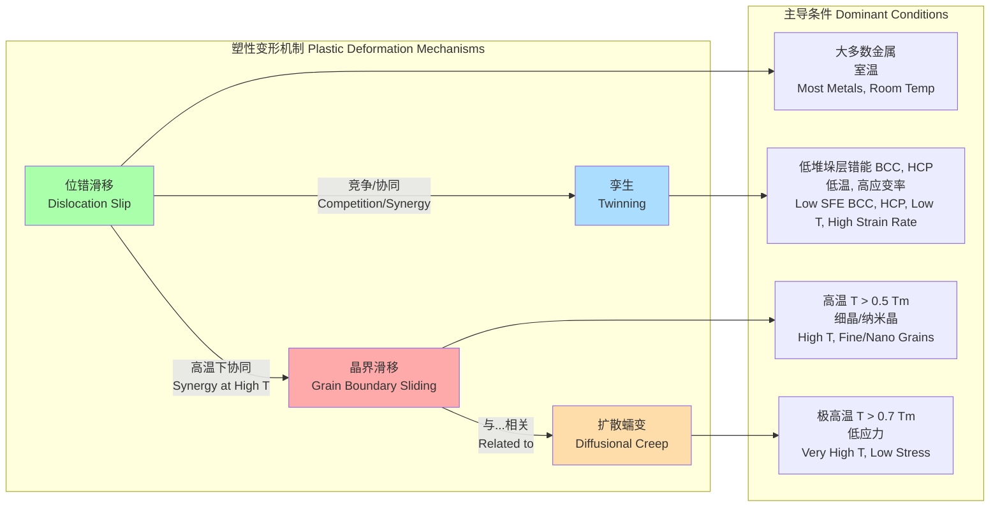

## 位错引致的结构演变

位错是晶体材料中的一维线缺陷，它在材料的塑性变形中扮演着核心角色。在外加应力作用下，位错的运动、增殖和相互作用不仅导致了宏观的形状改变，也引发了材料内部微观结构的深刻演变。本技术文档旨在对这些由位错引致的结构演变提供一个科学严谨的全面概述。

### 核心概念与数学基础

#### 1. 位错：定义与类型
位错由其线矢量 $\vec{\xi}$（位错线的切向矢量）和柏氏矢量（Burgers vector）$\vec{b}$ 来表征。柏氏矢量代表了晶格畸变的量级和方向，并沿着位错线保持守恒。它可以通过一个环绕位错线的闭合回路积分（柏氏回路）来确定：

$$ \vec{b} = -\oint_C d\vec{u} $$

其中，$C$ 是在晶格中环绕位错线的闭合回路，$\vec{u}$ 是位移场。

*   **刃型位错 (Edge Dislocation):** 其特征是 $\vec{b} \perp \vec{\xi}$。可以将其想象为晶体中插入了一个额外的半原子面。
*   **螺型位错 (Screw Dislocation):** 其特征是 $\vec{b} \parallel \vec{\xi}$。可以将其想象为晶体平面发生剪切滑移所形成的螺旋结构。
*   **混合型位错 (Mixed Dislocation):** 同时具有刃型和螺型分量。

#### 2. 位错运动与塑性应变
位错在其滑移面上的运动是塑性变形的根本机制。剪切应变率 $\dot{\gamma}$ 与位错运动之间的关系由 Orowan 方程给出：

$$ \dot{\gamma} = \rho_m b v_d $$

其中：
*   $\rho_m$ 是可动位错的密度 (m/m³ 或 m⁻²)。
*   $b$ 是柏氏矢量的模 (m)。
*   $v_d$ 是位错的平均运动速度 (m/s)。

#### 3. 位错的应力场
位错在其周围的晶格中产生长程应力场。对于各向同性材料中沿 z 轴的螺型位错，在柱坐标系 $(r, \theta, z)$ 下，其非零应力分量为：

$$ \sigma_{rz} = \sigma_{zr} = 0 $$
$$ \sigma_{\theta z} = \sigma_{z\theta} = \frac{G b}{2 \pi r} $$

对于柏氏矢量 $\vec{b}$ 沿 x 轴、位错线 $\vec{\xi}$ 沿 z 轴的刃型位错，其应力分量为：

$$ \sigma_{xx} = - \frac{G b}{2 \pi (1-\nu)} \frac{y(3x^2 + y^2)}{(x^2+y^2)^2} $$
$$ \sigma_{yy} = \frac{G b}{2 \pi (1-\nu)} \frac{y(x^2 - y^2)}{(x^2+y^2)^2} $$
$$ \sigma_{xy} = \sigma_{yx} = \frac{G b}{2 \pi (1-\nu)} \frac{x(x^2 - y^2)}{(x^2+y^2)^2} $$
$$ \sigma_{zz} = \nu (\sigma_{xx} + \sigma_{yy}) = - \frac{\nu G b}{\pi (1-\nu)} \frac{y}{x^2+y^2} $$

其中：
*   $G$ 是剪切模量 (Pa)。
*   $\nu$ 是泊松比 (无量纲)。
*   $(x, y)$ 是相对于位错线的坐标。

#### 4. 驱动位错运动的力：Peach-Koehler 力
作用在单位长度位错线上的力 $d\vec{F}$ 由 Peach-Koehler (P-K) 方程描述，它将外部应力张量 $\boldsymbol{\sigma}$ 与位错的几何特征联系起来：

$$ d\vec{F} = (\boldsymbol{\sigma} \cdot \vec{b}) \times d\vec{l} $$

其中 $d\vec{l}$ 是沿着位错线方向 $\vec{\xi}$ 的线元。该力驱动位错克服晶格阻力（如 Peierls-Nabarro 力）和其他缺陷的阻碍而运动。

#### 5. 主要的结构演变机制

```mermaid
graph TD
    A[施加应力/应变<br>Applied Stress/Strain] --> B弹性变形<br>Elastic Deformation;
    B -- "超过屈服强度<br>Exceeds Yield Strength" --> C[位错运动与增殖<br>Dislocation Motion & Multiplication];
    C --> D["加工硬化<br>Work Hardening ρ ↑"];
    
    subgraph "热激活过程 Thermally Activated Processes"
        D -- "中等温度/应变<br>Moderate T/ε" --> E[动态回复<br>Dynamic Recovery];
        E --> F[亚晶形成/多边形化<br>Subgrain Formation / Polygonization];
        F --> G[小角度晶界 LAGBs<br>Low-Angle Grain Boundaries];
        
        D -- "高等温度/应变<br>High T/ε" --> H[动态再结晶 DRX<br>Dynamic Recrystallization];
        H --> I[无位错的新晶粒<br>New Dislocation-Free Grains];
        I --> J[晶粒细化/组织改变<br>Grain Refinement / Texture Change];
    end

    C -- "极高应变<br>Very High Strain SPD" --> K[纳米晶/非晶化<br>Nanocrystalline / Amorphization];
    C -- "特定合金体系<br>Specific Alloy Systems" --> L[相变<br>Phase Transformation TRIP/TWIP];

    style D fill:#cde4ff
    style G fill:#e6ccff
    style J fill:#d4edda
    style K fill:#fff2cc
    style L fill:#f8d7da
```

*   **加工硬化 (Work Hardening):** 随着塑性应变的增加，位错相互交割、缠结，导致位错密度 $\rho$ 增加。这使得位错运动更加困难，从而提高了材料的屈服强度。这种关系通常由泰勒硬化定律描述：
    $$ \tau = \tau_0 + \alpha G b \sqrt{\rho} $$
    其中 $\tau$ 是流动剪应力，$\tau_0$ 是晶格的本征阻力，$\alpha$ 是一个与位错交互作用相关的常数（通常为 0.2-0.5）。

*   **动态回复 (Dynamic Recovery):** 在较高温度下，位错（特别是螺型位错）通过交滑移和攀移获得更高的迁移率。它们可以重新排列成能量更低的构型，如位错胞或亚晶界，从而部分抵消加工硬化效应。位错密度的演变可以用 Kocks-Mecking 模型来描述，该模型平衡了位错的储存和湮灭：
    $$ \frac{d\rho}{d\gamma} = k_1 \sqrt{\rho} - k_2 \rho $$
    其中 $\gamma$ 是剪切应变，$k_1$ 代表位错储存（与平均自由程相关），$k_2$ 代表动态回复（与热激活过程相关）。

*   **动态再结晶 (Dynamic Recrystallization, DRX):** 在高温和较大应变下，在形变剧烈的区域（如晶界处）会形核并长大出新的、几乎没有位错的晶粒。这个过程会显著改变材料的微观结构、织构和力学性能，通常导致材料软化和韧性提高。

*   **相变 (Phase Transformation):** 位错核心及周围的高应力/应变场可以作为新相形核的优先位置，从而诱发相变。例如，在 TRIP (Transformation Induced Plasticity) 钢中，形变诱导奥氏体向马氏体的转变。

### 关键技术规格

下表总结了不同状态下材料中与位错相关的典型微观结构参数。

| 参数 | 退火态金属 (Annealed) | 冷加工金属 (Cold-Worked) | 严重塑性变形 (SPD) | 单位 |
| :--- | :--- | :--- | :--- | :--- |
| **位错密度, $\rho$** | $10^{10} - 10^{12}$ | $10^{14} - 10^{16}$ | $> 10^{16}$ | m⁻² |
| **屈服强度, $\sigma_y$** | 50 - 300 | 300 - 1000 | > 800 | MPa |
| **亚晶尺寸** | 不适用 | 0.5 - 5 | < 0.5 | µm |
| **亚晶界取向差, $\theta$** | 不适用 | 1 - 5 | 2 - 10 | 度 (°) |
| **DRX 临界应变, $\epsilon_c$** | 不适用 | 0.2 - 0.8 (在 $T > 0.5 T_m$) | N/A | 无量纲 |
| **最终晶粒尺寸** | 20 - 200 | 10 - 100 | 0.05 - 0.5 | µm |

*注：数值为典型范围，具体值取决于材料种类、温度和应变速率。$T_m$ 为熔点温度 (K)。*

### 常见用例与量化性能指标

*   **钢材的冷轧：**
    *   **目标：** 提高强度和硬度。
    *   **机制：** 通过大塑性变形引入极高的位错密度。
    *   **性能指标：** 低碳钢的屈服强度可以从退火态的约 250 MPa 提升至冷轧 80% 后的 700 MPa 以上。位错密度从 $\sim 10^{12} \text{ m}^{-2}$ 增加到 $\sim 10^{15} \text{ m}^{-2}$。

*   **高温合金涡轮叶片的长时蠕变：**
    *   **工况：** 高温（例如 900-1100°C）和持续载荷。
    *   **机制：** 位错攀移和滑移达到平衡，形成稳定的亚晶结构，进入稳态蠕变阶段。
    *   **性能指标：** 对于镍基单晶高温合金，在 1000°C 和 150 MPa 应力下，稳态蠕变速率可低至 $10^{-8} \text{ s}^{-1}$。亚晶尺寸稳定在 2-5 µm。

*   **通过等通道转角挤压 (ECAP) 制备超细晶铝合金：**
    *   **目标：** 获得超细晶粒结构以实现优异的强度-韧性匹配。
    *   **机制：** 严重塑性变形（SPD）引入高密度位错，这些位错通过动态回复和连续动态再结晶转变为大角度晶界。
    *   **性能指标：** 纯铝的屈服强度可从 20 MPa 提高到 250-300 MPa，晶粒尺寸从 >50 µm 细化至 200-500 nm。

### 实现考量与算法分析

模拟位错引致的结构演变是计算材料科学中的一个重要领域。

*   **离散位错动力学 (Discrete Dislocation Dynamics, DDD):**
    *   **描述：** 直接模拟晶体中每条位错线的运动和相互作用。能够精确捕捉位错的个体行为。
    *   **算法复杂度：** 计算位错段之间的长程弹性相互作用是主要瓶颈。直接计算的复杂度为 $O(N^2)$，其中 N 是位错段的数量。使用快速多极子方法 (Fast Multipole Method) 或其他树形代码可将其降至 $O(N \log N)$ 或 $O(N)$。
    *   **适用性：** 适用于研究塑性变形的初始阶段、位错范式形成等基础问题，但计算成本高，模拟的物理尺寸和时间尺度有限。

*   **晶体塑性有限元方法 (Crystal Plasticity Finite Element Method, CPFEM):**
    *   **描述：** 一种连续介质力学方法，在有限元的每个积分点上，通过本构关系来描述滑移系上平均化的位错行为。
    *   **核心方程 (率相关滑移)：**
        $$ \dot{\gamma}^{(\alpha)} = \dot{\gamma}_0 \left| \frac{\tau^{(\alpha)}}{g^{(\alpha)}} \right|^n \text{sgn}(\tau^{(\alpha)}) $$
        其中 $\dot{\gamma}^{(\alpha)}$ 是滑移系 $\alpha$ 上的剪切应变率，$\tau^{(\alpha)}$ 是分切剪应力，$g^{(\alpha)}$ 是滑移系硬度（与位错密度相关），$n$ 是应变率敏感性指数。
    *   **算法复杂度：** 复杂度主要取决于有限元模型的规模（单元数和自由度），而非位错数量。
    *   **适用性：** 适用于模拟宏观构件的力学响应和织构演变，无法解析单个位错。

### 性能特征与统计度量

位错引致的结构演变产物通常具有统计分布特征。

*   **亚晶/晶粒尺寸分布：** 经历再结晶或严重塑性变形后的晶粒尺寸通常不均匀，其分布常用对数正态分布来拟合。
    $$ f(d) = \frac{1}{d \sigma \sqrt{2\pi}} \exp\left(-\frac{(\ln d - \mu)^2}{2\sigma^2}\right) $$
    其中 $d$ 是晶粒尺寸，$\mu$ 和 $\sigma$ 分别是对数尺寸的均值和标准差。
*   **取向差分布：**
    *   由位错排列形成的小角度晶界（LAGBs）在取向差分布图上表现为一个在低角度区域（< 15°）的峰。
    *   完全再结晶的随机织构材料的取向差分布接近于 Mackenzie 分布。
*   **力学性能的统计变化：** 对于经过特定工艺处理的一批样品，其力学性能（如屈服强度）会呈现统计波动。例如，某批次冷轧钢板的屈服强度可表示为 $750 \pm 25 \text{ MPa}$（95% 置信区间），反映了微观结构不均匀性导致的性能差异。

### 相关技术与比较模型

位错滑移是主要的塑性变形机制，但其他机制在特定条件下也起着重要作用。



*   **孪生 (Twinning) vs. 位错滑移:**
    *   **位错滑移:** 原子逐行滑过，滑移量为柏氏矢量 $b$ 的整数倍。
    *   **孪生:** 晶体的一部分区域发生均匀剪切，形成与母体呈镜面对称的孪晶。孪生剪切量 $s$ 是一个固定的晶体学常数。
    *   **数学模型:** 孪生可以被描述为一个仿射变换 $\mathbf{S} = \mathbf{I} + s \vec{d} \otimes \vec{n}$，其中 $s$ 是剪切量，$\vec{d}$ 是剪切方向，$\vec{n}$ 是孪生面的法线。
    *   **比较:** 孪生通常在低温、高应变率或低堆垛层错能材料中更易发生。它能更迅速地协调大的应变，并引入新的晶界，细化晶粒。

*   **位错蠕变 vs. 扩散蠕变:**
    *   **位错蠕变 (Power-Law Creep):** 由位错运动（滑移和攀移）主导，应变率 $\dot{\epsilon}$ 与应力 $\sigma$ 呈幂律关系：
        $$ \dot{\epsilon} = A \sigma^n \exp\left(-\frac{Q_c}{RT}\right) $$
        其中 $n$ 是应力指数（通常为 3-8），$Q_c$ 是蠕变激活能。
    *   **扩散蠕变 (Diffusional Creep):** 由原子通过晶格（Nabarro-Herring 蠕变）或晶界（Coble 蠕变）的扩散主导。应变率与应力呈线性关系 ($n=1$)。
        *   **Nabarro-Herring:** $\dot{\epsilon}_{NH} \propto \frac{D_L}{d^2} \frac{\sigma \Omega}{kT}$
        *   **Coble:** $\dot{\epsilon}_{C} \propto \frac{D_{gb} \delta}{d^3} \frac{\sigma \Omega}{kT}$
        其中 $D_L$ 和 $D_{gb}$ 分别是晶格和晶界扩散系数，$d$ 是晶粒尺寸，$\Omega$ 是原子体积。
    *   **比较:** 扩散蠕变在高温、低应力和细晶粒材料中占主导，而位错蠕变在中高应力下更为重要。

### 参考文献

1.  Hirth, J. P., & Lothe, J. (1982). *Theory of Dislocations* (2nd ed.). John Wiley & Sons. (A foundational text on dislocation theory).
2.  Kocks, U. F., & Mecking, H. (2003). Physics and phenomenology of strain hardening: the FCC case. *Progress in Materials Science*, 48(3), 171-273. DOI: [10.1016/S0079-6425(02)00003-8](https://doi.org/10.1016/S0079-6425(02)00003-8)
3.  Humphreys, F. J., & Hatherly, M. (2004). *Recrystallization and Related Annealing Phenomena* (2nd ed.). Elsevier. (A comprehensive resource on recovery, recrystallization, and grain growth).
4.  Valiev, R. Z., & Langdon, T. G. (2006). Principles of equal-channel angular pressing as a processing tool for grain refinement. *Progress in Materials Science*, 51(7), 881-981. DOI: [10.1016/j.pmatsci.2006.02.003](https://doi.org/10.1016/j.pmatsci.2006.02.003)
5.  Bulatov, V. V., & Cai, W. (2006). *Computer Simulations of Dislocations*. Oxford University Press. DOI: [10.1093/acprof:oso/9780198526145.001.0001](https://doi.org/10.1093/acprof:oso/9780198526145.001.0001)