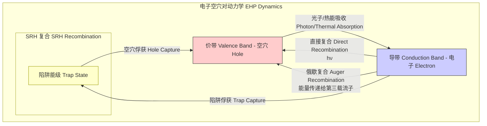
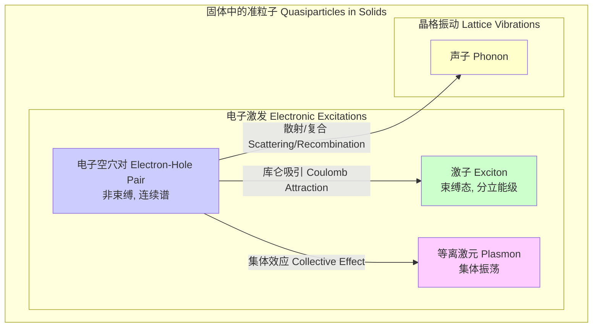

## 电子空穴对 (electron hole pairs)

电子空穴对 (EHP) 是半导体物理学中的核心概念，指的是在半导体材料中由一个导带中的自由电子和一个价带中的空穴组成的激发态。这种成对的载流子是半导体导电、光学和电学特性的基础。

### 核心概念与数学基础

在绝对零度下，纯净（本征）半导体的价带被电子完全填满，而导带是空的，因此不导电。当半导体吸收足够的能量（例如，通过热能或光能）时，价带中的电子可以被激发，跃迁到导带。

当一个电子从价带跃迁到导带时，它在导带中成为一个自由移动的负电荷载流子。同时，它在价带中留下一个空置的量子态。这个空置的态表现为一个带正电荷的准粒子，称为**空穴**。这个导带电子和价带空穴共同构成一个**电子空穴对**。

#### 能量-动量 (E-k) 关系

电子和空穴的行为可以通过能带理论中的能量-动量（E-k）关系图来描述。在导带底和价带顶附近，能带可以近似为抛物线形。

导带中电子的能量可以表示为：
$$ E_c(\vec{k}) = E_c + \frac{\hbar^2 |\vec{k}|^2}{2m_e^*} $$
其中：
*   $E_c(\vec{k})$ 是动量为 $\hbar\vec{k}$ 的电子在导带中的能量。
*   $E_c$ 是导带底的能量。
*   $\hbar$ 是约化普朗克常数 ($1.054 \times 10^{-34}$ J·s)。
*   $\vec{k}$ 是电子的波矢，与动量相关 ($\vec{p} = \hbar\vec{k}$)。
*   $m_e^*$ 是电子的**有效质量**。它反映了电子在周期性晶格势场中运动时受到的影响，通常不同于自由电子质量。

类似地，价带中空穴的能量可以表示为：
$$ E_v(\vec{k}) = E_v - \frac{\hbar^2 |\vec{k}|^2}{2m_h^*} $$
其中：
*   $E_v(\vec{k})$ 是动量为 $\hbar\vec{k}$ 的空穴在价带中的能量。
*   $E_v$ 是价带顶的能量。
*   $m_h^*$ 是空穴的**有效质量**。

**带隙能量** ($E_g$) 定义为导带底和价带顶之间的能量差：$E_g = E_c - E_v$。产生一个电子空穴对所需的最小能量就是 $E_g$。

#### 载流子浓度与质量作用定律

在热平衡状态下，电子浓度 ($n$) 和空穴浓度 ($p$) 的乘积是一个常数，仅与温度和材料固有属性有关。这被称为**质量作用定律**。
$$ np = n_i^2 $$
其中 $n_i$ 是本征载流子浓度，其表达式为：
$$ n_i = \sqrt{N_C N_V} \exp\left(-\frac{E_g}{2k_B T}\right) $$
参数定义如下：
*   $n$: 导带中的电子浓度 (单位: cm⁻³)。
*   $p$: 价带中的空穴浓度 (单位: cm⁻³)。
*   $n_i$: 本征载流子浓度 (单位: cm⁻³)。
*   $N_C$: 导带的有效状态密度 (单位: cm⁻³)，$N_C = 2\left(\frac{2\pi m_e^* k_B T}{h^2}\right)^{3/2}$。
*   $N_V$: 价带的有效状态密度 (单位: cm⁻³)，$N_V = 2\left(\frac{2\pi m_h^* k_B T}{h^2}\right)^{3/2}$。
*   $E_g$: 带隙能量 (单位: eV)。
*   $k_B$: 玻尔兹曼常数 ($8.617 \times 10^{-5}$ eV/K)。
*   $T$: 绝对温度 (单位: K)。
*   $h$: 普朗克常数 ($6.626 \times 10^{-34}$ J·s)。

### 关键技术规格

下表列出了一些常见半导体在室温（300 K）下的关键参数。

| 参数 | 符号 | 硅 (Si) | 锗 (Ge) | 砷化镓 (GaAs) | 单位 |
| :--- | :--- | :--- | :--- | :--- | :--- |
| 带隙能量 | $E_g$ | 1.12 | 0.66 | 1.42 | eV |
| 带隙类型 | - | 间接 | 间接 | 直接 | - |
| 电子有效质量 | $m_e^*/m_0$ | 1.08 | 0.55 | 0.067 | (无量纲) |
| 空穴有效质量 | $m_h^*/m_0$ | 0.81 | 0.37 | 0.45 | (无量纲) |
| 本征载流子浓度 | $n_i$ | $1.0 \times 10^{10}$ | $2.4 \times 10^{13}$ | $2.1 \times 10^6$ | cm⁻³ |
| 电子迁移率 | $\mu_n$ | 1400 | 3900 | 8500 | cm²/(V·s) |
| 空穴迁移率 | $\mu_p$ | 450 | 1900 | 400 | cm²/(V·s) |

*注：$m_0$ 是自由电子的静止质量 ($9.109 \times 10^{-31}$ kg)。有效质量为态密度有效质量。*

### 常见用例

电子空穴对的生成与复合是众多半导体器件工作的物理基础。

*   **光电二极管与光电探测器**:
    *   **原理**: 入射光子能量若大于带隙能量 ($h\nu > E_g$)，则会在耗尽区产生电子空穴对。内建电场将电子和空穴分离，形成光电流。
    *   **性能指标**: **量子效率 (QE, $\eta$)**，定义为每个入射光子所能产生的电子空穴对数量。典型值可达 80-95%。**响应度 ($R$)**，定义为单位入射光功率产生的光电流， $R = \frac{I_{ph}}{P_{in}} = \eta \frac{q}{h\nu}$。对于硅光电二极管，在900 nm波长处，响应度通常为 0.5-0.6 A/W。

*   **太阳能电池**:
    *   **原理**: 大面积的p-n结吸收太阳光，产生大量电子空穴对，并将其分离以产生电压和电流。
    *   **性能指标**: **能量转换效率 (PCE)**，目前单晶硅太阳能电池的实验室PCE记录超过26%。开路电压 ($V_{oc}$) 约 0.7 V，短路电流密度 ($J_{sc}$) 约 40 mA/cm²。

*   **发光二极管 (LED) 与激光二极管 (LD)**:
    *   **原理**: 这是电子空穴对生成的逆过程。通过在p-n结上施加正向偏压，大量电子和空穴被注入到有源区并发生**辐射复合**，以光子的形式释放能量。
    *   **性能指标**: **外量子效率 (EQE)**，即每注入一个电子所能发射到外部的光子数。商用高亮度LED的EQE可超过60%。

### 实现考量：生成与复合动力学

电子空穴对的浓度由生成速率 ($G$) 和复合速率 ($R$) 共同决定。在稳态下，$G = R$。

#### 生成机制
1.  **光生成 ($G_{opt}$)**: 吸收一个能量为 $h\nu$ 的光子，产生一个EHP。生成速率与入射光强和材料吸收系数 $\alpha$ 相关。
2.  **热生成 ($G_{th}$)**: 晶格的热振动（声子）提供能量，使电子跃迁，产生一个EHP。在无光照时，这是主要的生成机制。

#### 复合机制
复合是电子从导带回到价带与空穴结合，并释放能量的过程。

1.  **直接（辐射）复合 (Direct Recombination)**:
    *   电子直接从导带底跃迁到价带顶与空穴复合，并辐射出一个光子。这在直接带隙半导体（如GaAs）中是主要机制。
    *   复合速率 $R_{dir} = B(np - n_i^2)$，其中 $B$ 是复合系数。在低注入下，过剩载流子浓度为 $\Delta n$，则速率约为 $B(n_0+p_0)\Delta n$。其复杂度与载流子浓度的乘积成正比，可视为 $O(np)$。

2.  **间接（非辐射）复合 (Indirect Recombination / SRH)**:
    *   通过位于带隙中的缺陷或杂质能级（陷阱）作为中介进行复合。这是间接带隙半导体（如Si, Ge）中的主要复合机制。
    *   其速率由Shockley-Read-Hall (SRH)模型描述：
        $$ R_{SRH} = \frac{np - n_i^2}{\tau_p(n + n_1) + \tau_n(p + p_1)} $$
        其中：
        *   $\tau_n, \tau_p$: 电子和空穴的俘获寿命。
        *   $n_1 = n_i \exp\left(\frac{E_t - E_i}{k_B T}\right)$, $p_1 = n_i \exp\left(\frac{E_i - E_t}{k_B T}\right)$。
        *   $E_t$: 陷阱能级；$E_i$: 本征费米能级。
    *   在低注入水平下，该速率可简化为 $R_{SRH} \approx \frac{\Delta n}{\tau_{SRH}}$，复杂度为 $O(\Delta n)$。

3.  **俄歇复合 (Auger Recombination)**:
    *   一个电子和一个空穴复合，释放的能量被第三个载流子（电子或空穴）吸收，而不是以光或热的形式释放。
    *   此过程在高载流子浓度下变得显著。
    *   复合速率 $R_{Auger} = C_n(n^2p - nn_i^2) + C_p(np^2 - pn_i^2)$，其中 $C_n, C_p$ 是俄歇系数。其复杂度与载流子浓度的三次方成正比，可视为 $O(n^2p)$ 或 $O(np^2)$。

### 性能特征

*   **载流子寿命 ($\tau$)**:
    *   定义：过剩载流子（由光照等产生）在复合前存在的平均时间。这是一个关键的统计性能指标。
    *   过剩载流子浓度 $\Delta n$ 的衰减遵循指数规律：$\Delta n(t) = \Delta n(0) e^{-t/\tau}$。
    *   总复合寿命由所有机制共同决定：
        $$ \frac{1}{\tau} = \frac{1}{\tau_{dir}} + \frac{1}{\tau_{SRH}} + \frac{1}{\tau_{Auger}} $$
    *   **统计值**: 对于高纯度硅，SRH寿命 $\tau_{SRH}$ 可达毫秒 (ms) 级别。对于高质量的GaAs，辐射寿命 $\tau_{dir}$ 在纳秒 (ns) 级别。

*   **扩散长度 ($L$)**:
    *   定义：载流子在复合前可以扩散的平均距离。它决定了器件收集载流子的能力。
    *   与寿命和扩散系数 ($D$) 相关：
        $$ L = \sqrt{D\tau} $$
    *   扩散系数 $D$ 和迁移率 $\mu$ 通过**爱因斯坦关系**联系：
        $$ D = \frac{k_B T}{q} \mu $$
        其中 $q$ 是基本电荷 ($1.602 \times 10^{-19}$ C)。
    *   **统计值**: 在高质量单晶硅中，电子的扩散长度 $L_n$ 可达数百微米甚至毫米。在直接带隙的GaAs中，由于寿命较短，扩散长度通常在几微米到几十微米。

### 相关技术与比较

电子空穴对是半导体中的基本电子激发，但存在其他类型的准粒子，它们在物理性质和数学模型上有所不同。

#### 电子空穴对 vs. 激子 (Exciton)

*   **电子空穴对 (EHP)**: 一个自由的电子和一个自由的空穴，它们之间没有束缚或关联很弱。它们的能量是连续的，大于带隙能量 $E_g$。
*   **激子 (Exciton)**: 一个通过库仑力相互吸引而束缚在一起的电子-空穴对，类似于一个氢原子。
    *   **数学模型**: 激子的束缚能级可以用类氢原子模型描述：
        $$ E_{exc,n} = E_g - \frac{\mu_{r} q^4}{2(4\pi\epsilon_r\epsilon_0)^2\hbar^2 n^2} = E_g - \frac{R_y^*}{n^2} $$
        其中：
        *   $E_{exc,n}$ 是主量子数为 $n$ 的激子能级。
        *   $\mu_{r} = \frac{m_e^* m_h^*}{m_e^* + m_h^*}$ 是电子空穴对的**约化有效质量**。
        *   $\epsilon_r$ 是材料的相对介电常数。
        *   $R_y^*$ 是有效里德堡能量，即激子的基态束缚能。
    *   **比较**: 激子的能量位于带隙之内，形成分立的能级。只有当激子的束缚能 $R_y^*$ 远大于热能 $k_B T$ 时，激子才能稳定存在。在室温下的硅中，$R_y^* \approx 14.7$ meV，小于 $k_B T \approx 25.9$ meV，因此激子易于热离解成自由的电子空穴对。

#### 电子空穴对 vs. 等离激元 (Plasmon)

*   **电子空穴对**: 单粒子激发，涉及单个电子的跃迁。
*   **等离激元 (Plasmon)**: 自由载流子（电子气或空穴气）的**集体振荡**的量子。
    *   **数学模型**: 等离激元的振荡频率（等离子体频率）为：
        $$ \omega_p = \sqrt{\frac{n q^2}{\epsilon_r \epsilon_0 m_e^*}} $$
        其中 $n$ 是自由载流子密度。
    *   **比较**: EHP的产生需要能量至少为 $E_g$ 的跨带激发，而等离激元是带内激发，其能量 $\hbar\omega_p$ 通常在红外或可见光范围，具体取决于载流子浓度。

### 参考文献

1.  Sze, S. M., & Ng, K. K. (2006). *Physics of Semiconductor Devices*. John Wiley & Sons. DOI: [10.1002/0470068329](https://doi.org/10.1002/0470068329)
2.  Shockley, W., & Read Jr, W. T. (1952). Statistics of the Recombinations of Holes and Electrons. *Physical Review*, 87(5), 835–842. DOI: [10.1103/PhysRev.87.835](https://doi.org/10.1103/PhysRev.87.835)
3.  Hall, R. N. (1952). Electron-Hole Recombination in Germanium. *Physical Review*, 87(2), 387–387. DOI: [10.1103/PhysRev.87.387](https://doi.org/10.1103/PhysRev.87.387)
4.  Yu, P. Y., & Cardona, M. (2010). *Fundamentals of Semiconductors: Physics and Materials Properties*. Springer-Verlag Berlin Heidelberg. DOI: [10.1007/978-3-642-00710-1](https://doi.org/10.1007/978-3-642-00710-1)