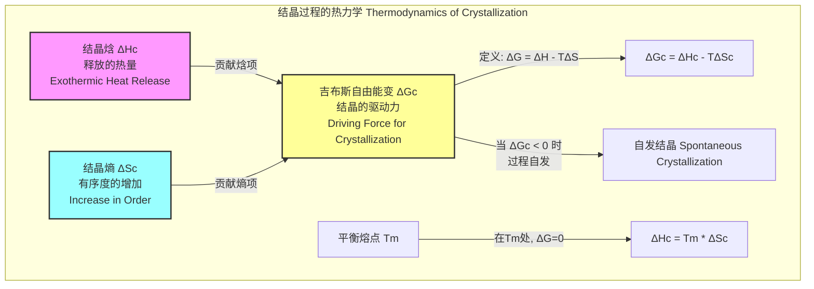

## 结晶焓

结晶焓（Enthalpy of Crystallization），记作 $\Delta H_c$，是一个关键的热力学参数，用于描述物质在恒定温度和压力下从液态（或非晶态）转变为有序的晶态固相时所释放的热量。由于结晶是一个放热过程，结晶焓的值通常为负。它在材料科学、化学、物理学和制药工程等领域具有重要的理论和实践意义。

### 1. 核心概念与数学基础

#### 1.1 热力学定义
根据热力学第一定律，焓 ($H$) 定义为系统的内能 ($U$) 加上压力 ($P$) 和体积 ($V$) 的乘积：
$$ H = U + PV $$
在恒定压力下，系统焓变 ($\Delta H$) 等于系统与环境交换的热量 ($q_p$)。结晶过程是在恒压下发生的相变，因此结晶焓等于结晶前后系统的焓差：
$$ \Delta H_c = H_{\text{晶态}} - H_{\text{液态}} $$
其中，$H_{\text{晶态}}$ 是物质在晶态下的焓，$H_{\text{液态}}$ 是物质在液态（或非晶态）下的焓。由于从无序的液态转变为有序的晶态会释放能量，所以 $H_{\text{晶态}} < H_{\text{液态}}$，导致 $\Delta H_c$ 为负值。

#### 1.2 与熔融焓的关系
结晶是熔融的逆过程。根据赫斯定律，一个过程的焓变与其逆过程的焓变大小相等，符号相反。因此，结晶焓 ($\Delta H_c$) 与熔融焓 ($\Delta H_f$) 的关系为：
$$ \Delta H_c = - \Delta H_f $$
这个关系在实验测量和理论计算中非常重要。通常，通过差示扫描量热法（DSC）在升温过程中测量熔融焓比在降温过程中测量结晶焓更为稳定和精确，因为结晶过程常伴随着难以精确控制的过冷现象。

#### 1.3 吉布斯自由能与结晶驱动力
相变的自发性由吉布斯自由能变 ($\Delta G$) 决定：
$$ \Delta G_c = \Delta H_c - T \Delta S_c $$
其中：
*   $\Delta G_c$ 是结晶过程的吉布斯自由能变 (J/mol 或 J/g)。
*   $\Delta S_c$ 是结晶过程的熵变 (J/(mol·K) 或 J/(g·K))。由于从无序到有序，$\Delta S_c$ 为负值。
*   $T$ 是绝对温度 (K)。

只有当 $\Delta G_c < 0$ 时，结晶过程才能自发进行。在平衡熔点 ($T_m$)，液相和固相共存，$\Delta G_c = 0$。此时，我们得到一个重要关系：
$$ \Delta H_c = T_m \Delta S_c $$
这个方程将宏观可测量的焓变与微观的有序性度量（熵变）联系起来。

### 2. 关键技术规格

下表列出了一些常见物质在标准压力（101.325 kPa）下的标准结晶焓值。

| 物质 (Substance) | 化学式 (Formula) | 摩尔质量 (Molar Mass, g/mol) | 熔点 ($T_m$, °C) | 结晶焓 ($\Delta H_c$, kJ/mol) |
| :--- | :--- | :--- | :--- | :--- |
| 水 (Water) | $H_2O$ | 18.02 | 0.00 | -6.01 |
| 苯 (Benzene) | $C_6H_6$ | 78.11 | 5.5 | -9.87 |
| 萘 (Naphthalene) | $C_{10}H_8$ | 128.17 | 80.26 | -19.1 |
| 铟 (Indium) | In | 114.82 | 156.6 | -3.28 |
| 高密度聚乙烯 (HDPE) | $(C_2H_4)_n$ | - | ~130 | -293 (J/g)* |

*注：对于聚合物，通常使用比焓（单位质量的焓变，J/g），且该值为100%结晶样品的理论值。实际样品的测量值会低于此值。

### 3. 常见用例与量化性能指标

#### 3.1 聚合物结晶度表征
结晶焓是评估半结晶聚合物结晶度的核心指标。结晶度（$\% X_c$）直接影响材料的机械性能（如刚度、强度）和热性能。
*   **性能指标**: 结晶度百分比 ($\% X_c$)
*   **计算方法**:
    $$ \% X_c = \frac{|\Delta H_{c, \text{measured}}|}{|\Delta H_{c, 100\%}|} \times 100\% $$
    其中：
    *   $\Delta H_{c, \text{measured}}$ 是通过实验（如DSC）测得的样品结晶焓 (J/g)。
    *   $\Delta H_{c, 100\%}$ 是该聚合物100%完全结晶时的理论结晶焓 (J/g)，这是一个材料常数。
*   **应用**: 在聚合物加工中，通过控制冷却速率来调控结晶度，从而获得具有特定性能（例如，高强度纤维或高韧性薄膜）的最终产品。

#### 3.2 相变储能材料 (PCM)
相变材料利用其在相变过程中吸收或释放的大量潜热（即熔融焓或结晶焓）来进行热能储存和管理。
*   **性能指标**: 潜热储存密度 (Latent Heat Storage Density, J/g 或 kJ/kg)。
*   **应用**: 具有高结晶焓的材料（如石蜡、盐水合物）被用于建筑节能、热管理系统和恒温纺织品中。$|\Delta H_c|$ 越高，单位质量材料在固化时能释放的热量就越多，储能效率也越高。

#### 3.3 药物制剂开发
在制药领域，许多药物以非晶态固体分散体（Amorphous Solid Dispersions, ASDs）的形式存在，以提高其溶解度和生物利用度。然而，非晶态是热力学亚稳态，有自发结晶的趋势。
*   **性能指标**: 结晶趋势或物理稳定性。
*   **分析**: 结晶焓的大小反映了从非晶态到晶态的能量势垒。一个绝对值较大的 $\Delta H_c$ 意味着结晶过程释放的能量更多，结晶的驱动力更强，这可能导致药物在储存期间结晶，从而降低药效。通过测量 $\Delta H_c$ 可以评估和筛选更稳定的非晶态配方。

### 4. 实施考量（实验测量）

测量结晶焓最常用的技术是差示扫描量热法（DSC）。

#### 4.1 DSC测量算法流程
```mermaid
graph TD
    A[开始: 样品制备] --> B["精确称量样品 m"];
    B --> C["将样品皿和参比皿放入DSC炉体"];
    C --> D["程序升温: 加热样品至熔点以上"];
    D --> E["等温保持: 消除热历史"];
    E --> F["程序降温: 以恒定速率 β 冷却"];
    F --> G["记录热流信号 vs. 温度"];
    G --> H["识别结晶放热峰[";
    H --> I["积分峰面积 A 计算总热量 q"];
    I --> J["计算结晶焓: ΔHc = q / m"];
    J --> K[结束: 输出结果];

    style A fill:#ccf,stroke:#333
    style K fill:#ccf,stroke:#333
    style I fill:#cfc,stroke:#333
    style J fill:#cfc,stroke:#333
```

#### 4.2 算法复杂度分析
DSC数据分析中的核心计算是峰面积的数值积分。如果结晶峰覆盖了 $N$ 个数据点，使用梯形法则或辛普森法则进行积分的计算复杂度为 $O(N)$。这在现代计算中是微不足道的，计算耗时远小于实验本身。

#### 4.3 关键影响因素
*   **冷却速率 ($\beta$)**: 冷却速率显著影响结晶温度 ($T_c$)。速率越快，过冷度（$T_m - T_c$）通常越大。对于某些聚合物，过快的冷却会抑制结晶，导致测得的 $|\Delta H_c|$ 偏小。
*   **样品质量 ($m$)**: 样品质量必须精确测量，因为它是计算比焓的基础。质量太小会导致信号弱，太大则可能引起仪器内部的温度梯度。
*   **基线选择**: 积分基线的选择对峰面积的准确性至关重要。不正确的基线会引入系统误差。
*   **仪器校准**: 必须使用已知熔点和熔融焓的标准物质（如铟、锌）对DSC的温度和热流信号进行定期校准。

### 5. 性能特征与统计度量

*   **可重复性 (Reproducibility)**: 在严格控制的实验条件下，DSC测量的结晶焓值的相对标准偏差 (RSD) 通常可以控制在 **1% 到 5%** 之间。
*   **准确性 (Accuracy)**: 经过良好校准的仪器，其测量结果的准确性通常可以达到理论值的 **±2%** 以内。
*   **过冷效应 (Supercooling Effect)**: 结晶是一个动力学过程，需要过冷才能引发。因此，在DSC降温曲线上观察到的结晶峰起始温度 ($T_{c,onset}$) 总是低于热力学平衡熔点 ($T_m$)。
*   **统计报告**: 严谨的科学报告应提供测量值的置信区间。例如：$\Delta H_c = -150.5 \pm 3.0$ J/g (95% CI)，表示有95%的信心认为真实值落在此区间内。

### 6. 相关技术与比较数学模型

结晶焓是更广泛的热力学和动力学理论框架的一部分。

#### 6.1 热力学势的相互关系


#### 6.2 经典成核理论 (Classical Nucleation Theory, CNT)
CNT 描述了结晶的动力学，特别是新相（晶核）形成的初始阶段。结晶焓是该理论的关键输入参数。
形成一个半径为 $r$ 的球形晶核的自由能变 ($\Delta G(r)$) 包括体积能的降低和表面能的增加：
$$ \Delta G(r) = \frac{4}{3}\pi r^3 \Delta G_v + 4\pi r^2 \gamma $$
其中：
*   $\gamma$ 是晶体-液体界面的表面能 (J/m²)。
*   $\Delta G_v$ 是单位体积的吉布斯自由能变 (J/m³)，是结晶的主要驱动力。它与结晶焓近似相关：
    $$ \Delta G_v \approx \frac{\Delta H_{c,v} (T_m - T)}{T_m} = \frac{\Delta H_c (T_m - T)}{V_m T_m} $$
    *   $\Delta H_{c,v}$ 是单位体积的结晶焓 (J/m³)。
    *   $V_m$ 是摩尔体积 (m³/mol)。
    *   $\Delta T = T_m - T$ 是过冷度。

该理论预测了一个临界成核能垒 $\Delta G^*$：
$$ \Delta G^* = \frac{16 \pi \gamma^3}{3 (\Delta G_v)^2} $$
从这些方程可以看出，一个绝对值更大的结晶焓 ($\Delta H_c$) 会导致一个更负的 $\Delta G_v$，从而降低成核能垒 $\Delta G^*$，加速结晶动力学。这定量地解释了为什么结晶焓是预测材料结晶行为的重要参数。

### 7. 参考文献

*   Wunderlich, B. (2005). *Thermal Analysis of Polymeric Materials*. Springer-Verlag Berlin Heidelberg. DOI: 10.1007/b105378
*   Sperling, L. H. (2006). *Introduction to Physical Polymer Science* (4th ed.). John Wiley & Sons, Inc. DOI: 10.1002/0471757128
*   Gabbott, P. (Ed.). (2008). *Principles and Applications of Thermal Analysis*. Blackwell Publishing Ltd. DOI: 10.1002/9780470697702