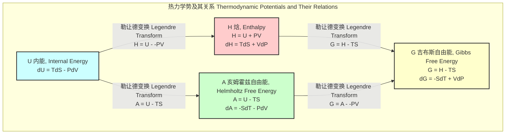

## 焓 (Enthalpy)

焓，作为一个核心的热力学状态函数，量化了系统的总能量含量。它不仅包括系统的内能，还包含了系统为在环境中占据自身体积而必须做的功。这使得焓在分析恒定压力下的过程中尤其有用，因为在这些条件下，焓的变化直接等于系统吸收或释放的热量。

### 1. 核心概念与数学基础

焓 (Enthalpy)，符号为 $H$，被定义为系统的内能 $U$ 与系统的压力 $P$ 和体积 $V$ 的乘积之和。

$$
H \equiv U + PV
$$

其中：
*   $H$ 是焓 (Enthalpy)，单位是焦耳 (J)。
*   $U$ 是系统的内能 (Internal Energy)，单位是焦耳 (J)。
*   $P$ 是系统的绝对压力 (Absolute Pressure)，单位是帕斯卡 (Pa)。
*   $V$ 是系统的体积 (Volume)，单位是立方米 (m³)。

#### 1.1 焓变的物理意义

焓本身是一个状态函数，其绝对值无法直接测量。在热力学中，我们更关心的是其在过程中的变化量，即焓变 ($\Delta H$)。焓的微分形式为：

$$
dH = dU + P dV + V dP
$$

根据热力学第一定律，内能的变化 $dU$ 可以表示为系统吸收的热量 $\delta Q$ 和系统对外做的功 $\delta W$ 的关系式：

$$
dU = \delta Q - \delta W
$$

对于只做体积功（PV功）的简单可压缩系统，$\delta W = P dV$。代入上式：

$$
dU = \delta Q - P dV
$$

将这个 $dU$ 的表达式代入 $dH$ 的微分形式：

$$
dH = (\delta Q - P dV) + P dV + V dP = \delta Q + V dP
$$

这个关系式是理解焓的关键。它表明，在任意可逆过程中，焓的变化等于吸收的热量与 $V dP$ 项之和。

**在恒压过程 (Isobaric Process) 中**，压力变化 $dP = 0$。此时，方程简化为：

$$
dH_P = \delta Q_P
$$

这揭示了焓最重要的物理意义：**在一个封闭系统经历的恒压过程中，系统的焓变等于系统从环境吸收或向环境释放的热量。** 这就是为什么化学反应的热效应通常以焓变 $\Delta H$ 来表示，因为大多数化学反应是在大气压（恒压）下进行的。

*   **放热反应 (Exothermic Reaction):** 系统向环境释放热量，$\delta Q_P < 0$，因此 $\Delta H < 0$。
*   **吸热反应 (Endothermic Reaction):** 系统从环境吸收热量，$\delta Q_P > 0$，因此 $\Delta H > 0$。

#### 1.2 焓与热容

定压热容 $C_P$ 定义为在恒定压力下，系统温度每升高一度所吸收的热量。利用上述关系，它可以直接与焓联系起来：

$$
C_P = \left( \frac{\delta Q_P}{dT} \right)_P = \left( \frac{\partial H}{\partial T} \right)_P
$$

这个偏导数表示在恒定压力下，焓随温度的变化率。对于一个有限的温度变化过程，焓变可以通过对定压热容积分来计算：

$$
\Delta H = H(T_2) - H(T_1) = \int_{T_1}^{T_2} C_P(T) dT
$$

#### 1.3 标准摩尔生成焓

标准摩尔生成焓 ($\Delta H_f^\circ$) 是指在标准状态（通常为 298.15 K 和 1 bar）下，由其最稳定形式的纯元素生成1摩尔化合物时的焓变。根据定义，任何处于标准状态下最稳定形式的单质，其标准生成焓为零。例如，$\Delta H_f^\circ(\text{O}_2, g) = 0$ kJ/mol。

对于一个化学反应，其标准反应焓 ($\Delta H_{rxn}^\circ$) 可以通过赫斯定律 (Hess's Law) 计算，即产物的总生成焓减去反应物的总生成焓：

$$
\Delta H_{rxn}^\circ = \sum_{p} \nu_p \Delta H_{f, p}^\circ - \sum_{r} \nu_r \Delta H_{f, r}^\circ
$$

其中：
*   $\nu_p$ 和 $\nu_r$ 分别是产物 (products) 和反应物 (reactants) 的化学计量系数。
*   $\Delta H_{f, p}^\circ$ 和 $\Delta H_{f, r}^\circ$ 分别是产物和反应物的标准摩尔生成焓。

### 2. 关键技术规格

以下表格列出了一些常见物质的标准摩尔生成焓和化学键的平均键焓。

**表1：常见物质的标准摩尔生成焓 ($\Delta H_f^\circ$)**
(条件: 298.15 K, 1 bar)

| 物质 (Substance) | 化学式 (Formula) | 状态 (State) | $\Delta H_f^\circ$ (kJ/mol) |
| :--- | :--- | :--- | :--- |
| 水 (Water) | $H_2O$ | (l) - 液体 | -285.83 |
| 水蒸气 (Water Vapor) | $H_2O$ | (g) - 气体 | -241.82 |
| 二氧化碳 (Carbon Dioxide) | $CO_2$ | (g) - 气体 | -393.51 |
| 甲烷 (Methane) | $CH_4$ | (g) - 气体 | -74.81 |
| 乙烷 (Ethane) | $C_2H_6$ | (g) - 气体 | -84.68 |
| 乙烯 (Ethene) | $C_2H_4$ | (g) - 气体 | +52.26 |
| 乙炔 (Ethyne) | $C_2H_2$ | (g) - 气体 | +226.7 |
| 氨 (Ammonia) | $NH_3$ | (g) - 气体 | -46.11 |
| 氯化氢 (Hydrogen Chloride) | $HCl$ | (g) - 气体 | -92.31 |

**表2：平均键焓 (Average Bond Enthalpies)**
(注意: 键焓为破坏1摩尔化学键所需的能量，均为正值)

| 化学键 (Bond) | 平均键焓 (kJ/mol) |
| :--- | :--- |
| C-H | 413 |
| C-C | 348 |
| C=C | 614 |
| C≡C | 839 |
| O-H | 463 |
| O=O | 495 |
| C-O | 358 |
| C=O (in $CO_2$) | 799 |
| N≡N | 945 |
| H-H | 436 |

### 3. 常见用例与量化性能指标

焓是工程和科学领域中一个极其重要的工具。

*   **化学反应工程 (Chemical Reaction Engineering)**
    *   **用例:** 设计和操作化学反应器。对于放热反应，必须精确计算反应焓变以设计有效的冷却系统，防止反应器温度失控。对于吸热反应，需要计算所需的热量输入。
    *   **量化指标:**
        *   **反应器热负荷 (Reactor Heat Duty):** $Q = \dot{n} \times \Delta H_{rxn}$，单位为千瓦 (kW) 或兆瓦 (MW)。其中 $\dot{n}$ 是反应物摩尔流率。
        *   **绝热温升 (Adiabatic Temperature Rise):** $\Delta T_{ad} = -\frac{\Delta H_{rxn}}{C_P}$，用于评估安全风险。

*   **热力学循环 (Thermodynamic Cycles)**
    *   **用例:** 分析发电厂（如朗肯循环）和喷气发动机（如布雷顿循环）的性能。循环的每个阶段（压缩、加热、膨胀、冷却）都涉及焓的变化。
    *   **量化指标:**
        *   **循环热效率 (Thermal Efficiency, $\eta_{th}$):** $\eta_{th} = \frac{W_{net}}{Q_{in}} = \frac{(H_{in} - H_{out})_{turbine} - (H_{out} - H_{in})_{pump}}{(H_{in} - H_{out})_{boiler}}$。效率直接由各点焓值决定。
    *   **Mermaid 图示：简化的朗肯循环 (Rankine Cycle)**
        ```mermaid
        graph TD
            subgraph "朗肯循环 Rankine Cycle"
                Node1["1. 泵 Pump<br>h1 -> h2<br>增加压力 Pressure Increase"]
                Node2["2. 锅炉 Boiler<br>h2 -> h3<br>恒压加热 Constant P Heating"]
                Node3["3. 涡轮机 Turbine<br>h3 -> h4<br>膨胀做功 Expansion Work"]
                Node4["4. 冷凝器 Condenser<br>h4 -> h1<br>恒压冷却 Constant P Cooling"]
            end
            
            Node1 -->|W_pump_in = h2-h1| Node2
            Node2 -->|Q_in = h3-h2| Node3
            Node3 -->|W_turbine_out = h3-h4| Node4
            Node4 -->|Q_out = h4-h1| Node1

            style Node2 fill:#ffcccc,stroke:#990000
            style Node3 fill:#ccffcc,stroke:#006600
        ```

*   **相变过程 (Phase Transitions)**
    *   **用例:** 计算物质熔化、汽化或升华所需的热量。例如，在暖通空调 (HVAC) 系统中，制冷剂的蒸发焓（汽化热）是实现冷却的关键参数。
    *   **量化指标:**
        *   **摩尔熔化焓 (Molar Enthalpy of Fusion, $\Delta H_{fus}$):** 水在0°C的 $\Delta H_{fus}$ 为 6.01 kJ/mol。
        *   **摩尔汽化焓 (Molar Enthalpy of Vaporization, $\Delta H_{vap}$):** 水在100°C的 $\Delta H_{vap}$ 为 40.67 kJ/mol。

### 4. 实现考量（计算方法）与算法复杂度

焓变的计算可以通过多种方法实现，其复杂性各不相同。

*   **赫斯定律 (Hess's Law)**
    *   **实现:** 将目标反应表示为一系列已知焓变反应的线性组合。
    *   **算法复杂度:** $O(N)$，其中 $N$ 是用于组合的已知反应的数量。这是一个简单的线性代数问题。

*   **基于键焓的估算**
    *   **实现:** $\Delta H_{rxn} \approx \sum (\text{Bonds Broken}) - \sum (\text{Bonds Formed})$。
    *   **算法复杂度:** $O(M)$，其中 $M$ 是分子中化学键的总数。这是一种快速估算方法，但精度有限。

*   **计算量子化学 (Computational Quantum Chemistry)**
    *   **实现:** 从第一性原理出发，通过求解薛定谔方程来计算分子的总能量，进而得到焓。焓的计算通常包括电子能量、零点振动能 (ZPVE)、热振动贡献以及 $PV$ 项。
        $H = E_{elec} + ZPVE + H_{trans} + H_{rot} + H_{vib} + RT$
    *   **算法复杂度:** 复杂度取决于所选的理论方法，通常与系统大小（以基函数数量 $N$ 衡量）的多项式成正比。
        *   **Hartree-Fock (HF) 方法:** 理论复杂度为 $O(N^4)$。
        *   **密度泛函理论 (DFT) 方法:** 常用泛函的复杂度为 $O(N^3)$。
        *   **高精度耦合簇方法 (e.g., CCSD(T)):** 复杂度为 $O(N^7)$，计算成本非常高，但精度也最高。

### 5. 性能特征与统计度量

焓的测量和计算都存在不确定性，其性能可以用统计指标来描述。

*   **实验测量 (Experimental Measurement)**
    *   **技术:** 等温滴定微量热法 (Isothermal Titration Calorimetry, ITC)、差示扫描量热法 (Differential Scanning Calorimetry, DSC)。
    *   **性能:** 高精度ITC仪器可以测量到纳瓦级别的功率变化。测量结果通常表示为 **平均值 ± 标准差 (Mean ± SD)** 或 **95%置信区间 (95% Confidence Interval)**。例如，一个生物分子结合反应的焓变可能报告为 $\Delta H = -25.4 \pm 0.3$ kJ/mol。

*   **计算预测 (Computational Prediction)**
    *   **性能:** 计算方法的准确性通常通过与大型、可靠的实验数据库（如 G2/97 或 W4-11 测试集）进行比较来评估。
    *   **统计指标:**
        *   **平均绝对误差 (Mean Absolute Error, MAE):** MAE = $\frac{1}{n} \sum_{i=1}^{n} |H_{calc, i} - H_{exp, i}|$
        *   **均方根误差 (Root Mean Square Error, RMSE):** RMSE = $\sqrt{\frac{1}{n} \sum_{i=1}^{n} (H_{calc, i} - H_{exp, i})^2}$
    *   **典型性能:** 对于标准生成焓的计算，常见的B3LYP/6-31G* DFT方法对有机小分子的MAE约为 20-40 kJ/mol。而高精度的复合方法如 G4 或 W4 理论，可以将MAE降低到 1-2 kJ/mol，达到所谓的“化学精度”。

### 6. 相关技术与比较数学模型

焓是四大基本热力学势之一，与其他势函数通过勒让德变换 (Legendre Transformation) 相互关联。



*   **内能 (Internal Energy, $U$)**:
    *   **定义:** $U$ 是系统内部分子运动和相互作用的总能量。
    *   **数学关系:** $dU = \delta Q - P dV$
    *   **比较:** 焓包含了内能以及为系统建立所做的 $PV$ 功。在恒容过程中，内能的变化等于吸收的热量 ($\Delta U = Q_V$)。

*   **亥姆霍兹自由能 (Helmholtz Free Energy, $A$)**:
    *   **定义:** $A = U - TS$
    *   **数学关系:** $dA = -S dT - P dV$
    *   **比较:** 亥姆霍兹自由能代表在恒温恒容条件下，系统能做的最大总功。它是表征自发过程方向的判据（$dA_{T,V} \le 0$）。

*   **吉布斯自由能 (Gibbs Free Energy, $G$)**:
    *   **定义:** $G = H - TS = U + PV - TS$
    *   **数学关系:** $dG = -S dT + V dP$
    *   **比较:** 吉布斯自由能是在恒温恒压条件下，系统能做的最大非体积功。它是化学反应和相变自发性的最终判据（$dG_{T,P} \le 0$）。焓变 $\Delta H$ 是吉布斯自由能方程 $\Delta G = \Delta H - T\Delta S$ 中的焓贡献项，决定了过程是受焓驱动还是熵驱动。

### 7. 参考文献

1.  Atkins, P., de Paula, J. (2014). *Atkins' Physical Chemistry*. 10th ed. Oxford University Press. (A foundational textbook covering all aspects of enthalpy).
2.  Curtiss, L. A., Redfern, P. C., & Pople, J. A. (2000). "Assessment of Gaussian-3 and related approaches for the computation of enthalpies of formation". *The Journal of Chemical Physics*, 114(1), 108–117. DOI: [10.1063/1.1321305](https://doi.org/10.1063/1.1321305). (A key paper on the performance of computational methods for predicting enthalpy).
3.  Freiburger, M. J., et al. (2009). "A high-throughput, high-precision, automated titration calorimeter for the characterization of biopolymer-ligand interactions". *Analytical Biochemistry*, 389(2), 154-160. DOI: [10.1016/j.ab.2009.03.044](https://doi.org/10.1016/j.ab.2009.03.044). (Describes the technical specifications and performance of modern calorimetric instruments).