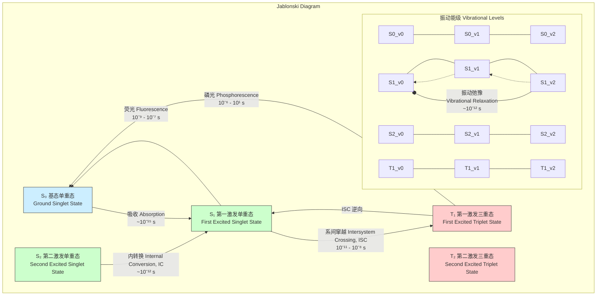
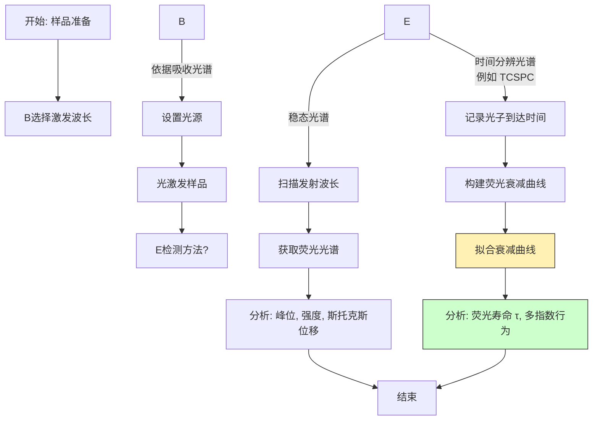

## 激发单重态

激发单重态（Excited Singlet State），在量子化学和光物理学中表示为 $S_n$（其中 $n \ge 1$），是一种特殊的分子电子激发态。在这种状态下，分子吸收了外部能量（通常是光子），导致一个电子从较低能级的分子轨道跃迁到较高能级的分子轨道，但体系的总自旋量子数仍然为零。这意味着被激发的电子与其在原始轨道中的配对电子的自旋方向仍然是相反的（反平行）。激发单重态是理解荧光、能量转移和许多光化学反应的核心。

### 1. 核心概念与数学基础

#### 1.1 电子自旋与自旋多重度

根据量子力学，电子具有一种称为“自旋”的内禀角动量。自旋角动量量子数 $s$ 对单个电子恒为 $1/2$。其在特定方向（通常定义为 z 轴）上的投影由磁自旋量子数 $m_s$ 描述，可取值为 $+1/2$（自旋向上，表示为 $\alpha$）或 $-1/2$（自旋向下，表示为 $\beta$）。

对于一个包含多个电子的分子，总自旋角动量量子数 $S$ 是各个电子自旋矢量和的结果。**自旋多重度 (Spin Multiplicity)** $M$ 描述了在磁场中总自旋角动量可能存在的取向数量，其定义为：

$$ M = 2S + 1 $$

其中：
*   $S$ 是体系的总自旋量子数。
*   $M$ 是自旋多重度。

#### 1.2 单重态与三重态的定义

在一个典型的有机分子中，基态（$S_0$）时所有电子都成对地占据在分子轨道中。根据泡利不相容原理，同一轨道中的两个电子自旋必须相反。

*   **单重态 (Singlet State)**: 当体系的总自旋量子数 $S=0$ 时，自旋多重度 $M = 2(0) + 1 = 1$。这表明体系的总自旋磁矩没有简并态。在双电子体系中，这对应于两个电子的自旋反平行配对。
*   **三重态 (Triplet State)**: 当体系的总自旋量子数 $S=1$ 时，自旋多重度 $M = 2(1) + 1 = 3$。这表明总自旋磁矩有三个简并的量子态（在没有外磁场时能量相同），对应于 $m_S = +1, 0, -1$。在双电子体系中，这对应于两个电子的自旋平行。

#### 1.3 波函数描述

分子的总波函数 $\Psi_{\text{total}}$ 可以近似为空间波函数 $\psi_{\text{spatial}}$ 和自旋波函数 $\sigma_{\text{spin}}$ 的乘积。根据泡利不相容原理，$\Psi_{\text{total}}$ 对于任意两个电子的交换必须是反对称的。

$$ \Psi_{\text{total}}(1, 2) = \psi_{\text{spatial}}(1, 2) \times \sigma_{\text{spin}}(1, 2) $$
$$ \Psi_{\text{total}}(2, 1) = -\Psi_{\text{total}}(1, 2) $$

对于一个双电子体系（例如，考虑HOMO和LUMO中的两个电子）：

*   **单重态 ($S=0$)**:
    其自旋波函数 $\sigma_S$ 是反对称的，因此空间波函数 $\psi_{\text{spatial}}$ 必须是对称的。
    $$ \sigma_S = \frac{1}{\sqrt{2}}[\alpha(1)\beta(2) - \beta(1)\alpha(2)] $$
    基态 $S_0$ 的空间波函数为 $\psi_{\text{spatial, S0}} = \phi_a(1)\phi_a(2)$，其中两个电子在同一轨道 $\phi_a$。
    激发单重态 $S_1$ 的空间波函数为 $\psi_{\text{spatial, S1}} = \frac{1}{\sqrt{2}}[\phi_a(1)\phi_b(2) + \phi_b(1)\phi_a(2)]$，其中电子分别在不同轨道 $\phi_a$ 和 $\phi_b$。

*   **三重态 ($S=1$)**:
    其自旋波函数 $\sigma_T$ 是对称的，因此空间波函数 $\psi_{\text{spatial}}$ 必须是反对称的。
    $$ \sigma_T = \begin{cases} \alpha(1)\alpha(2) & (m_S = +1) \\ \frac{1}{\sqrt{2}}[\alpha(1)\beta(2) + \beta(1)\alpha(2)] & (m_S = 0) \\ \beta(1)\beta(2) & (m_S = -1) \end{cases} $$
    激发三重态 $T_1$ 的空间波函数为 $\psi_{\text{spatial, T1}} = \frac{1}{\sqrt{2}}[\phi_a(1)\phi_b(2) - \phi_b(1)\phi_a(2)]$。

#### 1.4 Jablonski 图与光物理过程

Jablonski 图是描述激发单重态形成和衰变路径的标准模型。

关键过程包括：
*   **吸收 (Absorption)**: 分子从 $S_0$ 吸收一个光子，跃迁到 $S_1$ 或更高的激发单重态 ($S_n$)。这是一个自旋允许的过程，非常快。
*   **内转换 (Internal Conversion, IC)**: 从高能级激发态（如 $S_2$）到低能级激发态（如 $S_1$）的非辐射跃迁，不改变自旋多重度。
*   **荧光 (Fluorescence)**: 从 $S_1$ 辐射光子回到 $S_0$ 的过程。由于是自旋允许的（$\Delta S = 0$），该过程相对较快。
*   **系间窜越 (Intersystem Crossing, ISC)**: 从单重态（如 $S_1$）到三重态（如 $T_1$）的非辐射跃迁。这是一个自旋禁阻的过程（$\Delta S = 1$），通常比荧光慢，但重原子效应可以显著提高其速率。

### 2. 关键技术规格

激发单重态的性质可以通过一系列光物理参数来量化，这些参数对材料的应用至关重要。

| 参数 (Parameter) | 符号 (Symbol) | 定义 (Definition) | 典型值 (Typical Value) | 单位 (Unit) |
| :--- | :--- | :--- | :--- | :--- |
| **能量** | $E(S_1)$ | $S_1$ 态相对于 $S_0$ 态的能量 | 1.5 - 5.0 | eV |
| **寿命** | $\tau_S$ | $S_1$ 态布居数衰减到 $1/e$ 所需的时间 | 1 - 100 | ns |
| **荧光量子产率** | $\Phi_F$ | 发射的荧光光子数与吸收的光子数之比 | 0.01 - 1.0 | 无量纲 |
| **辐射衰变速率常数** | $k_r$ | 通过荧光从 $S_1$ 衰变的速率 | $10^7$ - $10^9$ | s⁻¹ |
| **非辐射衰变速率常数** | $k_{nr}$ | 通过IC和ISC等非辐射途径从 $S_1$ 衰变的总速率 | $10^6$ - $10^{12}$ | s⁻¹ |
| **斯托克斯位移** | $\Delta \tilde{\nu}$ | 吸收光谱峰值与发射光谱峰值之间的能量差 | 500 - 3000 | cm⁻¹ |

### 3. 常见用例

激发单重态的独特性质使其在多个科学和技术领域中得到广泛应用。

*   **荧光光谱与成像**:
    *   **描述**: 利用分子的荧光特性进行物质识别、定量分析和生物成像。$S_1$ 态的寿命和荧光产率对局部环境（如溶剂极性、pH、粘度）高度敏感。
    *   **量化指标**: 荧光探针的灵敏度可达纳摩尔（nM）级别。在**Förster共振能量转移 (FRET)**中，能量从一个供体分子的 $S_1$ 态转移到一个受体分子，其效率 $E$ 与距离 $r$ 的六次方成反比 ($E \propto 1/r^6$)，可用于测量纳米尺度的距离（通常为 1-10 nm）。

*   **有机发光二极管 (OLED)**:
    *   **描述**: 在OLED中，电注入产生激子（电子-空穴对）。根据自旋统计，约25%的激子是单重态，75%是三重态。传统荧光OLED仅利用单重态激子从 $S_1 \to S_0$ 的辐射衰变来发光。
    *   **量化指标**: 纯荧光OLED的内量子效率 (IQE) 理论上限为25%。通过热活化延迟荧光 (TADF) 或超荧光等机制，可将三重态激子转化为单重态，使IQE接近100%。

*   **光动力疗法 (PDT)**:
    *   **描述**: 光敏剂分子吸收光后被激发到 $S_1$ 态，随后通过高效的系间窜越（ISC）布居到长寿命的 $T_1$ 态。$T_1$ 态的光敏剂可将能量转移给基态的氧分子 ($^3O_2$)，生成高活性的单线态氧 ($^1O_2$)，从而杀死癌细胞。
    *   **量化指标**: 高效光敏剂的ISC量子产率 ($\Phi_{ISC}$) 必须很高（通常 > 0.5），以确保有效生成三重态。

### 4. 实现考量

这里的“实现”指激发单重态的实验生成、调控与检测。

#### 4.1 生成与调控

*   **方法**: 主要通过光激发实现。选择光源（如激光、LED）的波长，使其与分子的 $S_0 \to S_1$ 吸收带匹配。
*   **调控**:
    *   **激发强度**: 控制入射光功率，但需注意在高功率下可能发生非线性效应或光漂白。
    *   **分子设计**: 通过化学修饰改变分子的共轭体系、引入给/受体基团或重原子，可以系统地调节 $S_1$ 的能量、寿命和衰变路径。

#### 4.2 检测与分析

检测 $S_1$ 态主要依赖于其荧光发射。

*   **算法复杂度分析**:
    *   荧光衰减曲线的拟合是关键步骤。假设有 $N$ 个数据点，拟合函数为 $I(t) = \sum_{i=1}^{m} A_i e^{-t/\tau_i}$。
    *   对于单指数衰减 ($m=1$)，使用线性化的最小二乘法，复杂度约为 $O(N)$。
    *   对于多指数衰减 ($m>1$)，需要使用非线性最小二乘算法（如Levenberg-Marquardt），这是一种迭代算法，其每次迭代的复杂度约为 $O(m^2 N)$，总复杂度取决于收敛速度。

### 5. 性能特征

$S_1$ 态的“性能”由其光物理参数决定，这些参数具有统计特性。

*   **荧光寿命 ($\tau_F$)**:
    *   定义: 寿命是所有衰变路径总速率的倒数。
      $$ \tau_F = \frac{1}{k_r + k_{nr}} = \frac{1}{k_r + k_{IC} + k_{ISC} + \dots} $$
    *   统计测量: 通过时间相关单光子计数 (TCSPC) 测量，衰减曲线通常用指数函数拟合。结果表示为估计值和置信区间，例如 $\tau_F = 3.51 \pm 0.02$ ns (95% CI)。拟合优度（如卡方值 $\chi^2$）用于评估模型的准确性。

*   **荧光量子产率 ($\Phi_F$)**:
    *   定义: 辐射速率与总衰变速率之比。
      $$ \Phi_F = \frac{k_r}{k_r + k_{nr}} = k_r \tau_F $$
    *   统计测量: 通常通过与已知量子产率的标准品（如罗丹明6G，$\Phi_F = 0.95$ in ethanol）进行比较来测量。测量不确定度来源于吸光度、积分荧光强度和标准品产率的不确定性。最终结果报告为 $\Phi_F = 0.85 \pm 0.05$。

### 6. 相关技术对比：激发三重态

激发单重态 ($S_1$) 最直接相关的概念是激发三重态 ($T_1$)。它们的差异是光化学和光物理学的核心。

| 特性 (Property) | 激发单重态 ($S_1$) | 激发三重态 ($T_1$) |
| :--- | :--- | :--- |
| **总自旋量子数 (S)** | 0 | 1 |
| **自旋多重度 (2S+1)** | 1 (无简并) | 3 (三重简并) |
| **电子自旋** | 反平行配对 (↑↓) | 平行 (↑↑) |
| **能量** | $E(S_1)$ | $E(T_1)$，通常 $E(T_1) < E(S_1)$ |
| **形成方式** | $S_0$ 直接光吸收 (自旋允许) | 主要通过 $S_1$ 的系间窜越 (自旋禁阻) |
| **典型寿命** | 纳秒 ($10^{-9}$ s) | 微秒至秒 ($10^{-6}$ - $10^1$ s) |
| **辐射衰变过程** | 荧光 ($S_1 \to S_0$)，自旋允许 | 磷光 ($T_1 \to S_0$)，自旋禁阻 |
| **辐射衰变速率** | 快 ($k_r \sim 10^8$ s⁻¹) | 慢 ($k_p \sim 10^0 - 10^3$ s⁻¹) |

#### 数学模型：跃迁速率与费米黄金定则

电子态之间的跃迁速率 $W_{i \to f}$ 可由费米黄金定则描述：

$$ W_{i \to f} = \frac{2\pi}{\hbar} |\langle \Psi_f | \hat{H}' | \Psi_i \rangle|^2 \rho(E_f) $$

其中：
*   $\Psi_i$ 和 $\Psi_f$ 分别是初态和终态的总波函数。
*   $\hat{H}'$ 是引起跃迁的微扰哈密顿算符。对于光与物质相互作用，$\hat{H}'$ 是电偶极矩算符 $\hat{\mu}$。
*   $\rho(E_f)$ 是终态的态密度。

跃迁矩阵元 $\langle \Psi_f | \hat{H}' | \Psi_i \rangle$ 决定了跃迁是否“允许”。
$$ \langle \Psi_f | \hat{\mu} | \Psi_i \rangle = \int \psi_{f, \text{spatial}}^* \hat{\mu} \psi_{i, \text{spatial}} d\tau \times \int \sigma_{f, \text{spin}}^* \sigma_{i, \text{spin}} d\sigma $$

*   **荧光 ($S_1 \to S_0$)**: 初态和终态都是单重态，自旋波函数正交归一，$\langle \sigma_{S0} | \sigma_{S1} \rangle = 1$。跃迁是否允许取决于空间部分的积分（跃迁偶极矩）是否为零。这是**自旋允许**的。
*   **系间窜越 ($S_1 \to T_1$)**: 初态是单重态，终态是三重态。它们的自旋波函数是正交的，$\langle \sigma_{T1} | \sigma_{S1} \rangle = 0$。因此，在没有其他相互作用的情况下，跃迁矩阵元为零。这是**自旋禁阻**的。然而，**自旋-轨道耦合 (Spin-Orbit Coupling, SOC)** 算符 ($\hat{H}_{SO}$) 可以混合单重态和三重态的特性，使得该跃迁以较慢的速率发生。重原子（如 I, Br）可以显著增强SOC效应，从而加速ISC过程。

### 7. 参考文献

1.  Turro, N. J., Ramamurthy, V., & Scaiano, J. C. (2010). *Modern Molecular Photochemistry of Organic Molecules*. University Science Books. (这是该领域的权威教科书，全面介绍了激发态的化学和物理。)
2.  Lakowicz, J. R. (2006). *Principles of Fluorescence Spectroscopy*. Springer. (DOI: 10.1007/978-0-387-46312-4) (荧光光谱学领域的经典著作，详细介绍了激发单重态的测量技术和理论。)
3.  Förster, T. (1948). Zwischenmolekulare Energiewanderung und Fluoreszenz. *Annalen der Physik*, 437(1-2), 55-75. (DOI: 10.1002/andp.19484370105) (提出了FRET理论的开创性论文。)
4.  Adachi, C., Baldo, M. A., Thompson, M. E., & Forrest, S. R. (2001). Nearly 100% internal phosphorescence efficiency in an organic light-emitting device. *Journal of Applied Physics*, 90(10), 5048-5051. (DOI: 10.1063/1.1409582) (关于利用三重态实现高效OLED的关键论文，尽管主题是三重态，但与单重态的利用形成对比。)