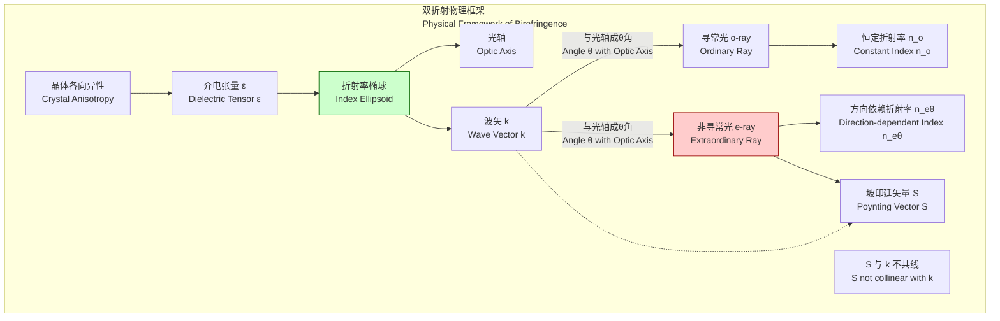

## 非寻常光 (extraordinary ray)

非寻常光（Extraordinary ray），通常简称为e光，是在光穿过各向异性介质（如方解石或石英等双折射晶体）时产生的两种折射光线之一。与另一条光线——寻常光（ordinary ray, o光）不同，非寻常光的传播行为不遵循标准的斯涅尔折射定律，其折射率随传播方向相对于晶体光轴的角度而变化。这种独特的行为源于晶体内部电场与原子结构相互作用的各向异性。

### 核心概念与数学基础

#### 1. 各向异性与介电张量

在光学各向同性介质中，介电常数 $\epsilon$ 是一个标量，电位移矢量 $\mathbf{D}$ 与电场强度矢量 $\mathbf{E}$ 平行。
$$ \mathbf{D} = \epsilon \mathbf{E} $$
然而，在各向异性晶体中，原子在不同方向上的束缚力不同，导致介电常数变为一个二阶张量 $\boldsymbol{\epsilon}$，称为介电张量。

$$ \mathbf{D} = \boldsymbol{\epsilon} \mathbf{E} $$

在无损耗介质的晶体主轴坐标系中，该张量可以对角化：

$$
\boldsymbol{\epsilon} = \epsilon_0
\begin{pmatrix}
\epsilon_x & 0 & 0 \\
0 & \epsilon_y & 0 \\
0 & 0 & \epsilon_z
\end{pmatrix}
= \epsilon_0
\begin{pmatrix}
n_x^2 & 0 & 0 \\
0 & n_y^2 & 0 \\
0 & 0 & n_z^2
\end{pmatrix}
$$

其中：
*   $\mathbf{D}$ 是电位移矢量 (C/m²)。
*   $\mathbf{E}$ 是电场强度矢量 (V/m)。
*   $\epsilon_0$ 是真空介电常数 (≈ 8.854 × 10⁻¹² F/m)。
*   $n_x, n_y, n_z$ 是沿晶体三个主轴方向的主折射率。

对于单轴晶体，其中两个主折射率相等。按惯例，我们将光轴（optic axis）选为z轴，则 $n_x = n_y = n_o$ (寻常光折射率)，$n_z = n_e$ (非寻常光主折射率)。

#### 2. 折射率椭球 (Index Ellipsoid)

折射率椭球（也称“光率体”或“菲涅耳椭球”）是一种几何工具，用于描述和计算在任意方向传播的光波所对应的折射率。其方程在主轴坐标系中为：

$$ \frac{x^2}{n_x^2} + \frac{y^2}{n_y^2} + \frac{z^2}{n_z^2} = 1 $$

对于单轴晶体，方程简化为：

$$ \frac{x^2 + y^2}{n_o^2} + \frac{z^2}{n_e^2} = 1 $$

给定一个波矢 $\mathbf{k}$ 的方向（由单位矢量 $\mathbf{s}$ 表示），可以通过以下步骤确定两种偏振模式的折射率：
1.  过椭球中心作一个垂直于 $\mathbf{s}$ 的平面。
2.  该平面与椭球相交形成一个椭圆。
3.  该椭圆的两个半主轴的长度即为该传播方向上两种正交线偏振光的折射率。

对于单轴晶体：
*   **寻常光 (o-ray)**：其偏振方向（$\mathbf{D}$矢量）垂直于由光轴和波矢$\mathbf{k}$构成的平面。无论$\mathbf{k}$的方向如何，其折射率始终为 $n_o$。
*   **非寻常光 (e-ray)**：其偏振方向（$\mathbf{D}$矢量）位于光轴和波矢$\mathbf{k}$构成的平面内。其折射率 $n_e(\theta)$ 依赖于波矢$\mathbf{k}$与光轴之间的夹角 $\theta$。

$n_e(\theta)$ 的值可以通过折射率椭球的截面方程导出：

$$ \frac{1}{n_e(\theta)^2} = \frac{\cos^2\theta}{n_o^2} + \frac{\sin^2\theta}{n_e^2} $$

其中：
*   $n_e(\theta)$ 是非寻常光在与光轴成 $\theta$ 角方向传播时的折射率。
*   $n_o$ 是寻常光折射率。
*   $n_e$ 是非寻常光主折射率（当光垂直于光轴传播时，$\theta=90^\circ$）。
*   $\theta$ 是波矢 $\mathbf{k}$ 与晶体光轴之间的夹角。

#### 3. 能量传播方向（坡印廷矢量）

非寻常光最“非寻常”的特性是其能量传播方向（由坡印廷矢量 $\mathbf{S}$ 描述）通常不与波的相位传播方向（由波矢 $\mathbf{k}$ 描述）平行。$\mathbf{S} \perp \mathbf{E}$ 且 $\mathbf{S} \perp \mathbf{H}$，而 $\mathbf{k} \perp \mathbf{D}$ 且 $\mathbf{k} \perp \mathbf{B}$。由于在各向异性介质中 $\mathbf{D}$ 与 $\mathbf{E}$ 不平行，导致 $\mathbf{S}$ 与 $\mathbf{k}$ 也不平行。

在折射率椭球模型中：
*   波矢 $\mathbf{k}$ 的方向垂直于椭球面上某一点的切平面。
*   坡印廷矢量 $\mathbf{S}$ 的方向是从椭球中心指向该切点的矢量方向。

只有当光沿着光轴（$\theta = 0^\circ$）或垂直于光轴（$\theta = 90^\circ$）传播时，$\mathbf{S}$ 和 $\mathbf{k}$ 才共线。

### 关键技术规格

下表列出了一些常见单轴晶体在特定波长下的主折射率。晶体根据 $n_e$ 和 $n_o$ 的相对大小分为正单轴晶体（$n_e > n_o$）和负单轴晶体（$n_e < n_o$）。

| 材料 (Material) | 晶系 (Crystal System) | 类型 (Type) | $n_o$ (at 589.3 nm) | $n_e$ (at 589.3 nm) | 双折射率 $\Delta n = |n_e - n_o|$ |
| :--- | :--- | :--- | :--- | :--- | :--- |
| 方解石 (Calcite) | 三方晶系 (Trigonal) | 负单轴 (-) | 1.658 | 1.486 | 0.172 |
| 石英 (α-Quartz) | 三方晶系 (Trigonal) | 正单轴 (+) | 1.544 | 1.553 | 0.009 |
| 钒酸钇 (YVO₄) | 四方晶系 (Tetragonal) | 正单轴 (+) | 1.993 | 2.215 | 0.222 |
| 金红石 (Rutile, TiO₂) | 四方晶系 (Tetragonal) | 正单轴 (+) | 2.616 | 2.903 | 0.287 |
| 氟化镁 (MgF₂) | 四方晶系 (Tetragonal) | 正单轴 (+) | 1.378 | 1.390 | 0.012 |
| 蓝宝石 (Sapphire, Al₂O₃) | 三方晶系 (Trigonal) | 负单轴 (-) | 1.768 | 1.760 | 0.008 |

### 常见用例

非寻常光的独特性质使其在光学系统中有广泛应用，尤其是在偏振控制和非线性光学领域。

*   **偏振器 (Polarizers)**
    *   **应用**: 如格兰-汤普逊棱镜（Glan-Thompson Prism），利用o光和e光在界面处不同的折射行为。在方解石棱镜中，通过精确设计切割角度，使o光在胶合层发生全内反射而被吸收或引出，而e光则能以最小损耗通过，从而产生高度线偏振的光。
    *   **性能指标**: 消光比（Extinction Ratio）是衡量偏振器性能的关键指标，典型值可达 $10^5:1$ 到 $10^6:1$。

*   **波片 (Wave Plates / Retarders)**
    *   **应用**: 用于改变光的偏振态。通过精确控制晶体厚度 $d$，使得o光和e光在出射时产生特定的相位差 $\Delta \phi$。例如，四分之一波片（$\Delta \phi = \pi/2$）可将线偏振光变为圆偏振光，半波片（$\Delta \phi = \pi$）可将线偏振光的偏振方向旋转。
    *   **数学模型**: 相位延迟 $\Delta \phi = \frac{2\pi}{\lambda_0} |n_o - n_e| d$。
    *   **性能指标**: 延迟精度（Retardance Accuracy）通常要求很高，高质量的零级波片可达到 $\lambda/500$。

*   **非线性光学中的相位匹配 (Phase Matching)**
    *   **应用**: 在倍频（SHG）、和频（SFG）等非线性过程中，为实现高效率转换，必须满足动量守恒，即相位匹配条件（例如，$\mathbf{k}_{2\omega} = 2\mathbf{k}_{\omega}$）。由于材料色散，通常 $n(\omega) \neq n(2\omega)$。利用双折射晶体，可以通过改变温度或角度来调节e光的折射率 $n_e(\theta)$，使其在某个特定角度 $\theta_m$ 满足 $n_e^{2\omega}(\theta_m) = n_o^{\omega}$（I类匹配）或类似的条件。
    *   **性能指标**: 转换效率（Conversion Efficiency）是核心指标，在优化的激光系统中可超过 80%。

### 实现考量

#### 波片设计算法
设计一个特定功能的双折射光学元件（如波片）通常遵循以下步骤：
1.  **材料选择**: 根据工作波长、所需双折射率大小、损伤阈值和成本选择合适的晶体（如石英、方解石）。
2.  **厚度计算**: 根据目标相位延迟 $\Gamma$ (以波长为单位，如1/4或1/2) 和工作波长 $\lambda_0$，计算所需厚度 $d$。
    $$ d = \frac{\Gamma \lambda_0}{|n_e - n_o|} $$
3.  **光轴定向**: 晶体的切割必须保证其表面与光轴有精确的角度关系。对于波片，光轴通常平行于元件表面。

#### 灵敏度分析（伪复杂度）
元件性能对外部参数的敏感度是设计中的关键考量，而非传统算法的时间/空间复杂度。
*   **温度敏感度**: 温度会通过热光系数 ($dn/dT$) 和热膨胀系数改变折射率和厚度，从而影响相位延迟。其变化率可表示为 $\frac{d(\Delta \phi)}{dT}$。
*   **波长敏感度**: 由于材料的色散特性，$n_o$ 和 $n_e$ 都是波长 $\lambda$ 的函数，导致相位延迟随波长变化。这种色散效应限制了波片的工作带宽。零级波片的带宽远优于多级波片。

### 性能特征

*   **角接收范围 (Angular Acceptance)**: 元件性能在规格范围内所能容许的入射光角度范围。对于零级波片，典型的角视场约为 ±0.5° 到 ±5°，具体取决于材料和设计。
*   **热稳定性 (Thermal Stability)**: 性能随温度的变化。例如，石英波片的延迟量变化率约为 $10^{-4} \lambda / ^\circ\text{C}$ 量级。通常使用温控装置或设计无热波片来减小影响。
*   **统计测量**: 对于大批量生产的光学元件，其关键性能（如延迟量）通常以均值和标准差（例如 $\Gamma = \lambda/2 \pm 0.001\lambda$ (95% 置信区间)）来表征。

### 相关技术与比较

```mermaid
graph TD
    A["入射非偏振光<br>Unpolarized Incident Light"] --> B["各向异性晶体<br>Anisotropic Crystal[";
    B --> C["寻常光 o-ray<br>Ordinary Ray"];
    B --> D["非寻常光 e-ray<br>Extraordinary Ray"];
    C --> C1["偏振 ⊥ 光轴与k矢量平面<br>Polarization ⊥ plane of Optic Axis & k-vector"];
    C --> C2["折射率 = n_o 常数<br>Refractive Index = n_o constant"];
    C --> C3["遵循标准斯涅尔定律<br>Obeys standard Snell's Law"];
    C --> C4["能量传播S || 波矢k<br>Energy Flow S || Wave Vector k"];
    D --> D1["偏振 ∈ 光轴与k矢量平面<br>Polarization ∈ plane of Optic Axis & k-vector"];
    D --> D2["折射率 = n_eθ 可变<br>Refractive Index = n_eθ variable"];
    D --> D3["不遵循标准斯涅尔定律<br>Violates standard Snell's Law"];
    D --> D4["能量传播S !|| 波矢k<br>Energy Flow S not || Wave Vector k"];

    style C fill:#cceeff,stroke:#004080
    style D fill:#ffcccc,stroke:#990000
```



| 特性 | 寻常光 (o-ray) | 非寻常光 (e-ray) |
| :--- | :--- | :--- |
| **折射率** | 恒定值 $n_o$ | 依赖于方向 $n_e(\theta)$ |
| **斯涅尔定律** | 遵循 | 不遵循（光线方向） |
| **波矢与能流** | $\mathbf{S} \parallel \mathbf{k}$ | $\mathbf{S}$ 与 $\mathbf{k}$ 通常不平行 |
| **偏振** | $\mathbf{D}$ 垂直于光轴-k矢量平面 | $\mathbf{D}$ 在光轴-k矢量平面内 |
| **本征模式** | 线偏振 | 线偏振 |

#### 与其他光学现象的比较

*   **旋光性 (Optical Activity)**
    *   **机理**: 由分子或晶格的手性结构引起的圆双折射，导致左旋和右旋圆偏振光的折射率不同 ($n_L \neq n_R$)。
    *   **数学模型**: 偏振面旋转角 $\rho = \frac{\pi d}{\lambda_0}(n_L - n_R)$。
    *   **对比**: 线性双折射（o/e光）的本征模式是线偏振，而旋光性的本征模式是圆偏振。在石英中，当光沿光轴传播时，表现为旋光性；沿其他方向传播时，则同时表现出线性和圆形双折射。

*   **法拉第效应 (Faraday Effect)**
    *   **机理**: 在外加磁场 $\mathbf{B}$ 作用下，介质（即使是各向同性介质）产生的磁致圆双折射。
    *   **数学模型**: 偏振面旋转角 $\beta = \mathcal{V} B d$，其中 $\mathcal{V}$ 是韦尔德常数。
    *   **对比**: 法拉第效应是由外场诱导的，且具有非互易性（光反向传播时旋转不抵消）；而晶体的自然双折射是其固有属性，具有互易性。

### 参考文献

1.  Born, M., & Wolf, E. (1999). *Principles of Optics* (7th ed.). Cambridge University Press. (ISBN: 978-0521642224)
2.  Saleh, B. E. A., & Teich, M. C. (2019). *Fundamentals of Photonics* (3rd ed.). Wiley. (ISBN: 978-1119506874)
3.  Dmitriev, V. G., Gurzadyan, G. G., & Nikogosyan, D. N. (1997). *Handbook of Nonlinear Optical Crystals*. Springer. (DOI: 10.1007/978-3-662-03358-1)
4.  Yeh, P. (2005). *Optical Waves in Layered Media*. Wiley. (DOI: 10.1002/0471731938)