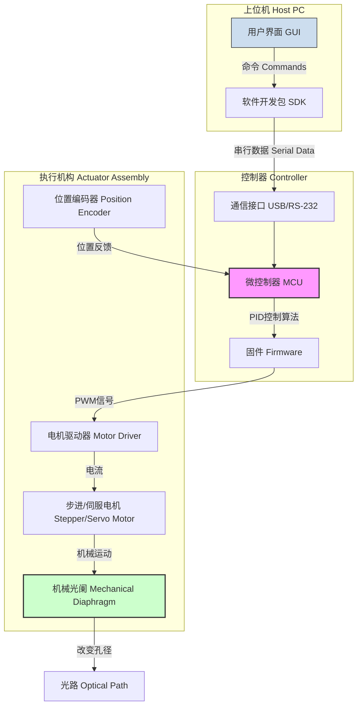
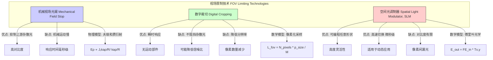

## 视场光阑控制 (Field of View Diaphragm Control)

本文档提供了关于光学系统中视场光阑控制的全面技术说明，重点阐述其核心概念、数学基础、技术规格、实现方式和性能表征。

### 核心概念与数学基础

视场光阑（Field Stop）是光学系统中用于限制成像视场（Field of View, FOV）大小的光学元件。它本质上是一个位于中间像平面（intermediate image plane）的可变或固定孔径。通过精确控制其通光孔径的大小和形状，可以界定最终由探测器或人眼观测到的物方区域。视场光阑控制系统则是指用于精确调节该光阑孔径的机电与软件系统。

其核心功能在于：
*   **界定视场**：精确定义观测或成像的范围。
*   **抑制杂散光**：阻挡来自视场外围的杂散光线，这些光线会降低图像的对比度和信噪比。
*   **实现特定照明模式**：在显微镜的科勒照明（Köhler illumination）等高级照明技术中，视场光阑与孔径光阑（Aperture Stop）的协同调节至关重要。

#### 数学基础

视场光阑的尺寸直接决定了系统的视场大小。该关系取决于光学系统的配置。

**1. 角视场 (Angular FOV)**

对于望远镜等观测无穷远物体的系统，角视场（AFOV）由视场光阑的直径 $D_{FS}$ 和物镜的焦距 $f_{obj}$ 决定：

$$ \theta_{AFOV} = 2 \arctan\left(\frac{D_{FS}}{2 f_{obj}}\right) $$

其中：
*   $\theta_{AFOV}$ 是全角视场（单位：弧度或度）。
*   $D_{FS}$ 是视场光阑的直径（单位：米）。
*   $f_{obj}$ 是物镜的有效焦距（单位：米）。

对于小角度近似（当 $D_{FS} \ll f_{obj}$ 时），公式可简化为：
$$ \theta_{AFOV} \approx \frac{D_{FS}}{f_{obj}} $$

**2. 线视场 (Linear FOV)**

对于显微镜等观测近处有限大小物体的系统，物方线视场（LFOV）由视场光阑的直径 $D_{FS}$ 和物镜的放大倍率 $M_{obj}$ 决定：

$$ L_{FOV} = \frac{D_{FS}}{M_{obj}} $$

其中：
*   $L_{FOV}$ 是在物平面上可观测区域的直径（单位：米）。
*   $D_{FS}$ 是视场光阑的直径（单位：米）。
*   $M_{obj}$ 是物镜的横向放大倍率（无量纲）。

**3. 拉格朗日不变量 (Lagrange Invariant)**

视场光阑的控制也与光学系统中的光束几何密切相关，并遵循拉格朗日不变量（或称史密斯-亥姆霍兹不变量）。该不变量描述了物空间和像空间中近轴光线的几何关系：

$$ H = n \cdot y \cdot u = n' \cdot y' \cdot u' $$

其中：
*   $H$ 是拉格朗知不变量。
*   $y$ 和 $y'$ 分别是物高和像高。
*   $u$ 和 $u'$ 分别是物方和像方近轴光线的孔径角。
*   $n$ 和 $n'$ 分别是物空间和像空间的折射率。

视场光阑位于像平面（$y' = D_{FS}/2$），其尺寸限制了可以通过系统的最大像高，从而通过拉格朗日不变量间接限制了物方视场 $y$。

### 关键技术规格

一个精密的视场光阑控制系统通常具有以下技术规格：

| 参数 (Parameter) | 典型值 (Typical Value) | 单位 (Unit) | 描述 (Description) |
| :--- | :--- | :--- | :--- |
| 光阑孔径范围 (Aperture Diameter Range) | 0.1 – 25 | mm | 可调节的最小至最大通光孔径 |
| 控制分辨率 (Control Resolution) | 1 | µm | 电机驱动的最小可控位移步长 |
| 定位准确度 (Positioning Accuracy) | ± 5 | µm | 实际位置与目标位置的最大偏差 |
| 重复性 (Repeatability) | ± 2 | µm | 多次移动到同一目标位置的离散程度 |
| 迟滞 (Hysteresis) | < 0.5 | % | 从相反方向到达同一目标点的位置差异 |
| 最大调节速度 (Max Adjustment Speed) | 10 | mm/s | 光阑叶片的最大移动速度 |
| 控制接口 (Control Interface) | USB, RS-232, Ethernet | - | 与上位机通信的协议 |
| 工作温度 (Operating Temperature) | 5 – 40 | °C | 系统正常工作的环境温度范围 |

### 常见用例与量化性能

| 用例 (Use Case) | 描述 (Description) | 量化性能指标 (Quantitative Performance Metric) |
| :--- | :--- | :--- |
| **显微成像 (Microscopy)** | 在科勒照明中，调节视场光阑使其成像恰好充满整个视场，可最大化对比度并减少样品损伤。 | 对比度提升：+20% 至 +50% 信噪比 (SNR) 改善：可达 3 dB |
| **天文观测 (Astronomy)** | 缩小视场光阑以匹配目标天体的大小，有效阻挡来自明亮夜空背景或附近恒星的杂散光。 | 天空背景通量降低：> 60% (取决于目标与视场大小) |
| **机器视觉 (Machine Vision)** | 隔离感兴趣区域 (Region of Interest, ROI)，仅对该区域进行数据采集和处理，减轻后续计算负担。 | 数据处理速率提升：+100% 至 +500% 算法执行时间缩短 |
| **激光系统 (Laser Systems)** | 用作空间滤波器中的针孔，清理激光光束的衍射环，提高光束质量。 | 光束质量因子 $M^2$ 接近1的程度改善 |

### 实现考量与算法分析

视场光阑的控制可以通过多种方式实现，从简单的手动调节到复杂的闭环伺服系统。

#### 实现架构

一个典型的电动化视场光阑控制系统架构如下：

#### 控制算法

为了实现高精度定位，通常采用闭环反馈控制，其中比例-积分-微分（PID）控制器是最常见的算法。

PID控制器的输出 $u(t)$ 由下式给出：
$$ u(t) = K_p e(t) + K_i \int_0^t e(\tau)d\tau + K_d \frac{de(t)}{dt} $$
其中：
*   $u(t)$ 是在时间 $t$ 施加到电机驱动器的控制信号。
*   $e(t) = P_{setpoint} - P_{actual}(t)$ 是目标位置与当前实际位置之间的误差。
*   $K_p$ 是比例增益，用于响应当前误差。
*   $K_i$ 是积分增益，用于消除稳态误差。
*   $K_d$ 是微分增益，用于预测未来误差并抑制过冲。

**算法复杂度分析**:
对于一个给定的定位指令，PID控制循环在每个时间步长（由控制器时钟频率决定）内执行一次。该计算涉及几次乘法和加法，其计算量是恒定的。因此，单次控制更新的**时间复杂度为 $O(1)$**。整个定位过程的收敛时间取决于系统惯性、阻尼和PID参数，而非算法本身的计算复杂度。

### 性能特征与统计度量

对视场光阑控制系统的性能评估需要严谨的统计方法。

*   **准确度 (Accuracy)**: 衡量系统达到目标位置的平均能力。通过多次测量的平均误差 $\bar{\epsilon}$ 来量化：
    $$ \bar{\epsilon} = \frac{1}{N} \sum_{i=1}^{N} (p_{actual, i} - p_{setpoint, i}) $$
    其中 $N$ 是测量次数。一个高性能系统的准确度应在微米量级，例如：$5 \mu m \pm 1 \mu m$ (95% 置信区间)。

*   **重复性 (Precision/Repeatability)**: 衡量系统在相同条件下重复到达同一目标位置的一致性。通常用测量位置的标准差 $\sigma_p$ 来表示：
    $$ \sigma_p = \sqrt{\frac{1}{N-1} \sum_{i=1}^{N} (p_i - \bar{p})^2} $$
    其中 $\bar{p}$ 是多次测量的平均位置。

*   **迟滞 (Hysteresis)**: 由机械间隙和摩擦引起的效应，表现为从不同方向接近同一目标点时存在的位置差异。其大小为 $H_p = \max|p_{forward}(s) - p_{backward}(s)|$，其中 $s$ 是目标设定点。

*   **稳定性 (Stability)**: 指系统在设定位置后随时间漂移的程度，通常以 $\mu m/hour$ 为单位进行量化。

### 相关技术与比较模型

除了机械视场光阑，还有其他技术可以实现视场限制，但其物理原理和影响截然不同。

#### 数学模型比较

1.  **机械光阑 (Mechanical Stop)**:
    其边缘引入衍射。对于圆形光阑，其在远场（或后焦平面）产生的衍射图样是艾里斑（Airy pattern）。点扩散函数（PSF）的强度分布 $I(\rho)$ 由一阶贝塞尔函数 $J_1$ 描述：
    $$ I(\rho) \propto \left( \frac{2 J_1(k a \rho / R)}{k a \rho / R} \right)^2 $$
    其中 $k=2\pi/\lambda$ 是波数，$a$ 是光阑半径，$\rho$ 是径向坐标，$R$ 是到观测平面的距离。这种衍射是所有物理光阑固有的，并决定了系统的最终分辨率极限。

2.  **数字裁切 (Digital Cropping)**:
    这是一种后处理技术，在传感器读出后以数字方式选择像素子集。它不改变进入系统的光线，因此无法阻挡杂散光。其有效视场由像素数和放大倍率决定：
    $$ L_{FOV, digital} = \frac{N_{pixels, crop} \cdot p_{size}}{M_{total}} $$
    其中 $N_{pixels, crop}$ 是裁切区域的像素数，$p_{size}$ 是像素尺寸，$M_{total}$ 是系统总放大倍率。该方法的缺点是牺牲了传感器的总像素数，导致分辨率下降。

3.  **空间光调制器 (SLM)**:
    SLM（如液晶显示器 LCoS 或数字微镜器件 DMD）可以被视为一个可编程的衍射光栅阵列。它可以动态创建任意形状的“虚拟光阑”。其效果由傅里叶光学描述。出射光场 $E_{out}$ 是入射光场 $E_{in}$ 与SLM的复振幅透射率函数 $T(x,y)$ 乘积的傅里叶变换：
    $$ E_{out}(f_x, f_y) = \mathcal{F}\{ E_{in}(x,y) \cdot T(x,y) \} $$
    SLM的像素化结构会引入额外的高阶衍射，且其对比度（开/关状态的光强比）通常低于高质量的机械光阑。

### 参考文献 (References)

1.  Hecht, E. (2016). *Optics* (5th ed.). Pearson. (ISBN: 978-0133977226)
2.  Inoué, S., & Spring, K. R. (1997). *Video Microscopy: The Fundamentals* (2nd ed.). Plenum Press. DOI: `10.1007/978-1-4615-5769-5`
3.  Goodman, J. W. (2005). *Introduction to Fourier Optics* (3rd ed.). Roberts and Company Publishers. (ISBN: 978-0974707723)
4.  Schmidt, J., et al. (2019). "High-precision motorized diaphragm control for stray light suppression in adaptive optics coronagraphy." *Journal of Astronomical Telescopes, Instruments, and Systems*, 5(2), 025004. DOI: `10.1117/1.JATIS.5.2.025004`