## 一阶液-液相变

一阶液-液相变（First-Order Liquid-Liquid Transition, LLT）是一种物理现象，指单一组分的物质在液态下可以存在两种或多种宏观上可区分的、不混溶的液相。这两种液相（通常称为低密度液相，LDL 和高密度液相，HDL）在结构和物理性质（如密度、熵、黏度）上存在显著差异。该相变在热力学上被归类为一级相变，其特征是在相变温度和压力下，系统的吉布斯自由能连续，但其一阶导数（如熵和体积）不连续。

### 1. 核心概念与数学基础

#### 1.1 热力学判据

根据热力学理论，一个处于恒定温度（$T$）和压力（$P$）下的系统的平衡态由其吉布斯自由能（$G$）的最小值确定。

$$ G = U + PV - TS $$

其中：
*   $G$ 是吉布斯自由能 (J)
*   $U$ 是内能 (J)
*   $P$ 是压力 (Pa)
*   $V$ 是体积 (m³)
*   $T$ 是绝对温度 (K)
*   $S$ 是熵 (J/K)

在一阶液-液相变点 $(T_{LLT}, P_{LLT})$，两种液相（$L_1$ 和 $L_2$）共存并处于热力学平衡。这意味着它们的吉布斯自由能相等：

$$ G_{L_1}(T_{LLT}, P_{LLT}) = G_{L_2}(T_{LLT}, P_{LLT}) $$

一阶相变的标志是吉布斯自由能的一阶偏导数不连续。具体表现为：

*   **熵的不连续性（潜热）**: 熵是吉布斯自由能对温度的偏导数。
    $$ S = - \left( \frac{\partial G}{\partial T} \right)_P $$
    在相变点，熵发生突变：
    $$ \Delta S_{LLT} = S_{L_2} - S_{L_1} \neq 0 $$
    这导致了相变潜热 $L_{LLT}$ 的存在：
    $$ L_{LLT} = T_{LLT} \Delta S_{LLT} $$

*   **体积的不连续性**: 体积是吉布斯自由能对压力的偏导数。
    $$ V = \left( \frac{\partial G}{\partial P} \right)_T $$
    在相变点，体积发生突变：
    $$ \Delta V_{LLT} = V_{L_2} - V_{L_1} \neq 0 $$

#### 1.2 相图与临界点

一阶液-液相变通常发生在远离常规液-气临界点的低温高压区。在P-T相图中，两种液相的共存线描述了 $G_{L_1} = G_{L_2}$ 的条件。这条共存线的斜率由克劳修斯-克拉佩龙方程给出：

$$ \frac{dP}{dT} = \frac{\Delta S_{LLT}}{\Delta V_{LLT}} = \frac{L_{LLT}}{T_{LLT} \Delta V_{LLT}} $$

这条一阶相变线会终结于一个**液-液临界点 (Liquid-Liquid Critical Point, LLCP)**，其坐标为 $(T_c', P_c')$。在临界点之上，两种液相之间的界限消失，它们可以连续地相互转变，此时相变为二级（或连续）相变。

```mermaid
graph TD
    subgraph "物质的P-T相图 P-T Phase Diagram of a Substance"
        direction LR
        Solid[固相 Solid]
        Liquid[液相 Liquid]
        Gas[气相 Gas]
        
        subgraph "过冷液区 Supercooled Liquid Region"
            LDL[低密度液相 LDL]
            HDL[高密度液相 HDL]
            LLCP[液-液临界点 LLCP, T_c', P_c']
        end

        CP[气-液临界点 Gas-Liquid Critical Point]
        TP[三相点 Triple Point]
        
        Solid -- "熔化/凝固线 Melting/Freezing Line" --> Liquid;
        Liquid -- "蒸发/冷凝线 Vaporization/Condensation Line" --> Gas;
        Solid -- "升华/凝华线 Sublimation/Deposition Line" --> Gas;
        
        Liquid -- "过冷 Supercooling" --> LDL;
        Liquid -- "加压 Pressurization" --> HDL;
        
        LDL -- "一阶LLT共存线 First-Order LLT Coexistence Line" --- HDL;
        HDL -- "Widom线 Widom Line" --> LLCP;
        LDL -- "Widom线 Widom Line" --> LLCP;
        
        Liquid -- "蒸发/冷凝线" -- "终点 Terminates at" --> CP;
        Solid -- "熔化/凝固线" -- "起点 Starts from" --> TP;
        Liquid -- "蒸发/冷凝线" -- "起点 Starts from" --> TP;
        Solid -- "升华/凝华线" -- "终点 Terminates at" --> TP;
    end

    style LLCP fill:#ff6347,stroke:#333,stroke-width:4px
    style LDL fill:#add8e6,stroke:#333
    style HDL fill:#4682b4,stroke:#333
```

### 2. 关键技术参数

以过冷水为例，其液-液相变假说预测了以下参数。这些值主要来自计算机模拟，因为实验上很难在水结晶前进行测量（该区域被称为“无人区”）。

| 参数 (Parameter) | 符号 (Symbol) | 典型值 (Typical Value) | 单位 (Unit) | 备注 (Notes) |
| :--- | :---: | :---: | :---: | :--- |
| 液-液临界温度 (Liquid-Liquid Critical Temperature) | $T_c'$ | ~225 | K | 基于ST2或TIP4P/2005水模型的模拟值 |
| 液-液临界压力 (Liquid-Liquid Critical Pressure) | $P_c'$ | ~100 | MPa | 模拟值，不同模型差异较大 |
| 相变潜热 (Latent Heat of Transition) | $L_{LLT}$ | ~1.0 | kJ/mol | 远离临界点的值 |
| 相变体积变化 (Volume Change of Transition) | $\Delta V_{LLT}$ | ~4.5 (20%) | cm³/mol | HDL (~18 cm³/mol) vs LDL (~22.5 cm³/mol) |
| 临界指数 - 压缩率 (Critical Exponent - Compressibility) | $\gamma$ | 1.1 ± 0.2 | 无量纲 | 描述等温压缩率在临界点附近的发散行为 |
| 临界指数 - 热容 (Critical Exponent - Heat Capacity) | $\alpha$ | 0.5 ± 0.1 | 无量纲 | 描述定压热容在临界点附近的发散行为 |

### 3. 常见应用场景

液-液相变作为一个基础物理化学现象，其理论被用于解释和预测多个领域的复杂行为。

*   **解释水的反常物性**:
    *   **现象**: 水在4°C时密度最大、过冷时等温压缩率 ($\kappa_T$) 和定压热容 ($C_P$) 急剧增大。
    *   **LLT解释**: 这些反常现象被认为是液-液临界点 $(T_c', P_c')$ 存在的前兆。在临界点附近，热力学响应函数会发散。
    *   **量化指标**: 实验数据表明，$\kappa_T$ 和 $C_P$ 随温度降低近似遵循幂律发散，这与临界现象理论一致：
        $$ \kappa_T(T) \propto |T - T_s(P)|^{-\gamma} $$
        其中 $T_s(P)$ 是响应函数极大值出现的温度线（Widom线），在临界点之上是 $T_c'$ 的延伸。

*   **非晶态物质（玻璃）的多形态性**:
    *   **现象**: 水可以形成低密度非晶冰（LDA）和高密度非晶冰（HDA）。
    *   **LLT解释**: LDA和HDA被认为是低密度液相（LDL）和高密度液相（HDL）通过玻璃化转变快速“冻结”而成的固态对应物。通过压力可以诱导HDA和LDA之间的转变。
    *   **量化指标**: HDA的密度约为1.17 g/cm³，而LDA的密度约为0.94 g/cm³，两者密度差接近25%，与理论预测的LDL-HDL密度差相符。

*   **生物物理与蛋白质折叠**:
    *   **现象**: 蛋白质的稳定性和功能与其周围的水化层结构密切相关。
    *   **LLT解释**: 在过冷温度下，蛋白质周围可能存在LDL和HDL两种结构的水。这两种水的结构和动力学差异会显著影响蛋白质的构象能量景观，从而影响其折叠路径和稳定性。

### 4. 实现考量

在实验和计算中研究LLT极具挑战性，因为它通常发生在亚稳态区域，易于被结晶过程掩盖。

#### 4.1 实验方法
*   **超快冷却/加热**: 采用皮秒或纳秒级的激光脉冲对微小水滴进行加热或冷却，速率高达 $10^7$ K/s，以“飞跃”结晶温度区间。
*   **高压囚禁**: 使用金刚石压砧（Diamond Anvil Cell）在低温下对样品施加高压，可以抑制结晶并探索P-T相图的高压区域。
*   **结构探测**: 利用X射线散射（XRS）或中子散射（NS）技术实时探测液体在相变过程中的结构因子 $S(Q)$ 和对关联函数 $g(r)$ 的变化。

#### 4.2 计算模拟方法（分子动力学）

分子动力学（MD）模拟是研究LLT最主要的理论工具。

*   **算法**:
    1.  **初始化**: 在三维空间中设置N个分子的初始位置和速度。
    2.  **力计算**: 根据预设的力场（势函数，如TIP4P/2005），计算每个分子受到的力。
    3.  **积分运动方程**: 使用Verlet或Leap-frog等算法，根据牛顿第二定律更新每个分子的位置和速度，时间步长为 $\Delta t$。
        $$ \vec{r}_i(t+\Delta t) = \vec{r}_i(t) + \vec{v}_i(t)\Delta t + \frac{1}{2}\vec{a}_i(t)\Delta t^2 $$
        $$ \vec{v}_i(t+\Delta t) = \vec{v}_i(t) + \frac{1}{2}(\vec{a}_i(t) + \vec{a}_i(t+\Delta t))\Delta t $$
    4.  **循环**: 重复步骤2和3，直到达到所需模拟时长。

*   **算法复杂度分析**:
    *   MD模拟的主要计算开销在于非键相互作用（范德华力和静电力）的计算。
    *   **朴素算法**: 计算所有粒子对之间的相互作用，复杂度为 $O(N^2)$，其中 $N$ 是粒子数。
    *   **截断半径法**: 只考虑截断半径 $r_c$ 内的粒子相互作用，复杂度降为 $O(N)$。
    *   **粒子-网格-Ewald (PME) 方法**: 用于高效计算长程静电力，将计算分为实空间部分和倒易空间部分，后者使用快速傅里叶变换（FFT）。总复杂度为 $O(N \log N)$，是现代大规模模拟的标准。

### 5. 性能特征

LLT的特征体现在热力学、结构和动力学三个方面。

#### 5.1 热力学响应函数发散
接近液-液临界点 $(T_c', P_c')$ 时，系统的热力学响应函数表现出幂律发散行为，这是临界现象的普遍特征。
*   **等温压缩率**: $\kappa_T = -\frac{1}{V}(\frac{\partial V}{\partial P})_T \propto |T - T_c'|^{-\gamma}$
*   **定压热容**: $C_P = T(\frac{\partial S}{\partial T})_P \propto |T - T_c'|^{-\alpha}$
*   **热膨胀系数**: $\alpha_P = \frac{1}{V}(\frac{\partial V}{\partial T})_P \propto |T - T_c'|^{-\alpha}$

#### 5.2 统计特征
*   **序参量分布**: 可以选择密度 $\rho$ 或局部结构序参量（如四面体序参量 $q$）作为区分LDL和HDL的序参量。
    *   在相变线以下（共存区），序参量的概率分布呈现双峰形态，两个峰分别对应LDL和HDL。
    *   在临界点之上，分布变为单峰，但其方差（涨落）在Widom线附近达到最大值。
*   **涨落**: 临界点处的涨落尺度发散。密度涨落的方差与等温压缩率成正比：
    $$ \langle (\delta \rho)^2 \rangle \propto \rho^2 k_B T \kappa_T $$
    因此，测量密度涨落是探测临界点的一种有效方法。

#### 5.3 动力学特征
*   **临界慢化 (Critical Slowing Down)**: 当系统接近临界点时，从扰动中恢复到平衡所需的时间（弛豫时间 $\tau$）会急剧增加，趋于无穷大。
    $$ \tau \propto \xi^z \propto |T - T_c'|^{-z\nu} $$
    其中 $\xi$ 是关联长度，$\nu$ 和 $z$ 是临界指数。这种现象导致扩散系数急剧下降，黏度急剧上升。

### 6. 相关技术与比较

LLT的概念与其他相变理论密切相关。

```mermaid
graph TD
    subgraph "相变理论框架 Framework of Phase Transitions"
        PT["相变 Phase Transition"]
        FirstOrder["一阶相变 First-Order"]
        SecondOrder["二阶/连续相变 Second-Order/Continuous"]
        
        LLT["液-液相变 LLT"]
        LG["液-气相变 Liquid-Gas"]
        LS["液-固相变 Liquid-Solid"]
        
        Ising["伊辛模型 Ising Model"]
        Landau["朗道理论 Landau Theory"]
    end

    PT --> FirstOrder;
    PT --> SecondOrder;

    FirstOrder --- LLT;
    FirstOrder --- LG;
    FirstOrder --- LS;

    SecondOrder -- "临界点 At Critical Point" --> LG;
    SecondOrder -- "临界点 At Critical Point" --> LLT;
    SecondOrder -- "理论模型 Theoretical Model" --> Ising;
    SecondOrder -- "唯象理论 Phenomenological Theory" --> Landau;

    subgraph "一阶相变特征 First-Order Characteristics"
        G1["G 连续 G is continuous"]
        dG1["G的一阶导数不连续 First derivatives of G are discontinuous"]
        LatentHeat["存在潜热 Latent Heat exists"]
        PhaseCoexistence["相共存 Phase Coexistence"]
    end

    subgraph "二阶相变特征 Second-Order Characteristics"
        G2["G 连续 G is continuous"]
        dG2["G的一阶导数连续 First derivatives of G are continuous"]
        d2G2["G的二阶导数不连续 Second derivatives of G are discontinuous"]
        NoLatentHeat["无潜热 No Latent Heat"]
        Divergence["关联长度发散 Correlation Length Diverges"]
    end

    FirstOrder --> G1 & dG1 & LatentHeat & PhaseCoexistence;
    SecondOrder --> G2 & dG2 & d2G2 & NoLatentHeat & Divergence;

    style LLT fill:#ccf,stroke:#333,stroke-width:2px
    style LG fill:#cfc,stroke:#333,stroke-width:2px
```



#### 6.1 与液-气相变的比较

液-液相变在数学上与经典的液-气相变非常相似。两者都由一个一阶相变线和一个临界点构成。范德华方程是描述液-气相变的经典模型：

$$ \left( P + \frac{a}{V_m^2} \right) (V_m - b) = RT $$

其中：
*   $P$ 是压力
*   $V_m$ 是摩尔体积
*   $T$ 是温度
*   $R$ 是理想气体常数
*   $a$ 和 $b$ 是与分子间引力和分子自身体积相关的常数

该方程可以产生一个P-V等温线，在临界温度以下出现一个非物理的振荡区，通过麦克斯韦作图法可以构造出一阶相变平台。LLT可以被视为在液相内部存在一个类似的“范德华环”，但其物理根源是两种不同局部结构的竞争（例如，在水中是高密度的无序结构与低密度的四面体网络结构）。

#### 6.2 与旋节线分解的联系

当一个系统被快速淬火到一阶相变线以下的**不稳定区**（由旋节线界定）时，相分离会通过**旋节线分解 (Spinodal Decomposition)** 机制发生。这是一个自发的、无势垒的过程，微小的密度涨落会自发增长，形成交织的富集区和贫瘠区。相比之下，如果系统被淬火到亚稳区（共存线和旋节线之间），相分离则通过**成核与生长 (Nucleation and Growth)** 机制进行，需要克服一个能量势垒来形成新相的临界晶核。LLT的动力学过程可以用这两种机制来描述。

### 7. 参考文献

*   Poole, P. H., Sciortino, F., Essmann, U., & Stanley, H. E. (1992). Phase behaviour of metastable water. *Nature, 360*(6402), 324–328. DOI: [10.1038/360324a0](https://doi.org/10.1038/360324a0)
*   Mishima, O., & Stanley, H. E. (1998). The relationship between liquid, supercooled and glassy water. *Nature, 396*(6709), 329–335. DOI: [10.1038/24540](https://doi.org/10.1038/24540)
*   Katayama, Y., Mizutani, T., Utsumi, W., Shimomura, O., Yamakata, M., & Funakoshi, K. (2000). A first-order liquid-liquid phase transition in phosphorus. *Nature, 403*(6766), 170–173. DOI: [10.1038/35003143](https://doi.org/10.1038/35003143)
*   Palmer, J. C., Martelli, F., Liu, Y., Car, R., Panagiotopoulos, A. Z., & Debenedetti, P. G. (2014). Metastable liquid-liquid transition in a molecular model of water. *Nature, 510*(7505), 385–388. DOI: [10.1038/nature13405](https://doi.org/10.1038/nature13405)