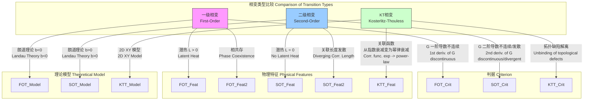

## 一级相变

一级相变（First-Order Phase Transition）是热力学系统在特定外部条件（如温度、压力）下，从一个物相转变为另一个物相时，其吉布斯自由能（Gibbs Free Energy）的一阶导数发生不连续变化的现象。这种不连续性表现为宏观物理性质的突变，如熵和体积的跃变，并伴随着潜热的吸收或释放。

### 核心概念与数学基础

相变理论的核心在于描述物质在不同相之间转换的物理规律。根据埃伦费斯特（Ehrenfest）分类，相变根据热力学势（如吉布斯自由能）的导数连续性进行分类。

#### 吉布斯自由能与相变判据

对于一个处于恒定压力 $P$ 和恒定温度 $T$ 下的系统，其热力学状态由吉布斯自由能 $G$ 描述：

$$ G = U - TS + PV $$

其中：
*   $U$ 是系统的内能 (Internal Energy)
*   $T$ 是绝对温度 (Absolute Temperature)
*   $S$ 是熵 (Entropy)
*   $P$ 是压力 (Pressure)
*   $V$ 是体积 (Volume)

吉布斯自由能的一阶偏导数对应于重要的热力学量：
*   熵：$S = - \left( \frac{\partial G}{\partial T} \right)_P$
*   体积：$V = \left( \frac{\partial G}{\partial P} \right)_T$

在一级相变点（例如，沸点 $T_b$），物质在两个相（例如，液相和气相）之间转换。此时，两个相的吉布斯自由能相等 ($G_1 = G_2$)，但它们的一阶导数不连续。这意味着：

*   **熵的不连续性**: $\Delta S = S_2 - S_1 = - \left( \frac{\partial G_2}{\partial T} \right)_P + \left( \frac{\partial G_1}{\partial T} \right)_P \neq 0$
*   **体积的不连续性**: $\Delta V = V_2 - V_1 = \left( \frac{\partial G_2}{\partial P} \right)_T - \left( \frac{\partial G_1}{\partial P} \right)_T \neq 0$

熵的跃变 $\Delta S$ 导致了**潜热**（Latent Heat）$L$ 的存在，即在相变温度下，系统吸收或释放的热量：

$$ L = T_c \Delta S $$

其中 $T_c$ 是相变温度。

#### 克劳修斯-克拉佩龙方程

该方程描述了一级相变线上压力随温度的变化率，即P-T图中两相共存曲线的斜率。沿着共存线，两相的吉布斯自由能变化量相等，$dG_1 = dG_2$。

$$ -S_1 dT + V_1 dP = -S_2 dT + V_2 dP $$

整理后得到：

$$ \frac{dP}{dT} = \frac{S_2 - S_1}{V_2 - V_1} = \frac{\Delta S}{\Delta V} $$

将潜热的定义 $L = T \Delta S$ 代入，得到克劳修斯-克拉佩龙方程（Clausius-Clapeyron Equation）的标准形式：

$$ \frac{dP}{dT} = \frac{L}{T \Delta V} $$

这个方程精确地将宏观可测量（潜热、体积变化）与相图的几何特征联系起来。

#### 相变过程的分类

下面的Mermaid图展示了基于吉布斯自由能导数的埃伦费斯特相变分类。

```mermaid
graph TD
    A[相变<br>Phase Transition] --> B["吉布斯自由能 G 的导数是否连续?<br>Are derivatives of Gibbs Free Energy G continuous?[";
    B -- "一阶导数不连续<br>1st derivatives are discontinuous" --> C[一级相变<br>First-Order Transition];
    B -- "一阶导数连续, 二阶导数不连续<br>1st derivatives continuous, 2nd discontinuous" --> D[二级相变<br>Second-Order Transition];

    subgraph "一级相变特征 First-Order Characteristics"
        C --> C1["熵 S 和体积 V 不连续<br>Discontinuous Entropy S & Volume V"];
        C1 --> C2["存在潜热 L = TΔS<br>Latent Heat L = TΔS exists"];
        C2 --> C3["相共存与界面<br>Phase Coexistence & Interface"];
        C3 --> C4["过冷/过热 亚稳态<br>Supercooling/Superheating Metastability"];
    end

    subgraph "二级相变特征 Second-Order Characteristics"
        D --> D1["熵 S 和体积 V 连续<br>Continuous Entropy S & Volume V"];
        D1 --> D2["无潜热 L=0<br>No Latent Heat L=0"];
        D2 --> D3["热容 Cp, 压缩系数 κT 发散<br>Divergence in Heat Capacity Cp, Compressibility κT"];
        D3 --> D4["关联长度 ξ 发散<br>Divergence in Correlation Length ξ"];
    end

    style C fill:#f9f,stroke:#333,stroke-width:2px
    style D fill:#9cf,stroke:#333,stroke-width:2px
```

### 关键技术规格

下表列出了一些常见物质在一级相变过程中的关键热力学参数（在标准大气压，1 atm = 101.325 kPa下）。

| 物质 (Substance) | 相变类型 (Transition Type) | 相变温度 $T_c$ (Transition Temperature) | 潜热 $L$ (Latent Heat) | 密度变化 $\Delta \rho$ (Density Change) | 体积变化 $\Delta V$ (Volume Change) |
| :--- | :--- | :--- | :--- | :--- | :--- |
| 水 (H₂O) | 熔化 (Melting) | 0.00 °C (273.15 K) | 333.55 J/g (6.01 kJ/mol) | $\rho_{ice} \to \rho_{water}$ (0.917 $\to$ 0.999 g/cm³) | -0.091 cm³/g |
| 水 (H₂O) | 沸腾 (Boiling) | 100.00 °C (373.15 K) | 2257 J/g (40.66 kJ/mol) | $\rho_{water} \to \rho_{steam}$ (0.958 $\to$ 0.00059 g/cm³) | +1672 cm³/g |
| 镓 (Gallium, Ga) | 熔化 (Melting) | 29.76 °C (302.91 K) | 80.1 J/g (5.59 kJ/mol) | $\rho_{solid} \to \rho_{liquid}$ (5.91 $\to$ 6.09 g/cm³) | -0.005 cm³/g |
| 铁 (Iron, Fe) | 熔化 (Melting) | 1538 °C (1811 K) | 247 J/g (13.8 kJ/mol) | $\rho_{solid} \to \rho_{liquid}$ (7.87 $\to$ 6.98 g/cm³) | +0.016 cm³/g |
| 二氧化碳 (CO₂) | 升华 (Sublimation) | -78.5 °C (194.65 K) | 571 J/g (25.1 kJ/mol) | $\rho_{solid} \to \rho_{gas}$ (1.56 $\to$ 0.0019 g/cm³) | +639 cm³/g |

### 常见用例与性能指标

一级相变的独特性质（特别是高潜热和相态体积剧变）在许多技术领域有重要应用。

*   **相变储能材料 (Phase Change Materials, PCMs)**
    *   **应用**: 建筑节能（调节室温）、太阳能热利用、电子设备热管理、冷链物流。
    *   **量化指标**:
        *   储能密度: 高熔化潜热是关键，例如石蜡类PCMs通常具有 > 200 J/g 的潜热。
        *   循环稳定性: 经过1000次熔化/凝固循环后，潜热衰减率 < 5%。
        *   导热系数: 决定了能量存取速率，通常在 0.2 W/(m·K)（有机）到 > 1 W/(m·K)（添加了导热增强剂）。

*   **蒸汽机与朗肯循环 (Steam Engines & Rankine Cycle)**
    *   **应用**: 火力发电、核能发电。
    *   **量化指标**:
        *   循环效率 ($\eta$): 利用水在沸腾时巨大的体积变化 ($\Delta V$) 来驱动涡轮机做功。实际效率通常在 35%-45% 之间，受限于卡诺效率 $\eta_{Carnot} = 1 - T_{cold}/T_{hot}$。
        *   功输出: 与工质的质量流率和焓降直接相关。

*   **制冷与热泵 (Refrigeration & Heat Pumps)**
    *   **应用**: 冰箱、空调、热泵热水器。
    *   **量化指标**:
        *   性能系数 (Coefficient of Performance, COP): COP = (制冷/制热量) / (输入功)。制冷剂的蒸发潜热是核心参数。家用冰箱的 COP 通常为 2.5-4.0，热泵的 COP 可达 3.0-5.0。

### 实现考量与算法分析

在计算物理和材料模拟中，准确模拟一级相变是一个挑战，主要因为其不连续和亚稳态的特性。

*   **亚稳态与成核**: 标准的分子动力学（MD）或蒙特卡洛（MC）模拟在相变点附近容易陷入亚稳态（如过冷液体或过热固体），因为跨越相界需要克服一个自由能垒。
*   **模拟算法**:
    *   **伞形采样 (Umbrella Sampling)**: 通过施加偏置势函数，强制系统在相变区域进行采样，从而计算自由能曲线。其计算复杂度与所选“窗口”的数量成正比。
    *   **元动力学 (Metadynamics)**: 引入一个依赖于历史的偏置势，以探索整个构型空间并翻越能垒。算法复杂度高于标准MD，并随集合变量的数量增加。
    *   **相共存模拟 (Phase Coexistence Simulation)**: 在一个模拟盒子中直接放置两个相，让它们达到平衡。通过调节温度或压力，可以直接确定共存点（$T_c, P_c$）。这种方法计算成本高，但结果直接可靠。
*   **有限尺寸效应分析**:
    *   在有限尺寸的模拟中，一级相变的不连续性会被“平滑化”。热力学极限（系统尺寸 $N \to \infty$）下的行为需要通过有限尺寸标度（Finite-Size Scaling）来外推。
    *   对于一级相变，比热 $C_V$ 或磁化率 $\chi$ 的峰值高度与系统体积（或粒子数 $N$）成正比：$C_V^{max} \propto N$。这与二级相变中峰值高度随 $N$ 的幂律增长（$C_V^{max} \propto N^{\alpha/\nu d}$）形成鲜明对比。

### 性能特征与统计度量

从统计力学的角度看，一级相变有几个独特的性能特征。

*   **能量直方图**: 在相变温度 $T_c$ 下，系统的能量概率分布 $P(E)$ 会呈现出典型的**双峰结构**。一个峰对应于低能相（如固相），另一个峰对应于高能相（如液相）。两个峰之间的谷底对应于亚稳态。
*   **自由能形貌**: 作为序参数（Order Parameter, 如密度 $\rho$ 或磁化强度 $M$）的函数的自由能 $F(\eta)$，在 $T_c$ 时表现为**双势阱**结构。两个势阱的深度相等，代表两个稳定相。它们之间的势垒高度与界面能有关。
*   **磁滞现象 (Hysteresis)**: 当缓慢改变一个外部控制参数（如磁场 $H$ 或压力 $P$）时，系统状态的变化路径依赖于改变的方向。例如，在铁磁体的一级相变中，磁化强度 $M$ 随外场 $H$ 的变化会形成一个磁滞回线。回线的宽度是衡量亚稳态区域范围的一个指标。
*   **界面张力 ($\sigma$)**: 共存两相之间的界面存在额外的自由能代价，称为界面张力。它可以通过实验测量（如滴定法）或通过模拟（如从自由能垒的高度）来确定。例如，在100°C时，水-蒸汽界面的张力约为 58.9 mN/m。

### 相关技术与比较模型

一级相变是多种相变类型中的一种。理解其与其他相变的区别至关重要。



#### 二级相变 (Second-Order Transition)

*   **定义**: 吉布斯自由能的一阶导数（$S, V$）连续，但二阶导数不连续或发散。
*   **二阶导数**:
    *   定压热容: $C_P = T \left( \frac{\partial S}{\partial T} \right)_P = -T \left( \frac{\partial^2 G}{\partial T^2} \right)_P$
    *   等温压缩系数: $\kappa_T = -\frac{1}{V} \left( \frac{\partial V}{\partial P} \right)_T = -\frac{1}{V} \left( \frac{\partial^2 G}{\partial P^2} \right)_T$
*   **特征**: 无潜热，无关相共存。其核心特征是**临界现象**，如关联长度 $\xi$ 在临界点 $T_c$ 发散，物理量遵循普适的标度律和临界指数。
*   **例子**: 铁磁-顺磁转变（居里点）、超流转变、液-气相变的临界点。

#### 朗道理论 (Landau Theory)

朗道理论是一个唯象理论，通过将自由能展开为序参数 $\eta$ 的幂级数来描述相变。

$$ F(\eta, T) = F_0(T) + \frac{1}{2} a(T) \eta^2 + \frac{1}{4} b(T) \eta^4 + \frac{1}{6} c(T) \eta^6 + \dots $$

其中：
*   $\eta$ 是序参数 (Order Parameter)，在无序相为0，有序相不为0。
*   $a(T), b(T), c(T)$ 是与温度相关的系数。

该模型可以统一描述一、二级相变：
*   **二级相变**: 设 $a(T) = a_0(T - T_c)$ 且 $b_0 > 0$。当 $T > T_c$ 时，$a>0$，自由能最小值在 $\eta=0$。当 $T < T_c$ 时，$a<0$，自由能最小值在 $\eta \neq 0$。相变是连续的。
*   **一级相变**: 如果系数 $b(T)$ 在相变点附近为负值 ($b < 0$)，则需要一个正的六阶项 ($c > 0$) 来保证自由能的稳定性。在这种情况下，自由能函数会出现多个极小值。当两个极小值（一个在 $\eta=0$，一个在 $\eta \neq 0$）的自由能相等时，发生一级相变。这通常发生在 $a(T)$ 仍然为正的时候，导致序参数的跳变和潜热的产生。

### 参考文献

1.  Landau, L. D., & Lifshitz, E. M. (1980). *Statistical Physics, Part 1* (3rd ed.). Pergamon Press. (This is a foundational text for the theory of phase transitions).
2.  Chaikin, P. M., & Lubensky, T. C. (2000). *Principles of Condensed Matter Physics*. Cambridge University Press. DOI: [10.1017/CBO9780511813467](https://doi.org/10.1017/CBO9780511813467). (Provides a comprehensive overview of phase transitions, including Landau theory).
3.  Binder, K. (1987). Theory of first-order phase transitions. *Reports on Progress in Physics*, 50(7), 783. DOI: [10.1088/0034-4885/50/7/001](https://doi.org/10.1088/0034-4885/50/7/001). (A detailed review on the theory and simulation of first-order transitions).
4.  Frenkel, D., & Smit, B. (2002). *Understanding Molecular Simulation: From Algorithms to Applications* (2nd ed.). Academic Press. (Details advanced simulation techniques for studying phase transitions, such as Gibbs ensemble and umbrella sampling).