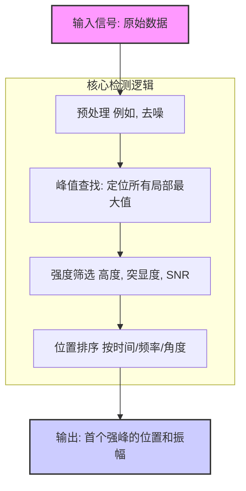
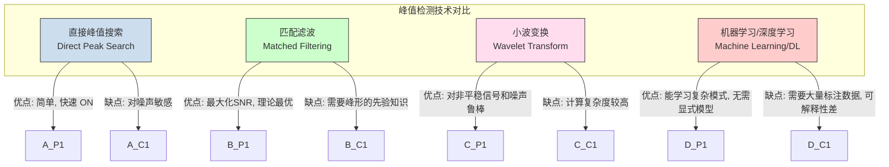

## 首个强峰 (First Strong Peak)

“首个强峰”是一个在众多科学与工程领域中用于信号分析的基本概念。它指代在一个数据集（如时间序列、频谱或色谱图）中，按自变量（如时间、频率、角度）排序，第一个满足特定“强度”标准的局部最大值。准确识别首个强峰对于从噪声背景中提取关键信息、触发事件检测以及量化系统响应至关重要。

### 1. 核心概念与数学基础

从数学角度看，“首个强峰”的识别涉及三个核心步骤：定位局部最大值（峰），根据其属性（强度）进行筛选，以及根据其位置进行排序。

#### 1.1. 峰 (Peak) 的定义
一个峰是其值大于其直接相邻点的局部最大值。

- **对于连续可微函数** $f(x)$，一个点 $x_p$ 是一个峰，如果它满足：
  $$
  f'(x_p) = 0 \quad \text{且} \quad f''(x_p) < 0
  $$
  其中 $f'(x)$ 和 $f''(x)$ 分别是 $f(x)$ 的一阶和二阶导数。

- **对于离散数据集** $\{y_i\}$，一个点 $y_i$ 是一个峰，如果：
  $$
  y_i > y_{i-1} \quad \text{且} \quad y_i > y_{i+1}
  $$

#### 1.2. 强度 (Strength) 的定义
“强”是一个相对术语，通常通过以下一个或多个标准来量化：

- **绝对高度 (Absolute Height):** 峰的振幅 $A_p$ 必须超过一个预定义的绝对阈值 $T_{abs}$。
  $$
  A_p > T_{abs}
  $$

- **信噪比 (Signal-to-Noise Ratio, SNR):** 峰的功率与局部噪声功率的比值必须超过一个阈值。通常以分贝 (dB) 表示。
  $$
  SNR = 10 \log_{10} \left( \frac{P_{peak}}{P_{noise}} \right) = 20 \log_{10} \left( \frac{A_{peak}}{\sigma_{noise}} \right) > T_{SNR}
  $$
  其中 $A_{peak}$ 是峰的振幅，$P_{peak}$ 是其功率，$\sigma_{noise}$ 是噪声的标准差。

- **峰突 (Peak Prominence):** 峰突是衡量一个峰相对于其他峰的突出程度的指标。它被定义为从该峰顶到其需要下降到的最低等高线的垂直距离，此等高线不包含任何比该峰更高的峰。这是一个在复杂背景中识别真正信号的稳健指标。

#### 1.3. 首个 (First) 的定义
在所有满足强度标准的峰中，“首个”峰是其在自变量轴上的坐标值最小的那个。假设已识别出一组强峰，其坐标为 $\{(x_1, A_1), (x_2, A_2), ..., (x_k, A_k)\}$，则首个强峰 $(x_{fsp}, A_{fsp})$ 满足：
$$
x_{fsp} = \min(\{x_i | \text{峰 } (x_i, A_i) \text{ 满足强度标准}\})
$$

### 2. 关键技术指标

在实际应用中，首个强峰的检测算法通常由一组可配置的参数来控制。

| 参数 | 描述 | 典型值 | 单位 |
| :--- | :--- | :--- | :--- |
| **最小峰高 (Minimum Peak Height)** | 峰的振幅必须超过的绝对值。 | > 3σ_noise | 计数, 伏特, a.u. |
| **最小峰突 (Minimum Peak Prominence)** | 峰的最小要求突出程度，用于将其与邻近特征区分开。 | 依赖于信号 | 计数, 伏特, a.u. |
| **信噪比阈值 (SNR Threshold)** | 用于将峰定义为“强”的最小信噪比。 | > 5 | dB |
| **最小峰距 (Minimum Peak Distance)** | 两个相邻峰之间的最小水平距离。 | 依赖于分辨率 | 秒, 赫兹, 度 |
| **半峰全宽 (FWHM) 范围** | 峰的宽度必须在此范围内，以过滤掉过宽的背景或过窄的噪声尖峰。 | 依赖于物理过程 | 秒, 赫兹, eV |
| **搜索域 (Search Domain)** | 在自变量轴上进行搜索的特定区间 $[x_{start}, x_{end}]$。 | 用户定义 | - |

### 3. 常见用例

首个强峰检测在多个领域都有关键应用。

- **X射线衍射 (XRD):**
  在晶体材料分析中，首个强衍射峰（通常在低 $2\theta$ 角）对应于布拉格定律中最大的晶面间距 $d$。
  $$ n\lambda = 2d \sin\theta $$
  其中 $n$ 是衍射级数，$\lambda$ 是X射线波长，$\theta$ 是衍射角。该峰对于物相鉴定和晶格参数计算至关重要。
  *   **性能指标:** 物相鉴定准确率 > 99.5%。

- **飞行时间 (Time-of-Flight, ToF) 系统 (如激光雷达/LiDAR):**
  在LiDAR中，返回信号中的首个强峰表示距离传感器最近的显著反射物体。这对于自动驾驶中的障碍物检测至关重要。
  *   **性能指标:** 测距精度 ±1 cm，检测概率 > 99.9% @ 50米。

- **拉曼光谱 (Raman Spectroscopy):**
  在化学分析中，首个强峰通常是分子的特征振动模式，可用于快速识别样品中的主要化学成分或官能团。
  *   **性能指标:** 识别灵敏度达到 ppm (百万分之一) 级别。

- **数字通信:**
  在脉冲位置调制 (PPM) 中，时间窗内的首个强脉冲的位置编码了信息。准确检测对于维持低误码率 (BER) 至关重要。
  *   **性能指标:** 误码率 (BER) < $10^{-9}$。

### 4. 实现考量

实现一个稳健的首个强峰检测器通常遵循一个标准流程。

#### 算法复杂度分析

假设输入信号有 $N$ 个数据点。
1.  **预处理:** 使用如Savitzky-Golay或高斯滤波器通常需要 $O(N \cdot K)$ 的时间，其中 $K$ 是滤波器窗口大小。由于 $K \ll N$，这通常是 $O(N)$。
2.  **峰值查找:** 通过一次线性扫描即可找到所有局部最大值。这是一个 $O(N)$ 的操作。
3.  **强度筛选:** 如果有 $M$ 个峰被找到 ($M \le N/2$)，对每个峰计算其属性（如突显度）可能需要对部分数据进行额外扫描，但通常可以优化到对每个峰的平均复杂度为常数或对数级别。最坏情况下，计算所有峰的突显度可能需要 $O(N \log N)$，但高效算法通常接近 $O(N)$。
4.  **排序和选择:** 筛选后，我们得到一个候选强峰列表。找到第一个（位置最小的）只需要一次线性遍历，时间复杂度与候选峰数量成正比。

因此，整个算法的**总体时间复杂度通常为 $O(N)$**，使其非常高效，适用于实时应用。

### 5. 性能特征

检测算法的性能通过统计指标来评估。

- **检测概率 ($P_d$):** 当存在一个真实的首个强峰时，算法成功检测到它的概率。
- **虚警概率 ($P_{fa}$):** 在没有真实信号的情况下，算法错误地将噪声识别为首个强峰的概率。
- **位置精度:** 检测到的峰位置与真实峰位置之间的误差，通常用均方根误差 (RMSE) 或标准差来量化。
- **接收者操作特征 (ROC) 曲线:** 一条绘制 $P_d$ 与 $P_{fa}$ 关系的曲线，用于评估算法在不同阈值下的整体性能。一个理想的检测器在ROC空间中会趋向左上角（$P_d=1, P_{fa}=0$）。

例如，一个高性能的系统可能会报告：在 SNR = 10 dB 时，具有 95% 置信区间的检测概率为 $P_d = 99.8\% \pm 0.1\%$，而虚警概率为 $P_{fa} < 10^{-6}$。

### 6. 相关技术

虽然直接的峰值搜索很常用，但更先进的技术可以在复杂场景下提供更优的性能。

#### 数学模型比较

- **首个强峰 (本文档核心):**
  通过阈值和排序进行程序化选择。
  $$ (x_{fsp}, A_{fsp}) = \text{argmin}_{x_i} \{ (x_i, A_i) | A_i > T_{abs} \land P_i > T_{prom} \} $$
  其中 $P_i$ 是第 $i$ 个峰的突显度。

- **匹配滤波 (Matched Filtering):**
  当期望的峰形 $s(t)$ 已知时，匹配滤波通过与信号 $x(t)$ 进行卷积来最大化输出信噪比。输出 $y(t)$ 中的峰值对应于信号的最佳匹配位置。
  $$
  y(t) = (x * s_r)(t) = \int_{-\infty}^{\infty} x(\tau) s(t-\tau) d\tau
  $$
  其中 $s_r(t) = s(-t)$ 是时间反转的模板。

- **连续小波变换 (Continuous Wavelet Transform, CWT):**
  CWT 将信号分解到时间和尺度（频率的倒数）平面上。峰在CWT系数中表现为跨越多个尺度的脊线，使其在噪声中易于追踪。
  $$
  CWT_x^{\psi}(a, b) = \frac{1}{\sqrt{|a|}} \int_{-\infty}^{\infty} x(t) \psi^*\left(\frac{t-b}{a}\right) dt
  $$
  其中 $\psi(t)$ 是母小波， $a$ 是尺度参数， $b$ 是平移参数。

### 7. 参考文献

1.  Du, P., Kibbe, W. A., & Lin, S. M. (2006). Improved peak detection in mass spectrum by incorporating continuous wavelet transform-based pattern matching. *Bioinformatics*, 22(17), 2059-2065. DOI: `10.1093/bioinformatics/btl355`. (这篇论文展示了如何使用小波变换来改进质谱中的峰检测，是处理复杂信号中峰检测问题的一个典范。)
2.  Tele-Communications, I. (2017). *Signal and power integrity-simplified*. Prentice Hall. (提供了关于信号处理，包括滤波和噪声分析的实用基础。)
3.  Craig, J. C., & Schwieters, C. D. (2004). A simple, fast and robust peak picking algorithm. *Journal of Magnetic Resonance*, 167(1), 1-8. DOI: `10.1016/j.jmr.2003.12.002`. (描述了一种在NMR光谱中应用的稳健峰检测算法。)