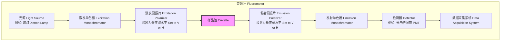
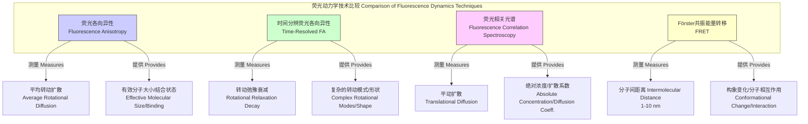

## 荧光各向异性 (Fluorescence Anisotropy)

荧光各向异性是一种强大的光谱学技术，用于研究分子在溶液中的大小、形状、构象变化以及分子间的相互作用。该技术通过测量荧光分子发射光的偏振程度来探测其在激发态寿命期间的转动扩散。

### 1. 核心概念与数学基础

荧光各向异性的基本原理是**光选择性激发 (photoselection)**。当一束平面偏振光照射到荧光分子样品上时，只有那些吸收跃迁偶极矩 (absorption transition dipole moment) 方向与光的偏振方向大致平行的分子才会被优先激发。

如果这些被激发的分子在发射荧光之前不发生转动，那么发射的荧光也将是高度偏振的。然而，在溶液中，分子会由于布朗运动而发生**转动扩散 (rotational diffusion)**。这种转动会导致发射光的去偏振化。分子的转动速度取决于其大小、形状以及溶剂的粘度。大分子转动得慢，去偏振程度小；小分子转动得快，去偏振程度大。

通过测量发射光在平行和垂直于激发光偏振方向上的强度，可以量化这种去偏振效应。

```mermaid
graph TD
    A["激发光 Excitation Light<br>垂直偏振 Vertically Polarized"] --> B["光选择性激发 Photoselection<br>仅激发跃迁偶极矩与偏振方向平行的荧光分子[";
    B --> C["激发态 Excited State<br>荧光寿命 τf[";
    C --> D["分子转动扩散 Rotational Diffusion<br>转动相关时间 τc[";
    D --> E["荧光发射 Fluorescence Emission[";
    E --> F["发射光 Emitted Light<br>部分去偏振 Partially Depolarized"];
    F --> G["测量平行分量 I_parallel"];
    F --> H["测量垂直分量 I_perpendicular"];
    G & H --> I["计算各向异性 Calculate Anisotropy r[";

    subgraph "影响因素 Influencing Factors"
        MolecularSize["分子大小/分子量 Molecular Size/MW"] --> D;
        Viscosity["溶剂粘度 Solvent Viscosity"] --> D;
        Temperature["温度 Temperature"] --> D;
    end

    style A fill:#cceeff,stroke:#333
    style F fill:#ffccdd,stroke:#333
    style I fill:#ccffcc,stroke:#006600
```

#### 数学定义

**荧光各向异性 ($r$)** 被定义为：
$$ r = \frac{I_{\parallel} - G \cdot I_{\perp}}{I_{\parallel} + 2G \cdot I_{\perp}} $$
其中：
*   $I_{\parallel}$ 是平行于激发光偏振方向测得的荧光强度。
*   $I_{\perp}$ 是垂直于激发光偏振方向测得的荧光强度。
*   $G$ 是 **G因子 (G-factor)**，一个仪器校正因子，用于校正检测器对不同偏振方向光响应的差异。其计算公式为：
    $$ G = \frac{I_{HV}}{I_{HH}} $$
    其中 $I_{HV}$ 是激发光为水平偏振、发射光为垂直偏振时的强度；$I_{HH}$ 是激发光和发射光均为水平偏振时的强度。

另一个相关的量是**偏振度 ($P$)**：
$$ P = \frac{I_{\parallel} - G \cdot I_{\perp}}{I_{\parallel} + G \cdot I_{\perp}} $$

各向异性 ($r$) 和偏振度 ($P$) 之间的关系为：
$$ r = \frac{2P}{3-P} \quad \text{and} \quad P = \frac{3r}{2+r} $$
在现代生物物理学研究中，各向异性 ($r$) 因其数学上的简便性而被更广泛地使用，因为它在加和性上优于偏振度。

#### Perrin方程

稳态荧光各向异性的核心关系由 **Perrin方程** 描述，它将测得的各向异性 ($r$) 与荧光寿命 ($\tau_f$) 和转动相关时间 ($\tau_c$) 联系起来：
$$ r = \frac{r_0}{1 + (\tau_f / \tau_c)} $$
其中：
*   $r_0$ 是**极限各向异性 (fundamental anisotropy)** 或称**内在各向异性 (intrinsic anisotropy)**。它是在没有发生任何转动扩散（例如在极高粘度的冷冻溶液中）时测得的理论最大各向异性。对于吸收和发射偶极矩平行的荧光团，其理论最大值为0.4。
*   $\tau_f$ 是荧光分子的**激发态寿命 (fluorescence lifetime)**，即分子在激发态的平均停留时间。
*   $\tau_c$ 是分子的**转动相关时间 (rotational correlation time)**，表征分子转动扩散速率的特征时间。对于球形分子，$\tau_c$ 可由 **Stokes-Einstein-Debye** 方程估算：
    $$ \tau_c = \frac{\eta V}{k_B T} $$
    其中：
    *   $\eta$ 是溶剂的粘度 (viscosity)。
    *   $V$ 是分子的水合体积 (hydrodynamic volume)。
    *   $k_B$ 是玻尔兹曼常数 ($1.380649 \times 10^{-23} \text{ J/K}$)。
    *   $T$ 是绝对温度 (absolute temperature)。

### 2. 关键技术规格

| 参数 (Parameter) | 典型值 (Typical Value) | 单位 (Unit) | 描述 (Description) |
| :--- | :--- | :--- | :--- |
| 极限各向异性 ($r_0$) | 0.3 - 0.4 | 无量纲 | 荧光探针的内在属性，取决于其电子结构。 |
| 荧光寿命 ($\tau_f$) | 1 - 10 | ns | 常见荧光团（如荧光素、罗丹明）的典型寿命。 |
| 转动相关时间 ($\tau_c$) | 0.1 - 100 | ns | 小分子（如荧光素）约为~0.5 ns；大蛋白（~50 kDa）约为~20 ns。 |
| 测量精度 | ±0.001 - ±0.003 | 无量纲 | 高质量荧光计在稳定条件下的典型精度。 |
| G因子 | 0.8 - 1.2 | 无量纲 | 仪器的光学系统特性，必须精确校准。 |
| 激发/发射波长 | 300 - 800 | nm | 取决于所选用的荧光探针。 |
| 样品浓度 | pM - µM | M | 取决于荧光探针的量子产率和仪器灵敏度。 |

### 3. 常见用例

荧光各向异性被广泛应用于生物化学和生物物理研究中。

*   **分子结合分析 (Binding Assays):**
    *   **应用:** 研究蛋白质-配体、蛋白质-DNA、抗原-抗体等相互作用。
    *   **原理:** 当一个小的高迁移率荧光标记配体（低 $r$）与一个大的低迁移率受体结合时，复合物的有效分子体积显著增加，导致 $\tau_c$ 增大，从而使测得的各向异性 $r$ 值升高。
    *   **定量指标:** 通过滴定实验，可以绘制各向异性值随配体或受体浓度变化的结合曲线，从而精确测定**解离常数 ($K_d$)**。例如，一个1 kDa的荧光标记肽与50 kDa的蛋白结合，其各向异性值可能从0.05增加到0.25，可用于测定nM至µM范围的$K_d$。

*   **膜流动性研究 (Membrane Fluidity Studies):**
    *   **应用:** 探测生物膜（如细胞膜）的微观粘度或“流动性”。
    *   **原理:** 将疏水性荧光探针（如DPH或TMA-DPH）嵌入脂质双分子层中。探针的转动自由度受周围脂质链的限制。膜流动性越高（微观粘度越低），探针转动越快，各向异性值越低。
    *   **定量指标:** 各向异性值 $r$ 直接与膜的有序参数 (order parameter) 和粘度相关。

*   **蛋白质折叠与构象变化:**
    *   **应用:** 监测蛋白质在变性、折叠或别构调控过程中的构象变化。
    *   **原理:** 蛋白质的折叠或去折叠状态具有不同的水合体积，导致其整体转动相关时间 $\tau_c$ 发生变化。通过定点标记荧光探针，可以跟踪这些构象转变。

*   **高通量筛选 (High-Throughput Screening, HTS):**
    *   **应用:** 在药物发现中快速筛选与靶蛋白结合的化合物库。
    *   **优势:** 该方法是均相的（无需分离步骤）、快速且易于自动化，使其成为HTS的理想选择。

### 4. 实现考量

#### 仪器设置

一个典型的稳态荧光各向异性测量系统（荧光计）包括以下组件：



#### 算法与数据处理

1.  **G因子校准:** 在每次实验前或定期进行G因子测量，以确保数据的准确性。这是消除仪器偏振伪影的关键步骤。
2.  **强度测量:** 依次测量四种强度：$I_{VV}$, $I_{VH}$, $I_{HV}$, $I_{HH}$ (第一个下标代表激发偏振片方向，第二个代表发射偏振片方向；V=垂直，H=水平)。
3.  **各向异性计算:**
    *   使用垂直激发光时：$r = \frac{I_{VV} - G \cdot I_{VH}}{I_{VV} + 2G \cdot I_{VH}}$
    *   G因子计算：$G = I_{HV} / I_{HH}$
4.  **数据拟合:** 对于结合分析，将得到的各向异性数据点 $r$ 作为总配体浓度 $[L]_T$ 的函数，并使用适当的结合模型（例如，对于单一位点结合的二次方程）进行非线性最小二乘法拟合，以提取 $K_d$ 值。
    $$ r_{obs} = r_{free} + (r_{bound} - r_{free}) \frac{([P]_T + [L]_T + K_d) - \sqrt{([P]_T + [L]_T + K_d)^2 - 4[P]_T [L]_T}}{2[P]_T} $$
    其中 $[P]_T$ 是总蛋白浓度，$r_{obs}$, $r_{free}$, $r_{bound}$ 分别是观测到的、游离配体的和结合配体的各向异性。

该过程的计算复杂度主要在于数据拟合步骤，通常采用Levenberg-Marquardt等迭代算法，其复杂度取决于数据点的数量和模型的复杂性。单点各向异性的计算复杂度为 $O(1)$。

### 5. 性能特征

*   **灵敏度 (Sensitivity):** 对分子转动相关时间的变化非常敏感，而 $\tau_c$ 与分子体积成正比。因此，该技术能有效检测分子量的变化，例如，一个分子量加倍的事件通常会产生清晰可辨的信号。
*   **精确度与准确度 (Precision and Accuracy):**
    *   主要误差来源包括：光子散粒噪声 (photon shot noise)、光源和检测器的漂移、样品的瑞利和拉曼散射、背景荧光污染。
    *   通过增加积分时间和精确的背景扣除，可以提高信噪比。
    *   典型的测量结果表示为均值 ± 标准差或置信区间，例如 $r = 0.215 \pm 0.002$ (95% CI)。
*   **动态范围 (Dynamic Range):**
    *   理论上 $r$ 的范围是 $[-0.2, 0.4]$。在实践中，测量的范围通常是 $[0, 0.4]$。
    *   在结合实验中，一个关键的性能指标是**分析窗口 (assay window)**，即 $\Delta r = r_{bound} - r_{free}$。窗口越大，分析的鲁棒性和灵敏度越高。一个大于0.03的 $\Delta r$ 通常被认为是可行的。

### 6. 相关技术比较

荧光各向异性是研究分子动力学的几种荧光技术之一。



#### 时间分辨荧光各向异性 (Time-Resolved Fluorescence Anisotropy, TRFA)

与测量平均稳态值的FA不同，TRFA通过脉冲激光激发样品，并测量荧光各向异性随时间 $t$ 的衰减。
$$ r(t) = r_0 \sum_{i} f_i e^{-t/\tau_{c,i}} $$
其中 $f_i$ 是与第 $i$ 个转动相关时间 $\tau_{c,i}$ 相关的振幅分数。对于简单的球形分子，该方程简化为 $r(t) = r_0 e^{-t/\tau_c}$。TRFA可以直接测量 $\tau_c$ 和 $r_0$，并能解析更复杂的转动行为（例如，非球形分子的各向异性转动或局部探针运动）。

#### 荧光相关光谱 (Fluorescence Correlation Spectroscopy, FCS)

FCS通过分析荧光强度在微秒到毫秒时间尺度上的波动来测量分子动力学。这些波动是由荧光分子进出激光聚焦的微小共聚焦体积（~1 fL）引起的。其自相关函数 $G(\tau)$ 为：
$$ G(\tau) = \frac{\langle \delta I(t) \cdot \delta I(t+\tau) \rangle}{\langle I(t) \rangle^2} = \frac{1}{N} \left(1 + \frac{\tau}{\tau_D}\right)^{-1} \left(1 + \frac{\omega_0^2}{\omega_z^2} \frac{\tau}{\tau_D}\right)^{-1/2} $$
其中：
*   $N$ 是共聚焦体积中的平均分子数。
*   $\tau_D$ 是**平动扩散时间 (translational diffusion time)**。
*   $\omega_0$ 和 $\omega_z$ 是共聚焦体积在径向和轴向的半径。

FCS测量**平动扩散**，而FA测量**转动扩散**。

#### Förster共振能量转移 (FRET)

FRET是一种依赖于距离的能量从一个“供体”荧光团非辐射地转移到一个“受体”生色团的现象。FRET效率 ($E$) 对供体-受体距离 ($R$) 非常敏感：
$$ E = \frac{1}{1 + (R/R_0)^6} $$
其中 $R_0$ (Förster距离) 是FRET效率为50%时的距离，通常在2-8 nm范围内。FRET是测量分子内或分子间距离变化的“光谱标尺”，而FA则报告分子的整体大小和转动。

### 7. 参考文献

1.  Lakowicz, J. R. (2006). *Principles of Fluorescence Spectroscopy* (3rd ed.). Springer. DOI: [10.1007/978-0-387-46312-4](https://doi.org/10.1007/978-0-387-46312-4)
2.  Valeur, B., & Berberan-Santos, M. N. (2012). *Molecular Fluorescence: Principles and Applications* (2nd ed.). Wiley-VCH. DOI: [10.1002/9783527650002](https://doi.org/10.1002/9783527650002)
3.  Perrin, F. (1926). Polarisation de la lumière de fluorescence. Vie moyenne des molécules dans l'état excité. *Le Journal de Physique et le Radium*, 7(12), 390-401. DOI: [10.1051/jphysrad:01926007012039000](https://doi.org/10.1051/jphysrad:01926007012039000)