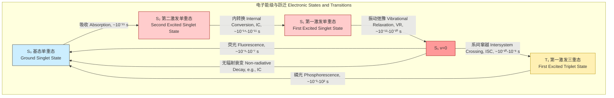
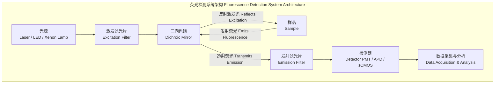
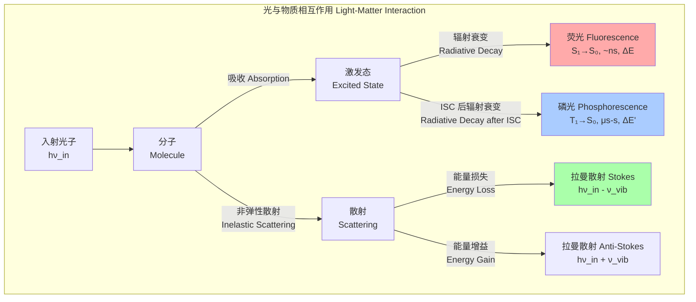

## 荧光 (fluorescence)

荧光是一种光致发光现象。当某种物质（通常是原子或分子）吸收了特定波长的电磁辐射（如紫外光或可见光）后，其电子会从基态 (ground state) 跃迁到能量较高的激发态 (excited state)。这些处于激发态的电子是不稳定的，会迅速通过各种途径回到基态。如果电子从激发单重态 (excited singlet state) 以辐射跃迁的方式回到基态，并在此过程中发射出光子，这个过程就称为荧光。发射出的荧光波长通常比吸收光的波长要长，这种现象被称为斯托克斯位移 (Stokes shift)。

### 核心概念与数学基础

荧光过程的核心物理机制可以通过 Jablonski 图来描述。

#### Jablonski 图

Jablonski 图是一种描绘分子中电子能级及其跃迁过程的示意图。它清晰地展示了吸收、荧光、内转换、系间窜越和磷光等过程。

#### 斯托克斯位移 (Stokes Shift)

由于在激发态的振动弛豫和溶剂重排，分子在发射荧光前会损失一部分能量。因此，发射光子的能量通常低于吸收光子的能量，导致发射光谱相对于吸收光谱向长波长方向移动。

斯托克斯位移 ($\Delta\lambda$) 定义为发射光谱峰值波长 ($\lambda_{em}$) 与吸收光谱峰值波长 ($\lambda_{ex}$) 之差：

$$ \Delta\lambda = \lambda_{em} - \lambda_{ex} $$

或者用波数 ($\bar{\nu}$) 表示能量差：

$$ \Delta\bar{\nu} = \bar{\nu}_{ex} - \bar{\nu}_{em} = \frac{1}{\lambda_{ex}} - \frac{1}{\lambda_{em}} $$

其中：
*   $\lambda_{em}$ 是最大荧光发射强度对应的波长 (nm)。
*   $\lambda_{ex}$ 是最大吸收强度对应的波长 (nm)。
*   $\bar{\nu}_{em}$ 和 $\bar{\nu}_{ex}$ 分别是发射和吸收的波数 (cm⁻¹)。

#### 荧光量子产率 (Fluorescence Quantum Yield)

荧光量子产率 ($\Phi_f$) 是衡量荧光效率的关键参数，定义为发射的荧光光子数与吸收的光子数之比。其值介于0和1之间。

$$ \Phi_f = \frac{\text{Number of photons emitted}}{\text{Number of photons absorbed}} $$

从动力学角度看，量子产率由辐射衰变速率 ($k_f$) 和所有非辐射衰变速率之和 ($k_{nr}$) 决定：

$$ \Phi_f = \frac{k_f}{k_f + k_{nr}} $$

其中：
*   $k_f$ 是荧光（辐射）衰变过程的速率常数 (s⁻¹)。
*   $k_{nr}$ 是所有非辐射衰变过程（如内转换、系间窜越、动态猝灭等）的总速率常数 (s⁻¹)。

#### 荧光寿命 (Fluorescence Lifetime)

荧光寿命 ($\tau_f$) 是指分子在被激发后，其荧光强度衰减到初始强度的 $1/e$（约36.8%）所需要的时间。它反映了分子在激发态的平均停留时间。

对于单指数衰减过程，荧光强度 $I(t)$ 随时间 $t$ 的变化遵循以下公式：

$$ I(t) = I_0 e^{-t/\tau_f} $$

其中：
*   $I(t)$ 是在时间 $t$ 时的荧光强度。
*   $I_0$ 是在 $t=0$ 时的初始荧光强度。
*   $\tau_f$ 是荧光寿命 (s)。

荧光寿命是激发态总衰变速率的倒数：

$$ \tau_f = \frac{1}{k_f + k_{nr}} $$

结合量子产率的定义，我们可以得到：

$$ \Phi_f = k_f \cdot \tau_f $$

### 关键技术规格

下表列出了一些常用荧光染料和蛋白的关键参数。

| 荧光团 (Fluorophore) | 激发波长 (λ_ex, nm) | 发射波长 (λ_em, nm) | 量子产率 (Φ_f) | 寿命 (τ_f, ns) | 摩尔消光系数 (ε, M⁻¹cm⁻¹) |
| :--- | :--- | :--- | :--- | :--- | :--- |
| 荧光素 (Fluorescein, FITC) | 494 | 518 | 0.92 | ~4.1 | 83,000 |
| 罗丹明B (Rhodamine B) | 555 | 580 | 0.31 (in ethanol) | ~1.7 | 105,000 |
| 绿色荧光蛋白 (EGFP) | 488 | 507 | 0.60 | ~2.6 | 56,000 |
| Alexa Fluor 647 | 650 | 668 | 0.33 | ~1.0 | 270,000 |
| CdSe/ZnS 量子点 | 520 - 650 (可调) | 530 - 660 (可调) | 0.5 - 0.9 | 10 - 40 | >500,000 |

### 常见用例与性能指标

*   **荧光显微镜 (Fluorescence Microscopy)**: 用于观察细胞和组织中特定分子的空间分布。
    *   **共聚焦显微镜 (Confocal)**: 性能指标：空间分辨率可达衍射极限，横向约 200 nm，轴向约 500 nm。
    *   **超分辨显微镜 (Super-Resolution, e.g., STED, PALM/STORM)**: 性能指标：空间分辨率突破衍射极限，可达 20-50 nm。
*   **流式细胞术 (Flow Cytometry)**: 用于高速分析和分选悬浮液中的单个细胞。
    *   性能指标：分析速度 > 10,000 个细胞/秒，可同时检测 > 20 种荧光参数。
*   **福斯特共振能量转移 (FRET)**: 一种“分子尺”，用于测量两个荧光分子间的距离（通常在 1-10 nm 范围）。
    *   FRET 效率 ($E$) 的数学模型为：
        $$ E = \frac{R_0^6}{R_0^6 + r^6} $$
    *   其中，$r$ 是供体-受体间距离，$R_0$ (福斯特距离) 是 FRET 效率为 50% 时的距离。$R_0$ 本身依赖于供体的量子产率、光谱重叠积分和偶极方向因子。
*   **荧光相关光谱 (FCS)**: 通过分析荧光信号的波动来测量分子的浓度和扩散系数。
    *   性能指标：可测量皮摩尔 (pM) 到纳摩尔 (nM) 浓度的分子，扩散系数测量精度约为 ±10%。

### 实现考量

#### 仪器架构

典型的荧光测量系统（如荧光光谱仪或显微镜）包含以下核心组件。

#### 算法复杂性分析

在荧光寿命成像 (FLIM) 中，数据分析至关重要。荧光衰减通常是多指数的：

$$ I(t) = \sum_{i=1}^{N} \alpha_i e^{-t/\tau_i} + B $$

其中 $N$ 是荧光组分的数量，$\alpha_i$ 和 $\tau_i$ 是第 $i$ 个组分的振幅和寿命，$B$ 是背景噪声。

*   **拟合算法**: 常用算法包括非线性最小二乘法 (Non-linear Least Squares, NLS) 和最大似然估计 (Maximum Likelihood Estimation, MLE)。
*   **计算复杂度**: 对于 NLS 算法（如 Levenberg-Marquardt），其计算复杂度在每次迭代中约为 $O(M \cdot P^2)$，其中 $M$ 是时间通道的数量（数据点数），$P$ 是拟合参数的数量（对于双指数衰减，$P=5$，即 $\alpha_1, \tau_1, \alpha_2, \tau_2, B$）。由于需要迭代收敛，总复杂度难以一概而论，但与数据点数和模型复杂度正相关。

### 性能特征与统计度量

*   **信噪比 (Signal-to-Noise Ratio, SNR)**:
    $$ SNR = \frac{S}{\sigma_{noise}} = \frac{I_{fluo}}{\sqrt{\sigma_{shot}^2 + \sigma_{dark}^2 + \sigma_{readout}^2}} $$
    *   $S = I_{fluo}$ 是荧光信号强度（光子数）。
    *   $\sigma_{shot} = \sqrt{I_{fluo}}$ 是由光子统计特性决定的散粒噪声（服从泊松分布）。
    *   $\sigma_{dark}$ 是探测器在无光照时的暗电流噪声。
    *   $\sigma_{readout}$ 是探测器读出电路引入的读出噪声。
*   **光漂白 (Photobleaching)**: 荧光分子在激发光照射下被不可逆地化学破坏。这通常被建模为一级动力学过程：
    $$ N(t) = N_0 e^{-k_{bleach}t} $$
    *   $N(t)$ 是在时间 $t$ 时仍有活性的荧光分子数量。
    *   $N_0$ 是初始数量。
    *   $k_{bleach} = \sigma \cdot I_{ex} \cdot \Phi_{bleach}$ 是光漂白速率常数，其中 $\sigma$ 是吸收截面，$I_{ex}$ 是激发光强度，$\Phi_{bleach}$ 是光漂白量子产率。
*   **统计置信度**: 在荧光寿命拟合中，参数估计值通常伴随着置信区间（例如 95% CI）。这通过分析拟合残差的卡方值 ($\chi^2$) 来评估拟合优度。一个好的拟合其约化卡方值 $\chi^2_{red}$ 应接近 1。

### 相关技术比较

荧光是光致发光的一种，但与其他发光过程在机理和时间尺度上存在显著差异。

*   **与磷光的比较**:
    *   **机理**: 荧光是单重态到单重态的跃迁 ($S_1 \to S_0$)，而磷光涉及自旋禁阻的三重态到单重态的跃迁 ($T_1 \to S_0$)。
    *   **寿命**: 荧光寿命在纳秒 ($10^{-9}$ s) 级别，而磷光寿命长得多，从微秒到数秒不等。
*   **与拉曼散射的比较**:
    *   **机理**: 荧光是两步过程（吸收后发射），而拉曼散射是瞬时（约 $10^{-14}$ s）的单步非弹性散射过程，涉及虚拟能级。
    *   **强度**: 荧光信号通常比拉曼信号强几个数量级。荧光截面 ($\sigma_{fluo}$) 约为 $10^{-16} \text{ cm}^2$，而拉曼散射截面 ($\sigma_{Raman}$) 约为 $10^{-29} \text{ cm}^2$。
    *   **能量位移**: 荧光发射的斯托克斯位移较大且与荧光团的电子结构有关。拉曼位移则对应于分子的特定振动能级，与激发波长无关。

### 参考文献

1.  Lakowicz, J. R. (2006). *Principles of Fluorescence Spectroscopy* (3rd ed.). Springer. DOI: [10.1007/978-0-387-46312-4](https://doi.org/10.1007/978-0-387-46312-4)
2.  Hell, S. W., & Wichmann, J. (1994). Breaking the diffraction resolution limit by stimulated emission: stimulated-emission-depletion fluorescence microscopy. *Optics Letters*, 19(11), 780-782. DOI: [10.1364/OL.19.000780](https://doi.org/10.1364/OL.19.000780)
3.  Förster, T. (1948). Zwischenmolekulare Energiewanderung und Fluoreszenz. *Annalen der Physik*, 437(1-2), 55-75. DOI: [10.1002/andp.19484370105](https://doi.org/10.1002/andp.19484370105)
4.  Roy, R., Hohng, S., & Ha, T. (2008). A practical guide to single-molecule FRET. *Nature Methods*, 5(6), 507-516. DOI: [10.1038/nmeth.1208](https://doi.org/10.1038/nmeth.1208)