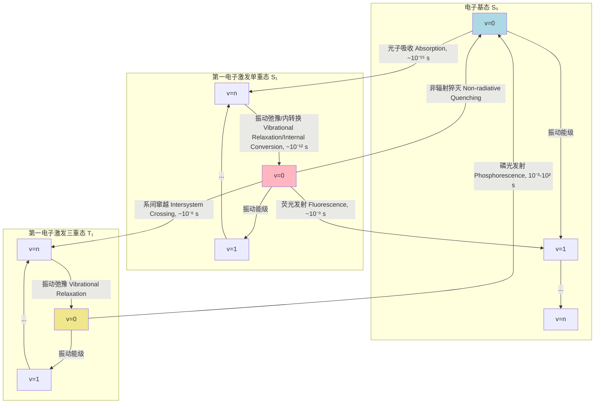
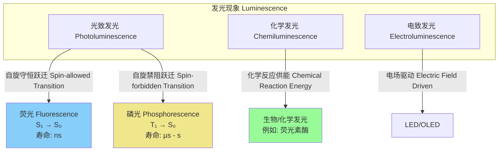

好的，我将根据您的要求，创建一份关于“荧光发射体”的综合性技术文档。该文档将严格遵循科学和数学的严谨性，所有内容均为简体中文，并包含所有指定元素。

## 荧光发射体

荧光发射体（Fluorescent Emitters），通常被称为荧光团（Fluorophores），是一类能吸收特定波长的光子，并随后发射出波长更长的光子的分子、量子点或蛋白质。这一过程被称为荧光。荧光发射体是现代科学研究和技术应用中的基石，其应用范围从生物成像到材料科学，再到临床诊断。

### 核心物理过程：雅布隆斯基图 (Jablonski Diagram)

荧光过程可以通过雅布隆斯基图进行描述，该图展示了分子在不同电子和振动能级之间的跃迁。



该过程的主要步骤包括：
1.  **吸收 (Absorption)**：分子从基态 ($S_0$) 吸收一个光子，跃迁到某个更高的电子激发单重态 ($S_1$, $S_2$, ...) 的某个振动能级。此过程极快，约为 $10^{-15}$ 秒。
2.  **振动弛豫 (Vibrational Relaxation) 和内转换 (Internal Conversion)**：处于高振动能级的激发态分子通过与周围溶剂分子的碰撞，迅速失去多余的振动能量，弛豫到该电子态的最低振动能级。如果分子跃迁到 $S_2$ 或更高能级，它通常会通过内转换（一种非辐射过程）快速、无辐射地弛豫到 $S_1$ 能级。这些过程的典型时间尺度为 $10^{-12}$ 秒。
3.  **荧光发射 (Fluorescence)**：分子从第一激发单重态的最低振动能级 ($S_1$) 回到电子基态 ($S_0$) 的不同振动能级，同时发射一个光子。由于发射前存在能量损失（振动弛豫），发射光子的能量通常低于吸收光子的能量，即发射波长更长。这个波长差被称为斯托克斯位移 (Stokes Shift)。荧光发射的时间尺度通常在 $10^{-9}$ 秒左右。
4.  **系间窜越 (Intersystem Crossing, ISC)**：分子也可能从激发单重态 ($S_1$) 经自旋翻转进入能量较低的激发三重态 ($T_1$)。这是一个自旋禁阻跃迁，因此概率较低。
5.  **磷光发射 (Phosphorescence)**：从三重态 ($T_1$) 回到基态 ($S_0$) 的跃迁也是自旋禁阻的，导致其寿命非常长，可从毫秒到数秒甚至更长。

### 关键技术参数

荧光发射体的性能由一系列可量化的技术参数来定义。

| 参数 (Parameter) | 符号 (Symbol) | 典型值 (Typical Value) | 单位 (Unit) | 描述 (Description) |
| :--- | :---: | :---: | :---: | :--- |
| 最大吸收波长 | $\lambda_{abs}$ | 300 - 800 | nm | 吸收光谱中吸收效率最高的波长 |
| 最大发射波长 | $\lambda_{em}$ | 350 - 850 | nm | 发射光谱中荧光强度最高的波长 |
| 斯托克斯位移 | $\Delta\lambda$ | 20 - 100 | nm | 最大发射波长与最大吸收波长之差 ($\lambda_{em} - \lambda_{abs}$) |
| 摩尔消光系数 | $\epsilon$ | 10,000 - 250,000 | M⁻¹cm⁻¹ | 衡量分子在$\lambda_{abs}$处吸收光子能力的物理量 |
| 荧光量子产率 | $\Phi_f$ | 0.01 - 0.99 | 无量纲 | 发射的光子数与吸收的光子数之比 |
| 荧光寿命 | $\tau_f$ | 0.1 - 20 | ns | 激发态分子恢复到基态的平均时间 |
| 分子亮度 | $B$ | 1,000 - 250,000 | M⁻¹cm⁻¹ | 综合性能指标，定义为 $\epsilon \times \Phi_f$ |
| 光稳定性 | - | 变化范围大 | s 或 cycles | 分子在被光漂白前能够发射荧光的平均时间或循环次数 |

### 数学模型与理论

#### 光吸收：比尔-朗伯定律 (Beer-Lambert Law)

当光通过含有荧光发射体的溶液时，其吸光度 ($A$) 遵循比尔-朗伯定律：
$$ A = \log_{10}\left(\frac{I_0}{I}\right) = \epsilon c l $$
其中：
*   $A$ 是吸光度（无量纲）。
*   $I_0$ 是入射光强度。
*   $I$ 是透射光强度。
*   $\epsilon$ 是摩尔消光系数 (Molar Extinction Coefficient)，单位为 M⁻¹cm⁻¹。
*   $c$ 是荧光发射体的摩尔浓度 (Molar Concentration)，单位为 M (mol/L)。
*   $l$ 是光程长度 (Path Length)，单位为 cm。

#### 荧光强度 (Fluorescence Intensity)

荧光发射的强度 ($I_f$) 与吸收的光子数和量子产率成正比。
$$ I_f = K \cdot I_{abs} \cdot \Phi_f = K \cdot \Phi_f \cdot I_0 (1 - 10^{-A}) $$
其中：
*   $I_f$ 是荧光强度。
*   $K$ 是一个与仪器几何构型和探测器效率相关的比例常数。
*   $I_{abs}$ 是吸收的光强度。
*   $\Phi_f$ 是荧光量子产率。
*   $A$ 是吸光度。

在稀溶液中（通常 $A < 0.05$），该方程可以泰勒展开并简化为线性关系：
$$ 1 - 10^{-A} \approx 2.303 \cdot A = 2.303 \cdot \epsilon c l $$
$$ I_f \approx K \cdot \Phi_f \cdot I_0 \cdot (2.303 \cdot \epsilon c l) $$
在此条件下，荧光强度与浓度成正比。

#### 量子产率与荧光寿命 (Quantum Yield and Fluorescence Lifetime)

荧光量子产率 ($\Phi_f$) 和荧光寿命 ($\tau_f$) 由激发态的辐射衰减速率 ($k_r$) 和非辐射衰减速率之和 ($k_{nr}$) 决定。
$$ \Phi_f = \frac{k_r}{k_r + \sum_i k_{nr,i}} $$
$$ \tau_f = \frac{1}{k_r + \sum_i k_{nr,i}} $$
其中：
*   $k_r$ 是从 $S_1$ 到 $S_0$ 的辐射跃迁速率常数（单位：s⁻¹）。
*   $k_{nr,i}$ 是所有非辐射衰减过程（如内转换、系间窜越、动态猝灭等）的速率常数之和（单位：s⁻¹）。

这两个参数之间存在直接关系：
$$ \Phi_f = k_r \cdot \tau_f $$
这意味着，具有较高辐射速率的荧光团通常具有更高的量子产率和更短的寿命。

#### Förster共振能量转移 (FRET)

FRET是一种非辐射能量转移机制，其中一个被激发的供体 (Donor) 荧光团将其能量转移给一个邻近的受体 (Acceptor) 分子。其效率 ($E$) 对距离极为敏感。
$$ E = \frac{1}{1 + (r/R_0)^6} $$
其中：
*   $E$ 是FRET效率。
*   $r$ 是供体和受体之间的实际距离。
*   $R_0$ 是Förster半径，即FRET效率为50%时的距离。

$R_0$ 的计算公式为：
$$ R_0^6 = \frac{9000 (\ln 10) \kappa^2 \Phi_D}{128 \pi^5 n^4 N_A} J(\lambda) $$
其中：
*   $\kappa^2$ 是偶极-偶极取向因子（在动态随机平均下通常取 2/3）。
*   $\Phi_D$ 是供体在没有受体存在时的量子产率。
*   $n$ 是介质的折射率。
*   $N_A$ 是阿伏伽德罗常数 ($6.022 \times 10^{23}$ mol⁻¹)。
*   $J(\lambda)$ 是供体发射光谱和受体吸收光谱之间的重叠积分，单位为 M⁻¹cm⁻¹nm⁴。
$$ J(\lambda) = \int_0^\infty f_D(\lambda) \epsilon_A(\lambda) \lambda^4 d\lambda $$
其中 $f_D(\lambda)$ 是归一化的供体荧光发射光谱，$\epsilon_A(\lambda)$ 是受体的摩尔消光系数。

### 性能表征与统计分析

#### 光漂白动力学 (Photobleaching Dynamics)

光漂白是指荧光发射体在持续光照下永久失去发光能力的现象。对于一个分子群体，其过程通常可以被建模为一级或多级指数衰减：
$$ I(t) = I_0 e^{-k_{bleach}t} $$
其中：
*   $I(t)$ 是时间 $t$ 时的荧光强度。
*   $I_0$ 是初始强度。
*   $k_{bleach}$ 是光漂白速率常数，它与激发光强度和光漂白量子产率 ($\Phi_{bleach}$) 成正比。

在单分子水平上，除了永久漂白，还会观察到荧光闪烁（blinking），即在发光（ON）态和不发光（OFF）态之间随机切换。ON和OFF态的持续时间分布通常遵循幂律分布 $P(t) \propto t^{-m}$，这反映了复杂的底层物理化学过程。

#### 荧光寿命测量与数据拟合

荧光寿命通常通过时间相关单光子计数 (Time-Correlated Single Photon Counting, TCSPC) 技术测量。测得的荧光衰减曲线 $D(t)$ 是真实荧光衰减 $F(t)$ 与仪器响应函数 (Instrument Response Function, IRF) 的卷积：
$$ D(t) = \int_0^t \text{IRF}(t') F(t-t') dt' $$
对于单指数衰减，$F(t) = A e^{-t/\tau_f}$。对于多指数衰减，$F(t) = \sum_i A_i e^{-t/\tau_i}$。

通过迭代重卷积算法对实验数据进行拟合，以找到最佳的寿命参数 ($\tau_i$) 和振幅 ($A_i$)。拟合的优度通常通过卡方 ($\chi^2$) 检验来评估：
$$ \chi^2 = \sum_{k=1}^{N} \frac{[D(t_k) - M(t_k)]^2}{\sigma_k^2} $$
其中 $D(t_k)$ 是在时间点 $t_k$ 的实验数据点， $M(t_k)$ 是该点的模型计算值，$\sigma_k^2$ 是数据点的方差（通常假设为泊松分布，$\sigma_k^2 \approx D(t_k)$）。一个好的拟合其约化卡方值 $\chi^2_{red} = \chi^2 / (N-p)$ 应接近1，其中 $N$ 是数据点数，$p$ 是拟合参数个数。拟合结果应报告参数的最佳值及其置信区间（例如，95% CI）。

### 常见应用案例

| 应用领域 | 关键技术 | 定量性能指标 |
| :--- | :--- | :--- |
| **生物成像** | 共聚焦显微镜, STED, PALM/STORM | **空间分辨率**: STED中 $d \approx \frac{\lambda_{em}}{2NA\sqrt{1+I/I_{sat}}}$<br>**信噪比 (SNR)**: $SNR = \frac{N_{signal}}{\sqrt{N_{signal} + N_{background} + \sigma_{detector}^2}}$ |
| **生物传感** | FRET传感器, 荧光猝灭传感器 | **检测限 (LOD)**: 通常定义为3倍空白信号标准差所对应的浓度<br>**动态范围**: 传感器响应呈线性的浓度范围 |
| **流式细胞术** | 多色荧光标记 | **通量**: 每秒分析的细胞数 (events/s)<br>**群体均一性**: 变异系数 (CV), $CV = (\frac{\sigma}{\mu})\times 100\%$ |

### 实现与数据处理考量

#### 荧光寿命成像 (FLIM) 数据处理流程

荧光寿命成像 (FLIM) 在每个像素点上测量荧光衰减曲线，从而生成一幅以荧光寿命为对比度的图像。其数据处理流程复杂，涉及大量计算。

```mermaid
graph TD
    A[原始TCSPC数据 Raw TCSPC Data] --> B["像素级数据分箱 Pixel-wise Binning[";
    B --> C[生成像素衰减直方图 Generate Decay Histograms per Pixel];
    C --> D[仪器响应函数 IRF 测量];
    subgraph "拟合算法 Fitting Algorithm"
        direction LR
        D -- "输入 Input" --> E["迭代重卷积拟合 Iterative Reconvolution Fit"];
        C -- "输入 Input" --> E;
        E -- "输出 Output" --> F[寿命参数图 Lifetime Parameter Maps, τ, A];
    end
    subgraph "无拟合算法 Fit-free Algorithm"
        direction LR
        C -- "输入 Input" --> G["相量分析 Phasor Analysis"];
        G -- "FFT" --> H[计算G和S分量 Calculate G and S components];
        H -- "输出 Output" --> I[相量图 Phasor Plot];
    end
    F --> J[图像可视化与分析 Image Visualization & Analysis];
    I --> J;

    style E fill:#ccf
    style G fill:#cfc
```

*   **算法复杂度分析**:
    *   **最小二乘法拟合**: 对于一个 $W \times H$ 像素的图像，每个像素有 $T$ 个时间通道，拟合一个单指数模型，其计算复杂度约为 $O(W \cdot H \cdot T \cdot I_{iter})$，其中 $I_{iter}$ 是迭代次数。这在计算上非常耗时。
    *   **相量分析 (Phasor Analysis)**: 该方法对每个像素的衰减曲线进行傅里叶变换，避免了迭代拟合。其主要计算瓶颈是FFT，复杂度为 $O(W \cdot H \cdot T \log T)$，速度远快于拟合方法。

### 相关发光技术对比

荧光是光致发光的一种，但与其他发光机制在时间尺度和物理过程上存在显著差异。



| 特性 | 荧光 (Fluorescence) | 磷光 (Phosphorescence) | 化学发光 (Chemiluminescence) |
| :--- | :--- | :--- | :--- |
| **能量来源** | 吸收外部光子 | 吸收外部光子 | 化学反应 |
| **电子跃迁** | $S_1 \rightarrow S_0$ (单重态-单重态) | $T_1 \rightarrow S_0$ (三重态-基态) | 反应产物激发态 $\rightarrow$ 基态 |
| **自旋多重性** | 自旋守恒 | 自旋禁阻 | 取决于反应路径 |
| **典型寿命** | 纳秒 ($10^{-9}$ s) | 微秒至秒 ($10^{-6} - 10^2$ s) | 分钟至小时 (取决于反应速率) |
| **量子力学模型** | 电偶极跃迁，速率高 | 需自旋-轨道耦合，速率低 | 反应动力学控制 |

#### 跃迁速率的量子力学模型

根据费米黄金定则 (Fermi's Golden Rule)，从初态 $|\psi_i\rangle$ 到末态 $|\psi_f\rangle$ 的跃迁速率 ($k_{i \to f}$) 为：
$$ k_{i \to f} = \frac{2\pi}{\hbar} |\langle \psi_f | \hat{H}_{pert} | \psi_i \rangle|^2 \rho(E_f) $$
其中：
*   $\hbar$ 是约化普朗克常数。
*   $\hat{H}_{pert}$ 是引起跃迁的微扰哈密顿算符。
*   $|\langle \psi_f | \hat{H}_{pert} | \psi_i \rangle|$ 是跃迁矩阵元，其大小决定了跃迁的“允许”程度。
*   $\rho(E_f)$ 是末态的态密度。

对于**荧光** ($S_1 \to S_0$)，$\hat{H}_{pert}$ 是电偶极算符。由于初末态自旋相同（单重态），跃迁矩阵元很大，导致速率快 ($k_r \sim 10^8$ s⁻¹)。
对于**磷光** ($T_1 \to S_0$)，由于初末态自旋不同，电偶极跃迁是禁阻的。跃迁需要通过自旋-轨道耦合 (Spin-Orbit Coupling) 算符作为微扰，该耦合效应较弱，导致跃迁矩阵元很小，速率极慢 ($k_p \sim 10^{-3} - 10^3$ s⁻¹)。

### 参考文献

1.  Lakowicz, J. R. (2006). *Principles of Fluorescence Spectroscopy*. Springer. (DOI: 10.1007/978-0-387-46312-4)
2.  Hell, S. W., & Wichmann, J. (1994). Breaking the diffraction resolution limit by stimulated emission: stimulated-emission-depletion fluorescence microscopy. *Optics Letters*, 19(11), 780-782. (DOI: 10.1364/OL.19.000780)
3.  Michalet, X., Pinaud, F. F., Bentolila, L. A., Tsay, J. M., Doose, S., Li, J. J., ... & Weiss, S. (2005). Quantum dots for live cells, in vivo imaging, and diagnostics. *Science*, 307(5709), 538-544. (DOI: 10.1126/science.1104274)
4.  Förster, T. (1948). Zwischenmolekulare Energiewanderung und Fluoreszenz. *Annalen der Physik*, 437(1-2), 55-75. (DOI: 10.1002/andp.19484370105)