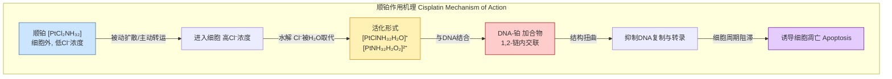
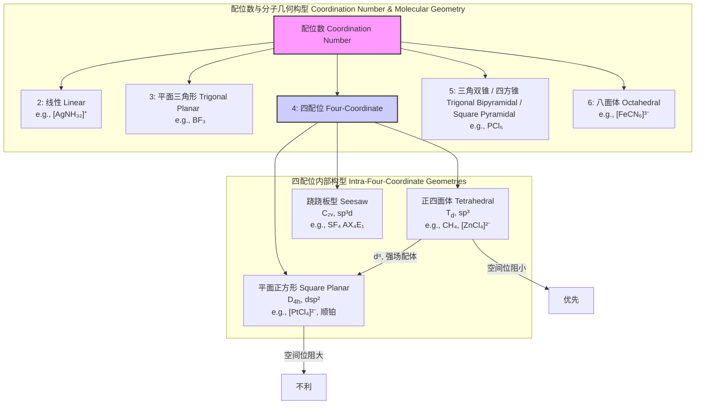

## 四配位分子

四配位分子是指一个中心原子或离子（M）与四个配体（L）通过化学键直接相连而形成的分子或离子实体，其通式可表示为 ML₄。这类分子在化学的各个分支中都至关重要，从有机化学中的甲烷到无机化学中的过渡金属络合物。其几何构型、电子结构和反应活性主要由中心原子的性质、配体的类型以及它们之间的相互作用决定。对四配位分子的研究是理解化学键合、分子对称性和催化机理的基础。

### 核心概念与数学基础

四配位分子的结构和性质主要通过价层电子对互斥理论（VSEPR）、价键理论（VBT）和配位场理论（LFT）/晶体场理论（CFT）来解释。这些理论的背后是量子力学和群论的数学原理。

#### 1. 分子几何构型

最常见的两种四配位几何构型是**正四面体（Tetrahedral）**和**平面正方形（Square Planar）**。

*   **正四面体 (Td)**: 当中心原子没有孤对电子，且四个配体相同时，通常形成正四面体构型。这是空间利用率最高的构型，配体之间的排斥力最小。其理想键角为 $109.5^\circ$。
*   **平面正方形 (D4h)**: 这种构型主要出现在d⁸电子构型的过渡金属络合物中，例如 Ni(II)、Pd(II)、Pt(II) 和 Au(III)。配体和中心原子共平面，理想键角为 $90^\circ$。

#### 2. 对称性与群论

分子的对称性可以通过点群来描述。点群是由分子中所有对称元素（恒等E、旋转轴Cₙ、镜面σ、反演中心i、旋转反映轴Sₙ）构成的数学群。

*   **正四面体点群 (Td)**: 包含24个对称操作。其高对称性使得许多分子轨道和振动模式是简并的（能量相同）。
*   **平面正方形点群 (D4h)**: 包含16个对称操作。与 Td 相比对称性较低，导致能级简并度的解除。

群论的特征标表（Character Table）是分析分子性质的强大工具。例如，一个分子的红外（IR）或拉曼（Raman）活性振动模式可以通过其在点群不可约表示（Irreducible Representation）下的对称性来预测。一个振动模式是红外活性的，当且仅当它所属的不可约表示与偶极矩算符（x, y, z）的变换方式相同。

#### 3. 电子结构与配位场理论

配位场理论（LFT）是解释过渡金属络合物颜色、磁性和稳定性的核心理论。它描述了在配体形成的静电场中，中心金属d轨道的能级分裂情况。

**晶体场稳定化能 (CFSE)** 是d电子占据分裂后的d轨道所获得的额外稳定性。

对于**四面体场 (Td)**，d轨道分裂成两组：能量较高的t₂轨道（dxy, dxz, dyz）和能量较低的e轨道（dz², dx²-y²）。能级分裂能用 $\Delta_t$ 表示。

$$
CFSE_t = \left( -0.6 \cdot n_{e} + 0.4 \cdot n_{t_2} \right) \Delta_t
$$

其中：
*   $n_{e}$ 是占据e轨道的电子数。
*   $n_{t_2}$ 是占据t₂轨道的电子数。
*   $\Delta_t$ 是四面体场的晶体场分裂能。

对于**平面正方形场 (D4h)**，能级分裂更为复杂，通常视为从八面体场（Octahedral, Oh）中沿z轴移走两个配体而形成。d轨道分裂成四组：dx²-y² (最高), dxy, dz², 和简并的 (dxz, dyz) (最低)。其稳定化能非常高，特别是对于d⁸构型，所有电子都填充在较低的能级上，从而使该构型非常稳定。

四面体场分裂能与八面体场分裂能（$\Delta_o$）之间存在一个重要的近似关系：

$$
\Delta_t \approx \frac{4}{9} \Delta_o
$$

这个关系解释了为什么对于给定的金属和配体，八面体络合物通常比四面体络合物更稳定（除非有强烈的空间位阻）。

### 关键技术规格

下表总结了两种主要四配位构型的关键参数。

| 特性 (Property) | 正四面体 (Tetrahedral) | 平面正方形 (Square Planar) |
| :--- | :--- | :--- |
| **点群 (Point Group)** | $T_d$ | $D_{4h}$ |
| **理想键角 (Ideal Bond Angle)** | $109.47^\circ$ | $90^\circ$ |
| **中心原子杂化 (Hybridization)** | $sp^3$ | $dsp^2$ 或 $sp^2d$ |
| **典型中心原子 (Central Atom)** | C, Si, Ge, Sn (主族) | Ni(II), Pd(II), Pt(II), Au(III) (d⁸ 构型) |
| | Zn(II), Cd(II), Hg(II) (d¹⁰ 构型) | Rh(I), Ir(I) (d⁸ 构型) |
| **d轨道分裂模式** | e (较低), t₂ (较高) | (dxz, dyz), dz², dxy, dx²-y² (能量递增) |
| **CFSE (d⁸, 弱场)** | $-0.6 \Delta_t$ | $-2.46 \Delta_{sp} + P$ (高自旋, 罕见) |
| **CFSE (d⁸, 强场)** | $-0.6 \Delta_t$ | $-2.46 \Delta_{sp} + P$ (低自旋, 常见) |
| **磁性 (d⁸)** | 通常为顺磁性（2个未成对电子） | 通常为抗磁性（0个未成对电子） |

### 常见用例与量化性能指标

#### 1. 有机化学与材料科学：甲烷与金刚石

*   **分子**: 甲烷 (CH₄)
*   **构型**: 正四面体
*   **应用**: 天然气主要成分，重要的化工原料。
*   **性能指标**:
    *   C-H 键长: 108.7 pm
    *   H-C-H 键角: 109.5°
    *   C-H 键解离能: 439.3 kJ/mol
    *   在金刚石晶格中，每个碳原子都与其他四个碳原子形成正四面体结构，造就了其极高的硬度（莫氏硬度 10）。

#### 2. 药物化学：顺铂

*   **分子**: 顺铂 (Cisplatin, [PtCl₂(NH₃)₂])
*   **构型**: 平面正方形
*   **应用**: 广谱抗癌药物，尤其对睾丸癌和卵巢癌有效。
*   **性能指标**:
    *   **作用机理**: 顺铂进入细胞后，氯离子被水分子取代，活化后的铂络合物与DNA链上的鸟嘌呤（Guanine）碱基的N7位点发生配位，形成链内或链间交联。
    *   **结合亲和力**: 顺铂与DNA的结合常数（Kb）数量级约为 $10^5$ M⁻¹。
    *   **量化效应**: 这种交联会严重扭曲DNA双螺旋结构，抑制DNA复制和转录，从而诱导细胞凋亡。DNA弯曲角度可达 34-55°。
    *   **临床缓解率**: 在睾丸癌治疗中，以顺铂为基础的联合化疗方案可使超过 80% 的患者达到完全缓解。

### 实现考量与算法复杂度

在计算化学领域，预测和分析四配位分子的性质依赖于复杂的算法。这些计算的“实现”是指通过软件求解近似的薛定谔方程。

$$
\hat{H}\Psi = E\Psi
$$

其中：
*   $\hat{H}$ 是哈密顿算符，描述了系统的总能量。
*   $\Psi$ 是体系的波函数，包含了所有关于电子和原子核的信息。
*   $E$ 是体系的能量。

#### 几何优化算法

为了找到分子的最稳定构型（能量最低点），计算化学软件使用迭代优化算法。
*   **算法**: 梯度下降法（Steepest Descent）、共轭梯度法（Conjugate Gradient）、准牛顿法（Quasi-Newton, e.g., BFGS）。
*   **复杂度**: 每次迭代的复杂度主要由能量和梯度的计算决定。对于一个包含 $N$ 个基函数的体系（$N$ 与原子数和电子数相关），计算成本通常如下：
    *   **Hartree-Fock (HF)**: $O(N^4)$
    *   **密度泛函理论 (DFT)**: $O(N^3)$ 到 $O(N^4)$
    *   **Møller-Plesset 微扰理论 (MP2)**: $O(N^5)$
    *   **耦合簇理论 (CCSD(T))**: $O(N^7)$ (被认为是化学精度的“黄金标准”)

因此，选择计算方法是在精度和计算成本之间进行权衡。对于大型四配位络合物，DFT是目前最常用和最均衡的选择。

### 性能特征与统计度量

理论计算的“性能”通过其与实验数据的吻合程度来评估。

**案例：四氯甲烷 (CCl₄) 的结构参数**

| 参数 | 实验值 (气相电子衍射) | 计算值 (DFT, B3LYP/6-311G*) | 偏差 (Deviation) |
| :--- | :--- | :--- | :--- |
| **C-Cl 键长 (pm)** | 176.6 ± 0.3 | 177.4 | +0.45% |
| **Cl-C-Cl 键角 (°)** | 109.5 | 109.5 | 0% |

**统计度量**:
*   **均方根偏差 (RMSD)**: 常用于比较理论预测结构与晶体学实验结构的吻合度。对于小分子，一个好的模型的RMSD应小于 0.1 Å。
$$
RMSD = \sqrt{\frac{1}{n} \sum_{i=1}^{n} \delta_i^2}
$$
其中 $n$ 是原子数，$\delta_i$ 是第 $i$ 个原子在最优叠合后，理论位置与实验位置之间的距离。
*   **置信区间**: 实验值通常伴随着一个置信区间（例如，95% CI），表示真值可能落入的范围。理论值如果落在此区间内，则认为吻合度非常高。

### 相关技术与比较数学模型

四配位是配位化学中的一个重要节点，理解它需要与其他配位数进行比较。

**理论模型比较**

| 模型 (Model) | 核心思想 (Core Idea) | 数学基础 (Mathematical Basis) | 优点 (Pros) | 局限性 (Cons) |
| :--- | :--- | :--- | :--- | :--- |
| **VSEPR** | 电子对（成键和孤对）相互排斥，占据使排斥最小化的位置。 | 库仑定律的定性应用 | 简单直观，能快速预测主族元素分子构型。 | 无法解释过渡金属构型（如平面正方形），不能提供能量信息。 |
| **价键理论 (VBT)** | 原子轨道线性组合形成杂化轨道，通过轨道重叠形成共价键。 | 量子力学（轨道叠加原理） | 提供了键的图像（σ, π键），解释了构型（如sp³对应四面体）。 | 对激发态和磁性解释较差，计算复杂。 |
| **配位场/分子轨道理论 (LFT/MOT)** | 金属和配体轨道组合形成分子轨道，或静电场导致d轨道能级分裂。 | 群论，线性代数（久期方程） | 能定量解释颜色（光谱）、磁性、稳定性和反应性。 | 概念更抽象，需要更复杂的计算。 |

### 参考文献

1.  Miessler, G. L., Fischer, P. J., & Tarr, D. A. (2014). *Inorganic Chemistry* (5th ed.). Pearson. (A comprehensive textbook covering coordination chemistry).
2.  Wang, D., & Lippard, S. J. (2005). Cellular processing of platinum anticancer drugs. *Nature Reviews Drug Discovery*, 4(4), 307-320. DOI: `10.1038/nrd1691`. (A key review on the mechanism of cisplatin).
3.  Gillespie, R. J. (1970). The electron-pair repulsion model for molecular geometry. *Journal of Chemical Education*, 47(1), 18. DOI: `10.1021/ed047p18`. (A foundational paper on VSEPR theory).
4.  Jensen, F. (2017). *Introduction to Computational Chemistry* (3rd ed.). Wiley. (Provides detailed information on the algorithms and complexity of quantum chemical calculations).