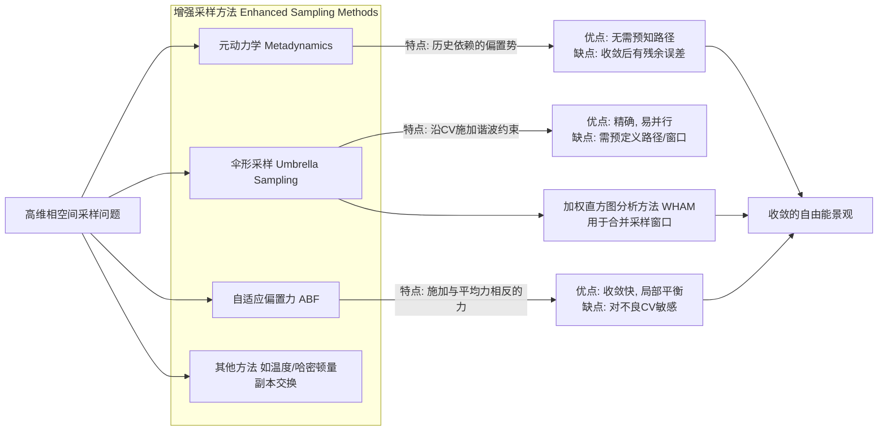
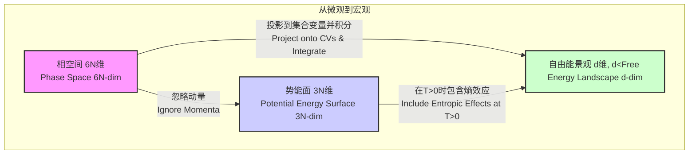

## 自由能景观

自由能景观（Free Energy Landscape, FEL）是一个在化学、物理学和生物学中至关重要的理论工具，它通过将一个复杂高维系统的热力学性质投影到少数几个关键的低维坐标上，为理解和量化分子过程（如化学反应、蛋白质折叠和相变）提供了直观且强大的框架。景观中的“地形”直接与系统的稳定状态、亚稳定状态以及它们之间的转变路径相关联。

### 1. 核心概念与数学基础

自由能景观的根本思想源于统计力学。一个包含 $N$ 个粒子的系统，其微观状态由所有粒子的位置 $\mathbf{r}^N$ 和动量 $\mathbf{p}^N$ 构成的 $6N$ 维相空间中的一个点来描述。然而，我们通常关心的是宏观可观测的、由少数几个参数描述的过程。这些参数被称为**集合变量 (Collective Variables, CVs)**，记作 $\xi = (\xi_1, \xi_2, ..., \xi_d)$，其中 $d \ll 3N$。集合变量可以是原子间的距离、二面角、配位数等。

自由能景观 $F(\xi)$ 定义为在给定集合变量 $\xi$ 的值时，系统的亥姆霍兹自由能。它与观察到系统处于特定CV值 $\xi$ 的概率密度 $P(\xi)$ 直接相关。

#### 基本数学定义

在恒定温度 $T$ 和体积 $V$ 的正则系综 (Canonical Ensemble) 中，自由能 $F(\xi)$ 与概率密度 $P(\xi)$ 的关系式为：

$$
F(\xi) = -k_B T \ln P(\xi) + C
$$

其中：
*   $F(\xi)$: 在集合变量值为 $\xi$ 时的亥姆霍兹自由能。
*   $k_B$: 玻尔兹曼常数 ($1.380649 \times 10^{-23}$ J/K)。
*   $T$: 系统的绝对温度。
*   $P(\xi)$: 在集合变量空间中找到系统处于 $\xi$ 的概率密度。
*   $C$: 一个任意的常数，通常被设定为使全局自由能最低点的能量为零。

概率密度 $P(\xi)$ 本身是通过对系统所有微观状态的构型空间进行积分得到的，这些微观状态与特定的CV值 $\xi$ 相对应：

$$
P(\xi) = \frac{1}{Z} \int d\mathbf{r}^N \exp\left(-\frac{V(\mathbf{r}^N)}{k_B T}\right) \delta(\xi'(\mathbf{r}^N) - \xi)
$$

其中：
*   $V(\mathbf{r}^N)$: 系统的势能函数，依赖于所有原子的坐标 $\mathbf{r}^N$。
*   $\xi'(\mathbf{r}^N)$: 将原子坐标映射到集合变量的函数。
*   $\delta(\cdot)$: 狄拉克δ函数，用于在积分中筛选出满足 $\xi'(\mathbf{r}^N) = \xi$ 的构型。
*   $Z$: 系统的配分函数， $Z = \int d\mathbf{r}^N \exp\left(-\frac{V(\mathbf{r}^N)}{k_B T}\right)$，作为归一化因子。

自由能景观的拓扑结构包含了系统的关键动力学信息：
*   **能量极小点 (Minima)**: 对应于系统的热力学稳定或亚稳定状态（例如，蛋白质的折叠态、未折叠态或中间态）。
*   **鞍点 (Saddle Points)**: 对应于连接两个极小点的最高能量点，即过渡态 (Transition State)。
*   **自由能垒 (Free Energy Barrier, $\Delta F^\ddagger$)**: 从一个极小点到鞍点所需的自由能差，它决定了该过程的速率。

```mermaid
graph TD
    subgraph "自由能景观 Free Energy Landscape"
        A["反应物 稳定态 <br> Reactant Stable State"]
        TS["过渡态 鞍点 <br> Transition State Saddle Point"]
        B["产物 稳定态 <br> Product Stable State"]
        I["中间体 亚稳态 <br> Intermediate Metastable State"]

        A -- "ΔF_fwd‡ 正向能垒" --> TS
        TS -- " " --> I
        I -- "ΔF_int‡ 中间体能垒" --> TS2["过渡态2"]
        TS2 -- "" --> B

        style A fill:#cde4ff
        style B fill:#cde4ff
        style I fill:#e6dcfc
        style TS fill:#ffcccc
        style TS2 fill:#ffcccc
    end
```

### 2. 关键技术规格

在构建和分析自由能景观时，以下参数至关重要。

| 参数 (Parameter) | 符号 (Symbol) | 描述 (Description) | 典型单位 (Typical Units) |
| :--- | :--- | :--- | :--- |
| 集合变量 | $\xi$ | 描述系统宏观状态的低维坐标。 | Å, nm (距离); rad, deg (角度); 无单位 (配位数) |
| 温度 | $T$ | 系统的绝对温度，影响热涨落和熵。 | K (开尔文) |
| 玻尔兹曼常数 | $k_B$ | 连接微观能量与宏观温度的物理常数。 | J/K; kcal/(mol·K) |
| 自由能垒 | $\Delta F^\ddagger$ | 转变过程的活化自由能，决定反应速率。 | kJ/mol; kcal/mol |
| 概率密度 | $P(\xi)$ | 在特定CV值处发现系统的概率。 | CV单位的倒数 |
| 模拟时间 | $t_{sim}$ | 为充分采样相空间所需的分子动力学模拟总时长。 | ns, µs, ms |
| 采样窗口/步长 | $\Delta \xi$ | 在伞形采样或元动力学中，沿CV的离散化步长。 | Å, rad |

### 3. 常见用例

自由能景观被广泛应用于解释和预测复杂的分子事件。

*   **蛋白质折叠**:
    *   **用途**: 识别折叠路径、中间体和错误折叠的陷阱。
    *   **性能指标**: 计算得到的折叠自由能 ($\Delta G_{\text{fold}}$) 与实验值（如通过圆二色谱或荧光光谱测量）的吻合度。典型值范围为 -20 至 -60 kJ/mol。计算的折叠速率与实验测量值的比较。

*   **药物-靶标结合与解离**:
    *   **用途**: 计算配体的结合自由能 ($\Delta G_{\text{bind}}$)，揭示结合/解离路径。
    *   **性能指标**: 结合亲和力 ($K_d$) 可通过 $\Delta G_{\text{bind}} = RT \ln K_d$ 得到，并与等温滴定量热法 (ITC) 的实验结果进行比较。解离速率常数 ($k_{\text{off}}$) 可通过过渡态理论从解离能垒中估算，并与表面等离子体共振 (SPR) 实验值对比。

*   **化学反应机理**:
    *   **用途**: 在溶液或酶活性位点中确定反应路径、过渡态结构和反应速率。
    *   **性能指标**: 活化自由能 ($\Delta F^\ddagger$) 可通过以下公式与反应速率常数 $k$ 关联：
        $$
        k = \kappa \frac{k_B T}{h} \exp\left(-\frac{\Delta F^\ddagger}{k_B T}\right)
        $$
        其中 $h$ 是普朗克常数，$\kappa$ 是透射系数。计算出的速率常数与动力学实验数据进行比较。

*   **材料相变**:
    *   **用途**: 研究晶体成核、熔化或固-固相变过程。
    *   **性能指标**: 计算不同相之间的自由能差，预测相图中的相边界（温度、压力）。成核能垒的高度决定了成核速率。

### 4. 实现考量

由于高维相空间的广阔性，直接通过标准分子动力学 (MD) 模拟来充分采样以构建自由能景观通常是不可行的（这被称为“采样问题”）。因此，必须使用增强采样 (Enhanced Sampling) 算法。



#### 算法分析

*   **元动力学 (Metadynamics, MetaD)**:
    *   **原理**: 通过在系统的轨迹上周期性地添加小的、排斥性的高斯势（称为“山丘”）来修改势能面。这会阻止系统重新访问已探索过的区域，迫使其跨越能垒。
    *   **偏置势**: $V_G(\xi, t) = \sum_{t'=0, \tau, 2\tau, ...}^{t'<t} w \exp\left(-\frac{(\xi(\mathbf{r}(t')) - \xi)^2}{2\sigma^2}\right)$
        *   $w$: 高斯山丘的高度 (能量单位)。
        *   $\sigma$: 高斯山丘的宽度 (CV单位)。
        *   $\tau$: 山丘添加的时间间隔。
    *   **复杂度**: 算法的计算开销主要与MD模拟本身成正比，但需要额外的开销来更新和评估偏置势。如果偏置势存储在格点上，则每次更新的复杂度为 $O(1)$，但总复杂度与模拟步数和格点数有关。

*   **伞形采样 (Umbrella Sampling, US) 与 WHAM**:
    *   **原理**: 将CV空间划分为一系列重叠的“窗口”。在每个窗口中，通过施加一个谐波偏置势（“伞”）将系统限制在CV的特定值 $\xi_i$ 附近。
    *   **偏置势**: $U_i(\mathbf{r}) = V(\mathbf{r}) + \frac{1}{2}k_i(\xi'(\mathbf{r}) - \xi_i)^2$
    *   **后处理**: 使用**加权直方图分析方法 (Weighted Histogram Analysis Method, WHAM)** 将所有窗口的偏置采样数据组合起来，以重建无偏置的自由能景观。WHAM通过自洽迭代求解一组非线性方程来找到最佳的全局概率分布。
    *   **复杂度**: 模拟部分可以完美并行化（每个窗口独立模拟）。WHAM后处理的复杂度取决于窗口数量和直方图的分辨率，但通常远小于模拟本身的计算成本。

### 5. 性能特征

评估计算出的自由能景观的质量至关重要。

*   **收敛性**:
    *   **标准**: 自由能景观应不随模拟时间的延长而发生显著变化。
    *   **度量**:
        *   在元动力学中，可以监测偏置势的增长速率，当系统开始在已填充的势阱中扩散时，增长速率会减慢。
        *   可以将模拟时间分成多个块，并比较从每个块计算出的自由能曲线。曲线之间的标准差可以作为收敛性的量度。例如，一个收敛良好的1D FEL，其关键区域的自由能值在最后几个时间块中的标准差应小于 0.5-1.0 kJ/mol。
*   **统计误差**:
    *   **来源**: 有限的采样时间导致统计涨落。
    *   **度量**:
        *   **块平均 (Block Averaging)**: 将轨迹分成若干个不相关的块，独立计算每个块的FEL，然后计算均值和标准误差。
        *   **自举法 (Bootstrapping)**: 从原始数据中有放回地重采样，多次构建FEL，并从这些副本的分布中估计置信区间（例如，95%置信区间）。
        *   对于WHAM，存在多种方法可以估算自由能曲线每个点的统计误差。

### 6. 相关技术

自由能景观是更广泛的理论框架的一部分，与其他概念密切相关。

#### 自由能景观 (FEL) vs. 势能面 (PES)

这是一个核心区别，对于理解FEL的意义至关重要。

| 特性 (Feature) | 势能面 (Potential Energy Surface, PES) | 自由能景观 (Free Energy Landscape, FEL) |
| :--- | :--- | :--- |
| **定义** | $V(\mathbf{r}^N)$ | $F(\xi) = -k_B T \ln \int e^{-V(\mathbf{r}^N)/k_B T} \delta(\xi'-\xi)d\mathbf{r}^N$ |
| **变量** | 所有 $3N$ 个原子坐标 | 少数几个 ($d$) 集合变量 $\xi$ |
| **温度** | 绝对零度 (0 K) | 有限温度 ($T > 0$ K) |
| **熵** | 不包含熵的贡献 | 包含熵的贡献 (通过对其他自由度的积分) |
| **物理意义** | 系统的机械能 | 系统的热力学自由能 |
| **用途** | 几何优化，寻找最小能量结构 | 研究热力学平衡，计算速率和平衡常数 |



#### 反应坐标 (Reaction Coordinate)

选择合适的集合变量（或反应坐标）是构建有意义的自由能景观的最关键、最具挑战性的一步。一个“好”的反应坐标应该：
*   **区分关键状态**: 能够明确区分反应物、过渡态和产物。
*   **捕捉慢过程**: 应该与系统中最慢的动力学过程强相关。
*   **平滑性**: 自由能景观沿该坐标的投影应相对平滑，没有太多无关的崎岖。

如果选择了不好的CV，重要的过渡态可能会被投影掉，导致对机理的错误理解和对能垒的严重低估。现代方法如**时间滞后独立成分分析 (TICA)** 和**扩散图 (Diffusion Maps)** 被用于从长时MD数据中系统性地识别最佳的反应坐标。

### 7. 参考文献

*   Laio, A., & Parrinello, M. (2002). Escaping free-energy minima. *Proceedings of the National Academy of Sciences*, *99*(20), 12562–12566. DOI: [10.1073/pnas.202427399](https://doi.org/10.1073/pnas.202427399)
*   Kumar, S., Rosenberg, J. M., Bouzida, D., Swendsen, R. H., & Kollman, P. A. (1992). The weighted histogram analysis method for free-energy calculations on biomolecules. I. The method. *Journal of Computational Chemistry*, *13*(8), 1011–1021. DOI: [10.1002/jcc.540130812](https://doi.org/10.1002/jcc.540130812)
*   Chipman, D. M. (2006). Free energy surface for the reaction OH + H2O → H2O + OH in aqueous solution. *The Journal of Physical Chemistry A*, *110*(51), 13956-13966. DOI: [10.1021/jp0648418](https://doi.org/10.1021/jp0648418)
*   Pohorille, A., Jarzynski, C., & Chipot, C. (2010). Good practices in free-energy calculations. *The Journal of Physical Chemistry B*, *114*(32), 10235–10253. DOI: [10.1021/jp102971x](https://doi.org/10.1021/jp102971x)