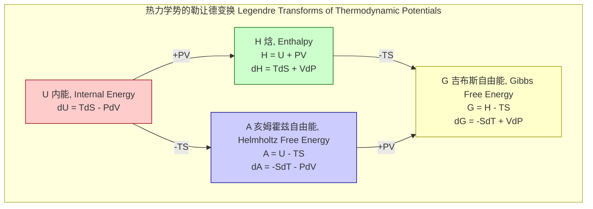
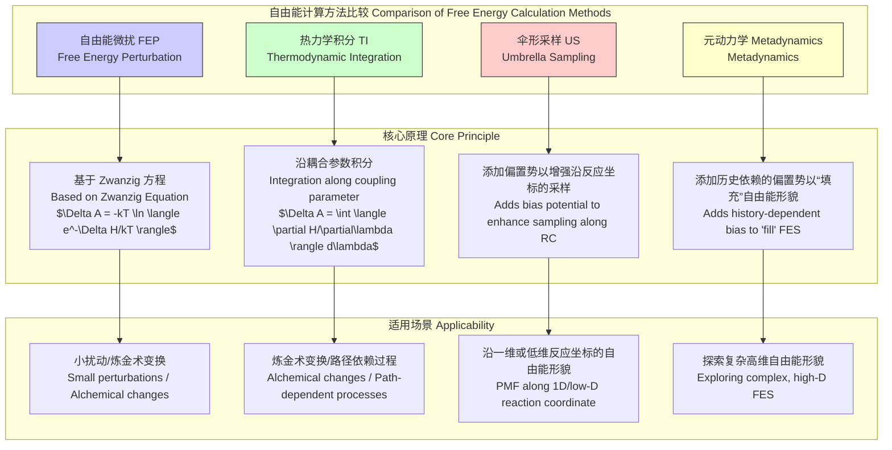

## 自由能

自由能 (Free Energy) 是一个热力学状态函数，它描述了在特定热力学过程中，一个物理系统能够做非体积膨胀功的“有用”能量。自由能的概念在化学、物理学、材料科学和生物学中至关重要，因为它为预测化学反应的方向、相变的发生以及生物过程的能量学提供了定量的基础。

自由能主要有两种形式：亥姆霍兹自由能（Helmholtz Free Energy, $A$）和吉布斯自由能（Gibbs Free Energy, $G$）。它们的选择取决于系统所处的条件（例如，恒温恒容 vs. 恒温恒压）。

### 1. 核心概念与数学基础

#### 1.1 亥姆霍兹自由能 (Helmholtz Free Energy)

亥姆霍兹自由能 $A$ 定义在恒温（$T$）和恒容（$V$）的条件下。它代表了系统在恒温过程中可以转化为功的总能量。其定义为：

$$
A \equiv U - TS
$$

其中：
*   $A$ 是亥姆霍兹自由能，单位为焦耳 (J)。
*   $U$ 是系统的内能 (Internal Energy)，即系统内所有微观粒子动能和势能的总和，单位为焦耳 (J)。
*   $T$ 是绝对温度 (Absolute Temperature)，单位为开尔文 (K)。
*   $S$ 是系统的熵 (Entropy)，是系统无序度或微观状态数量的量度，单位为焦耳/开尔文 (J/K)。

在恒温恒容的封闭系统中，一个过程自发进行的方向是亥姆霍兹自由能减少的方向。当系统达到平衡时，其亥姆霍兹自由能达到最小值。其微分形式为：

$$
dA = -SdT - PdV + \sum_i \mu_i dN_i
$$

其中：
*   $P$ 是压力 (Pressure)。
*   $V$ 是体积 (Volume)。
*   $\mu_i$ 是组分 $i$ 的化学势 (Chemical Potential)。
*   $N_i$ 是组分 $i$ 的粒子数 (Number of Particles)。

在恒温（$dT=0$）和恒容（$dV=0$）且无物质交换（$dN_i=0$）的条件下，该方程简化为 $dA \le 0$，这正是自发过程的判据。

#### 1.2 吉布斯自由能 (Gibbs Free Energy)

吉布斯自由能 $G$ 定义在恒温（$T$）和恒压（$P$）的条件下，这在化学实验中更为常见。它代表了系统在恒温恒压下可以做的最大非体积功。其定义为：

$$
G \equiv H - TS = U + PV - TS
$$

其中：
*   $G$ 是吉布斯自由能，单位为焦耳 (J)。
*   $H$ 是焓 (Enthalpy)，定义为 $H = U + PV$，单位为焦耳 (J)。

在恒温恒压的封闭系统中，一个过程自发进行的方向是吉布斯自由能减少的方向。当系统达到平衡时，其吉布斯自由能达到最小值。其微分形式为：

$$
dG = -SdT + VdP + \sum_i \mu_i dN_i
$$

在恒温（$dT=0$）和恒压（$dP=0$）且无物质交换（$dN_i=0$）的条件下，该方程简化为 $dG \le 0$。

#### 1.3 统计力学联系

在统计力学中，自由能与系统的配分函数 (Partition Function) 直接相关，配分函数是对系统所有可能微观状态的能量进行玻尔兹曼加权求和。

对于正则系综（NVT ensemble），亥姆霍兹自由能 $A$ 与正则配分函数 $Q$ 的关系为：

$$
A = -k_B T \ln Q
$$

其中：
*   $k_B$ 是玻尔兹曼常数 ($1.380649 \times 10^{-23}$ J/K)。
*   $Q$ 是正则配分函数，定义为 $Q = \sum_i e^{-E_i / (k_B T)}$，其中 $E_i$ 是系统第 $i$ 个微观状态的能量。

对于等温等压系综（NPT ensemble），吉布斯自由能 $G$ 与等温等压配分函数 $\Delta$ 的关系为：

$$
G = -k_B T \ln \Delta
$$

其中：
*   $\Delta$ 是等温等压配分函数，$\Delta = \sum_j \int e^{-(E_j + PV_j) / (k_B T)} dV_j$。

这种联系是连接微观世界（粒子状态和相互作用）与宏观热力学（自由能）的桥梁。

### 2. 关键技术规格

以下是一些常见物质在标准状态（298.15 K, 1 bar）下的标准摩尔生成吉布斯自由能。

| 物质 (Substance) | 化学式 (Formula) | 相态 (Phase) | $\Delta G_f^\circ$ (kJ/mol) |
| :--- | :--- | :--- | :--- |
| 水 (Water) | $H_2O$ | 液态 (l) | -237.1 |
| 水蒸气 (Water Vapor) | $H_2O$ | 气态 (g) | -228.6 |
| 二氧化碳 (Carbon Dioxide) | $CO_2$ | 气态 (g) | -394.4 |
| 甲烷 (Methane) | $CH_4$ | 气态 (g) | -50.5 |
| 氨 (Ammonia) | $NH_3$ | 气态 (g) | -16.5 |
| 葡萄糖 (Glucose) | $C_6H_{12}O_6$ | 固态 (s) | -910.2 |
| 氧气 (Oxygen) | $O_2$ | 气态 (g) | 0 (参考态) |
| 氮气 (Nitrogen) | $N_2$ | 气态 (g) | 0 (参考态) |

**基本物理常数**

| 常数 (Constant) | 符号 (Symbol) | 值 (Value) | 单位 (Unit) |
| :--- | :--- | :--- | :--- |
| 摩尔气体常数 (Molar Gas Constant) | $R$ | 8.314462618 | J/(mol·K) |
| 玻尔兹曼常数 (Boltzmann Constant) | $k_B$ | 1.380649 × 10⁻²³ | J/K |
| 法拉第常数 (Faraday Constant) | $F$ | 96485.33212 | C/mol |

### 3. 常见用例与量化性能指标

#### 3.1 化学反应方向与平衡

吉布斯自由能变 ($\Delta G$) 是判断化学反应自发性的核心指标。
*   $\Delta G < 0$: 反应是自发的（正向进行）。
*   $\Delta G > 0$: 反应是非自发的（逆向进行）。
*   $\Delta G = 0$: 反应处于平衡状态。

标准吉布斯自由能变 ($\Delta G^\circ$) 与化学平衡常数 ($K$) 的关系为：

$$
\Delta G^\circ = -RT \ln K
$$

其中：
*   $\Delta G^\circ$ 是在标准状态下反应的吉布斯自由能变。
*   $R$ 是摩尔气体常数。
*   $K$ 是反应的平衡常数。

**示例：哈伯-博斯法 (Haber-Bosch Process)**
反应式：$N_2(g) + 3H_2(g) \rightleftharpoons 2NH_3(g)$
在 298.15 K 时, $\Delta G^\circ = 2 \times (-16.5) - [0 + 3 \times 0] = -33.0$ kJ/mol。
*   **性能指标**: $K = e^{-\Delta G^\circ / (RT)} = e^{-(-33000) / (8.314 \times 298.15)} \approx 5.8 \times 10^5$。这个巨大的 $K$ 值表明在室温下平衡极大地偏向于生成氨。然而，由于反应动力学缓慢，实际生产需要在高温高压和催化剂下进行。

#### 3.2 相变

在相变温度（如熔点或沸点），两相处于平衡状态，因此吉布斯自由能变为零 ($\Delta G_{trans} = 0$)。
$$
\Delta G_{trans} = \Delta H_{trans} - T_{trans} \Delta S_{trans} = 0
$$
因此，相变温度可以计算为：
$$
T_{trans} = \frac{\Delta H_{trans}}{\Delta S_{trans}}
$$
**示例：水的沸点**
在 1 atm 下，水的汽化焓 $\Delta H_{vap} \approx 40.65$ kJ/mol，汽化熵 $\Delta S_{vap} \approx 108.9$ J/(mol·K)。
*   **性能指标**: $T_b = \frac{40650 \text{ J/mol}}{108.9 \text{ J/(mol·K)}} \approx 373.3$ K，这与 100 °C 非常接近。

#### 3.3 电化学

在电化学电池中，吉布斯自由能变与电池电动势 ($E_{cell}$) 相关：
$$
\Delta G = -nFE_{cell}
$$
其中：
*   $n$ 是反应中转移的电子摩尔数。
*   $F$ 是法拉第常数。
*   $E_{cell}$ 是电池的电动势 (V)。

#### 3.4 生物能量学

生物系统利用ATP（三磷酸腺苷）水解来驱动非自发过程。
$ATP + H_2O \rightarrow ADP + P_i$
*   **性能指标**: 在标准生理条件下，该反应的 $\Delta G \approx -30.5$ kJ/mol。这个负值意味着释放的能量可以用来驱动其他需要能量的生化反应（例如，肌肉收缩、离子泵）。

### 4. 实现考量（计算自由能）

在计算化学和分子模拟中，直接计算绝对自由能非常困难。通常计算的是两个状态之间的自由能差 ($\Delta A$ 或 $\Delta G$)。主要方法包括自由能微扰（FEP）和热力学积分（TI）。

#### 4.1 自由能微扰 (Free Energy Perturbation, FEP)

FEP 基于 Zwanzig 方程，计算两个哈密顿量 $H_0$ 和 $H_1$ 所描述的系统之间的亥姆霍兹自由能差：
$$
\Delta A = A_1 - A_0 = -k_B T \ln \left\langle e^{-(H_1 - H_0)/(k_B T)} \right\rangle_0
$$
其中 $\langle \dots \rangle_0$ 表示在由哈密顿量 $H_0$ 生成的系综上进行的平均。

*   **实现考量**:
    *   **采样问题**: 如果状态 0 和状态 1 的相空间重叠很小，指数项的涨落会非常大，导致收敛极其缓慢。
    *   **分层策略 (Stratification)**: 为了解决这个问题，通常会引入一系列中间状态，这些状态由一个混合哈密顿量 $H(\lambda) = (1-\lambda)H_0 + \lambda H_1$ 定义。然后计算每个相邻中间态 ($\lambda_i \rightarrow \lambda_{i+1}$) 之间的 $\Delta A_i$，最后求和：$\Delta A = \sum_i \Delta A_i$。
*   **算法复杂度**:
    *   假设使用分子动力学（MD）进行采样，每个时间步的复杂度对于 $N$ 个粒子系统约为 $O(N \log N)$ 或 $O(N)$。
    *   如果使用 $M$ 个 $\lambda$ 窗口，每个窗口模拟 $S$ 步，则总计算复杂度为 $O(M \cdot S \cdot N \log N)$。$M$ 的选择对精度和成本至关重要。

#### 4.2 热力学积分 (Thermodynamic Integration, TI)

TI 通过对 $\lambda$ 参数的导数进行积分来计算自由能差。
$$
\Delta A = \int_0^1 \frac{\partial A(\lambda)}{\partial \lambda} d\lambda = \int_0^1 \left\langle \frac{\partial H(\lambda)}{\partial \lambda} \right\rangle_\lambda d\lambda
$$
对于混合哈密顿量 $H(\lambda) = (1-\lambda)H_0 + \lambda H_1$，导数为 $\frac{\partial H(\lambda)}{\partial \lambda} = H_1 - H_0$。

*   **实现考量**:
    *   **数值积分**: 在实践中，积分是通过在多个离散的 $\lambda$ 值（例如，$\lambda_1, \lambda_2, \dots, \lambda_M$）上计算系综平均 $\left\langle \frac{\partial H(\lambda)}{\partial \lambda} \right\rangle_\lambda$，然后使用数值方法（如梯形法则或辛普森法则）进行积分。
    *   **端点奇点**: 当 $\lambda \to 0$ 或 $\lambda \to 1$ 时，如果引入或消失的粒子与环境有强烈的范德华或静电相互作用，$\langle \dots \rangle_\lambda$ 的值可能会发散。这需要使用软核势 (soft-core potentials) 来处理。
*   **算法复杂度**: 与 FEP 类似，总复杂度约为 $O(M \cdot S \cdot N \log N)$。

### 5. 性能特征与统计度量

计算出的自由能是统计估计值，必须报告其不确定性。
*   **统计误差**: 在每个 $\lambda$ 窗口中，系综平均 $\langle X \rangle$ 的标准误差 (Standard Error of the Mean, SEM) 可以通过以下方式估计：
    $$
    \sigma_{\langle X \rangle} = \frac{\sigma_X}{\sqrt{N_{eff}}}
    $$
    其中 $\sigma_X$ 是 $X$ 的标准差，$N_{eff}$ 是有效样本数，通常通过 $N_{eff} = N_{samples} / (2\tau)$ 计算，$\tau$ 是数据的自相关时间。这考虑了分子模拟中连续样本之间的时间相关性。
*   **误差传播**: 对于 TI，总误差是每个 $\lambda$ 窗口误差通过数值积分公式传播的结果。对于梯形法则，总方差 $\sigma^2_{\Delta A}$ 近似为：
    $$
    \sigma^2_{\Delta A} \approx \sum_{i=1}^{M-1} \left( \frac{\lambda_{i+1} - \lambda_i}{2} \right)^2 (\sigma_i^2 + \sigma_{i+1}^2)
    $$
    其中 $\sigma_i^2$ 是在 $\lambda_i$ 处计算的 $\langle \frac{\partial H}{\partial \lambda} \rangle$ 的方差。
*   **收敛性**: 判断模拟是否收敛至关重要。通常通过监测自由能导数随模拟时间的累积平均值是否稳定，或者通过将模拟分成几个块并检查块平均值的一致性（块平均法）来评估。一个典型的目标是达到 $\approx 1$ kJ/mol (或 $\approx 0.25$ kcal/mol) 的统计不确定性。

### 6. 相关技术与比较模型

*   **亥姆霍兹自由能 vs. 吉布斯自由能**:
    *   $A$ 是 NVT 系综（理论和模拟中常用）的自然变量。
    *   $G$ 是 NPT 系综（与实验条件更相关）的自然变量。
    *   对于凝聚相系统，压力-体积项 ($PV$) 通常远小于内能项 ($U$)，因此 $\Delta A \approx \Delta G$。但对于涉及气体或高压的系统，这种近似不成立。

*   **平衡法 vs. 非平衡法**:
    *   FEP 和 TI 是“平衡”方法，因为它们在每个 $\lambda$ 窗口都对平衡系综进行采样。
    *   近年来，基于 Jarzynski 等式和 Crooks 涨落定理的非平衡方法也变得流行。这些方法通过快速地将系统从一个状态驱动到另一个状态，并对许多这样的轨迹进行平均来计算自由能差。它们在某些情况下可以更高效。
    $$
    e^{-\Delta A / (k_B T)} = \left\langle e^{-W / (k_B T)} \right\rangle
    $$
    其中 $W$ 是在非平衡过程中对系统所做的功。

### 7. 参考文献

1.  Kirkwood, J. G. (1935). Statistical mechanics of fluid mixtures. *The Journal of Chemical Physics*, 3(5), 300-313. **DOI**: [10.1063/1.1749657](https://doi.org/10.1063/1.1749657) (奠定了热力学积分的基础).
2.  Zwanzig, R. W. (1954). High-temperature equation of state by a perturbation method. I. Nonpolar gases. *The Journal of Chemical Physics*, 22(8), 1420-1426. **DOI**: [10.1063/1.1740409](https://doi.org/10.1063/1.1740409) (提出了自由能微扰的核心方程).
3.  Shirts, M. R., & Pande, V. S. (2005). SOLVING FOR THE STATISTICAL UNCERTAINTY OF FREE ENERGY DIFFERENCES FROM MOLECULAR SIMULATIONS. *Journal of Computational Chemistry*, 26(15), 1661-1679. **DOI**: [10.1002/jcc.20294](https://doi.org/10.1002/jcc.20294) (关于自由能计算中统计误差分析的综述).
4.  Pohorille, A., Jarzynski, C., & Chipot, C. (2010). Good practices in free-energy calculations. *The Journal of Physical Chemistry B*, 114(32), 10235-10253. **DOI**: [10.1021/jp102971x](https://doi.org/10.1021/jp102971x) (关于自由能计算实践的综合指南).